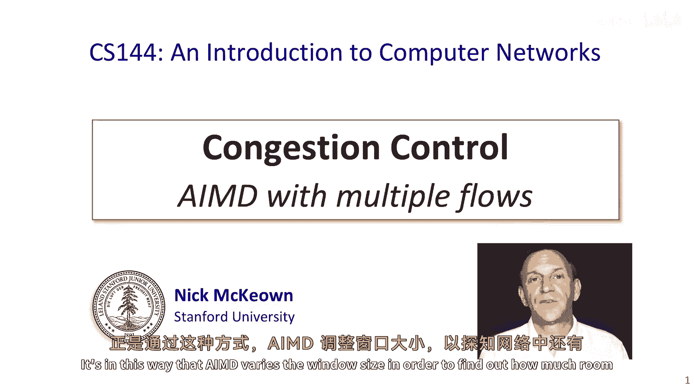
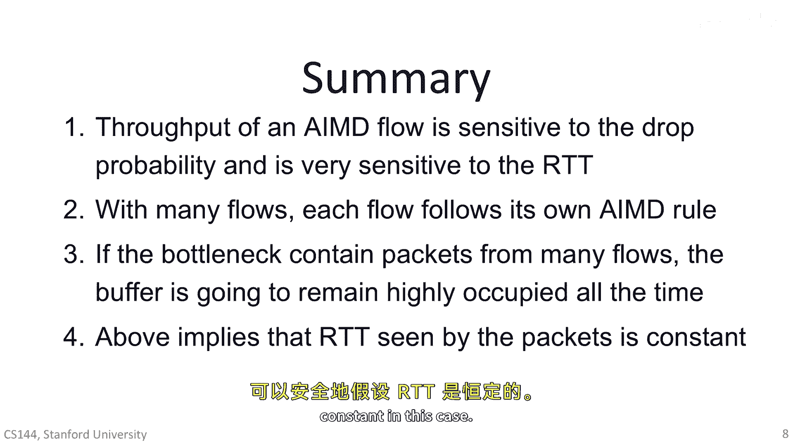

# 【计算机网络 CS144】斯坦福—中英字幕 - P57：p56 4-4 AIMD Multiple Flows - 加加zero - BV1qotgeXE8D

在最后一个视频中，我解释了如何在特殊情况下，imd算法控制拥堵。

当我们的网络中只有一项流量时。

amd，指的是，正如你所记得的，它是增加与乘法减少的缩写，通过控制窗口大小，增加与乘法减少控制拥堵。

未确认包也被称为未确认包。

因为它们是我们发送的包，但我们还没有收到确认。

嗯，用来告诉我们它们安全到达目的地。

嗯，人们常说amd控制包发送速率。

这并不是严格真实的，你会经常听到这个错误。

这真的很重要记住。

当网络空无一人，未拥堵时，它有空间让流量发送更多的包，以便有更多的未确认包。

在网络中。

但当包，当网络充满了包，并且拥堵时。

我们必须减少我们的流量有未确认的包。

以便我们不会过度填充缓冲区，因为它们在那里被持有。

如果我们过度填充它们，当然我们会丢失包，这就是amd如何变化窗口大小。

以便找出可以放置额外包或字节的空间在。

在网络中，所以它一直在探索，以找出可以多大地使窗口大小。

因为这是它唯一需要控制的。

单一流量情况。

帮助我们理解了imd的基本原理，它特别帮助我们理解当时只有一个主导流量在网络中的网络。

例如，在你在家庭网络中当你在流媒体时。

嗯，流媒体视频，但在互联网的狂野世界中。

它，它非常常见于路由器同时通过数千甚至数百万流量。

同时，这种情况与那个简单的单一主导流量情况相去甚远。

并且你预期amd的动态将非常不同。

当有这么多流量存在时。

你确实正确，动态性非常，当网络同时承载许多流量时，其动态性非常不同。

因此，在这个视频中，我将解释IMD的工作原理，在这种情况下，首先在具有多个流量的网络中。

让我们回顾一下我们如何计算一个流量的吞吐量。

想象服务器a有包要发送给服务器b，目前窗口大小是三个包，哪个服务器发送b以三个确认回复，这些确认到达一轮后，旅行时间，或者RTP服务器现在可以增加窗口大小一个包，并发送四个包。

在另一个RTP后，它可以发送五个包，就这样，直到窗口大小增长到填满所有缓冲区，并且一个包必须被丢弃，你可以看到，在任何循环中，吞吐量等于窗口大小除以RTP，让我们看看包缓冲区。

在一个在任何一时刻都是大量流量的瓶颈路由器内部。

路由器缓冲区中有来自许多不同流量的许多包，"路由器缓冲区出现这种情况并不罕见"。

能够处理数百万封包，"他们将来自许多许多不同的来源"，"这只是这张图片里的缓冲区阻塞。"，"我已经使用不同的颜色来代表来自不同流的包"，"我在PowerPoint中没有足够的颜色来显示所有不同的流程"。

"但你可以立即看到，属于任何一个人的数据包都在流动"，"只占缓冲区中所有包量的极小一部分"，你可以想象，如果一万个流共享一个缓冲区，那么，"容纳一万个包裹的空间"，每个流感通常只在缓冲区中存储一个包。

偶尔一个包会到达并找到满缓冲区，包被丢弃，其流量窗口大小将减半，因为系统中有许多流量，你可以看到，流量几乎随机地经历包丢失，这取决于一个流量的包何时偶然到达并找到满缓冲区，大多数时候，缓冲区不会满。

但偶尔一个流量会运气不好，并且其包在缓冲区满时到达，流量的包被丢弃。

记住，每个流量都遵循自己独立的锯齿过程，当一条流中的一包被丢弃时，这条流会将其窗口大小减半，但其他的所有流都不会受影响，它们将继续愉快地增加其窗口大小，直到它们自己也遇到丢弃，流越多。

队列的占用率就越平滑，随着每个流偶尔经历随机丢弃，如果我们放大任何一条单独的流，就像我在这里用红色标记的那样，那么你就可以看到它仍然会跟随amd锯齿状，但丢弃会发生在随机的时间。

"因为流量遇到包丢失的时间确实取决于偶然性"，"并且它将窗口大小减半，这就是一个非常重要的点需要记住的。"，"认为往返时间RTT基本上恒定是非常合理的"，当有许多流动时，"当一个包被丢弃时。

会出现轻微的波动"，"但是，其余的时间"，"拥堵的缓冲区已满"，因此，作为结果，我们可以假设数据包的rtt保持不变，"穿过拥挤的路由器"，这表示一个流的吞吐量，在每个循环中，等于其窗口大小除以rt。

T将与窗口大小成正比，换句话说，平均吞吐量是平均窗口大小除以常数rtt，你应该将这个与我们在上一段视频中看到的单个流情况进行对比。

这是完全不同的，我们看到rtt与imd锯齿同步变化，在两种情况下，我们可以准确地说，吞吐量等于窗口大小除以rtt。

但是在单流情况下，窗口大小与RTT步调一致，而在多流情况下，窗口大小变化但RTT保持不变，在图中我还要指出一点，你可能注意到我画锯齿的方式有所不同，在这个视频中。

当我，当我是，当我为单流绘制它时，顶部边缘弯曲。

因为窗口大小增加，RTT也增加，每个水平步骤都比前一个步骤长，当我们有多个流，我们可以假设RTT是常数的。

因此，每个水平步骤的长度相同，并且锯齿形是一个直角边三角形，现在让我们看看一个流的吞吐量，吞吐量仅仅是每秒发送的字节数或包数，它在第一个RTT中发送，它发送三个包，当包被成功确认时。

在下一个rtt中它可以发送四个包，这样你就可以看到方式，通过率与rtt成反比，值得问的是，通过率如何取决于丢失概率，所以我现在要向您展示一个简单的，直观几何关系，通过率与rtt和丢失概率之间的关系。

这是我们熟悉的amd模型，显示锯齿通过增加函数，乘法减少，我假设我们已经进入了amd阶段，每次窗口大小达到w max时，缓冲区填充并丢弃一包，窗口大小减半，w max超过两。

记住在每个峰值处都有一个包丢失，牙齿导致窗口大小的一半。

第一个观察是，这里显示的阴影区域告诉我们我们发送了多少包，在一个周期中，从两个连续的包丢失之间，线实际上是一个窗口大小的阶梯，每次步长增加1个窗口大小。

阴影区域的宽度是rt t乘以w max over two，因为它需要w max over two步，为了窗口大小从w max over two爬回到w max再次，记住我们假设rtt是一个常数。

因为在网络上有很多流量，阴影区域的高度是w max，因此，区域a只是w max的立方的三分之一。

一种思考方式是，下面的正方形是w max over two在每个边，所以有一个面积为w max的平方over four，面积是下正方形大小的1。5倍，1。5乘以四分之一等于三八。

所以a等于三八的w x的平方，现在我们知道a，我们可以写一个通过量率的表达式，因为我们知道我们每w max over two乘以rt t秒发送a字节。

速率等于a除以w max over two rt t，我们可以从第二个观察中得出，我们知道面积a和包丢失概率之间的关系，这是因为我们每次发送a包就会丢失一个包，换句话说，P等于1除以a。

我们现在准备好将速率作为函数rt和p来导出，在实际中，我们不知道w max是什么，但因为我们知道a是p的函数，我们可以将p代入方程，最后我们得到一种速率方程，它看起来像这样。

速率等于根号三除以二除以rt，T乘以根号p来看一眼，这不仅仅是方程，它告诉我们关于imd的性质，当我们有许多流量时，它告诉我们首先，一个流经历的速率与它的rt成反比，换句话说，rtt越大，速率越低。

这意味着当我们与更远的服务器通信时，我们可以预期速率较低，这不是我们想要从拥塞控制算法中的特性，我们可能不希望惩罚距离我们更远的流量，这并不是我们想要拥塞控制算法的特性。

我们可能不希望惩罚距离我们更远的流量，因此，一般来说，IMD被认为是一种弱点，关于吞吐量公式的第二个要注意的是，吞吐量对二分之一的平方根除以p的掉包概率非常敏感，这也可能看起来有些矛盾。

如果掉包概率趋近于零，这是否意味着速率趋近于无穷大，但如果你思考一下，这正是AMD所做的，如果没有掉包，窗口大小只会一直增长并永远增长，并且窗口大小将趋近于无穷大，换句话说，发送者没有刹车。

它将以可能的最快速度发送，始终如此，这确认了我们已经知道的事实，那就是包丢失是IMD拥塞控制如何工作的重要部分，包丢失指示发送者窗口打开得太远，并且我们网络中有太多的未完成的包，我们需要将其降下来。

这就是拥塞控制的全部。

所以总的来说，我们从AMD中学到了什么，到目前为止，我们学到了AMD流的吞吐量对掉包概率敏感。

对RTT也非常敏感，我们学到了当网络承载许多流时，每个流都遵循AMD规则，就像单个流一样，窗口将根据AMD方程收缩和扩大，发送者正在探索它可以安全地将多少字节放入管道，发送器和接收器之间。

我们还学到了如果瓶颈包含属于许多不同流的包，那么缓冲器将始终被高度占用。

这意味着包看到的RTT大约相同。

我们可以安全地假设RTT是常数的，在这种情况下。

你现在已经了解了AMD，在接下来的几个视频中。

你将看到它是TCP拥塞控制算法主要机制之一。

还有其他许多机制我们将在接下来的视频中学习。

其中IMD是其中之一，你将学习到，TCP工具箱中有许多其他技巧。

