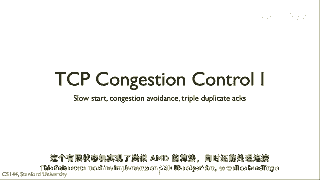
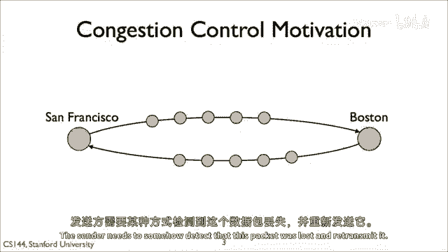
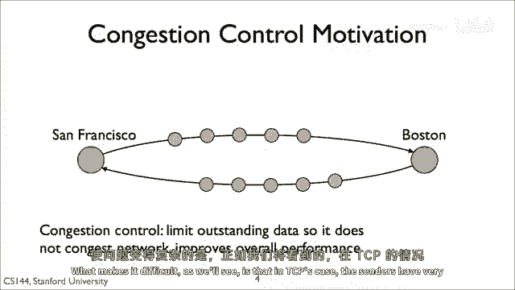
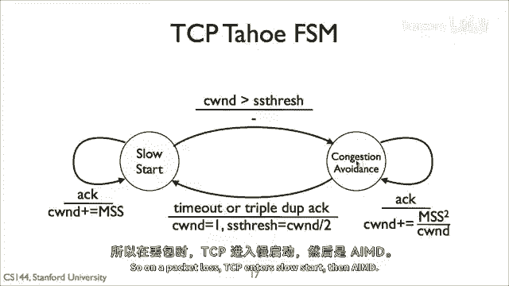
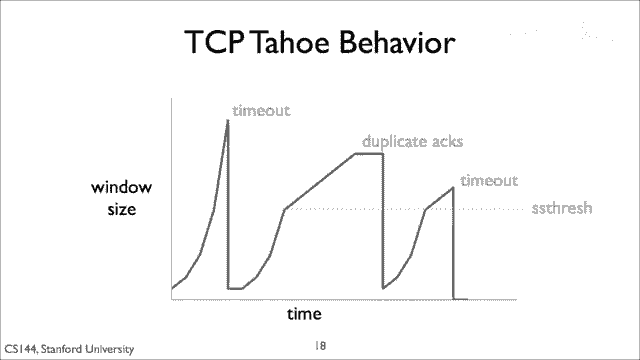

# 【计算机网络 CS144】斯坦福—中英字幕 - P58：p57 4-5 TCP Tahoe - 加加zero - BV1qotgeXE8D

在接下来的三个视频中，我将解释TCP的拥塞控制如何工作，基本总结是TCP使用加性增加，乘性减少，但是关于如何实现这一点有很多细节，TCP被认为是网络领域的一项巨大成就，它是可靠的。

一种在高性能网络环境中都能良好运行的传输层，当然它不是完美的，但你可以看到它的强大之处，以及有多少应用依赖于它，本视频解释了TCP如何使用简单的有限状态机来控制数据包的数量，它在网络中表现出色。

这个有限状态机实现了AMD类似的算法，同时也处理连接。

嗯，设置和重大的网络中断，所以记住流量控制，网络、协议或系统如何尝试不过度加载网络两端之间的网络，假设我们在旧金山和波士顿之间传输数据，在这些两个端点之间有许多路由器，每个节点都有自己的队列和流量负载。

如果我们发送包率低于，支撑的岩石，我们可以预期看到相对较低的包丢失率，来自旧金山到波士顿的大部分包将到达，并且来自波士顿到旧金山的大部分包将到达，但如果我们在岩石和支撑中发送更多的包。

然后他们将从队列中丢失，发送者需要某种方式检测到这个包丢失并重新传输。

这需要时间和降低性能，所以，拥塞控制的目的是控制发送者尚未发送的数据包数量，在网络中，目标是发送网络能够支持的最大数量的数据包，但是，发送更多的数据包会导致队列填满并大量丢弃数据包，这看起来简单。

什么使它困难。

正如我们将看到的，在有状态传输控制协议（TCP）的情况下，发送者对网络内部状态的信息非常有限，因此，必须从这些有限的信号中推断出丢失。

基本总结是，在其稳定状态下，TCP使用AMD，它维护一个名为其拥塞窗口的变量，拥塞窗口指定未确认的秒段数量，连接可以在网络上有未确认的段，当发送者收到确认，这些指示段已经离开了网络，因此。

它可以在每个往返时间内发送更多，Rt，TCP通过增加拥塞窗口的大小来增加1，最大段大小1 MSS，这是TCP在检测到数据包丢失时增加的累积增加量，它具有拥塞窗口，或者在某些情况下将其设置为一个段。

到目前为止，我们已经解释了拥塞控制作为一个清晰和明显的问题，它如何出现，而AMD是一个简单且高度有效的算法，用于管理拥塞，但这从一开始就没有被意识到，我将简要讲述TCP如何从使用AMD开始进化的。

这是一个伟大的故事，互联网崩溃并变得无法使用，对此崩溃的反应，一些研究人员发明了AMD。

我将详细解释它如何工作，这是TCP在70年代中到晚期的早期历史，Cerf和其他人开发了一个三步握手用于连接建立，并将TCP分成我们今天所知的两个层，IP在网络层，TCP在传输层，于1981年1月1日。

1983年，整个ARPANET在三年后切换到TCP/IP，1986年，互联网开始遭受拥塞崩溃，因为TCP流开始饱和链接，路由器丢弃数据包，但TCP对这些丢弃的数据包反应不佳。

TCP大部分时间都在重新传输成功到达的数据包，继续浪费这些饱和链接的容量，这导致包丢失率高，以至于新段经常被丢弃，因此，应用程序看到了非常低的数据率，网络正在拼命工作，发送浪费的段。

这创造了拥塞崩溃的术语，网络极度拥堵，但在1987年，应用程序没有看到任何有用的工作被做，1988年，Van Jacobson深入研究了正在发生的事情并修复了TCP，发表了开创性的TCP论文。

其算法构成了今天所有TCP实现的基础，这种TCP被称为TCP Tahoe，以两年后与它打包的BSD Unix特定发布版命名，在称为TCP Reno的版本中，对TCP进行了一些进一步改进。

现代TCP层在TCP之上添加了一些额外的复杂性，Reno适用于现代网络速度，但其核心是TCP Reno。

因此，我们可以将TCP简化为三个问题，何时发送新数据，何时重新传输数据，何时发送确认，在这个视频中，我将解释第一个问题的答案，TCP何时发送新数据，我会解释第二两个问题的答案。

在下一个关于RTT估计和自我时钟的视频中。

记住TCP窗口在其头部有一个窗口字段，连接的哪一侧使用此字段告诉另一方其流量控制窗口的大小，TCP规范说TCPU中心不应该发送数据，超过弹性知识字节，加上流量控制窗口的大小。

流量控制确保发送者不发送接收者无法处理的数据，TCP的原始版本在完成三次握手后，发送一个满窗口的段，所以，如果接收者，所以，如果发送者收到了一个四十千字节的流量控制窗口，并且有四十千字节要发送。

它将发送四十千字节段的价值，立即，然后，它将为每个包和每个段启动重传计时器，如果计时器触发且段未被确认，tcp将重新传输它，直到确认消息到来，它们可以提高发送者的窗口，当。

窗口字段中的认可号总和指示接收器可以处理，更多的数据，如果窗口远大于网络所能支持的，那么这将成为一个问题，假设，例如，在两个端点之间的瓶口链接只能排队几个数据包，一旦握手完成。

发送方将发送三十个或更多的数据包，在第一几个填满瓶颈链接后，瓶颈队列，其余的将被丢弃。

这就是观察到的情况，这张图来自确立TB拥塞控制机制的经典论文，x轴显示时间以秒为单位，y轴以段序列号表示，TCP传输的段序列号是多少，向右表示TCP正在发送更多的数据，一条向下跳的线，向右表示存在重传。

因为TCP正在发送一个较旧的序列号，具有相同y值的两个点，但具有不同x值的点显示了重传，直线显示了大约每秒二十千瓦的可用带宽，如果TCP行为良好，网络将比现在慢得多，然后，我们将看到暗线跟踪这条亮线。

填充可用带宽，但这不是我们看到的相反情况，我们在这个图中可以看到，TCP立即发送大量的段，远远超过了网络可以处理的数量，然后，它等待几乎一秒，直到超时使它重新传输一个包，然后，随着窗口的推进。

它发送更多的片段，其中一些再次丢失，这种锯齿状模式意味着TCP从几乎每个爆发中丢失包，而且整条线的斜率远低于每秒20千比特的容量。

因此，tp taho添加了三项改进以正确控制拥塞，拥塞窗口，更好的超时时间估计和自我计时，与这个视频相反。

我会阻止第一个，我会展示第一个，记住，流量控制是关于一个端点可以处理的流量的，TCP不会发送超过流量控制窗口指定的数据，但如果端点可以处理比网络更多的数据，流量控制窗口只是发送者应发送数据的上限。

为了良好的性能，它可能应该发送远少于此，TCP tau估计网络中称为拥塞窗口的东西，它的发送窗口是流量窗口的最大值，拥塞窗口不会发送超过另一方可以处理的，也不会发送超过网络可以处理的。

以管理这个拥塞窗口，tp将拥塞控制分离为两个状态，被称为慢启动和避免拥塞在稳定状态，TCP处于避免拥塞状态，在其中，它遵循IMD策略当连接开始时，或者有包超时，TCP进入慢启动状态，它不遵循IMD策略。

关于拥塞避免和慢启动状态如何工作的思考方式，是以它们如何增加其拥塞窗口来衡量的，当TCP进入慢启动状态时，其拥塞窗口是最大段大小mss或一个段，每次它收到一个新的确认，那就是一个确认段。

那确认之前未被确认的数据，TCP增加拥塞窗口一个最大段大小，这个政策和慢启动意味着拥塞窗口以指数增长，发送者开始窗口的大小为ss，它发送一个段当它收到确认，增加拥塞窗口到两个mss。

并当它收到对这些段的确认时发送两个新段，它增加拥塞窗口到四个mss，一个对于每个确认，并发送四个新段，慢启动这个名字可能有些误导，指数增长比加法增长快得多，但它被称为慢启动因为它在比较旧的方法时比慢。

TCP以前立即上升整个流量控制窗口，在避免拥塞状态。

TCP增加窗口的速度要慢得多，类似于IMD，它增加窗口一个mss的平方，它增加窗口由一个mss的平方，按照每个确认的分段窗口进行分割，假设没有包被丢弃。

这导致tcp将窗口大小增加每个往返传输时间一个mss，所以我认为我们应该将窗口大小增加每个往返传输时间一个mss，存在未完成的窗口大小除以mss的分段，如果存在未完成的分段，然后。

每个确认都应该将我们期望增加的一端添加到窗口大小中，以字节计算，这意味着mss除以窗口大小，因为我们期望增加的mss，这意味着每个确认增加窗口大小mss次，mss除以窗口大小。

所以这就是imd的增加的一部分。

所以我们有这两个状态，第一个慢启动允许tcp快速找到可用的网络容量，例如，假设网络可以支持一个窗口大小为四十包的包，等待四十个往返传输时间才能到达，这个值需要太长的时间，但当我们接近网络容量时。

我们想要使用避免拥塞来更小心地探查使用增加的部分，那么我们如何选择从这两个状态过渡，tcp有三种信号可用给它，确认数量的增加意味着传输正在顺利进行，因为tcp使用累积确认。

重复的确认意味着分段丢失或延迟，但是其他分段最终成功地到达，如果出现超时，那么一定有很大的问题。

这就是tcp状态机的样子，从那里开始，连接处于慢启动状态，每次它收到确认，它将窗口大小增加sea wind一个mss，它增加窗口大小，所以直到它超过被称为ss thresh或慢启动阈值的阈值。

当窗口大小超过这个阈值时，tcp过渡到避免拥塞状态，在避免拥塞状态中，它更保守地减少窗口大小，每个往返传输时间一个mss，在超时或三重重复确认时，tcp返回到慢启动状态，tcp推断三重重复确认。

所以四个相同的动作是证明下一个分段丢失的好证据，接收器继续接收分段，但它无法为确认号，因为它缺少一个，当tcp返回到慢启动状态时，它设置ss thresh变量为窗口大小的一半。

这个数值设置TCP在跟随IMD后的分割点，所以，当一个包丢失时，TCP进入慢启动，然后一个IMD。

这个数字显示了TCP，太浩的拥塞窗口如何随时间变化，它开始时的大小为一个MSS，并按指数增长，第一个丢失响应超时，所以窗口被返回到一个MSS，并开始按指数增长，直到它达到其原始值的一半，在此点。

它开始按添加方式增长，它增长直到这个段丢失，并且有3个重复的确认，获胜者不会对这些重复行为做出反应，然后它下降到一个MSS，在慢启动后按指数增长，直到它达到SS阈值并开始按添加方式再次增长。

如果你仔细看，SS阈值是相同的有价值的时间，在这个例子中，TCP返回慢启动，然后它过渡到与相同窗口大小的拥塞点，对于这个简单图表，这是因为我计算SS阈值以整数个MSS为单位。

并且两个情况都被圆整到相同的值，请注意，TCP太浩并不严格管理拥塞，使用AMD很好，AMD是管理稳定状态或稳定网络的优秀算法，在实际中，TCP必须处理一个更广泛的范围条件，如启动。

暂时网络故障和丢失包burst，或可用带宽的突然变化，所以记住这三个问题，TCP何时发送新数据，它何时重传数据，它何时确认数据，这回答第一个问题，TCB发送新数据。

当其发送窗口定义为其拥塞窗口和流量控制窗口的最小值时，允许它这样做，拥塞窗口是一个发送者维护的值。

