# 【计算机网络 CS144】斯坦福—中英字幕 - P59：p58 4-5a Congestion Control - TCP Tahoe - 加加zero - BV1qotgeXE8D

所以在这个视频中，我将谈论流量控制，特别是流量控制和传输协议的一般动机。

然后，我将走过第一个真正识别并解决这个问题的协议示例，TCP的特定版本。

TP被称为TP Tahoe，我将谈论TP Tahoe使用的第一个机制。

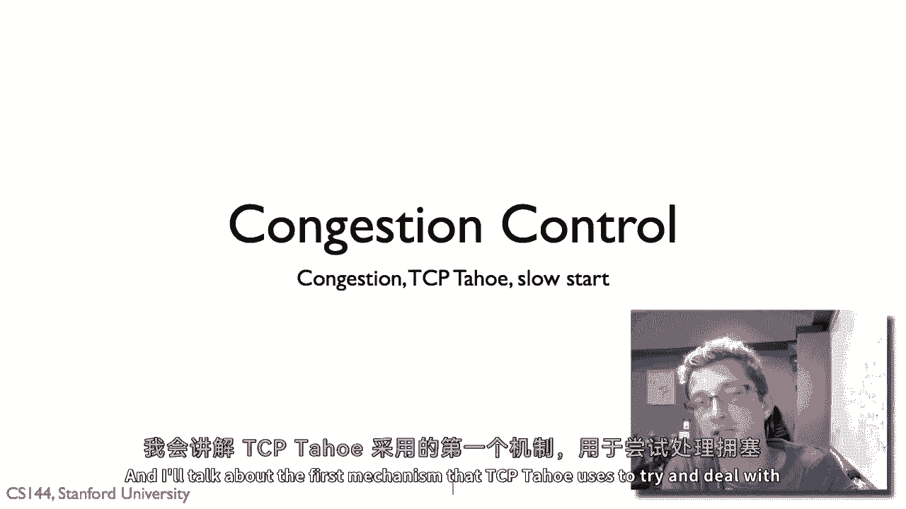

以尝试处理流量，被称为慢启动，流量控制的基本动机是，流量控制告诉终端点，说它将告诉BOIS，将要告诉旧金山他们可以接受的数据量，因此，流量控制，指定终点的限制，但是，非常有可能。

这个位于波士顿的节点能够接收的数据量，远远超过网络所能支持的，所以，例如，虽然这个新的位于波士顿的节点可能，你知道，有一个缓冲区允许它接收，嗯，一百，嗯，每跳路由每跳路由的包数。

可能是从旧金山到波士顿的路径上的某些瓶颈链路，实际上只能支持大约五个包每跳路由，所以想法是，如果旧金山与波士顿通信，旧金山的这个节点与波士顿的节点以某种速率通信，这种流量控制允许。

那么它将发送比它能支持的包数快得多的包，大多数这些包都会被丢弃，而且它将花费大量时间进行重传，以恢复这些严重的错误，你不想饱和网络，因为所有的工作都将不如，如果大多数包到达，需要较少的控制开销。

通常工作更好。

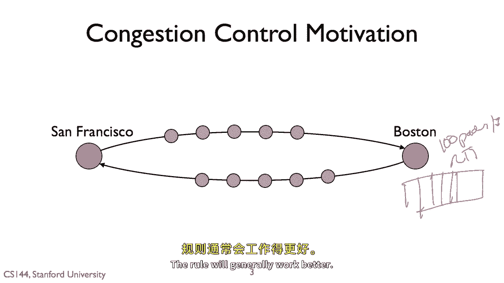

因此，网络拥塞控制的基本思想是，终端应该控制他们的数据率。

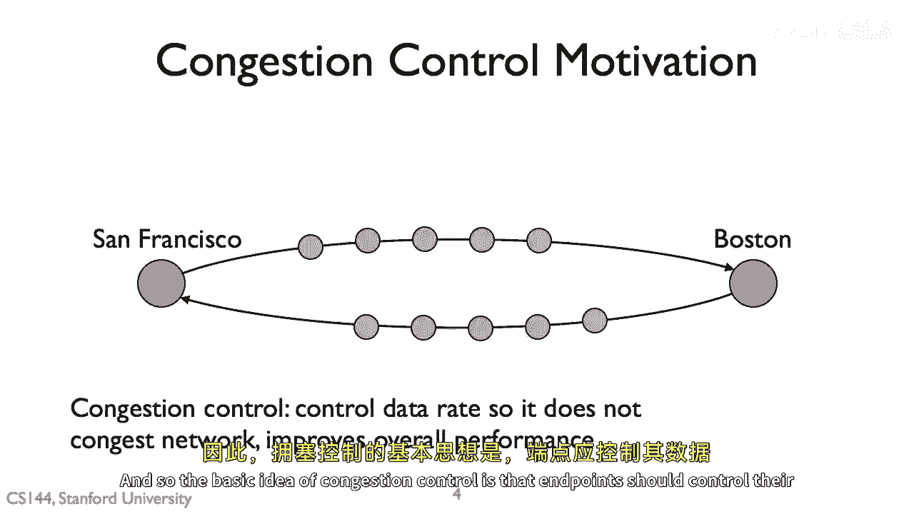

以便他们不会过度负载网络。

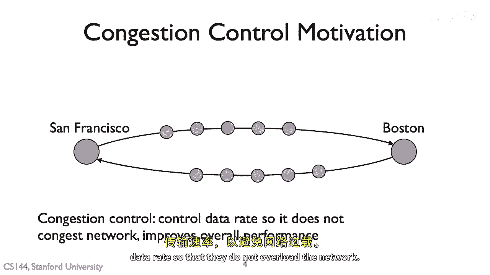

这将通常提高网络的性能，所以，如果我们从拥塞控制的角度来看退一步，真正导致它的是什么，正如互联网中这一非常重要的研究领域和工程，它都来自tcp，所以，通过握手在1974年建立的tcp基本历史，你知道。

罪与罚，嗯，在1978年，tcp和ip被分割，嗯，被分割，以前，互联网仅仅处于那个阶段，ARP不仅支持TCP，但他们意识到，哦，我们需要将它们分开，因为我们需要像UDP这样的东西，然后一月一日。

一九八三年，那是，你知道，开关日，突然整个ARPANET切换到，TCP，我P，我P，V4，那之后三年，互联网开始遭受拥堵崩溃，链接饱和的地方，他们在发送，你知道，以线速度运行，然而。

没有比这更有用的工作在进行，相反，传输的所有包都是不必要的，重传或确认，所以你看到链路的满负荷利用，同时没有应用级别的吞吐量，所以然后van jacobson在标志性的论文中，嗯，固定了tcp。

弄清楚了发生了什么事情，然后，他发表了TCP的里程碑性论文，嗯，这篇论文描述了TCP Tahoe，所以，这些名字Tahoe和Reno，嗯，来自硬件版本的名称，嗯。

这些TCP实现发生在伯克利Unix的版本上，所以你会读到Tahoe和Reno，然后，当你开始看到像新Reno这样的名字时，Vegas，戴顿纳，只是为了跟随那个主题。

但是太浩和雷诺被标记为某种形式的伯克利的，在硬件中分发的伯克利Unix版本，它们大约是关于，你知道，在第一个tp太浩几年后，一种快速的恢复和快速的传输，这是一种未来的东西，tp版本。

我会在后期视频中讨论，雷诺传输协议，今天常见的是，但在那个时期，新的想法被添加进去了，所以，如果你基本上看所有TCP实现今天，嗯，都有TCP太浩和TCP雷诺中的机制。

所以我们将在这一系列的视频中讨论它们。

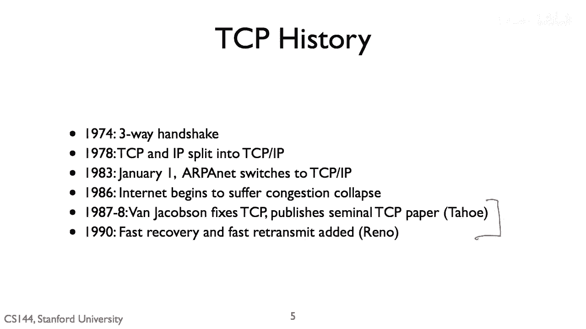

所以，基本有三个问题一个传输协议需要回答，如果它要提供可靠的传输，首先，是什么时候发送新数据，那就是什么时候发送它从未放在网络上的数据，第二，是什么时候发送重传，我应该尝试重新发送我之前发送的数据。

最后，是什么时候发送对成功接收的数据的确认，这些都是我做的基本事情，它是什么时候生成数据包，它们是数据包，数据包的重传还是确认包的重传现在，当然，我们经常谈论数据和确认包作为独立的，但在TCP中。

它们不是，确认只是头部中的一个字段，你可以，当然，可以叠加数据和确认，但我们通常只谈论数据确认单独，假装流量是单向的，尽管经常不是，它可能双向，要点是，你可能没有数据要发送。

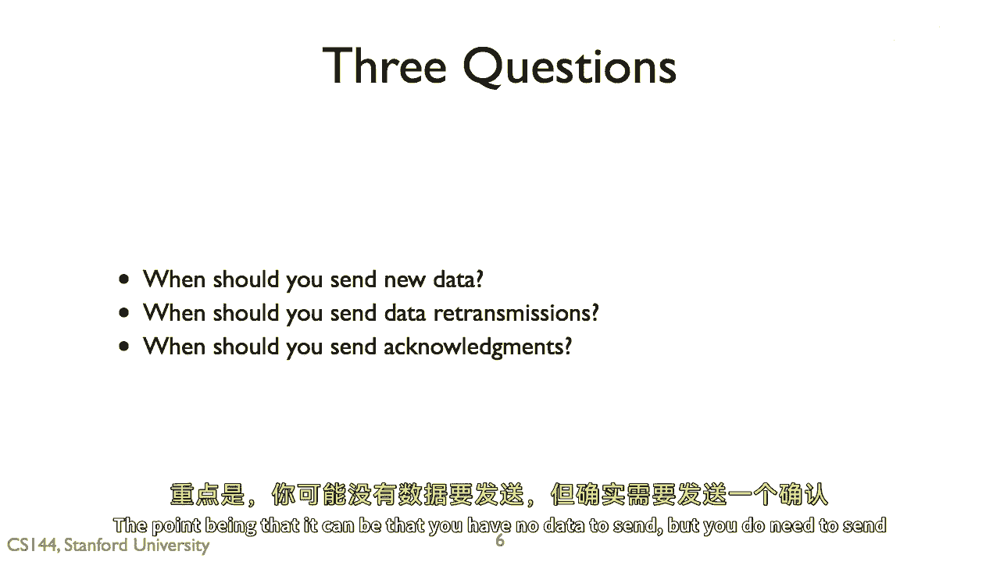

但你需要发送确认，TCP在TCP太浩之前看起来什么样子，所以，基本上，你会通过握手设置连接，现在，一个端点有了流量控制窗口的大小，通过TCP头部的窗口字段来注意，在太浩之前，TCP会做什么。

这似乎是一件简单的事情。

它会只是发送满窗口的数据包，如果窗口说呀，我是三十千字节，它会发送三十千字节的数据包，这遵守了流量控制，它会然后开始对每个数据包的重传计时，嗯，然后在没有收到对该数据包的确认时，当传输时间到期时。

重传时间被触发，它会然后重传那个数据包，所以，基本问题这是遇到什么。

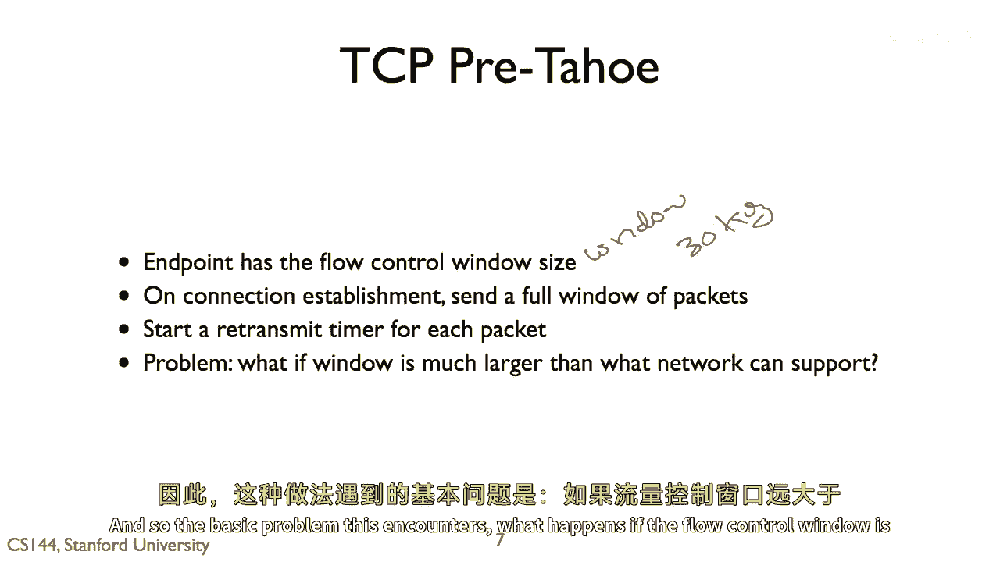

如果流量控制窗口远大于网络可以支持的，它可能你的目的地有30千字节的空间，但你知道链接已经饱和，你不能突然就向它dump另一个30千字节，我的意思是，现在这些数字可能看起来很小，但是。

那时候你知道你有五十，与今天的速度相比，你的链接相对较慢，所以，你可以把这看作是你的窗户，突然我们广告了三十兆字节，你不一定想立即将，三十兆字节倒入你的DSL或电缆调制解调器链接中。

所以，如果你实现那个算法，你只是发送一包窗口的包，那么，会发生什么，所以这有一张图片，所以这里正在显示，X轴是秒数，Y轴是包序列号，以千字节为单位，所以TCP发送的字节的序列号。

所以你看到的是在连接建立中，它立即发送一个满缓冲区的包，大约有二十，千字节的值，然后它开始获取一些确认，所以正在发送更多的数据，但是突然它的窗口变成了特定的大小，流量控制窗口，而且它没有。

收到对这个的确认，嗯，这里这一段，所以到这个点，tcp被阻塞了，对，这些点表示传输的包，所以到这个点，因为它被送到最后一个知识字节，所以它被阻塞了，再加上窗口大小，而且它不能再发了。

而且原因是这个包可能丢失了，所以这里是，基本上这里是超时，然后它重新传输那个包，然后，正如你可以看到，它能够发送大量的包，它收到了大量的确认，或者它会累积确认，允许窗口移动，嗯，向前，等等等等。

但是要在这里看到的基本点是，这里有这些巨大的锯齿状，你看到大量的包流后跟着空闲超时，大量的包流后跟着空闲超时，而且许多这些包是冗余的，比如这个特定的包现在已经被发送三次了，这个包也被发送三次。

所以你看到了大量的重传，总的来说，协议的性能并不好，它正在发送所有这些包，但如果你看到这个线的实际斜率，从数据未发送的角度来看，斜率并不高，如果tcp以线速度运行，以正确的速度运行，它应该遵循这里的线。

但相反，它遵循一条斜率远低于这里的线，实际上，它正在以比应该能够的速度发送数据慢得多，这是被观察到的，TCP非常慢的原因，因为它在不必要的情况下发送大量的重传，并且有很多超时。

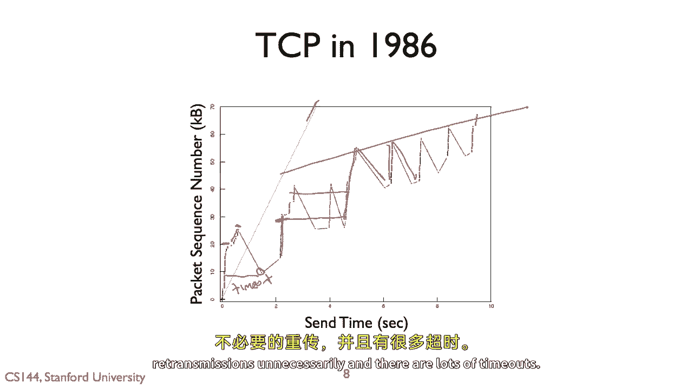

因此，基于这个，嗯，雅各森提出了三个改进，第一个是拥塞窗口的概念，第二个是更准确的超时估计，最后一个是自我计时，我将逐一介绍这些，嗯，拥堵，在这个视频中，我们将讨论拥塞窗口和相关的内容，在未来的视频中。

我将讨论超时时间的估计和自我计时。

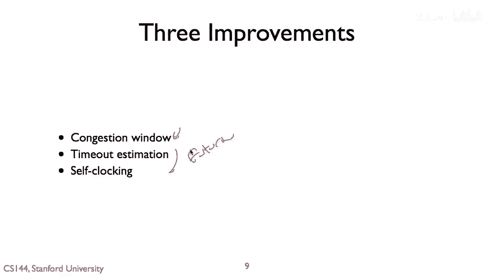

所以拥塞窗口，所以基本理解是，流量控制窗口只关于终端点，所以你想要TCP估计拥塞窗口，这就是网络能支持的数量，当我，在数据发送和网络可靠交付的速度上，我如何能做到？

然后，发送窗口将是这两个的最小值。

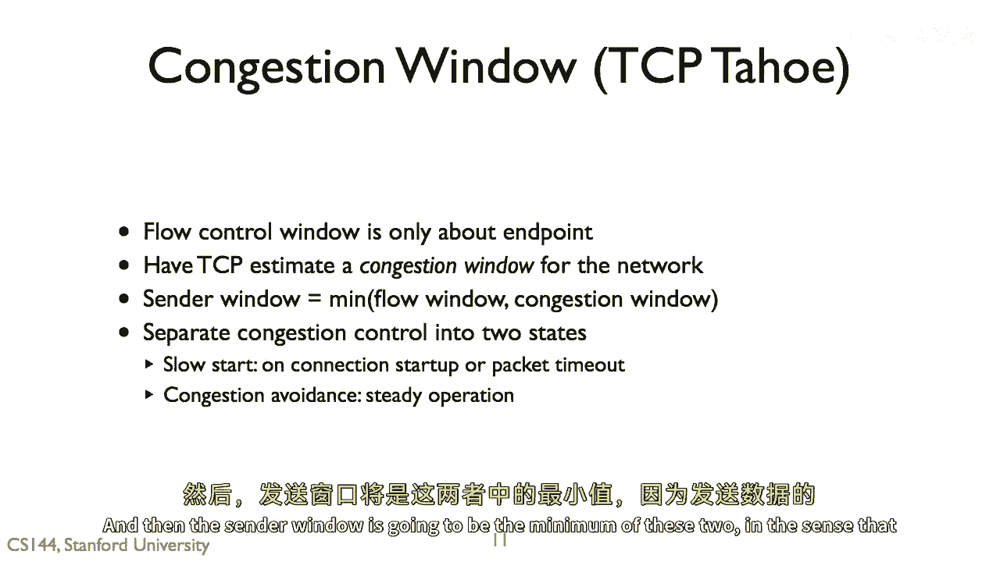

因为没有意义发送比网络支持速度更快的数据，也没有意义发送比目标语言主机支持速度更快的数据。

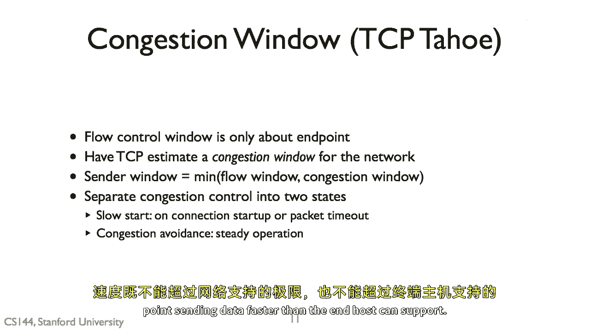

然后，你的行为基于这种拥塞窗口的概念。

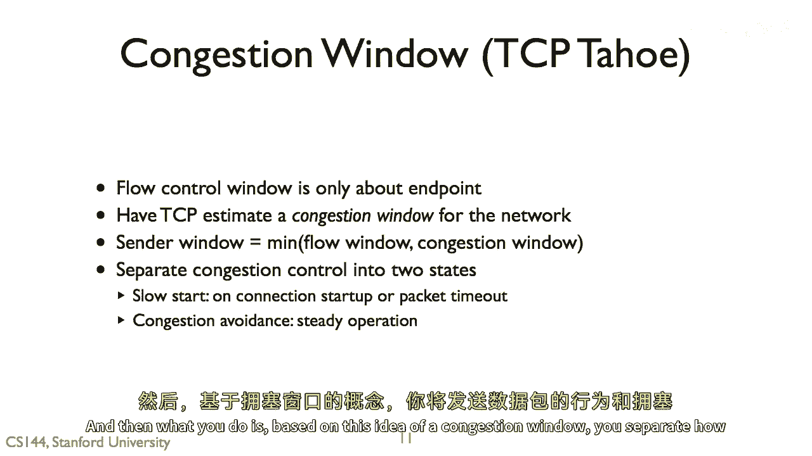

你分离在发送包方面的行为和大小，并将拥塞窗口的大小分为两个状态，第一个被称为慢启动。

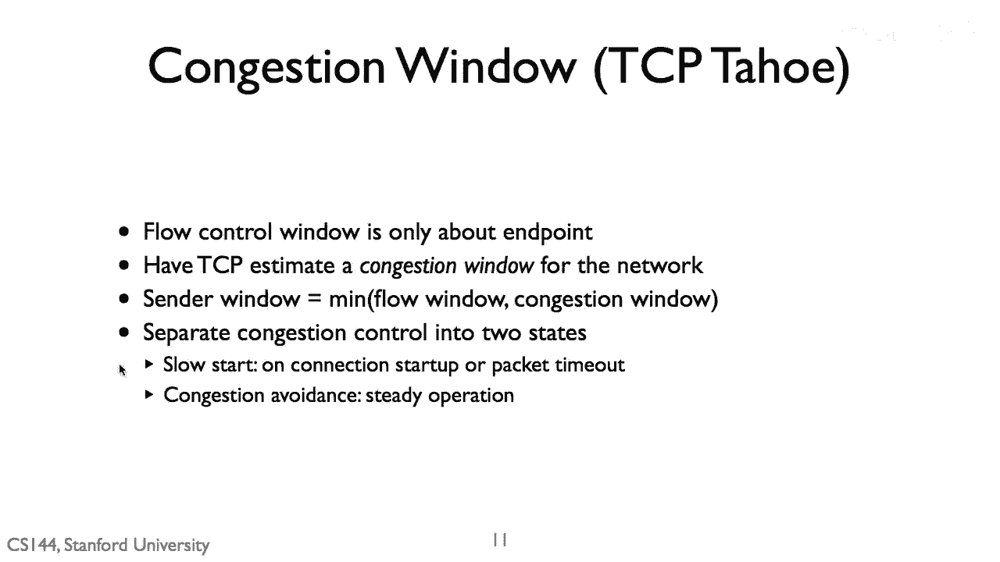

第二个是拥塞状态，在连接启动时使用慢启动。

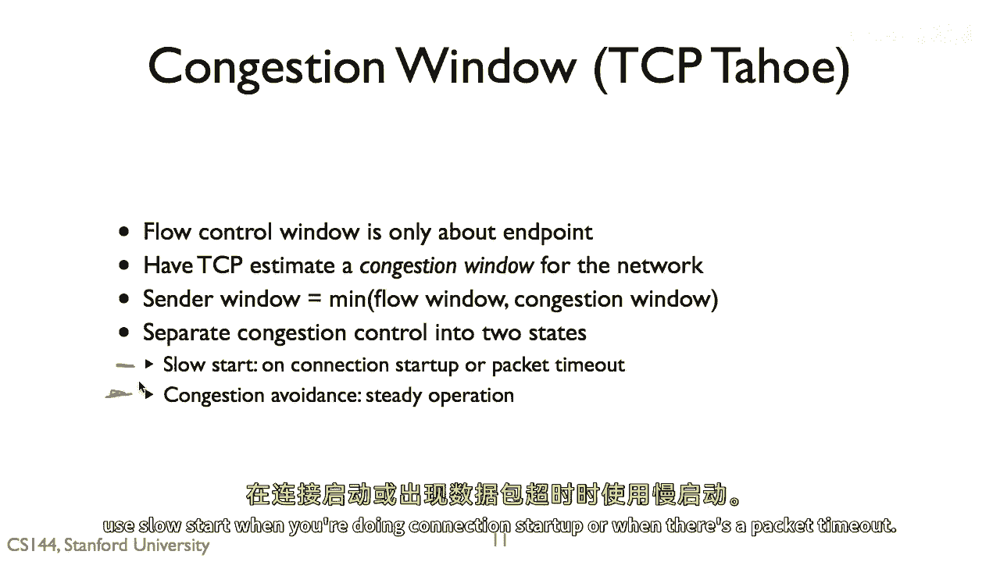

或者在包超时时，当出现严重问题时，并且你想完全后退。

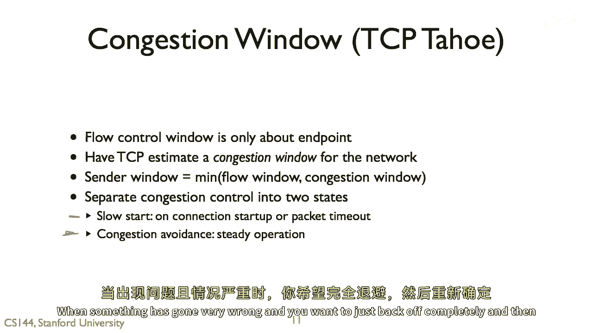

然后找出网络可以支持的拥塞避免策略，相比之下，当你的行为相当良好时，那就是，你正在接近网络的容量，所以你不想开始发送东西更快或更慢，你正在接近什么，你认为，网络的拥塞窗口是。

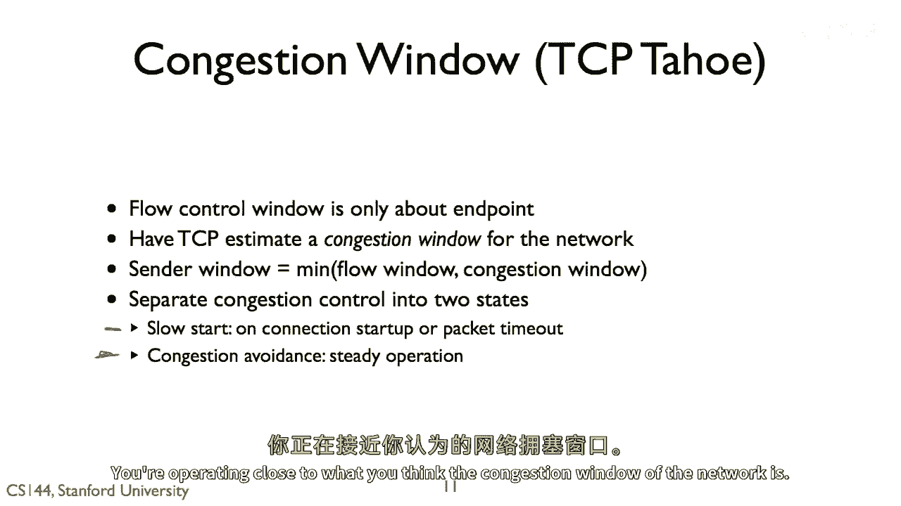

所以慢启动思想的基本原理是，节点会做的事情是，而不是一开始就将其窗口设置为流量控制窗口的大小，它开始时会将窗口设置为最小最大段大小的大小，所以基本上，今天的数据包值是一个段的大小，嗯。

节点可能会从两个或四个开始，嗯，关于两个有一些规则，三个，Two，Three or four，But the original version started at one，Um。

And then every time a packet acknowledged，Every time you receive a new acknowledgment。

You increase this window by the maximum segment size。

And what this means in terms of practice is that in the first round trip time。

You're going to send a single packet，You'll be acknowledged now，你的段边，现在，你的窗口大小是二，所以你会发送两个包，他们都会被确认。

你增加两个，它会发送四个包，他们会被确认，然后你会发送八个包，有这种指数增长，这就是你在这里看到的，所以这里有一个包，两个包，嗯，或者有一个，两个四，你知道八等等，这种指数增长，放大，所以。

在对数步数中，你可能希望发现网络的拥塞窗口大小是多少，所以这可能看起来我的意思是，指数增长并不慢，所以名称是它可以有点困惑，它被称为慢是因为它与前一个相比慢，实际上，这是今天tp中更快的模式。

但与发送整个流量控制窗口的包相比，通过一个对数数量的步骤进行指数规模的扩展，这样相比起来是如此的，所以与现代相比，它是一种有趣的历史比较，嗯，现代观念，因此，我们可以从这幅图中看到，这也是来自。

雅各逊的论文的，嗯。

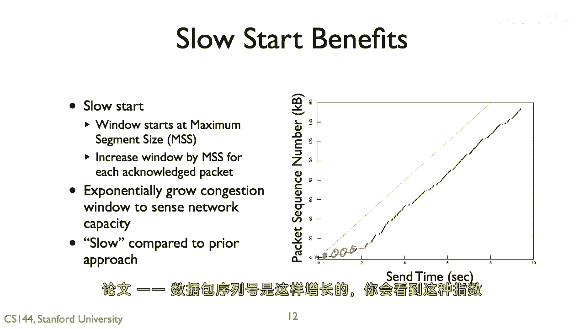

你知道的包序列号是以这种方式增加的，你看到的第二个潜在增长，然后使用慢启动，你将最终，再加上稍后我会讨论的拥塞避免状态。

你将最终达到这个美好的稳定状态，虽然它需要一些时间来发现线速度是多少，最终，协议的行为非常接近这条线速度，并运行接近容量，它不会让它过载，你也不会看到这些锯齿状的糟糕性能。

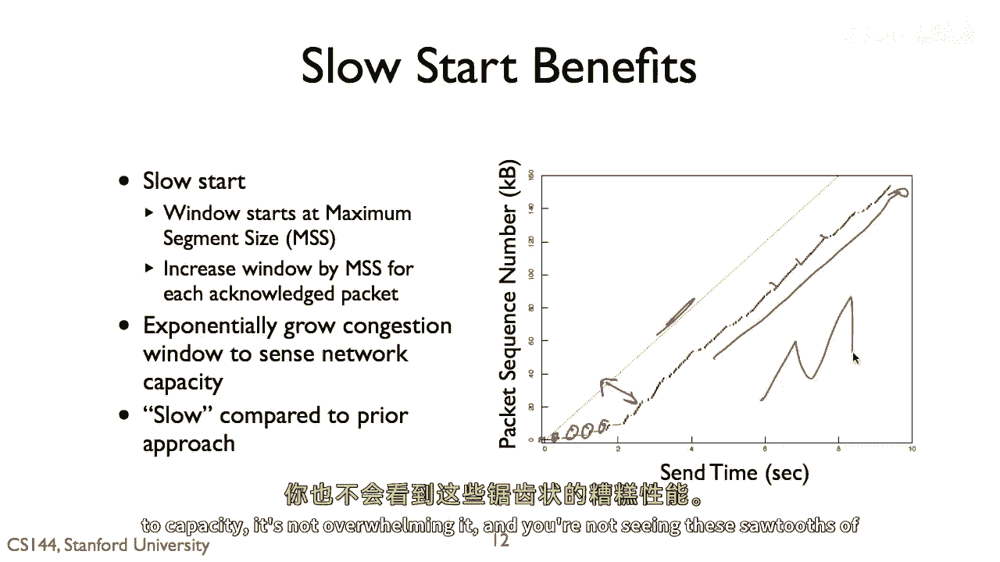

这就是慢启动状态，所以在慢启动状态，你将通过每个确认增加拥塞窗口的最大段大小，这导致窗口大小的指数增长，你可以处于的第二个状态被称为拥塞避免，在这个模型中，当你处于拥塞避免状态时，你将增加拥塞窗口。

和最大段大小的平方，除以每个确认的拥塞窗口，这种行为的结果是，而不是通过窗口为每个确认增加最大段大小，你想要为每个往返时间增加最大段大小，所以它是累加的增加，而这是它以指数方式增长窗口大小。

这正在增长窗口大小，嗯，线性地。

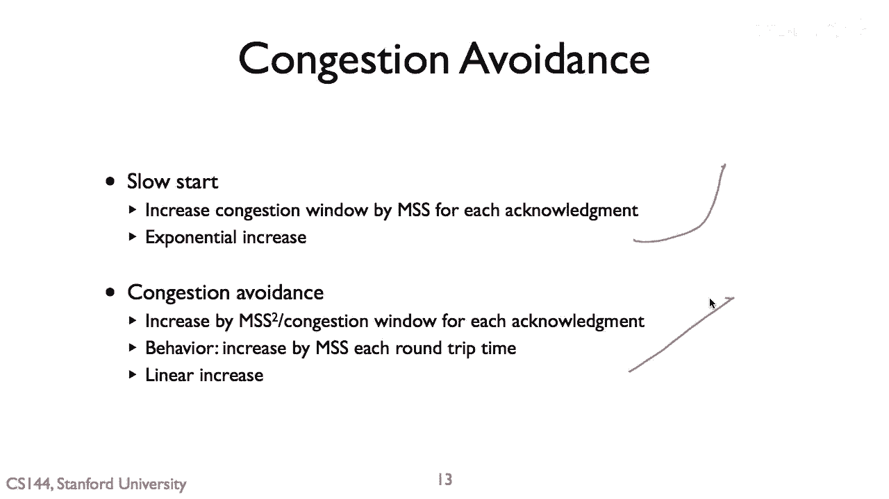

所以我们有两个状态，慢启动和拥塞避免，我们如何从它们之间过渡呢，真的，有这些，有这些两个目标，为什么不使用慢启动来快速找到网络的拥塞容量，那就是，我们多快可以发送东西，直到网络进入拥塞。

开始缓冲包并丢弃包，所以当我们接近那个容量时，你想要使用拥塞点来非常小心地探索，我们在拥塞点以下，让我们就从慢速开始增加，直到我们达到它，然后可能稍微下降一点，然后开始慢速增加，直到我们达到它。

我们基本上可以使用这个来保持在那个值附近，并接近网络的容量，我们有三个信号来实现这个，对吧，第一个是如果我们看到越来越多的确认，这意味着数据传输正在顺利进行，也许我们可以稍微加快速度。

第二个是如果我们有重复的确认，记住tcp使用累积确认，所以如果我们看到对同一块数据的许多确认，这意味着tcp正在接收分段，但是其中有一个缺失，所以这意味着有些东西丢失或延迟了，最后的信号是如果有超时。

如果我们发送一大批包或一个包的窗口，并且我们没有收到任何消息，并且有一个超时，这意味着发生了非常严重的错误，或者基于什么，网络拥塞是平滑的，或者突然变得拥塞，因为它本身可以具有动态的流量。

所以这就是tcp tahoe finance状态机，我将一步一步地走，所以当你打开一个tcp tahoe连接，你将从慢启动状态开始，最大窗口的最大段大小，记住，你的实际窗口永远不会比流量控制窗口大。

流量控制窗口和拥塞控制窗口的最小值，所以这是在控制拥塞控制窗口的大小，然后每次我们在慢启动状态并收到，嗯，确认。

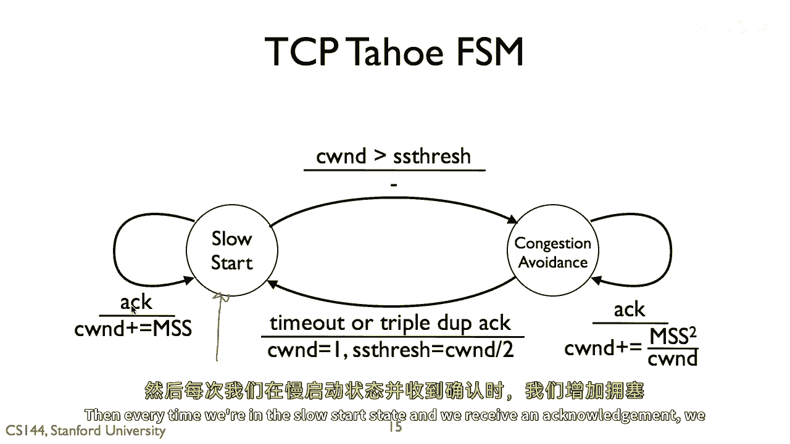

我们将海洋窗口的拥塞窗口增加，嗯，最大段大小，所以这里是指数增长，我们有一个参数ss threshold。

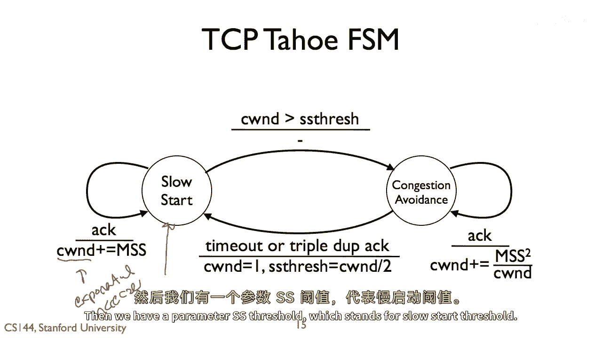

这代表慢启动阈值，如果拥塞窗口增长超过慢启动阈值，那么我们将过渡到拥塞避免状态，这意味着，我们突然有一个足够大的拥塞窗口，然后我们应该减缓我们的增长，现在，我们在拥塞避免状态下过渡到拥塞避免。

如果我们收到确认并增加拥塞窗口至最大段大小，嗯，拥塞窗口的平方除以拥塞窗口，这是线性增长，因此，我们看到窗口大小随着时间的推移将像这样。

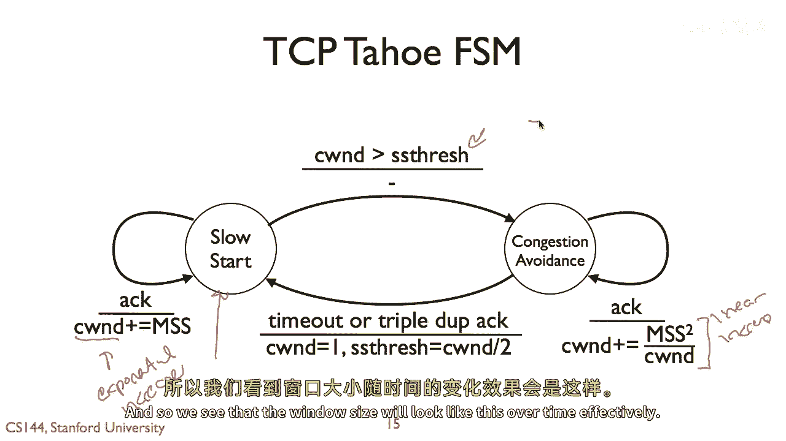

这里就是我们达到ss阈值的地方，这部分对应于这个状态，这部分对应于这个状态，但是现在如果我们处于拥塞避免状态会发生什么，并且这个线性增加，嗯，超过了拥塞，嗯，网络的容量，嗯，会发生的事情是。

我们将看到超时或三重重复动作，三重重复动作，这暗示了一个数据包丢失，嗯，我们看到这么多确认，嗯，因此，当TCP Tahoe看到，要么是超时，要么是三重重复动作，是，它将重置拥塞窗口为1。

并设置SS阈值为旧的拥塞窗口除以2。

因此，这将做什么是，假设我们之后看到，嗯，我们看到线性增长，然后，当我们说三重重复动作时，会发生的是，TCP Tahoe将设置蓝色，它将设置SS阈值，为当时拥塞窗口的一半，然后它将重新进入，嗯，慢启动。

进行指数增长，直到它达到SS阈值，这时，然后作为阈值点，将进入拥塞避免并进行线性增长。

因此，我们可以这样想，每当发生三重重复动作。

或者超时，TCP Tahoe已经发现了它认为太多的东西，太快，传输率，它的窗口太大，所以然后它做什么是，它说，好吧，我将指数增长我的窗口，直到我达到那个点的一半。

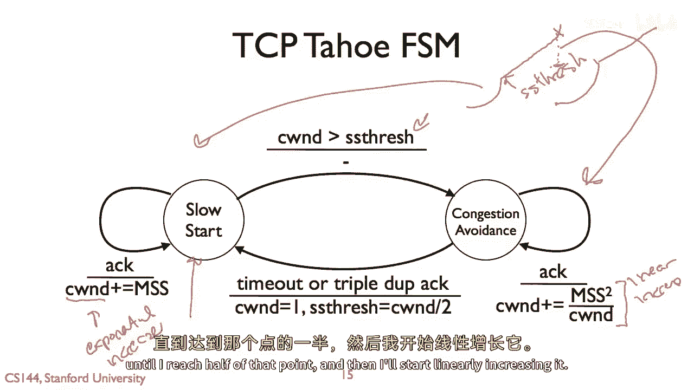

然后我开始线性增加，这就是你希望快速恢复到。

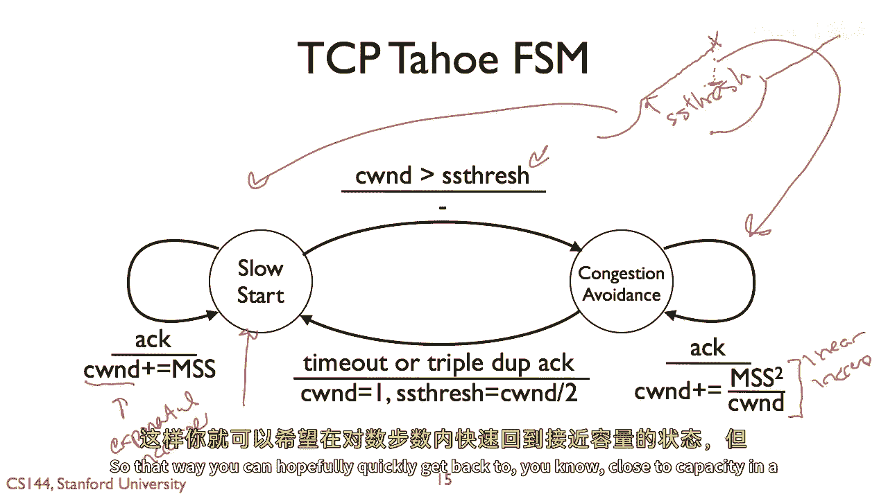

你知道，接近容量，只需要几个步骤，但你不想太接近，所以你从那个旧值的一半开始，然后开始线性增加 again。

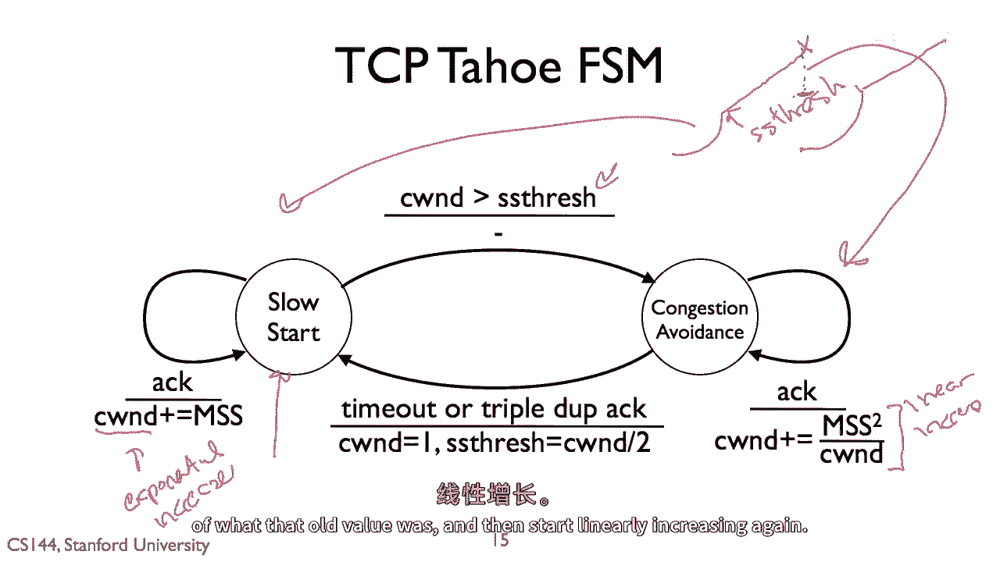

这就是TCP Tahoe的基本有限状态机，所以这里我将走一个简单的例子，我们开始与发送者，让我们假设SS阈值等于4，嗯，当它启动时，所以它首先，它将发送一个单一的，嗯，TCP段，单一最大段，段大小。

接收者，我们就叫这个一个，为了简单起见，我将它们编号为包，嗯，接收者发送确认，所以，到现在为止，我们的拥塞窗口，现在是等于一的，因为我们处于慢启动状态，它将变成两个，变成两个，因此。

发送者可以发送两个包，三个和四个，接收者接收它们，抱歉，两个和三个，接收者接收它们并发送确认，现在，拥塞窗口有四个，这意味着我们将发送，四个包，嗯，这将是四个，五，六和七现在，到这个点。

拥塞窗口达到了慢启动阈值，这意味着tcp tahoe将要离开这个，慢启动状态并进入拥塞避免状态，所以，当这些确认回来时，它将增加窗口一个，因此，而不是发送八个包，拥塞窗口将是五个，你将发送五个包。

让我们就说我会画一个箭头，这里表示包八到十一到十二现在，让我们说包八丢失了，它在网络中被丢弃，我们实际上已经达到了我们的拥塞点，嗯，会发生什么嗯，接收者将确认八，它将确认已经收到，并记住这个tcp。

所以，动作实际上会说九，但我只会写，写八以简化起见，我们将说，啊哈，我收到了八，然后十一到十二到达现在，tcp将会，然后发送确认八，八是因为累计确认还没有收到九，我只能说我收到了八。

我收到了接收日期接收日期，这是三重重复确认，我们有三个重复，所以现在tp tau打算做什么，是，它将过渡回慢启动状态，我的超时时间窗口是五，所以我要设置我的，嗯，慢启动阈值等于超时时间窗口的一半对吧。

所以让我们说，嗯，我们将其设置为，基本上它是2。5，嗯，再次进入慢启动状态。

所以我现在将发送一个包，这个包将被发送，嗯，在超时时间，所以本质上我在等待确认九，我还没有听到全部，超时时间，我将发送，我将重发九，然后这就是我可以有未确认包的数量，然后如果确认九回来。

我可以将我的超时时间窗口设置为2，嗯，但这不僅仅是对九的确认，因为已经收到了十，十一和十二，所以这确认实际上是说已确认十二，所以现在我的超时时间窗口为2，我知道十二已经收到，我可以发送十三和十四。

我回到慢启动状态，直到我达到ss阈值，这将过渡回避免拥堵状态，这就是TCP Tahoe的基本概述，和它如何行为，它移动在慢启动和避免拥堵状态之间，并如何使用三重重复动作。

以便推断出某些事情出了问题并返回慢启动状态。

