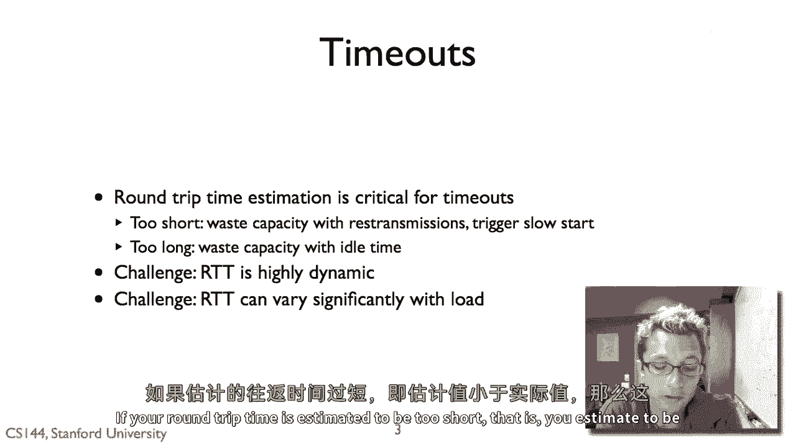

# 【计算机网络 CS144】斯坦福—中英字幕 - P61：p60 4-6a Congestion Control - RTT Estimation and Self-Clocking - 加加zero - BV1qotgeXE8D

所以，在这个视频中，我要谈谈TCP Tahoe引入的两个额外的机制，用于控制，拥塞，提高RTT，旅行时间估计和自我计时。

为了回顾TCP Tahoe的三个基本机制。

使它能够控制拥塞，实质上允许互联网再次工作。

我们之前谈论的拥塞窗口，以及这个慢启动和连接状态的概念，现在让我们谈谈第二个机制。

超时时间估计，因此，大约旅行时间的估计确实非常关键。

对于重传和超时，如果你的往返时间被估计得太短。

那就是你估计的比实际短，那么这就意味着你将浪费容量，你将认为包没有成功接收，即使它已经被不必要的重传和发送，这将触发慢启动，所以这真的很糟糕。

由于如果我有一个合适的窗口大小，我正在发送数据，但我的rtt估计太短。

我现在进入了慢启动，不一定是现在，如果rtt估计太长。

那也是一个问题，因为那可能是，我可能很早就重新传输了。

包没有到达那里，但是假设，让我们假设，我估算了RTT为五分钟，而当它只有几百毫秒时，你的策略在那里将停滞五分钟。

在它发出超时时尝试重传之前，所以这是可以的。

但是真正的挑战是，尤其是在互联网上，我们已经看到分组交换的RTT可以高度动态。

此外，负载变化可能会显著，即使你开始发送东西更快。

你可以更改自己的路径延迟，即使其余的世界保持不变，那么如何廉价地估计路径延迟。

非常快，考虑到这些限制。

所以，在tcp tahoe之前，嗯，有一个非常简单的机制，那就是r是你的rtt估计。

然后你只需要将它初始化为一些合理的值，比如哦，我们猜测嗯，五百毫秒或者什么，嗯然后您正在生成对最近活跃数据包的测量。

您说，哦，我在这个时间发送了包五，我现在有了AK在，你知道，时间加上五七毫秒，或者说两百毫秒，然后估计m将会是，你知道，五十七或者两百毫秒，然后我保持一个指数加权移动平均。

所以alpha r加上一减去alpha m的，这基本上就是说，接受我现有的估计，并集成一些我新估计的部分。

所以如果说，让我们就说r等于一百毫秒，并且我的测量等于，嗯。

八十毫秒和alpha，这是历史样本权重到当前的值。

让我们就说alpha等于一个点九，所以我会等待历史很多，这是一种平滑噪声的方法，然后新的r将是一百毫秒的点九倍，加上八十毫秒的一点倍，单到九十八毫秒，所以这一位于八十毫秒采样的。

将大致处于r和m之间的十分之一。

所以你可以想象一个较低的alpha值意味着你将更加重视，当前的测量，相对于较高的alpha值，更加重视历史，然后你的超时时间基于此因素，βr和β是两个，所以如果你看到。

你没有因为你的平均值的两倍而收到确认。

那么你假设有超时，然后你触发超时，所以这看起来像是一个完全合理的算法，你知道在初次看来，所以问题是什么，结果发现问题的是事实r是一个特定的值，不应该说任何事情关于rtt值分布的样子。

所以一种想象的方式是，"让我们假设你知道这里有一个图表"，"我正在看一个往返分布的情况"。

他们不是恒定的，"它们随时间变化得很好"，在一些情况下，我可能会有这样的数据：这是我的平均值，让我们叫它"这样"，我可能在这里有一个像这样的分布，实际上，如果我看两个小于零点零的a。

零点零零零一个百分点，嗯，的包需要那么长时间，到哪个点beta，一个beta值为二的估计极其保守，但它也可能有一个稍微不同的情况，或者这里让我们就说我有一个。

另一个链接，或者另一个路径，这是我的分布中的b在哪里，嗯，看起来像这样，如果我看两个b，有些人说百分之二十的，嗯，包倾向于有那个长的rtt，取决于网络的动态，你可以有非常不同的分布rtts。

这种方法没有考虑到这一点。

因此，对于rtt分布非常紧的tcp连接，Beta过于保守，结果你变得无所事事，当你不需要的时候，它，估计的rtt过大，但是，当rtt的分布非常广泛的时候。

Beta等于2等于2过于激进。

结果你无谓地重新传输，所以tcp tahoe，嗯，通过基本上将RTT的方差概念纳入其估计中，解决了这个问题，嗯，这就是提出的算法，也是被使用的算法，基本上，你要做的就是像以前那样。

你在做指数加权移动平均，嗯，你有这个r这个r这个RTT估计，你在做的也是测量你的估计误差。

所以，给定我有这个估计，R和我有一个测量，我测量的误差是m减去r。

并且我乘以这个增益因子，因为这些术语本质上是在乘以负r。

所以有我们在先前方法中看到的阿尔法因子，然后我们测量方差，所以方差再次是以加权平均计算的。

是错误的增益因子，减去方差，嗯，但是诱饵，所以这里的基本想法是，我们不仅在测量r的指数加权移动平均。

我们还在测量随时间的指数移除平均方差。

然后我们的超时时间等于平均值，加上四次方差或beta是4，所以这样，如果我们像以前那样，如果我们有一个非常紧的分布，那么以这样的标准的方差，那么我们将在包丢失时超时。

当方差只是当你有一个包时，那就是四次方差出，同样，如果你有一个非常宽的分布，你的分布将出现在这里，那么你会在非常当包的时候超时。

它是那个值的四倍，所以非常，它非常可能包实际上已经丢失，在交通拥堵极大的情况下，你没有，嗯。

估计，你知道什么也没有发生，你指数增加这个超时。

这里是来自van jacob的论文的两张图，它们显示了这个rtt估计的性能，所以底部的淡线显示，是实际从确认消息中测量的包rtts，而上面的实线显示超时时间估计，嗯，对于tcp算法，所以想法是。

一个完美的世界，那么超时将完美地反映这个，这样，如果我们没有得到它，如果我们只是等待比我们知道如何重新传输稍长的时间，所以有两个点，这个图在左边，你可以看到有一个巨大的差距。

所以tp一直在那里等待很长时间，实际上它可以更早地传输，也有案例它跨越了，这个图在右边，你可以看到它跨越了，所以这有点糟糕，这意味着包传输的时间更长，你知道，估计实际上，嗯，估计太短。

所以如果你看，这是右上角的预太浩算法，是后，是太浩算法，你看，它正在跟踪，嗯，RTT大大提高，对，这里的观察到的RTT和超时时间间隔大大缩小。

TP-TAO带来的第三个改进是一个叫做自我计时的东西。

这在某种程度上是TCP太浩最伟大的概念贡献。

嗯，TCP太浩的想法是，你想要基本上计时你发送的包，基于收到的确认。

所以这是，这是，这是种。

嗯，范雅各森提出的概念模型，假设我有一个发送者有一个非常大的管道，我们通过这种方式显示它变胖，其中这些包的体积是恒定的。

接收者也有一个胖的管道，但在中间有一个瓶颈链接，由于有这个瓶颈链接，会发生什么，是从发送者发送的非常快的包，将被在时间上拉伸。

它们需要更长的时间，然后它们在接收器中被以时间间隔分开。

接收者，如果它直接对这些包生成确认。

那么它将发送确认回，与接收它们相同的时间，这是由这个拥塞链接决定的，这个，嗯，瓶颈拥塞链接，这些动作到达，它们穿越瓶颈链接，你可以看到它们大大缩短，所以它们没有正确填充。

它们只占用一部分，然后这些确认到达发送者，对应于接收器接收的包的频率。

然后如果发送者发送由这些确认定时的包。

这实际上会内在地限制自己以时间间隔发送包，以便它们以正确的速率进入这个瓶颈链接。

那就是就像这里发出的包一样，然后通过技巧落下来，一个新的包开始到达，以及这个自我计时的概念，你不在网络中放入新的包，直到一个出来，你根据。

这允许TCP在一个非常简单的机制中。

不将大量的包放入网络，也不突然发送大量的包，使得这个链接饱和。

因为你可以想象这里有一个线索，所以，即使TP知道。

哦，我只能在每个往返时间内发送五个包，如果它发送一个包含五个包的爆发。

那么这些包可能会从队列的末尾掉下来，但如果由于这个时间间隔，它们被适当地间隔开来。

那么它们将以稳定的速率喂出，这将填满这个管道，而不会过度填充队列。

所以这里的原则是你只有在数据被留下时才将数据放入网络。

否则你将增加数据的量，网络，并导致拥堵。

所以您直接发送新数据以响应确认。

但也重要的是您要积极发送确认，例如，我们看到的重复确认，它们是根发送者非常重要的信号，所以如果您正在接收额外的分段。

并且您缺少分段，您应该积极发送对这些分段的确认，这样它就看到重复确认，它得到信号有一些东西被错过了，在收到这些确认时，它也知道，这些重复确认表明包已经离开了网络。

它可以据此做出决定，所以这就是TCP拥塞窗口的三个机制。

更好的RTT估计，考虑自时钟的方差。

或实际上是TCP Tahoe的基础，所以在1979年，1987年和1988年，van Jacobson修复了TCP以使用这些机制。

以及一些其他技巧，并发表了这篇关于TCP Tahoe的里程碑性论文。

嗯，这基本上解决了TCP的拥塞控制问题，互联网又开始工作了，嗯，这个调查实际上引发了TCP领域的大量研究。

以及关于如何管理您的发送率以不阻塞网络的整个想法，在下一个部分，我只是谈论了TCP Tahoe的第一版。

但是，它有一段很长的历史，所以，下一个视频将谈论tp reno，新的reno，你离它更近，今天的工作，他们添加了几项新机制，如果这感兴趣，我强烈推荐阅读van jacobson的原始论文。

拥塞避免和控制，大致描绘了他们看到的故事，然后这些机制和他们如何解决。

