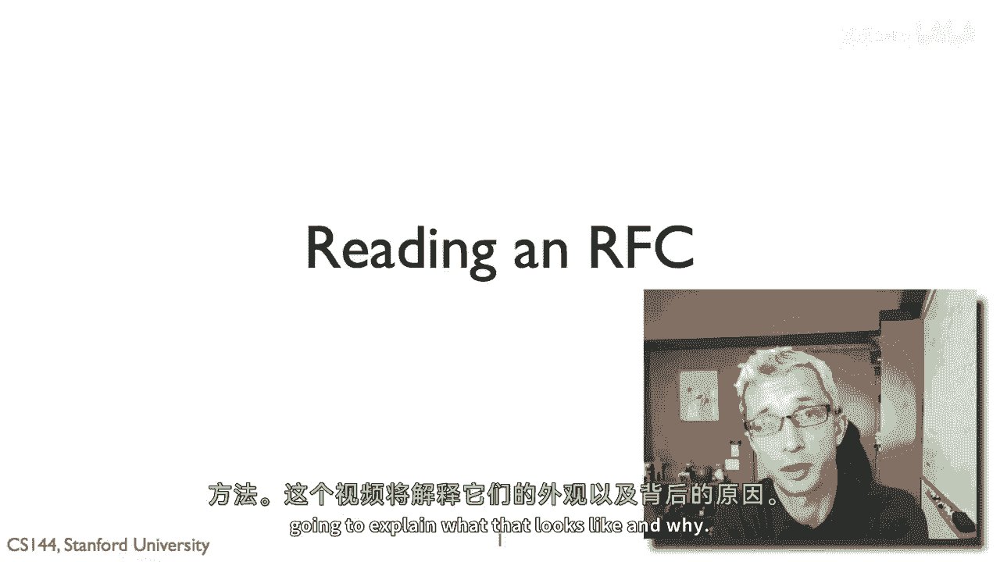
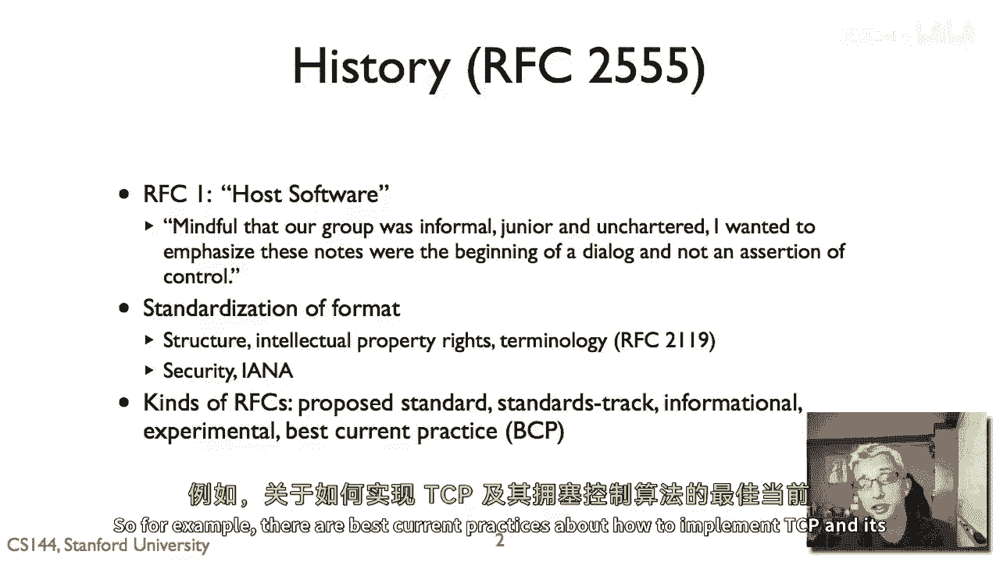
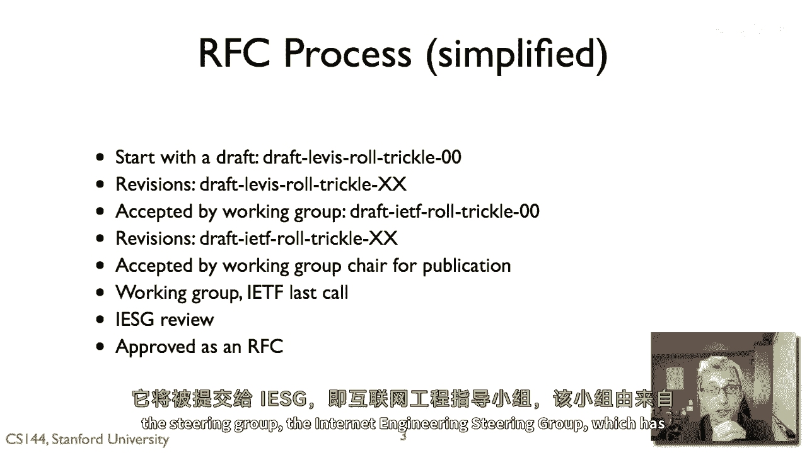
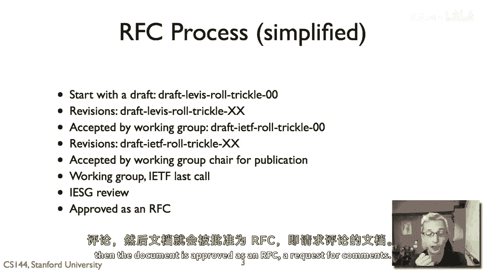
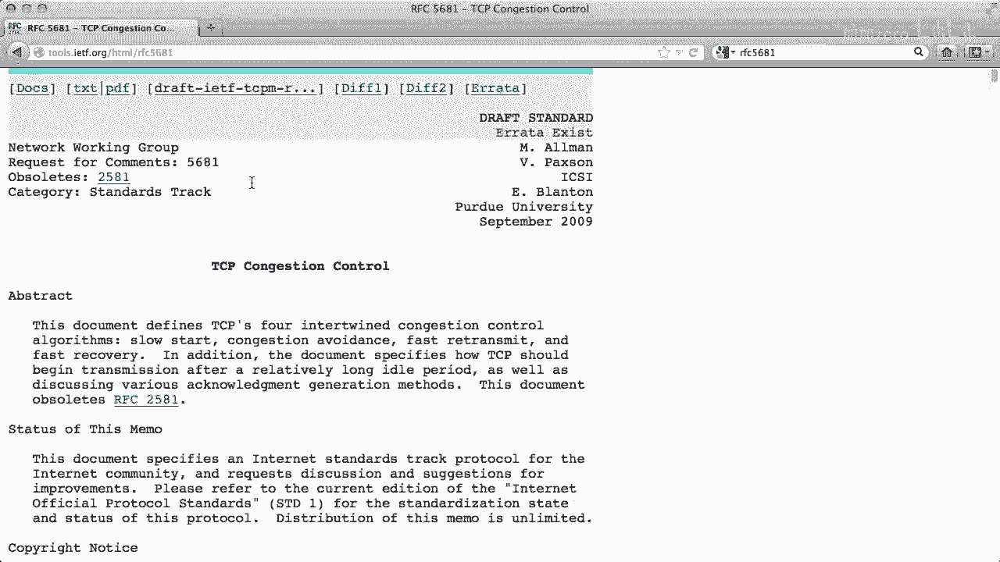
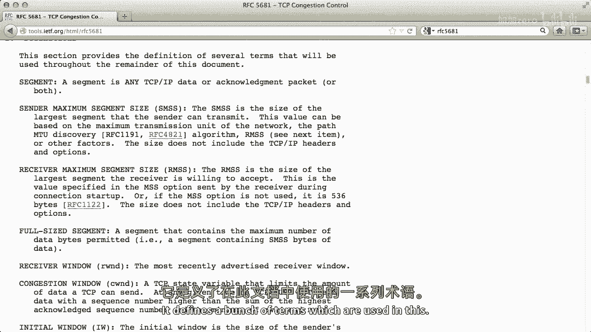
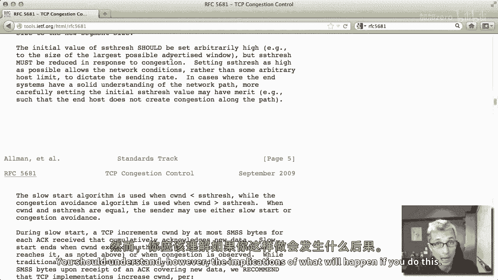
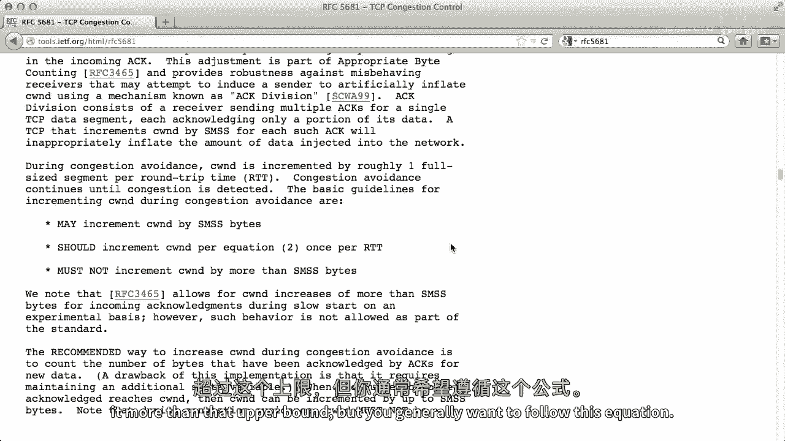

# 【计算机网络 CS144】斯坦福—中英字幕 - P65：p64 4-9 Skills --- Reading and RFC - 加加zero - BV1qotgeXE8D

所以，这个视频是关于如何阅读RFC（请求评论）或请求反馈的，互联网的标准文档，因此，阅读RFC至关重要，如果你想更深入地理解互联网如何工作。

它的协议是如何指定的，但是，RFC已经发展了几十年，具有特定的结构和方法，这个视频将解释这看起来像什么，以及为什么。

实际上，有一份RFC或请求反馈，嗯，2555，它描述了RFC的历史，可以说是一种历史回顾，第一个，嗯，第一个RFC，RFC1被命名为主机软件，来自RFC1的这句话解释了这个名字的来源。

这些文档不是控制声明，或控制主张，而是对话的一部分，尽管今天的RFC比这个第一个更正式，关于如何结构化主机软件，仍然有一些想法，没有人强制执行RFC，而是一组人对你需要做什么以实现互操作的声明。

你可以总是编写不遵循RFC的东西，但如果你想要互操作，这就是你需要做的事情，随着时间的推移，RFC开始有了标准化的格式，所以，文档的结构，知识产权问题，以及RFC使用的特定术语，通常。

你在看到全大写的术语时，它们的含义都有特定的大写字母组合，所有这些都在RFC中都有定义，119现代RFC，嗯，例如，总是需要有两个部分，嗯，安全考虑和安娜考虑，安全有明显的原因，如果我是这个RFC，嗯。

它需要新的注册表，比如，你知道协议字段，是否分配字段。

嗯，在其他协议中，一件事，初学者往往不太清楚，这可能会感到有些困惑，那是否它们实际上是多种类型的rfcs，而且它们实际上具有非常不同的意义和非常不同的对互联网标准过程的影响，所以例如，有提议的标准。

标准跟踪信息性实验和最佳当前实践，那么可以这样想，所以从是否这是一个想法，一些两个人有提议，到是否它是一个规范，或者是仅仅是一些有价值的信息，有一个光谱，嗯，比如实验的，是否它是一个规范。

或者是它仅仅是一些有价值的信息，那是一种信息性的，RFC，可能不是协议，而是对社区有价值的一些信息，那么你就有提出过的标准，所以这里有一些，一组人认为应该成为互联网普遍标准的东西，然后标准跟踪。

和从提议标准到标准跟踪的过渡，嗯，或者标准跟踪可以说是更远的，成为互联网真正稳定标准的过程涉及到，有多少实现，它们是否可以相互操作，并且有一些正式的过程来使过渡，也存在一些rfcs是最佳当前实践。

根据我们今天的知识状态，这些都是你真正想要完成的事情，最佳实践，最佳实践，所以，例如，关于如何实现TCP及其拥塞控制算法的最佳当前实践有很多。

这就是一个RC的样子，RFC的基本过程是这样的，或者一个文档要成为RFC的过程，这有点简化，而且这是我在处理这个时个人的经验，嗯，来自这个算法的RFC，嗯，我的研究进展缓慢，因此，一般来说。

文档开始时是一个草稿，所以当你在itf中看到名为草稿的文档，它们不是rfcs，它们不是正式文档，相反，有正在进行的工作和对应的，它们实际上超时，所以如果人们不更新草稿，最终它会从f服务器消失，因此。

你开始以一个草稿开始，我意思是你知道这是草稿牛仔裤，这意味着这是一份个人草稿，它是私人的，它是一份个人提交，那是某个人，或者可能几个人建议这份文档可能对互联网有兴趣，然后有一些信息，在这种情况下。

Levis就是我，角色是，如果是工作小组，那么它就是，这份草稿被提议用于在低功率和损失性链接上进行路由，然后有一个描述性名称滴答，滴答算法，然后一个数字，所以这是这份草稿的版本零，所以它的第一版。

然后你可以将那份提交到工作小组进行一些考虑和讨论，可能迭代几次以进行一些改进，嗯，一些修改和数字增加，所以滴答零零，滴答零一，滴答零二，然后，工作小组的椅子在某个时候可以说或问工作小组。

我们觉得这应该是一个工作小组的工作项，那就是这是这个文档或想法或协议，哪个工作小组认为它是其章程的一部分，并且应该当它成为工作小组文档时变得更加正式，然后名称从草稿某人的名字更改为，草稿ietf。

以显示这现在已经是一个在工作组全面监督下的文档，你可以看到它仍然是，工作小组在这个阶段，版本号重置为零零，然后它通过修订，嗯，你在工作小组会议上展示，你获得反馈，嗯，在邮件列表中的评论，问题关注，文档。

迭代过版本，嗯，零一零二零三，在某个时候，工作小组的椅子或工作小组的椅子之一，他们决定文档已经准备好出版，因此，工作小组的椅子可以说看，我觉得这份文档已经经过了很多修订，我们同意。

看起来这是一个好的位置，这是这个工作小组工作的一部分，我们想要使 this 成为 rfc，在那个时候，首先向工作小组发出最后呼叫，然后向 ietf 发出，所以工作小组有机会有一段时间来回应任何最终评论。

以改善文档，之后然后它向整个 ietf 发出最后呼叫，任何人都可以评论它并提出改进的建议，经过最后几次通话后，所有看到的问题都已经得到解决，它被发送到ig，指导组，互联网工程指导组。

该组有来自互联网所有主要领域的代表，因此，你有 both 巨大的深度，人们会说，运输专家，实时应用基础设施的专家，嗯，但是，因为所有的专家都在那里，所以它也具有巨大的广度，从网络到运营，一切都包括，嗯。

到运输，所以ig审查，它提供反馈，提供评论，有时候他们拒绝将其发布为rfc，他们说这不是，这有实质性问题，我们见到，嗯，你需要完全重新编写它，嗯，但如果事情进展顺利，The i。

G给出了一些评论来处理那些评论，然后，文档被批准为rfc。

提出评论，按照rfc所述，嗯，二零一九年，rfcs中使用了一些术语，这些术语在与互操作性和提议的标准相关的意义上具有非常特定的含义，所以这些是那些术语，当它们被使用时，它们以大写字母使用。

所以第一个是必须要求的，并且应当，如果在RFC中看到使用此术语的情况，那么这是绝对的要求，如果协议或实现不遵循此声明，那么它不是，它不遵循RFC，它不兼容，那么应该推荐，因此不应该推荐。

这是你们真正普遍想要做的事情，强烈建议您这样做，但人们理解可能会有时候您不做，出于任何原因，因此，2019年使用的术语是，嗯，您真应该理解不这样做可能带来的影响，如果您选择不做，最后，有些是可选的。

因此，这完全取决于您，您可以做，您可以做，这并不要求在任何方式下实现互操作性，因此，当您阅读RFC时，看到并理解这些术语如何使用是非常重要的，然后理解RFC真正想说什么，您必须做才符合。

所以我想，例如，我们可以走一遍，嗯，RFC5681，嗯，这是TCP，拥塞控制，如您所见，嗯，它是标准跟踪的，所以这相当先进，并在2009年由互联网上的一些大人物编写，嗯，他们是互联网的重要人物，嗯。

所以你可以看到的是，嗯，实际上，关于这个文档的草稿历史，嗯，所以是草稿。

IETF，嗯，它经历了所有这些修订，你可以看到修订是什么，早期的愿景，这就是什么，这个过时的版本是2581，所以这个特定的草案在成为rfc之前经历了七次修订。

所以让我们回到rfc，所以正如你可以看到。

这里有一种抽象的表述，说明它关于其他版权通知的内容，但是知识产权，嗯，一些背景，然后嗯，它定义了一些在这个中使用的术语。

但如果我们跳过去，嗯，所以在第三节中，它正在定义TCP慢启动中的拥塞控制算法，拥塞避免，更快的传输和快速恢复，嗯。

所以你知道，例如，这份文档首先提出的一个要求是嗯，对于TCP发送者来说，可以比这些算法说的发送速度更慢，以便在拥塞时更积极地后退，但它不能比这些更积极，这份文档描述的基本上是TCP应该做的上限。

它永远不会比这快发送，因为这样做可能会引起问题，所以这里还有一个规范，它说拥塞窗口的初始值，所以当你开始一个TCP连接时，拥塞窗口的初始窗口是多少，嗯，它必须按照这些参数设置。

所以基本上如果你有较大的段大小，那么它应该为两个段，如果你有中等大小的段，它可以达到三个段，如果你有较小的段，它可以达到四个片段，这里有一个陈述，如果你要正确地遵循TCP拥塞控制。

这里是你初始片段大小可以设置为的初始拥塞窗口大小。

所以这些都是必须和必须不，这里有一个应该，所以这个ss thresh在说初始慢启动阈值是多少，我们开始过渡的初始阈值，从慢启动到拥塞避免，所以这份文档说，初始值应该非常，非常高。

"这样你就可以慢慢地开始，直到基本上你开始亏损"，"然后您就会进入拥堵避免模式"，"无论如何，你知道如果你想，它可以更小"，因此，它应该被任意地设置得很高，"但你不能随意将其设置得很高"。

"你应该理解"，然而，"如果你这样做，可能会产生的后果"。

最后，"这是一个实际上的'可能'、'应该'和'不应该'的例子"，所以他在谈论TCP在拥塞避免阶段的情况，并且它在增加拥塞窗口，它说，哦，你可能增加拥塞，打算购买一定数量的字节，实际上你不必。

你可以只是不，如果你想要，你可以不增加它，一，但是，它应该按照这个方程式每次rt增加1，而且，它不能增加超过这个金额，所以，基本上在说，这里是上限，嗯和嗯，你永远不应该超过这个上限。

但你通常想要遵循这个方程式，你应该遵循这个方程式，所以，我们将所有这些放一边，记住，这个文档正在谈论拥堵的大小，初始窗口大小应该多大，它必须是这个数字的段，对于大段大小，是两个段，对于中等大小。

是三个段，对于小段，是四个段，但记住这只是一个rfc，对，有，你可以说某人不遵守，但是并没有人打算去执行它，实际上，如果你看看这个网页，这里有一篇大约两年前非常有趣的博客帖子。

关于谷歌和微软如何不遵守rfc的，所以如果你愿意，你可以查看这个，这是本·强的博客，如果你搜索谷歌，微软。

拥塞窗口欺骗，他实际上发现的是，当你首次连接到谷歌或微软网站时，他们的初始窗口大小显著大于两个，那就是他们会发送超过两个段，基本上以便他们可以在一次往返时间内发送整个网页，而不必等待拥塞窗口增加。

所以他走过了他收集的所有实验证据，并显示这些人没有遵循规则，因为ITF一直在讨论，也许我们需要增加这些大小，网络正在变快，但问题的关键是，仅仅因为它写在RFC中，它说你必须做某事。

