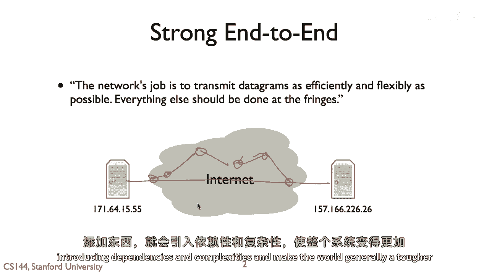
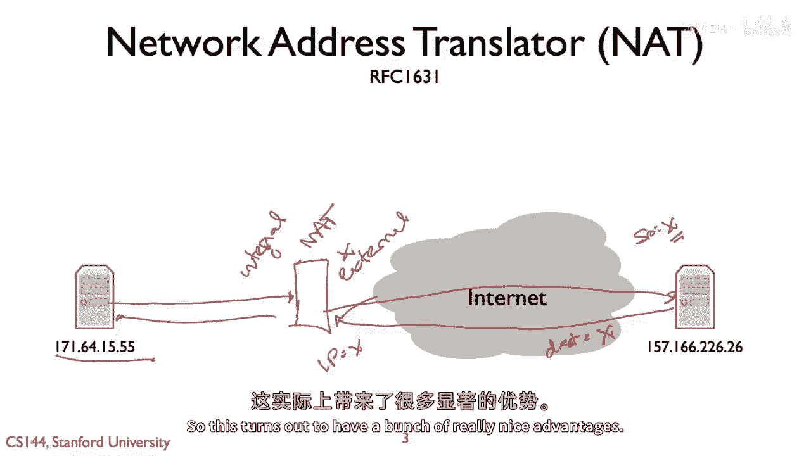
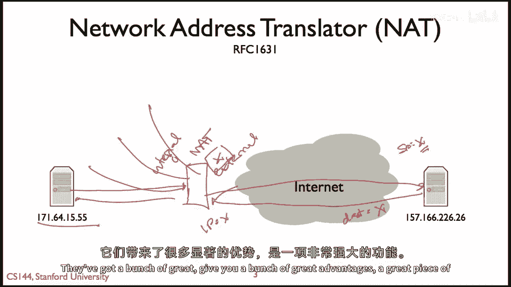
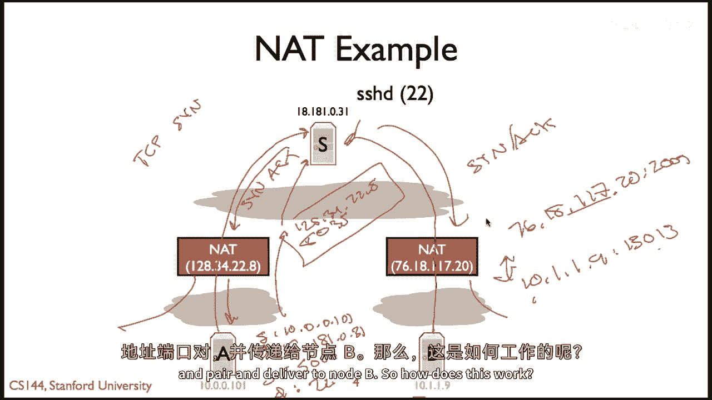
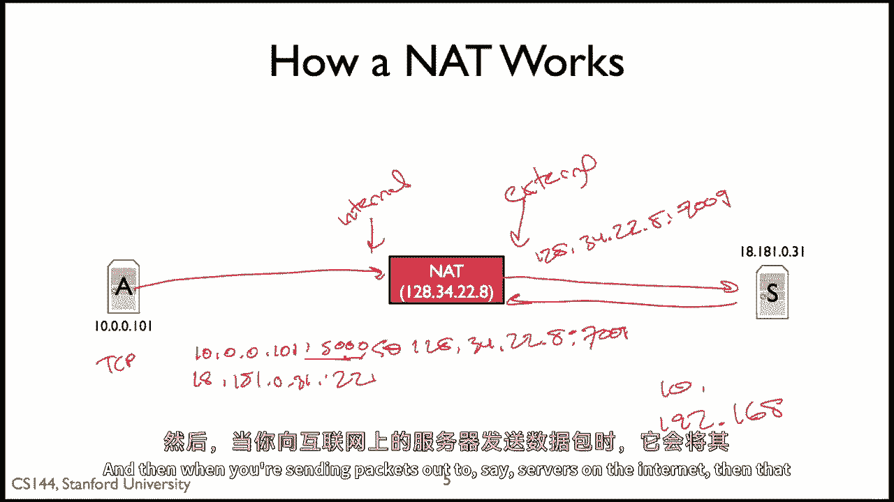
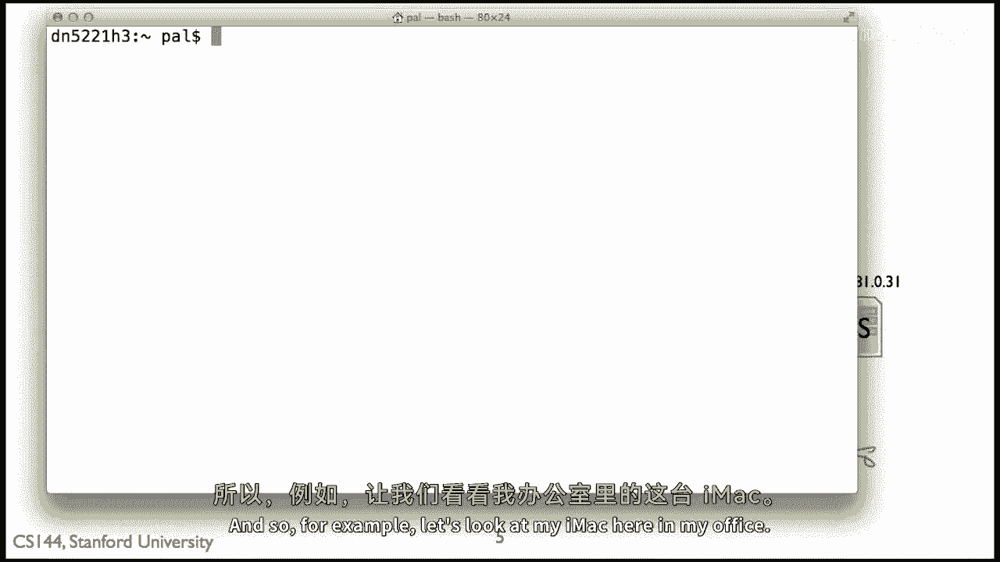
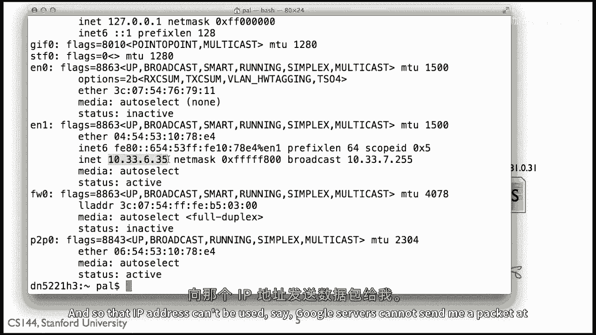
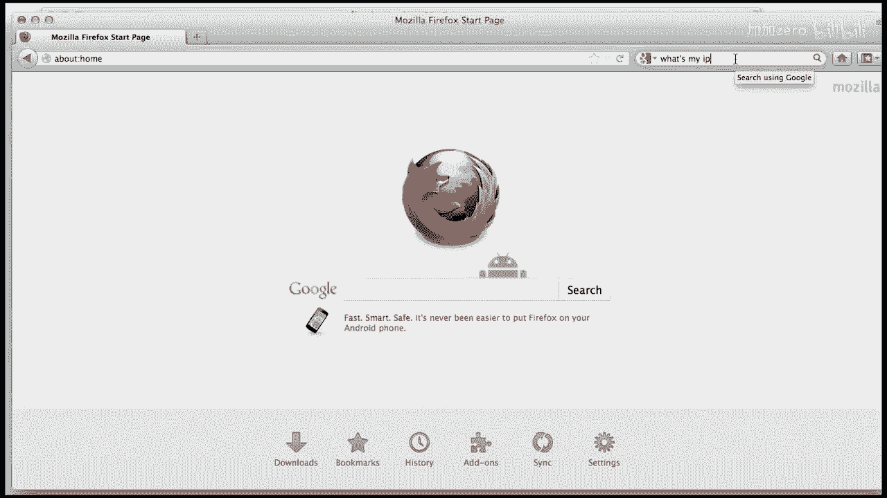
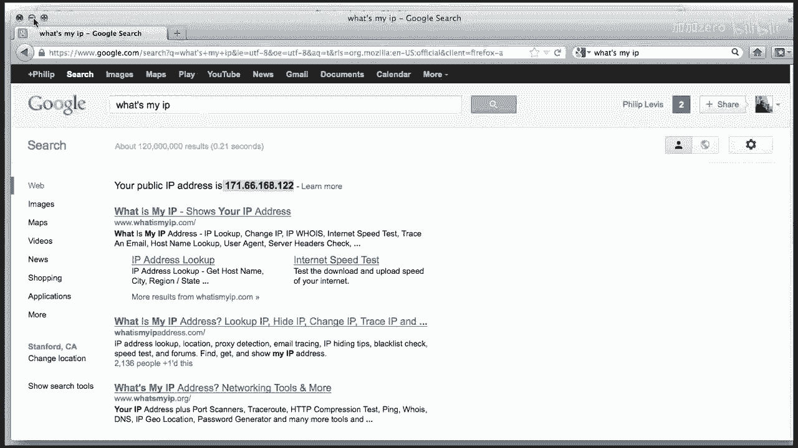

# 【计算机网络 CS144】斯坦福—中英字幕 - P68：p67 5-1 NATs - Introduction - 加加zero - BV1qotgeXE8D

所以本视频我们将讨论网络地址翻译的基本知识，并解释网络地址翻译器或其工作原理。

所以如果我们回到端到端的原则，有一种强大的端到端论据，认为网络的任务是传输数据包，尽可能高效和灵活地，其他所有工作都应该在摩擦的边缘进行，所以在这个模型中，你知道我们将有两个主机。

每个主机都有一个IP地址，实际上，互联网应该做所有事情，哦，那么这两个节点之间的主机和设备集合应该做，是向前发送并传输他们的数据包，如果你知道，通过互联网发送它沿着一些路线，找出最佳路线并送达它。

在这些两个主机之间传递那些包，这就是网络应该做的所有，你想要所有的智能都在边缘，因为那是行动发生的地方，那是你可以添加新东西的地方，当你开始在中间添加东西时，然后您开始引入依赖性和复杂性。

使世界变得更加普遍和困难。

所以，是否使用网络地址翻译器，我先被指定，在rfc十六三十一很久以前，所以我认为nats是一个非常有趣的例子，一个非常有说服力的例子，说明将一些东西放入网络可以带来一些真正的好处，在很大程度上。

网络中添加一些智能可以带来一些真正的好处，但也引入复杂性可能会引起很多头痛，所以，本质上，网络地址翻译器所做的是，它是一个坐在您和互联网之间的盒子，就像，说左边的主机，所以这就是我们的at。

并且这个nat有自己的，嗯公共互联网的ip地址，所以让我们就叫那个，嗯ip地址，嗯x，发生的事情是nat做什么的当一个数据包来自你电脑，被称为这个内部地址，或者它的内部接口内部，网络做什么。

它会将数据包发送到互联网上更广泛的地方，所以它既有内部接口也有外部接口，接口是它会重写数据包的地方，使它看起来像是从NAT的外部接口来的，所以如果AT，假设它有内部接口i和外部接口x。

你的数据包可能是从171616515到555的，那么它会将其重写为来自IP地址x的数据包，然后数据包发送到另一个主机，它看到了来自x的包，也许它是TCP连接请求，或者是类似的，因此它会向x发送一个包。

所以目的地在这里，源在这里是x，目的地是x，在接收到这个包后，NAT将知道它实际上是为你设计的，会重新翻译它，将包重写为来自uh到目的地，紧邻你的目的地，然后适当地将其转发到其内部接口，因此。

这就有了一堆非常棒的优势。

例如，当今几乎所有的无线路由器基本上都是无线家庭路由器，都是nats，想法是，你连接到你的无线路由器到你的互联网连接，ISP给你一个单一的IP地址，让我们就叫它x。

然后内部gnat可以给它后面的许多机器，不同的私有IP地址，只是本地IP地址，并将其全部翻译为一个公共IP地址，因此，这是一种让大量节点共享IP地址的方式，这就是它允许你有说的，在你的家中。

十台机器拥有一个IP地址是，不是单个公共路由的IP地址，NAT的IP地址，其中一些提供了一些安全属性，其中，因为你的IP地址隐藏在这个结扣后面，实际上，这对对手或攻击者来说变得极其困难。

开始连接到你机器，所以这是一种有限的防火墙安全保护，所以nats真的很吸引人，非常流行，它们有很多伟大的。

嗯，可以给你带来很多伟大的优势，现在是一种伟大的功能，让我为你走一遍，嗯，一个更具体的例子是，当我的pedresses确切地描述了正在发生的事情时，当你在这些两个主机a和b后面坐着时。

而且他们都在nat后面，这些nat在不同的网络上，所以其中一个有这个ip地址，一零二八三四二二八所以nat，嗯是七十六，一八一，一七二零，所以cp，在家里有两个人，他们用不同的isp。

所以首先需要注意的是，这些nat正在给在他们后面的主机，这些以十开头的私有ip地址，所以，如果你试图向互联网上的十个地址发送数据包，它不会到达任何地方，它被认为是一个私人本地地址，可能会到达，实际上。

你有一个与你的私人本地机器一对一的地址，嗯，所以，nats可以共享这些ip地址，实际上，一个位于那个b后面的机器，和一个位于右侧nat后面的机器，和一个位于左侧nat后面的机器可以有相同的ip地址。

因为那个ips只在它们的内部有效，他们的小领域，那现在会发生什么，当一个想要连接到，假设这是网络中的ssh服务器，所以它正在尝试建立连接，嗯，这将导致一个tcp sin包，现在当一个发送消息时。

源地址将是十点零点零点一一一，目的就会是一八一八一零三一，源端口，嗯，这将是ace决定的一些端口，让我们简单地说，五千，目的地端口将是二十二，当这个包穿越gnat时，nat将翻译网络地址。

它将重写网络地址，所以，而不是来自一零零一零一零，包将来自一二三八四二二八，目的地将保持不变，目的地端口将保持不变，但结果是网络也必须重写源端口，因为否则会发生什么。

如果两个位于NAT后面的主机都决定使用端口五千，你不能共享端口五千，所以我们在源端口上应该设置为，你知道八千三百五，这个包然后通过互联网发出，到达SSH服务器，看到来自一和二的请求，八，三，四，二，二。

八，港口，八十三五，它将生成说一个tcp同步作为响应，到这个IP地址和端口，当NAT看到包返回时，它将重新翻译那个包，二，八，三十，四，二，二，八，八十，三，五，到十，零，零，一，零，一，五千。

并且对于那个包a，所以它在内部IP地址和端口之间设置一个映射，和外部IP地址和端口之间，同样当主机b发送一个包到服务器时，嗯，NAT将翻译其IP地址和端口为其自己的，所以b的IP地址变为自己的。

所以以前是十，一，一点，九端口，嗯，假设一三万一三将被变为，七十六，十八点一，一，七点二十，嗯，假设端口，嗯，两千零九，然后当服务器发送这个TCP返回时，它将其发送到这个IP地址和端口对。

哪个可以翻译回内部IP地址，嗯，端口和对并交付给节点b。

所以这是如何工作的，广告神奇地设置这些映射，你知道它是如何管理这些映射的，嗯，原来NAT可以有各种各样的操作方式，我们将在未来的视频中探讨这个问题，嗯，但是基本模型是NAT不创建一般的映射。

直到它从内部收到请求，所以这里我们有NAT的内部接口，这里我们有其外部接口，一般来说，当GNAT看到目的地址为外部节点的包时，这是互联网上从其内部接口的节点的包，对这些包做出响应，它可能会生成映射。

在这种情况下，假设a试图打开到服务器s的端口22的包，所以有来自10。0。0。111的包进来，我的意思是，假设它是TCP包，嗯，再次是端口，让我们说5000，它要去18。1。81。31的端口22。

那么这将说看，我看到一个试图打开连接的包，我需要为这个特定的内部IP端口对分配一个外部IP端口对，所以让我们说128。34。22。8的端口7890，所以它将创建一个从10。0。0。

111的5000到128。34。22。8的7890的映射，这是TCP和TCP专用的，然后包将穿越，它将查找这个映射，它将翻译包，发送包带有外部IP地址和端口，然后当从服务器的包回来时，它将说呀。

我收到了一个包在我的外部接口上，我将查看是否有任何映射，根据协议、IP地址和端口来匹配它，嗯，然后如果如此，翻译包并重写为内部地址和端口，所以从高层次来看，正在发生，原来有各种各样的变化和细节。

我们将在未来的讲座中深入探讨，但这是基本模型，并且这涉及到维护一些状态，以便它可以翻译包，所以这就是大致的情况，实际上，有很多变化和细节，我们将在未来的讲座中详细讨论，但这是基本模型。

并且这涉及到维护一些状态，以便它可以翻译包，一般来说，当接收到来自节点的包时，它会设置此状态，在内部接口请求，或向外部节点发送包时，因此，当你在家通过无线连接无线路由器时，当你说，在你的。

并看到你的ip地址，你将看到它几乎肯定是一个本地私有地址，或者是在十的范围内，或者是嗯，一九二点，一六八，然后当你在向互联网上的服务器发送数据包时，那么那些数据包就会被翻译成它的公共IP地址和端口。

所以例如，让我们来看看我的。

嗯，我在办公室里的imac，所以如果我看我的IP地址，所以结果发现无线网是一个有效的，那就是你可以看到的无线接口，实际上我有一个私有IP地址，一三三零点六三五，所以这不会通过我们自己的互联网发送。

是一个在斯坦福的局部私有地址，所以那个IP地址不能用来说，你知道，嗯，谷歌服务器无法向我发送那个ip地址的包。

所以这意味着我正坐在nat后面，实际上如果我输入。

你知道，我在谷歌服务器中输入我的ip地址，它告诉我我的ip地址是，七十一，六十六一六十八一六二二，所以这里发生的事情是我有一个私有ip地址是，十三十三点六三十五在网络地址转换盒的内部接口。

并且网络地址转换器的外部接口是一百七十一，六十六，一百六十八，二二，所以当我向谷歌服务器发送连接请求时，这是他们看到的ip地址，然后他们将包发送到这个ip地址，当nat接收到这些包时。

它会将它们翻译回我自己的私有本地ip地址，转发连接设置好的包，所以这些无处不在。

