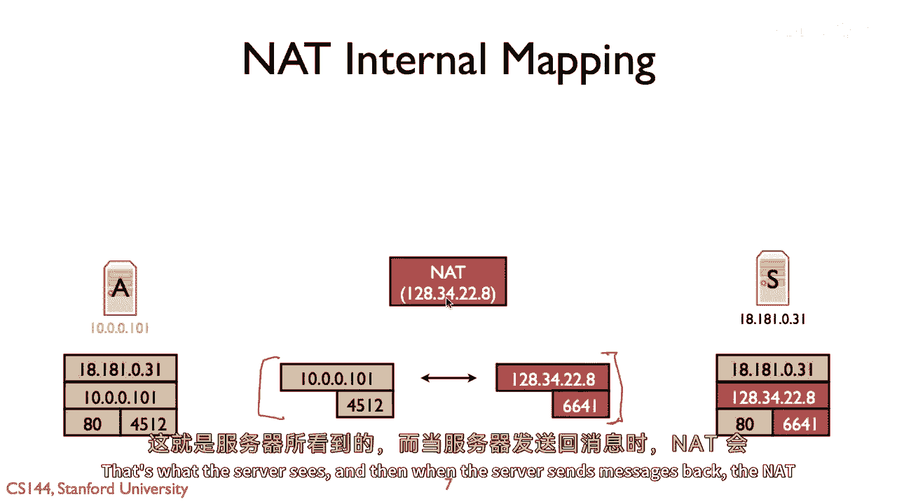
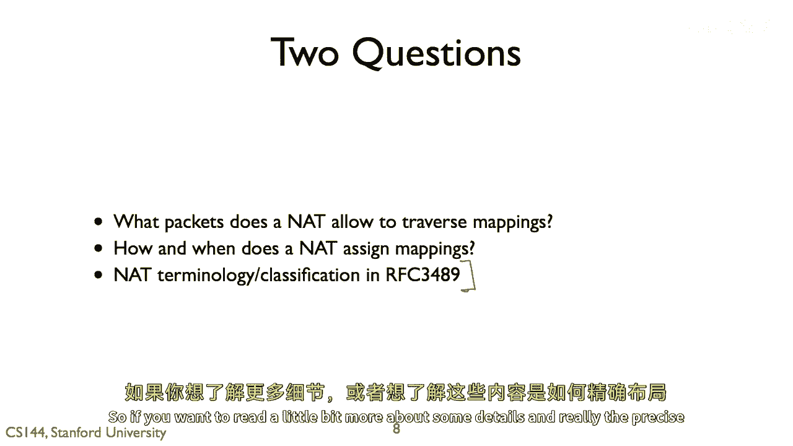
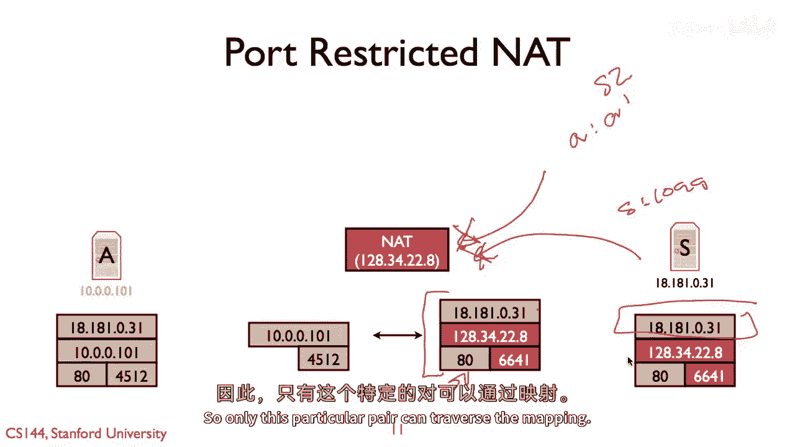
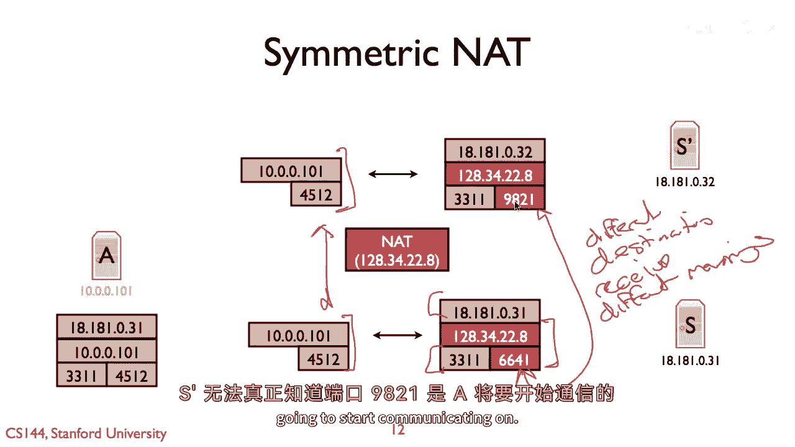
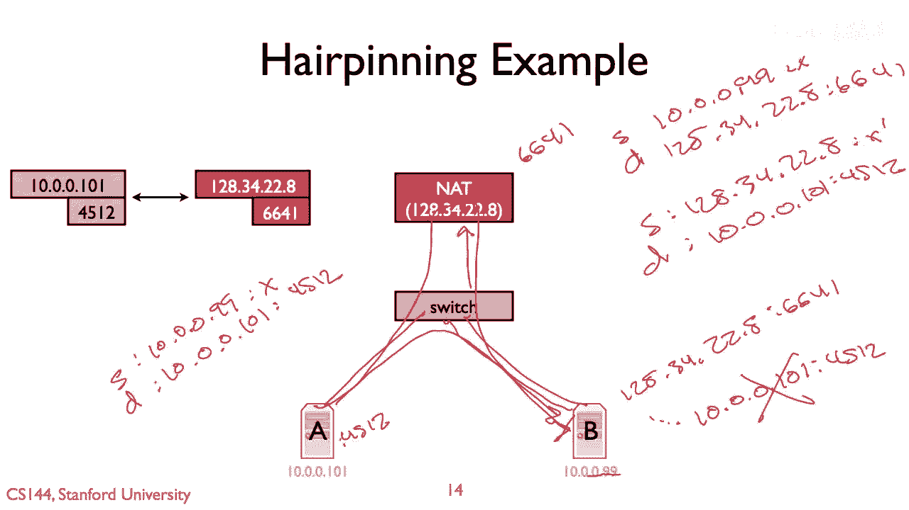

# 【计算机网络 CS144】斯坦福—中英字幕 - P69：p68 5-2 NATs - Types - 加加zero - BV1qotgeXE8D

所以在这个视频中，我将介绍所有不同类型的结，或者不是所有的，许多存在的不同类型的结。

所以看起来是将地址从内部翻译到外部的一个非常简单的抽象。

内部到外部接口，结果发现你可能有许多不同的方式来实现这个。

并且其中许多已经在野外部署，理解这些差异可以给你一种感觉。

然后，为什么在构建应用时，nats可能会成为一个复杂的因素，所以回忆起一个模型，那就是，或者一般来说，它的工作方式是当有一些种形式的沟通时，"从内部网络节点到互联网上的外部节点"。

"自然语言处理器在内部建立一个映射，将输入的句子映射到一个内部表示，并将这个内部表示映射到你对它的理解"。"它就在它的记忆中"，"在一个内部IP地址之间"，嗯，"并关联到一个外部IP地址和端口的端口"。

"因此，当这台服务器试图连接到位于18。1的Web服务器时"，八一零三一，"所以，将在这个主机上安装八十个端口"，并且来自端口四，五一二，NAT重写了这条路线，那就是所有这些包，包括TCP，然后。

所有来自其自己IP地址和端口66的数据包，四一，这就是服务器看到的，然后，当服务器发送消息时。

然后它们就会被翻译回端口四，五二一，这就是简单的模型，并且会出现两个基本的问题，第一个问题是一个蚊虫允许哪些包通过这些映射，第二个问题是蚊虫如何和何时分配这些映射，它何时创建它们，所以我说，当你生成包。

但结果是它可能比那稍微复杂一些，比如它何时拆除那些映射，它不永久保持映射，所以结果发现有一种很好的rfc，大致描述了一些，我在这个视频剩余部分将要使用的分类和术语，389。

所以如果你想阅读一些关于细节的更多信息，以及这些是如何布局的。

看一下rfc 389，第一种nat被称为全锥nat，这在某种程度上是，最友好的一种，一个完全开放的网络被称为，它被称为那样，因为它在允许通过映射的包方面限制最少，因此它是一个完全的锥体。

而且允许在其中的东西种类，嗯是大的，所以完全锥体的基本模型是，任何说，例如协议tcp的包，任何进入nat到这个ip地址的tcp包，端口对将被翻译为这个IP地址，这个端口对，无论源地址和源端口是什么。

这是限制最弱的，所以如果我有一些其他服务器说，S two that has，你知道一些IP地址a，并且它从端口a发送一个包，并且这个包以源a源端口a'发送，a'是发送到一二一四二四八点的，六六四一。

然后那将会把它翻译，并且我的服务器，嗯我的，这里的主机会看到从一个到达端口一零零一的质数来的什么东西，一零四五十二现在它可能会丢弃那个包，它可能会发送一个icmp错误，但重点是不是会做翻译是最不严格的。

它是一个全锥形，所以除了全锥形名词之外，也存在受限锥形NAT，并且受限锥形NAT做的事情是它根据源IP地址过滤，所以，在受限锥形NAT中，NAT会将来自相同源地址的包翻译，正如在外部映射中预期的，所以。

当网络设置内部地址和端口对之间的映射时，和外部地址和端口对，它包括其他端点的地址，因此，在这种情况下，如果我有s two，它试图从一个冒号发送一个包，一个优质的地址对应一个优质的地址。

这个结扣不允许那个包通过，它会丢弃它，要么发送一个icmp错误，或者一般不翻译那个包，主机s永远不会看到它，然而，如果服务器s要从ip地址s发送一个包，然后让我们假设端口um，假设端口接近一万九千九。

那个将能够穿越映射，从意义上说，它是来自181，81，零三一，所以主机将看到一个来自一八一八一零三一的包，端口九十九，它将以目的地为十到零进入，在零到一零一端口四五一二，所以那是一个受限的锥体。

Nat它将根据IP地址过滤，但并不是，所以最后一种类型的anad，或这三大主要分类中的任一种是端口受限网，它在行为上像受限的锥体，除了它还过滤端口，所以，在这种情况下，当从外部主机来的包到达时，嗯。

一二八三四二二二八六六四一，然后，这也存储预期的IP地址和端口，所以，在这种情况下，如果我再次，我有一些服务器s2，它试图从a发送一些东西，并且这将不会翻译，那就是被视为一个错误。

并且我np等没有主机的路由，无论它认为应该指定的错误是什么，取决于条件，嗯但同样，如果服务器S试图从端口999发送消息，那将不会穿越任何一方，因为它不匹配映射中的端口。

所以只有来自此IP地址端口对18180的包，1031，端口80将被允许翻译为100014512，所以只有这一对特定的元素可以穿越映射。

所以，最后的和不是最终的不被称为对称不，并且，什么是使对称不不同的，不仅仅是因为它首先由定义限制了端口，还有的事实是，来自同一源的包，在内部NAT地址和端口，前往不同目的地的包。

地址和端口被分配了不同的公共地址端口映射，所以，如果你看这张图，你就会看到我在说什么，所以，我在这里有主机a，"并且它正从10。0。0。101的端口4542发送数据包。"，首先，他们将被送到1818。

"一零三一端口三三一一"，"所以网络设备设置一个映射，并将这个内部地址端口对映射到外部地址端口对"，"并且这个内部地址端口对是一二"，八，三，四，"两"，"两"，八，六，六，四一，因此。

发送到端口三三三的包，在这个IP地址上的十一包将被翻译为具有以下IP地址的包，和端口，但是，如果a发送包到一个不同的公共IP地址和端口，如，让我们假设甚至相同的端口和IP地址在比特上差异一个。

所以它也在向18的p'发送数据包，八十一，零，三，二点，三，三十一，然后这就设置了一个完全不同的映射，所以尽管这两个数据包流的端口地址对是相同的，但事实是，目的地端口地址对是不同的。

意味着nat设置一个单独的映射六，端口六十六四十一和端口九十九十八二十一，所以不同，接收，不同的映射，所以结果是，而且这只是为了给你一个具体的例子，表明，nat们可以如何真正干扰应用，所以让我们假设。

嗯，主机a正在发送udp流量，而且这udp流量是为一款大规模多人在线游戏设计的，这是一，这是真实的故事，我一个朋友，他在为这个服务器的工作，当这件事发生时，是在九十年代末期。

而且他对Linux发出了愤怒的呼叫，嗯，不是开发者，因此，问题在于这个巨大的多人在线游戏运行在许多服务器上，有时你知道有人从一个岛跳到另一个岛，或者做什么，他们需要改变他们所在的服务器，所以系统会做。

它会告诉客户端，好的，嘿，你已经在与一个服务器交谈，十八一，八十一零三一，你应该与服务器的质数s1进行交流，八十一在十八一，八十一零三二在这个部分，即使是相同的部分也不重要，比如这里，我说。

端口三三一一，并且他们两个都想在端口三三一一交流，所以嘿，请开始在这个其他部分进行转接交流，嗯，到这个其他主机，问题是这个结，对称的结将创建一个新的映射，所以s看到了客户端从端口6641覆盖。

但现在突然客户端从端口9821覆盖，在这里的系统无法知道这一点，因为natjust设置成这样，它可以任意决定，所以连接可能会断开，观察到的行为是因为有一个对称的nat。

每当有人试图从一个服务器迁移到另一个服务器时，他们会断开连接，所以，这里是一个例子，通过将智能添加到网络中，突然，你看到的行为与简单的不同，你知道，强有力的端到端论点，并且有这个额外的行为。

这真的很难管理和真的很难考虑，因为s prime真的没有其他方式知道端口九十八二一，是a将要开始通信的端口。

所以，这只是对一些方法的最基本概述，在哪些nats中可以存在行为差异，结果发现存在许多更多的复杂性，nats可以做的各种不同的事情，我之前提到的rfc，实际上涵盖了你看到的所有真正多样的行为。

在nats最初流行之前，对应该发生的事情进行了真正的标准化，存在许多像静态映射这样的东西，你可以告诉他们，只需设置外部主机IP端口对之间的静态映射，我的公共IP地址和端口，然后转到内部一个。

这是说如果你有一个在你的后面运行的Web服务器，你可以告诉它，嘿，任何到达端口八十四到这个服务器的流量，都会在端口八十上接收，你有像触发器这样的东西，如果你看到数据包从一个方向上发出。

然后也设置这个额外的映射，这在一些早期的日子里非常有用，第一人称射击游戏，在线游戏，再次在哪里，它们并没有考虑到nats的设计，nap的行为真的很多样，发生了各种各样的更复杂的事情，但结果是你知道。

因为nats正在创建应用程序的所有头痛和混乱，f one提出了一些建议，关于nat应该如何行为，所以rfc中指定的一般行为建议，五十五，五十三，TCP的八十二，和四十七，UDP的八十七，所以。

只是想给你一个例子，关于，一些不能考虑的奇怪边缘情况，和一些在这里指定的事情，我要谈谈发卡，这是当你有一个位于你NAT后面的节点时发生的过程，然后，它向外部接口端口对发送一个数据包，该nat有一个映射。

所以基本上我有一个位于gnat后面的节点，并且正在尝试穿越nat的映射。

所以这里是，示例，我现在有一个一、二、三、四、二、二、八，嗯，我有主机a和b，它们都位于，现在，它们都连接到交换机，好的，所以a有端口，嗯，b的地址是10。0。0。99，让我们假设我们在做某种IP电话。

嗯，来自哪个端口，这是UDP流量，所以它是主机day的端口44512，所以它使用端口44512，这就是翻译后的端口，嗯，它在at上的端口是6641，问题在于当b试图向一、二八、三四发送流量时发生什么。

二十二点八，端口六六四一，基本问题是所以结将到达的at，然后那就是要将其翻译，它将翻译这个，假设嗯，它是一个完整的，嗯锥体，那么它将将这个翻译为十零一零一，"港口四五一二一，你可以问的问题就是，那么"。

"它将翻译目的地"，"IP地址和端口"，"我应该如何对待源代码？"，"IP地址导入也应该翻译为这个"，"那就是如果这个包裹能到达"，看似来自128334。22，"或者这个包裹应该来自十点的来信"。

"零点"，"零点"，九十九，很好，那么让我们走一遍，如果nat没有翻译源地址和端口会发生什么，所以这个包将通过交换机，它会到达nat，然后它会重新写为去10。0。1。0，1。0。4，512。

所以看到的包将是源地址为10。0。0，零点九九，让我们就说x并不重要，一个目的地，十点零点，零点一，零一端口，四五一二，让我们就说它喜欢这个包，它想要响应，然后它发送一个响应。

"那个包裹永远无法到达结点"，"这可能会直接跳转到开关"，"因为它没有通过自然选择"，"这不会被翻译"，所以b将发送一个包到128334228，"六十六四十一港口"。

"我们将看到回复一个来自十点零点的包"，"零点一零一四五一二"，"所以这次休息"，这并不是你想要做的事情，相反，当这个包被送到NAT时，NAT需要翻译它，所以它以来自某个源包的形式进入，十点。

零点零点九九，端口x目的地12834226，一需要重写为源12834226，带有一些端口，让我们简单地称它为x'目的地10点，零点零点一零一点零四五一二端口，因此这样做，因为现在源来自网络。

当A发送响应时，它会返回到网络，然后我可以重新翻译它并转发回给B，所以被称为模型中的环回，因为你实际上必须通过这个设备返回，有点像发夹，它从电话网络回来作为术语，所以这里是一个特定行为的例子。

nat必须具有的，如果它不，那么在这个小边缘案例中，B最终将一个包发送到A，基于外部映射，如果你不做这个，它会破裂，所以这只是nat引入的许多棘手边缘案例之一，nat引入的。

