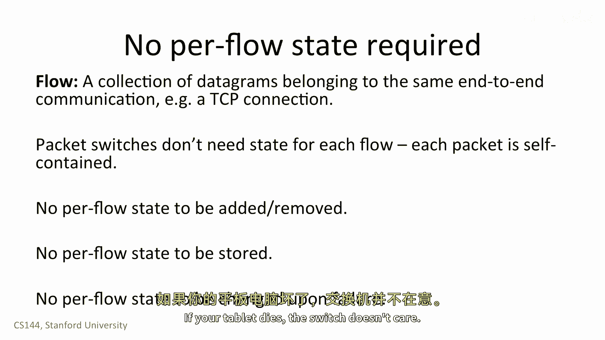

# 【计算机网络 CS144】斯坦福—中英字幕 - P6：p5 1-5 Packet switching principle - 加加zero - BV1qotgeXE8D

当互联网最初被设计时，它基于一个具有争议的革命性想法，分组交换，现在，看起来在显而易见的方式中构建网络似乎很直接，但这并不是总是这样，这是一个非常简单的想法，但是当然，就像简单的想法一样。

一旦将其付诸实践，就会产生许多有趣的影响，我们将在课程中花费一整周的时间来讨论分组交换和其影响，但是在这个视频中，我们呈现了高级理念及其立即的好处。

数据包是一个包含所有必要信息以使其到达目的地的自包含单位。

分组交换是我们将数据分成离散的，自包含的数据块。

每个块被称为数据包，包含足够的信息，使网络能够将数据包全部送达目的地。

所以让我们说，我们有一个源和目的地，以及一个包网络，这是一个。

B和C之间的网络，当A接收到目的地的数据包时，它将其发送到链接b，当b接收到目的地的包时，它将其发送到c，当c接收到目的地的包时，它将其直接发送到目的地，包交换的最简单形式中。

每个包都被单独和独立地路由，例如，假设有一个连接到b的交换机叫做d，在发送包到c后立即，B可以向d发送下一个包，或者如果下一个包也是要到达的目的地，它将发送两个连续的包来查看。

这里是对分组交换的一个简单定义，意味着对于每个到达的包。

我们选择其出站链接，如果链接空闲，我们发送它，否则我们保留包以备后用。

这里是分组交换如何工作的一个例子，每个包都包含一个明确的路由。

指定沿途每个包交换机的ID，直到目的地，我们称此为自我路由或源路由，因为源在发送包时指定路线，它为包插入a和b，它为包插入a，b和c。

然后，目的地将包转发给a a，它查看头部并看到下一个顶级是b，所以它将包转发给b，B发送下一个看到的下一个跳点是c和c，说看到的最后一个顶部是目的地，结果是互联网支持这种源路由。

但通常被关闭因为它引发了大的安全问题。

一个简单的优化，而且互联网今天主要做的事情是将一小部分状态放在每个交换机中。

这告诉它应该将包发送到哪个下一个跳点，例如，交换机可以拥有一个包含目的地地址和当它接收到包时下一个跳点的表，它查找地址在表中并发送包到适当的下一个跳点，在这种模型中，所有包只需要携带目的地地址使用地址。

沿途的每个交换机都可以做出正确的决定，例如，在我们的网络中这里，A的表说包到目的地应该去交换机B，交换机B的表说包到目的地应该去交换机C等等。

分组交换有两个非常棒的属性，第一个是交换机可以为每个包做出单独的本地决策，它不需要在包上保持额外的状态，它看到两个包是否去同一个目的地，即使许多包是某个更大传输协议的一部分，交换机不需要知道或关心。

这个交换机需要了解一些包是Skype通话，一些是Web请求，还有一些仍然是你计算机的固件更新，它只是转发包，这极大地简化了交换机，第二个是它让我们有效地共享链路给许多各方，例如，考虑家庭无线路由器。

有两个人在他们的笔记本电脑上浏览互联网，如果一个人在阅读一页，然后另一个人可以下载文件链接的全速，如果第一个人开始加载Web页面，链接可以共享给两个人，一旦下载完成，第一个人可以使用链接的全速。

这两个点真的很重要，所以我们将更深入地讨论这两个方面。

当然，当我们通信时，我们通常不 only 发送一个包，我们发送许多，例如，一个语音通话由许多连续的包组成，所有这些都是同一通信的一部分，我们称这个序列的包为流量，更具体地说。

一个流量是属于同一端到端通信的一组数据包，例如，TCP连接，首先，我们来看看每个数据包是如何工作的，嗯，独立路由，因为每个数据包都是自包含的，交换机不需要知道关于数据包组或流量的信息。

想象一下，如果每个交换机都必须跟踪通过它的每个单个Web连接。

这将需要巨大的状态，这将非常难以管理，相反，独立处理每个包意味着交换机可以建造得更加简单，管理，并且调试交换机，不需要担心添加或删除流状态。

想象一下，如果你每次想要加载一个网页，你需要与路径上的每个交换机通信，只是为设置状态，这样你的要求才能通过这个，这可能会使事情变得慢得多，你可以只是发送包，交换机将它们向前转发。

交换机也不需要存储这个状态，因为交换机必须非常快，他们需要将此状态存储在非常快速的内存中，这将是昂贵的，这允许我们切换开关的焦点仅做一件事，快速和高效地转发数据包。

最后，它意味着开关不需要担心失败。

想象，例如，当你开始一个Web请求时发生什么。

但是，然后您的平板电脑耗尽了电力，开关将保持请求的流量状态。

但是如果创建状态的节点数字之一失败，交换机需要了解如何清理完成后果，否则你可能有百万亿，或者，然而，许多死亡的流量会消耗你的记忆，使用包交换。

交换机没有每个终点的状态，如果你的平板电脑死亡。

交换机不在乎，它只意味着它停止从它那里接收包，这样。

开关更功能上独立于通过它发送交通的计算机，想想你通常如何使用互联网，你的使用是间歇性的，你加载一个网页，然后阅读它，然后加载另一个，你从itunes下载几首歌曲，然后听它们。

你从netflix流媒体你的节目四十五分钟，然后停止数据，交通繁忙，"不如总是以固定的速率发送和接收数据"，"使用率随着时间的推移而上升和下降"，"尽管峰值和大数据流量发生了大规模的变化"，"三片"。

"下午两点通常很高"，"八点钟很好"，"凌晨两点很低沉"，"在较小的规模上"。

它非常爆发性，而且这些野兽的爆发往往独立，假设你和你的朋友都在咖啡店浏览网页，当你加载新的页面，当你的朋友加载新的页面时，大多数是独立的。

有时你可能会重叠，但往往他们不会，因为他们会把所有的流量都视为数据包。

无线路由器可以非常有效和简单地将其容量与你共享，如果你正在加载页面，当你的朋友在阅读时，无线路由器可以将其全部容量分配给您的包，同样，如果你的朋友正在加载页面，而你正在阅读。

无线路由器可以将其全部容量分配给您朋友的包，链接不需要部分空闲，因为有一个人不在使用它，如果你都在使用它。

然后链接可以由您共享，这种将单个资源分配给多个用户的想法。

以概率或统计的方式被称为统计复用，它是统计的，并且每个用户根据其他人如何使用资源获取到一个统计份额。

例如，如果你的朋友正在阅读，你可以使用所有的链接。

如果你们两个都在加载页面，你获得链接容量的一半，所以分组交换有两个主要优点，首先，它使交换机简单因为它们不需要知道数据包的流量。

其次，它使我们能够足够地共享链路上的容量，这个简单的构建块在当时是革命性的。

