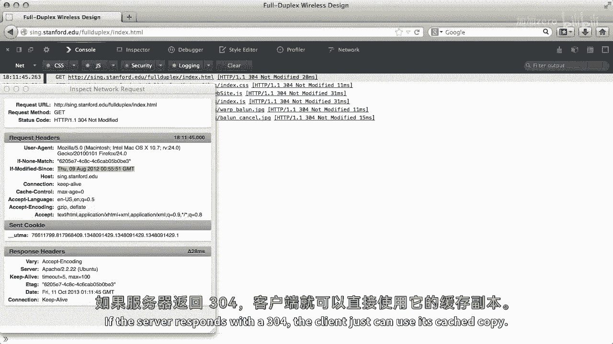
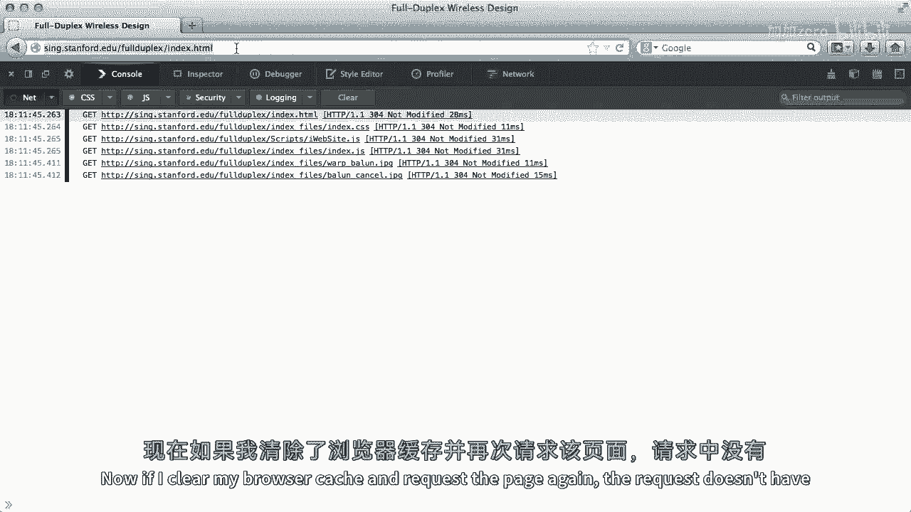
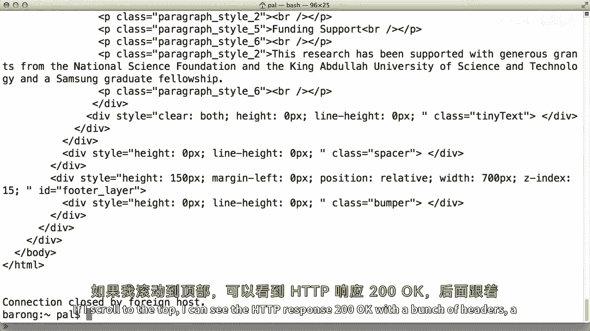

# 【计算机网络 CS144】斯坦福—中英字幕 - P72：p71 5-5a HTTP - 加加zero - BV1qotgeXE8D

超文本传输协议，或HDP，是现代互联网的基石，最初旨在传输文档，它现在已经被用于许多其他事情，如Netflix等公司的流媒体媒体和应用程序，通过脚本，浏览器下载并在此部分运行。

我将解释HTTP的基本概念模型，并介绍一些分析工具，以理解其性能，HTTP代表超文本传输协议，那么，超文本是什么？超文本是一种文档格式，它允许你在文档中包含，格式和内容信息，每当你下载一个网页。

你正在下载一个超文本文档，与许多其他文档格式不同，例如，微软，Word或pdf，超文本全是ascii文本，如果你看一个文档，他们通常来说，你的文本编辑器不能显示的任何字符吗，那么让我们以为例子。

来自维基百科页面和HTTP历史记录的这段摘录，它中有一个更大的字体的历史单词，在蓝色显示的一些链接和嵌入的图像，以及一些其他漂亮的格式化，例如，下面划线的'历史'，使它在阅读时更容易隐藏。

文档看起来像这样，这是浏览器下载以显示此部分的超文本，所有格式信息都在尖括号内，小于等于h2，大于，例如，意味着这应该是一个标题，应该以更大的字体显示，你可以在外面看到单词历史，任何这样的格式化信息。

在这段摘录中，单词历史被显示为标题，正如你所见，如此在基本层面上，超文本文档只不过是一个文本文档，你浏览器根据这些特殊格式命令和控制，称为标记，来显示它，超链接，例如，仅仅是一种格式化标签。

表示标签内的内容，如果点击，应该加载这个url，实现这个功能的标签是a标签，看这里，以a标签的第二行为例，二，七为一个链接到http版本零点九的链接，当你点击那个链接时，它会带你到这个URL http：

//www，WWW，三点，Org，Pub，等，但是，超文本文档与仅仅格式化有所不同的地方在于，通过超文本，你可以在其他文件中嵌入文档或文件，在维基百科页面上的最简单的例子是这张图片。

这张图片的像素点并没有存储在超文本文档中，那样就不是人类可读的ASCII文本，相反，在超文本文档中有一种方法，比如说，加载这张其他文档并将其放置在那里，看看第二十行，你会看到一个图片或标签。

标签说，从此URL加载图像并显示在这里，当您的浏览器加载维基百科页面的超文本时，它看到像这样的标记并自动请求它们引用的文件，所以当您加载页面时，您的浏览器自动请求图像并显示它，有许多种资源。

除了网页上的形象之外，网页可以引用其他页面，样式表，字体，脚本，还有更多，我们来看一个例子，我将请求纽约时报的新网页，并使用我的浏览器开发者工具来看所有由此产生的请求，正如你所见，大约有二十个文档。

包括超文本到图像到广告，在HTTP，客户端打开一个TCP连接到服务器并向其发送命令，最常见的命令是GET，请求哪一页，ATP设计为程序通过一个文档为中心的方式来通信，例如如果我在浏览器中输入http。

www，Stanford，Edu，浏览器会连接到服务器www，Stanford，Edu，并发送一个获取该站点根页面的GET请求，服务器接收到请求，检查其是否有效，如果用户可以访问该页面并发送响应。

响应与其关联有一个数字代码，例如，如果服务器对GET请求发送200 OK响应，这意味着请求被接受，文档数据中其余响应的其余部分，以www。stanford。edu为例，Edu网页。

200 OK响应将包括描述主要斯坦福页面的超文本，还有其他类型的请求，如PUT以更新信息，以及其他响应，如400 Bad Request，如超文本本身，HTTP全部是ASCII文本，人类可读，例如。

对新闻时报的GET请求的开始，看起来像这样GET /http/1。1，一，对成功请求的响应开始看起来像这样HTTP/1。1，一，200 OK，但基本模型很简单，客户端通过写入连接发送请求，服务器读取。

请求，处理它，并向连接写入响应，客户端然后读取响应，这可能导致它发出更多，GET请求。

这是HTTP请求的样子，第一行，ASCII文本说方法，如GET，URL的方法，然后使用的HTTP版本的号，白色方块代表空格，如方法与URL之间的空格，URL与版本之间的空格，向左的箭头表示回车。

一种说回到行开始的方式，向下的箭头表示换行，一种说转到新行的方式，所以例如，在我之前的例子中，请求URL，方法将是GET，URL将是说全双工索引。html，版本可能是最可能的hp 1。1，在第一行之后。

请求本身可能有零个或多个头部，一行一个头部，每个头部行以头部字段名开始，跟随值，在头部之后，有一条空白的行，接着是消息的主体，等待，请求为什么可能有主体，请求的主体是什么，在GET方法的情况下。

请求一个页面，主体是空的，但HP支持其他请求，其他方法如POST，which sends data，例如，当你填写并提交表单时，POST请求通常带有一个身体。

让我们来看看这看起来什么样子，我将请求HTTP，Www sing edu full duplex index html，在我已经毕业的研究生中有一个网页。

他们写了一篇描述他们在无线网络中做了一些有趣研究的文章，我将在firefox中打开开发者工具，这允许我看请求和响应，你可以看到，有一个全双工索引的请求，Dtml http，一个接一个，后面跟着一堆头。

对于这个请求来说，一个重要的头是如果修改，因为这是客户端告诉服务器只给文档的一种方式，如果从那时以来被修改过，如果文档从那个时间戳以来被修改过，服务器对两百个响应，好的，新的文档副本。

否则它将以304未修改响应，当您的客户缓存页面时，此头部非常有用，大多数Web浏览器都这样做，而不是再次传输相同的文档，再次，客户端可以告诉服务器有条件传输它，如果服务器以304响应。

客户端只需可以使用其缓存副本。

HTTP响应看起来相似，第一行包含HTTP版本，状态代码和与该状态代码相关联的短语，然后，就没有更多的头，响应体的空白行，让我们看看对我的GET请求的响应是什么，它是一个3或4。

这个网页自从我的浏览器第一次加载以来就没有被修改过，现在把它放入缓存中。

如果我清除我的浏览器缓存并再次请求页面，请求没有修改自头部。

因此响应为200，好的，火狐开发者工具的开发者工具，允许您看到请求响应对，但无法查看它们的实际格式，我将做一件事非常简单，我将使用telnet程序连接到Web服务器，Telnet打开TCP连接。

它将您输入的内容写入套接字并打印出它读取的内容，所以我会告诉它连接到stanford。edu端口80并输入，获取全双工，Index。html HTTP 1。0。

许多HTML返回，如果我滚动到顶部。

我可以看到ATP响应2在下面，好的，带有许多头部，新行，然后身体，网页的HTML。

内容长度头部，告诉我身体有多长，HTTP是现代互联网的基石协议，当它，虽然最初是文档中心化的，设计用于获取页面和文档，今天它被用于许多其他，文档，例如可以是浏览器执行的脚本作为应用程序的一部分。

基本模型，然而，请求URL并接收响应的基本模型仍然具有HTTP的一个优点，那就是它是人类可读的文本，您可以输入HTTP请求并阅读响应，如我所见，由town发送，连接到端口80，我鼓励您玩一玩。

在您的浏览器中使用开发者工具，以查看所请求的内容并学习更多关于协议的细节，所以这就是协议的基本知识，请求响应，HTTP 1。0非常简单，想要请求文档的客户端，打开连接，它发送GET请求。

服务器响应状态代码，例如200，好的，文档并关闭连接，一旦响应完成，如果客户端想要请求第二个文档，它必须打开第二个连接，当Web主要是静态的，我们可能只是一个图像或两个，这种方法工作得非常好。

人们分发他们的网页，添加所有的格式化，所以让我们走一遍这需要多长时间，让我们做一些简化的假设，服务器可以立即响应，所以没有处理延迟，客户端和服务器之间的延迟是五十毫秒，HTTP请求是一个完整的TCP段。

响应是两满段，大小等于一个小的初始慢启动，以这种方式的拥塞窗口，我们不必担心窗口大小或拥塞控制，一个完整段的封装延迟是十毫秒，所以请求的总封装延迟是十毫秒，回复是二十毫秒，你可以假设链接是双工的，这样。

一个节点可以在同一链路上同时接收和传输，这意味着请求的封装延迟，不会影响响应的封装延迟，让我们最后假设TCP段没有数据，如三向握手和动作包，它们的封装延迟为零，最后我们可以有最多两个开放连接。

所以让我们考虑一个你想要加载单个页面的情况，首先，这需要多长时间，有发送一个sin的延迟，所以五十毫秒，有秒的延迟，所以另一个五十毫秒在接收sync时，客户端可以发送三向握手的动作，然后是请求。

请求的封装延迟是十毫秒，所以这需要六十毫秒，然后服务器需要发送响应回来，响应的封装延迟是二十毫秒，所以这一步需要七十毫秒，所以总延迟是五十毫秒，加上五十毫秒，加上六十毫秒，加上七十毫秒或二百三十毫秒。

让我们看一个更复杂的例子，有一个加载两个图片的页面，我们可以将其分解为两个步骤，在第一步，客户端请求页面，在第二步，它使用两个连接请求图像，第一步将与我们的单页示例相同长度，有一百毫秒的设置。

然后一百三十毫秒用于请求和响应，第二步稍微有些复杂，记住，虽然我们有独立的TCP连接，但它们共享同一个链接，这意味着一个请求的包化延迟会影响另一个的设置，两个连接将需要一百毫秒。

