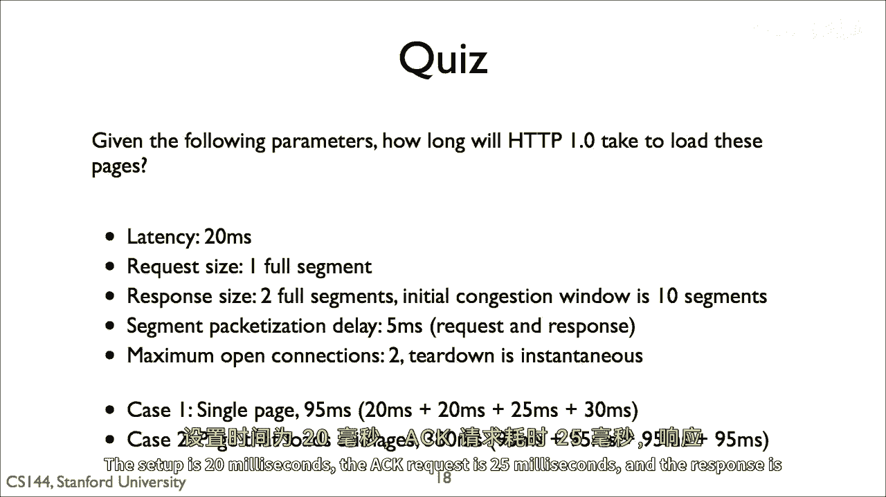
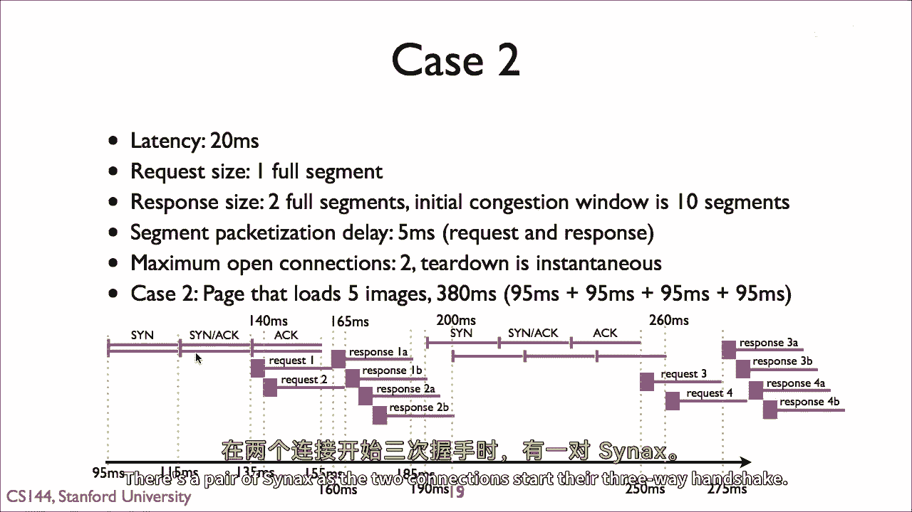
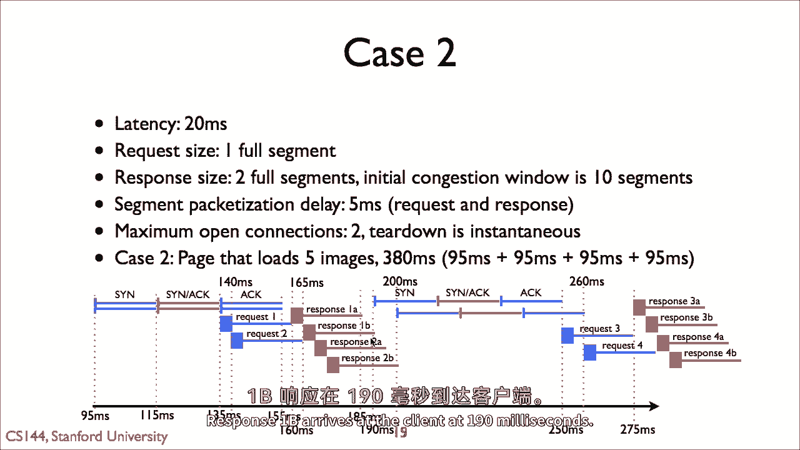
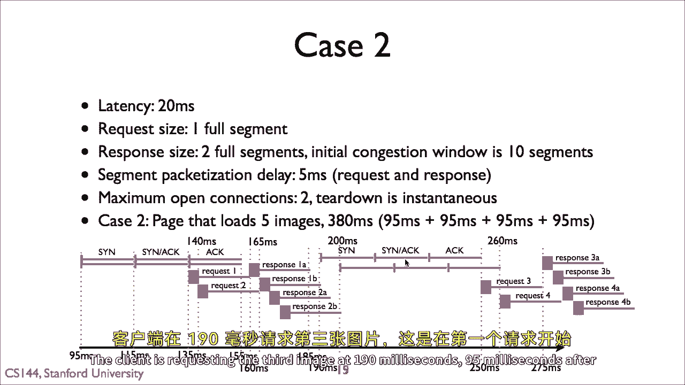
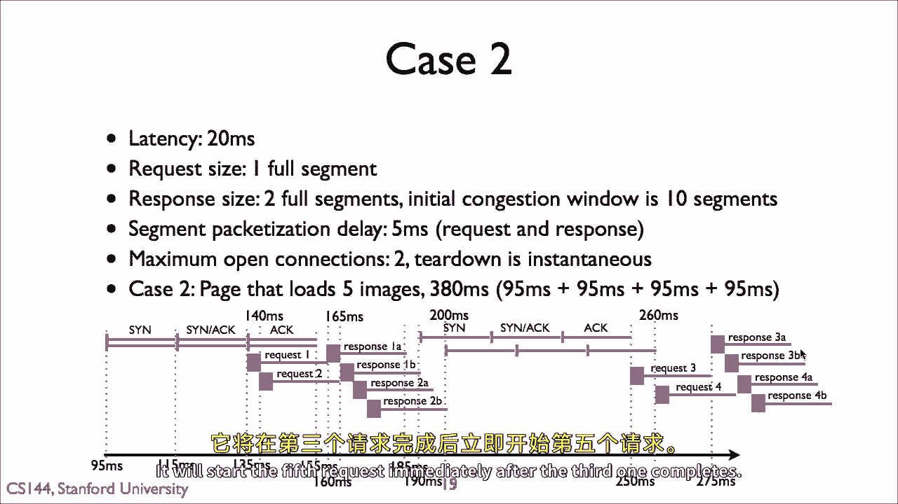
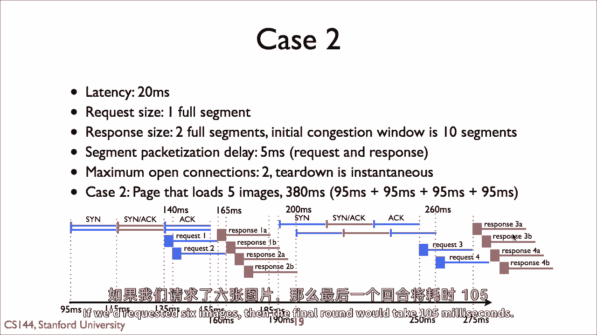
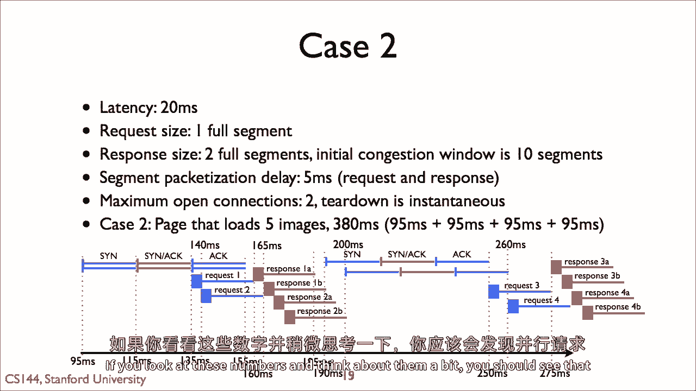
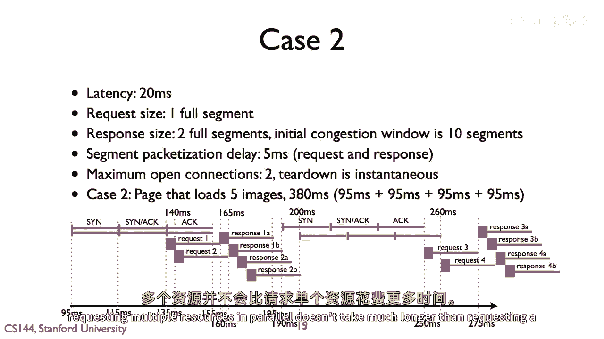
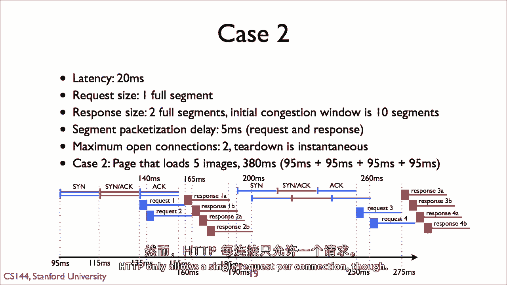

# 【计算机网络 CS144】斯坦福—中英字幕 - P76：p75 5-5e HTTP Quiz 2 Explanation - 加加zero - BV1qotgeXE8D

案例一的答案是九十五毫秒，设置是二十毫秒。

动作请求是二十五毫秒，然后响应是三十毫秒，所以总共是九十五毫秒，案例二的答案是三百八十毫秒，加载初始页面需要九十五毫秒，当图像一完成时，加载图像一需要九十五毫秒，图像三开始，与此同时。

图像二已经在飞行中。

所以当图像三完成时是九十五毫秒，这是另一个九十五毫秒，因为图像二已经完成，图像四在飞行中，加载图像五需要最后的九十五毫秒，总共是三百八十毫秒。

让我们看看这个图表，以了解正在发生的事情，这个图表在首次初始页面请求后开始，它显示了当客户端请求图像时发生的事情，我们从九十五毫秒开始。

这里有一对语法，当两个连接开始他们的三向握手时。

所以四十毫秒后，在一百三十五毫秒，客户端在一百三十五毫秒发送请求一，然后在一百四十毫秒发送请求二，请求一到达服务器在一百六十五毫秒。

有二十毫秒的延迟和五毫秒的包化延迟，服务器开始发送响应，当第二个请求到达时，它开始发送响应a段，第二个请求的响应段在响应b段后排队并发送，响应b段到达客户端在一百九十毫秒。

到这个点，客户端通过三向握手打开一个新连接，请注意这花了多长时间，客户端在一百九十毫秒请求第三张图像，在第一个请求开始九十五毫秒后。

因为第二个请求是并行的，客户端不需要等待它完成才开始第三个请求。

它将立即开始第五个请求，在第三个完成后。

这三个轮次每个需要九十五毫秒，如果我们请求六张图像，那么最后一个轮次将需要一百五毫秒。

仔细看这张图表，直到你理解正在发生的事情，由于请求从延迟的队列中发出，从队列中发出，它们延迟响应，因为响应从队列中发出也延迟，它们随着时间的推移进一步延迟请求，这导致请求和响应自然间隔开来。

减少队列延迟。

因为我们有多个操作在并行进行，他们可以掩盖彼此的延迟，如果你看这些数字并稍微思考一下。

你应该看到，并行请求多个资源，并不比请求单个资源花费更长的时间。

存在额外的分组延迟，但在今天的大多数网络中，分组延迟在整个时间中只占一小部分，单个请求无法填满网络容量。

但许多请求可能可以，HTTP仅允许每个连接一个请求。

