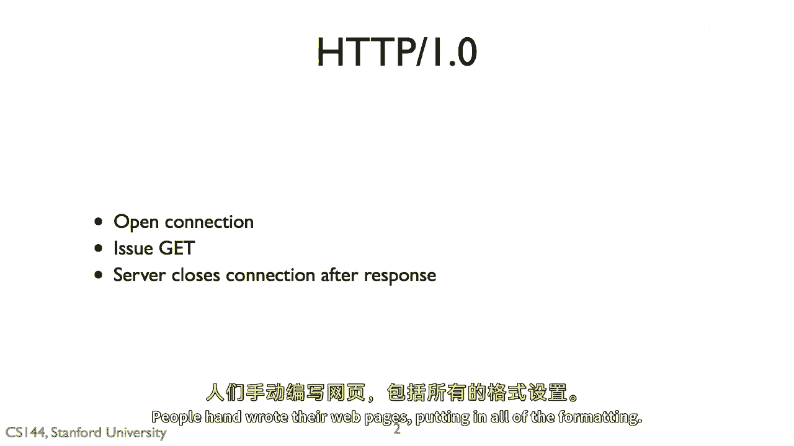
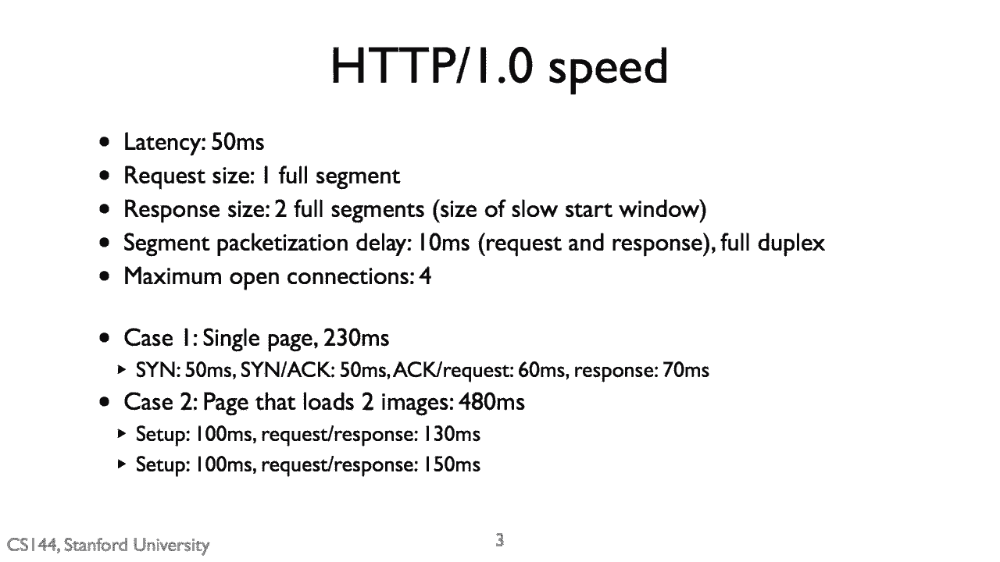
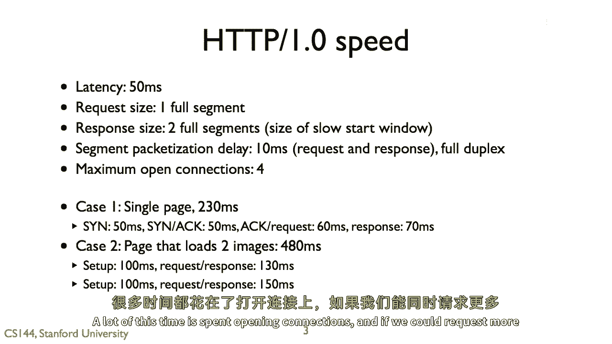
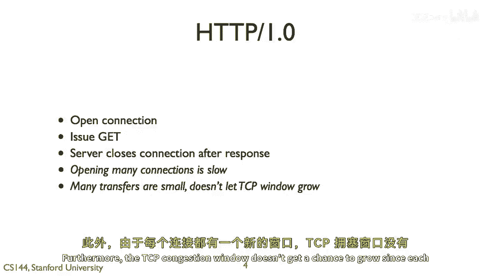
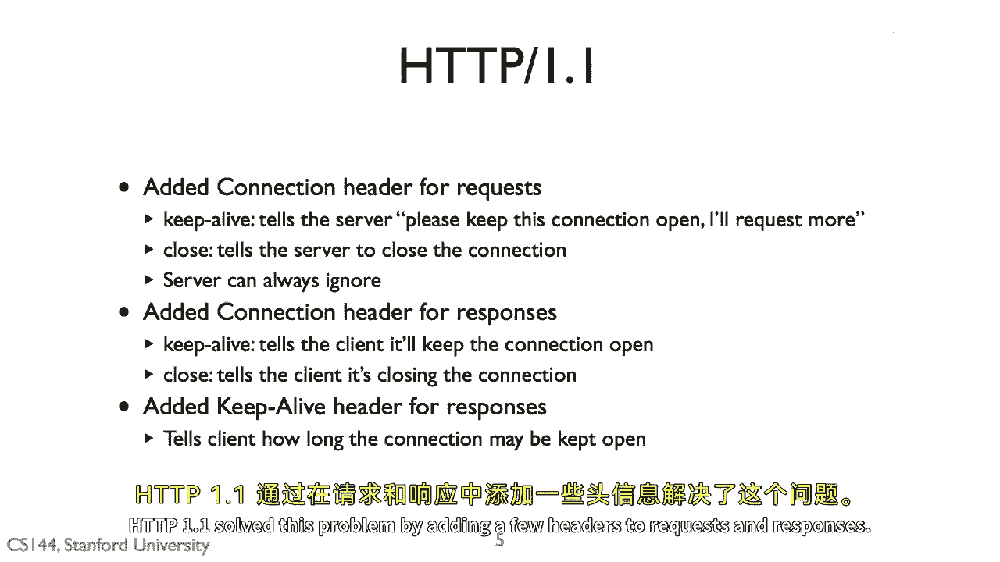
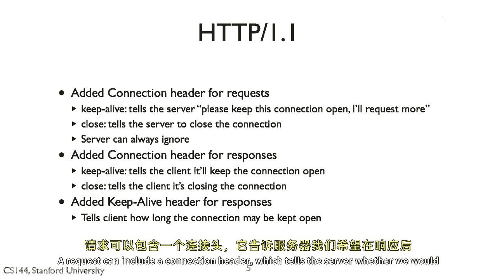
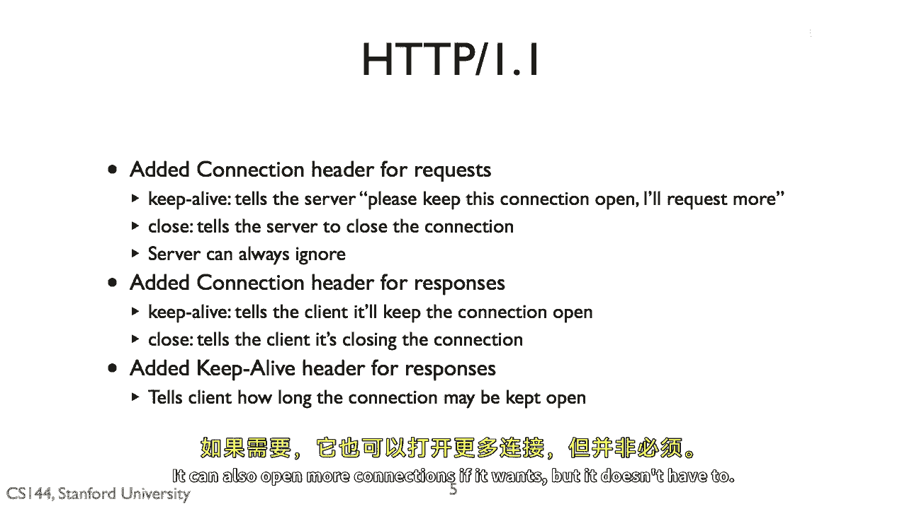
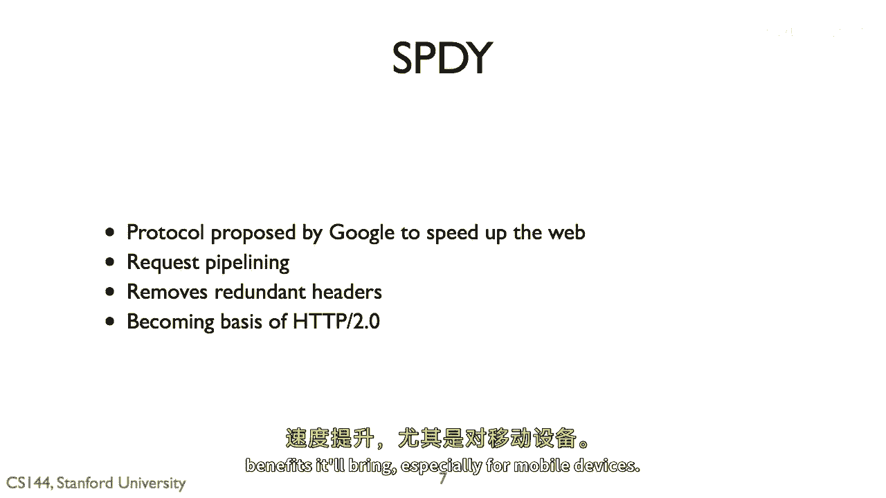

# 【计算机网络 CS144】斯坦福—中英字幕 - P77：p76 5-6 HTTP11 Keep-alive - 加加zero - BV1qotgeXE8D

在这个部分，我将讨论HTTP1。1中出现的一项非常重要的优化。

被称为保持连接的头部，HTTP是一种基本的请求响应协议，HTTP1。0非常简单，想要请求文档的客户端打开一个连接，它发送一个GET请求，服务器响应状态代码，例如200，好的，文档在响应完成后包含连接。

如果客户想要请求第二个文档，当网页主要是文本，可能包含一张图片或两张图片时，必须打开第二个连接，这种方法工作得很好，人们上交他们的网页，输入所有格式。

回忆我们从分析p1。0的结果中得出的结论。

使用这些参数加载单个页面需要230毫秒，加载包含两张图片的页面需要超过两倍的时间，法律，这次时间被用来打开连接，如果我们能一次请求更多的文档。

那么它将更快，所以http1。0使用的方法可以真的很浪费，客户端花费很多时间打开连接，此外，tcp拥塞窗口没有机会增长，因为每个连接都有一个新的窗口。

http1。1通过在请求和响应中添加几个头部解决了这个问题。

一个请求可以包括一个连接头部。

这告诉服务器我们是否希望在响应后保持连接还是关闭，服务器可以做它想做的任何事情，但客户端可以给它一个提示，例如，如果你正在请求一个基本的文本文件，没有理由保持连接打开。

因为文本文件不会引用其他东西来加载，响应包括一个连接头部，它告诉客户端服务器决定做什么，如果它决定保持连接打开，然后保持连接头部告诉客户端现在持续多久，客户端可以在同一连接上发送更多请求，如果需要。

它也可以打开更多的连接。

但它不必，因此，这就成了一个大件事，让我们考虑一个比之前更现实的情况，其中包化延迟只有毫秒，现在页面加载了十一张图片，今天的浏览器通常打开超过两个连接，但它们也在典型的页面上加载超过十一种资源。

所以我们只会将这些数字保持小以简化，我们将使用我们在查看HTTP1。0视频时使用的同一分析方法，当查看HTTP1。0时，慢启动窗口足够大，以至于我们永远不会遇到拥塞控制，对于HTTP1。0。

这将需要1421毫秒，在第一轮中有7轮，我们请求一页，这需要203毫秒，在接下来的6轮中，每个请求2张图片，除了最后一个，我们只请求一张图片，每轮需要203毫秒，所以总时间是203毫秒。

加上1218毫秒的HTTP1。0，421秒，现在，我们来看HTTP1。1，这将只需要326毫秒，我们设置一个需要100毫秒请求页面的连接，请求11张图片需要103毫秒，虽然只需要123毫秒，这是5。

毫秒用于第一个请求，和72毫秒用于11个响应，毫秒的延迟，加上22毫秒的包化，因此，dp1。1比dp1。0快4倍以上，因为我们可以连续发送这些请求到一个连接中，而不必打开新的连接。

HTTP1。1已经存在一段时间，大约从1997年或更早，最近，Google开发了一种新的协议叫做Speedy，它改进了HTTP，它做 things like 允许请求管道化，所以，一个需要解决的问题是。

是客户端请求资源的顺序与服务器响应的顺序相同，因此，如果这个资源需要大量的处理，例如，你有一个通过如Ruby on Rails或Django这样的动态生成Web页面的方式，你的数据库过载。

并且需要一段时间来生成页面，但大多数资源只是图像，可以快速发送，如果客户端首先请求斜坡页面，它不会收到任何图像，直到它收到页面，如果服务器能以不同顺序响应，并且说，开始发送图像，同时页面正在生成。

Speedy还删除了冗余的头部，打开Wireshark，看看一些HTTP1。1请求和响应，非常经常，在每个响应和请求中，有许多冗余信息，如果你能设置一些参数，例如，浏览器类型在整个会话中。

而不是每次发送，那将大大加快速度，'飞速'已经使用了一段时间，在未来几年里，它将成为h到b2。0的基础，我怀疑大多数网站都将使用hp2。0，因为它将带来的速度利益。

