# 【计算机网络 CS144】斯坦福—中英字幕 - P78：p77 5-7 BitTorrent - 加加zero - BV1qotgeXE8D

那么让我们谈谈比特torrent，它是一种令人着迷的互联网应用，拥有许多有趣的算法和方法。

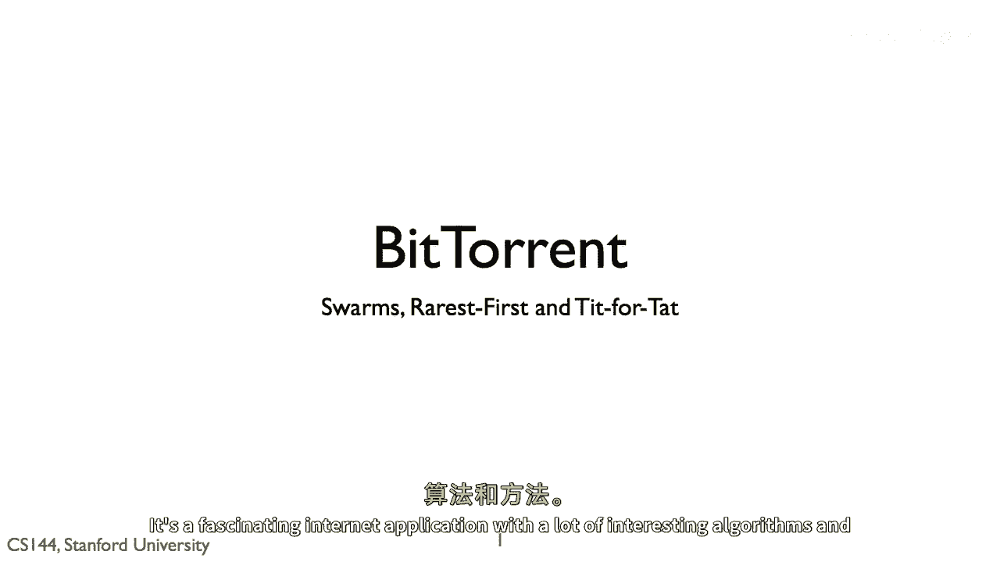

它有原因为什么能如此有效，比特torrent允许人们分享和交换大型文件，一个比特torrent客户端从其他客户端请求文档，这样单个客户端可以从许多其他人那里请求，并行。

比特torrent将文件分解为数据块，称为片段，当一个客户端从另一个客户端下载片段时，然后它告诉其他客户端它已经有了那个片段，所以，这些能够将这些文件下载到协作客户端集合中的东西被称为蜂群。

所以我们可以谈论一个客户端加入或离开蜂群的情况。

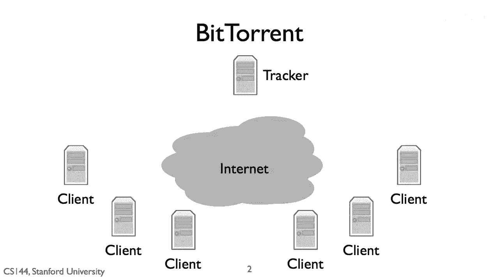

一个客户端加入蜂群，通过下载一个包含文件信息的torrent文件。

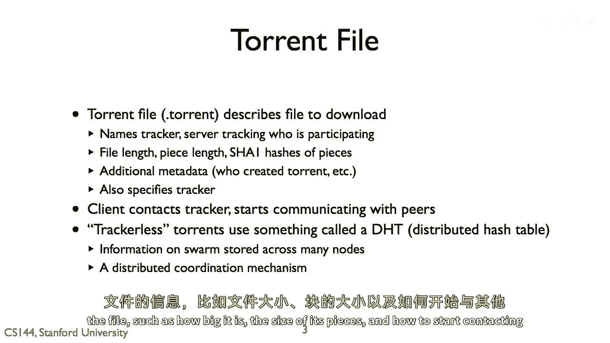

例如，它的大小是多少，它的片大小是多少，以及如何开始与其他客户端联系，以前，torrent会命名一个追踪器，一个计算机，它跟踪哪些客户端是蜂群的一部分，当一个客户端加入蜂群时。

它请求跟踪器从其他客户端列表中获取一个列表，然后开始通过tcp与这些客户端进行通信，一个bitTorrent客户端可以同时打开大约一百个tcp连接，在2000年代的后期，跟踪器开始受到许多不必要的关注。

大多数客户端都过渡到使用跟踪器列表当前，这些torrent联系一个主机，该主机告诉他们如何加入被称为分布式哈希表的东西，或dht，dht是一种将哈希值映射到节点的方法。

支持该dht的一组节点可以改变很多，您仍然可以找到节点，因此，而不是使用这个查找的中央表格，映射实际上在所有参与节点上分布，这基本上是一种方式，让一些节点可以协作存储一些数据，在这种情况下。

存储哪些客户端是蜂群一部分的列表。

BitTorrent将文件分成n片，每一片都是256千字节或更大。

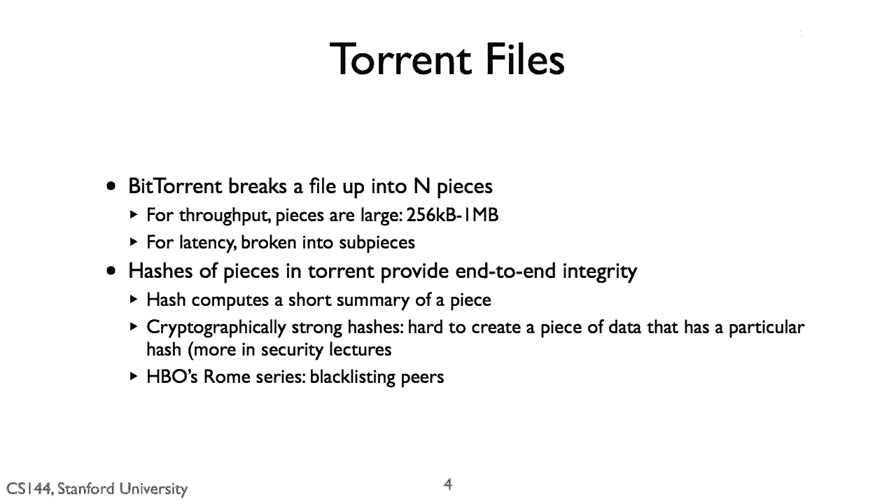

这个尺寸是为了确保TCP流，传输，文件的寿命足够长，以至于其拥塞窗口可以增长到一个合理的大小。

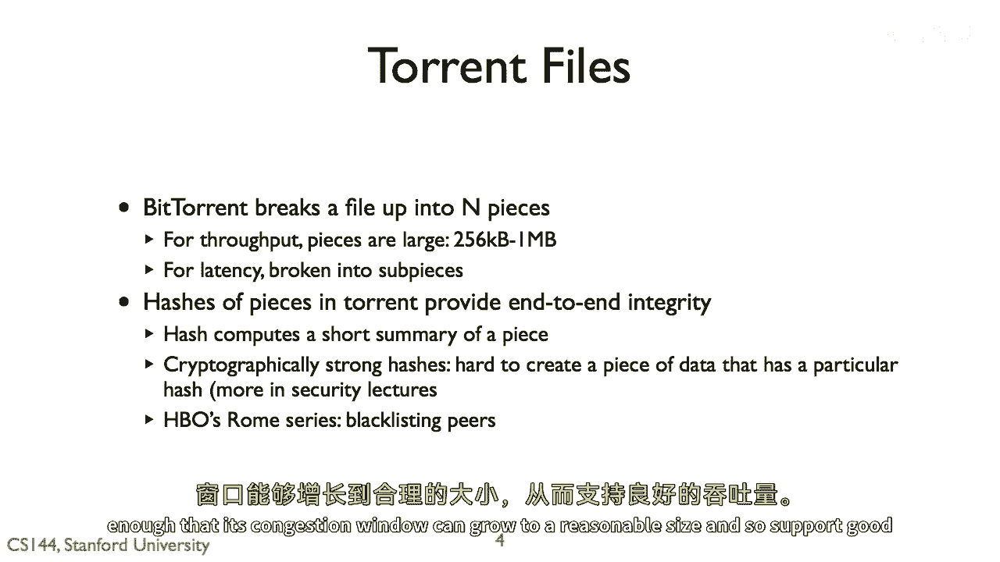

因此，支持高吞吐量，但是，BT也把文件分成子片段，所以，它可以从多个对等节点请求片段的部分，因此，减少延迟，一个片段也是BT用于检查完整性的单位，一个torrent包含每个片段的sha1哈希值。

sha1被称为加密哈希函数，它是消息验证代码中使用的基本原理，一个强大的加密哈希函数具有属性，给定一个哈希，真的很难创建一个数据片段，具有那个哈希值，这意味着如果torrent说片五的哈希是h。

想找出不是片五的片很难，这也是有哈希h的片，所以你不能开始替换torrent的片并搞砸它，没有客户端注意到哈希正确并重试，所以这实际上在两千零六年引出一个有趣的故事，hbo有一部新系列叫罗马。

对它有多个不同的torrent，每个都有非常大规模的swarm，但许多人发现他们的客户端无法下载系列，调查后，发现有很多非常，非常快的peer，许多客户端都连接到并从中下载。

但这些peer提供的片没有正确的哈希，所以客户端会下载片，发现哈希错误，扔掉片。

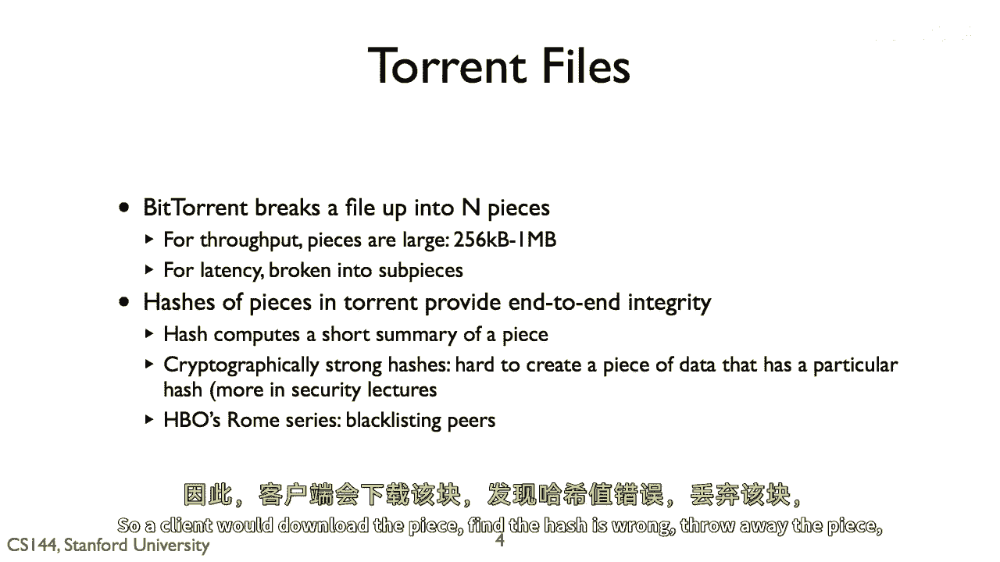

并重试，然后客户端假设这只是一个错误，所以继续从同一个peer请求，所以许多客户端就会陷入一个无尽的循环，试图下载同一片坏片，假设这是hbo为了防止下载的努力。

现在客户端可以黑名单提供许多坏片的peer。

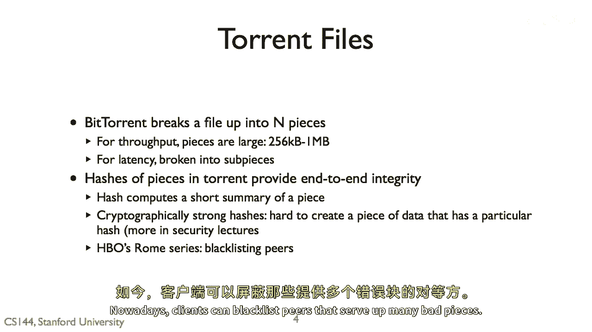

当客户端连接时，bitTorrent客户端会定期交换关于它们拥有的片的信息，客户端首先尝试从其peer中下载最稀有的片，如果单个片变得不可用，没有人可以下载文件，如果只有少数客户端有片。

他们会成为下载的瓶颈，这被称为最稀有优先政策，最稀有优先政策的一个例外是当客户端到达torrent的末尾，并只需要几片，到这个点，它会从多个peer请求片，它这样做来对抗边缘情况的情况。

即从非常陡峭的peer请求最后一片，并不得不等待，所以这一步意味着客户端可能会下载多个子片的副本，并浪费swarm带宽，但由于swarm通常包含数千片。

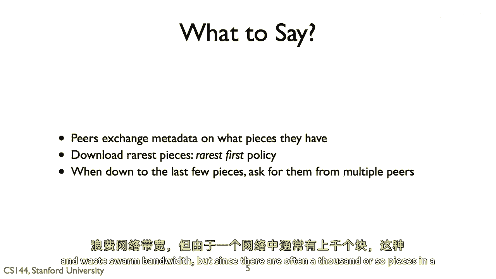

这个成本很小，所以值得，所以bitTorrent客户端与其他客户端交换元数据，以了解它们拥有的片，客户端开始从其peer请求片，但如果你向每个peer发送数据，你将有许多非常慢的片。

而不是一百个慢的tcp流，bitTorrent试图有较少的快速流，想法是你向发送给你数据的peer发送数据，贡献的peer可以下载更快，这创造了一个激励发送片给peer的动机。

这是通过掐断大多数peer实现的，所以你不向他们发送数据，维多利亚测量从每个邻居下载的速度，并选择其中最佳的p个，p通常一个小数字，比如四个，或者是邻居数量的平方根，然后它掐断这些p个邻居的数据传输。

并向他们发送数据，这个算法叫做以牙还牙，你向发送数据给你的节点发送数据，这个算法的一个问题是它探索得不多，可能外面有一个真的很好的同伴，他能够以非常快的速度向你发送数据，如果只有你先开始发送一些数据。

所以大约每三十秒，bitTorrent在chokes上随机阻塞一个码头，这个码头可能会找到它的方式进入p best。

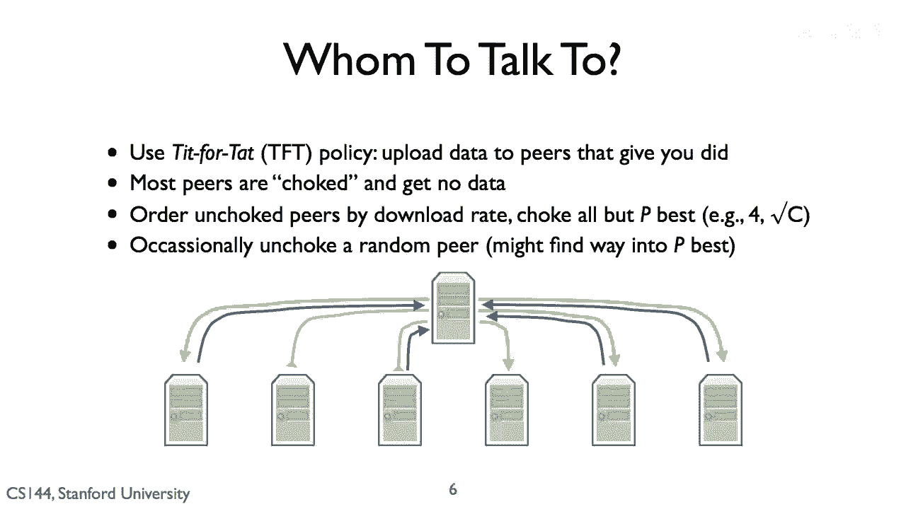

bitTorrent的tit for tat算法似乎相当 robust，你优先向发送你数据的其他码头发送数据。

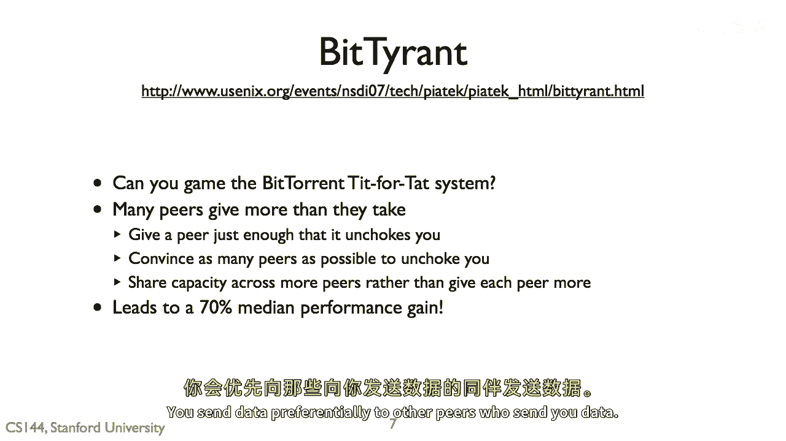

但它不是完美的，在二十七中有一篇很好的论文提出了一个叫做bit tyrant的东西，它自私地试图游戏系统，并且它使用bit tyrant做到了。

你可以通过增加你的bit torn吞吐量来提高七十 percent，基本的观察和比特暴君是，这个在标准比特torrent中的存在，一个节点试图将其可用的bling能力均匀地分配给它的未阻塞节点。

所以如果一个客户端有p个未阻塞节点，然后每个一个都接收到超过p个其上行能力的一个，但是一旦你进入这个前p，你就得到这一切，所以技巧是，你想要在这里放弃 just enough 以便能够进入它的 top。

p 并且不再多，你应该然后花费额外的能力试图进入另一个节点，top p，所以这样你就可以给每个人足够的资源，以至于他们不会窒息你。

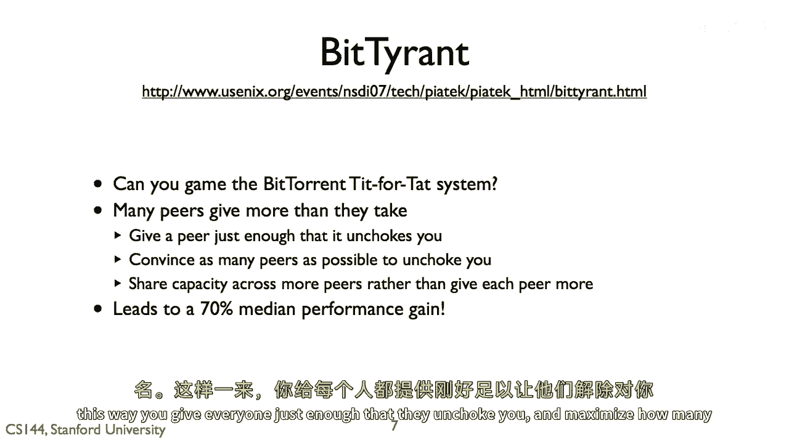

并最大化窒息你的人数，这是一个很好的结果，他们还发现，如果每个人都使用比特流转换性能可以稍微提高。

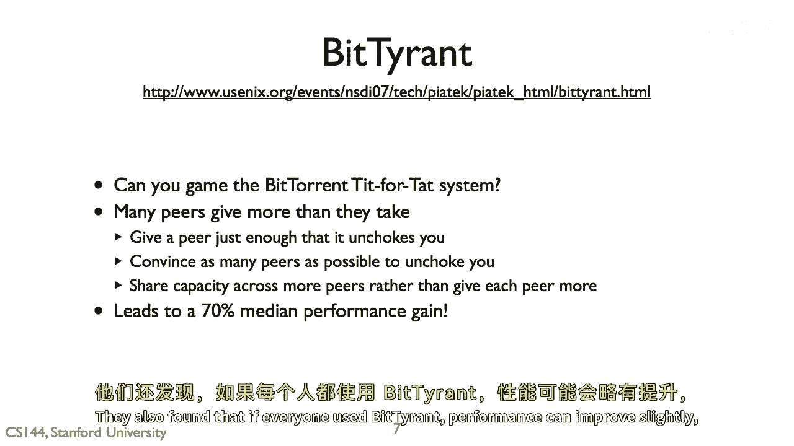

但你得到的利益最大，如果你是唯一的暴君。

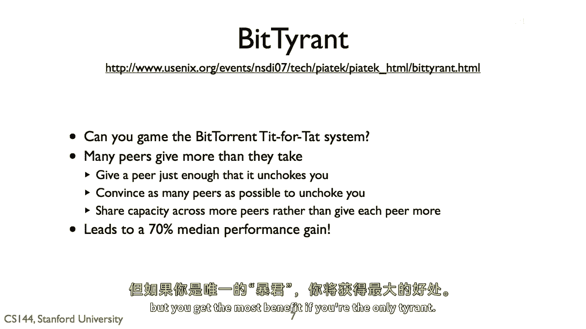

URL，这里是论文的链接，所以这就是比特流转换的基本概述，你的客户下载一个torrent文件，例如，通过HTTP，这描述了要下载的文件。

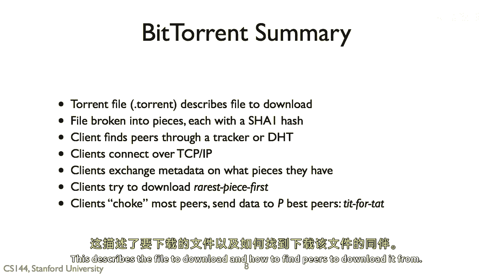

并描述了从BitTorrent中下载它的 peer 的方式，它打破了文件，这些片段和 peer 交换这些片段，他们通过 TCP 连接并交换元数据，因此，他们知道他们的部分 swarm 中片段的分布情况。

然后，客户端尝试首先下载最稀有的片段，以平衡可用性，客户端只将数据上传到他们的 top p 下载者，因此，大多数 peer 被阻塞，无法接收到数据，并客户端将数据提供给那些给你数据的人。

使用报复性算法发现可能良好的新邻居。

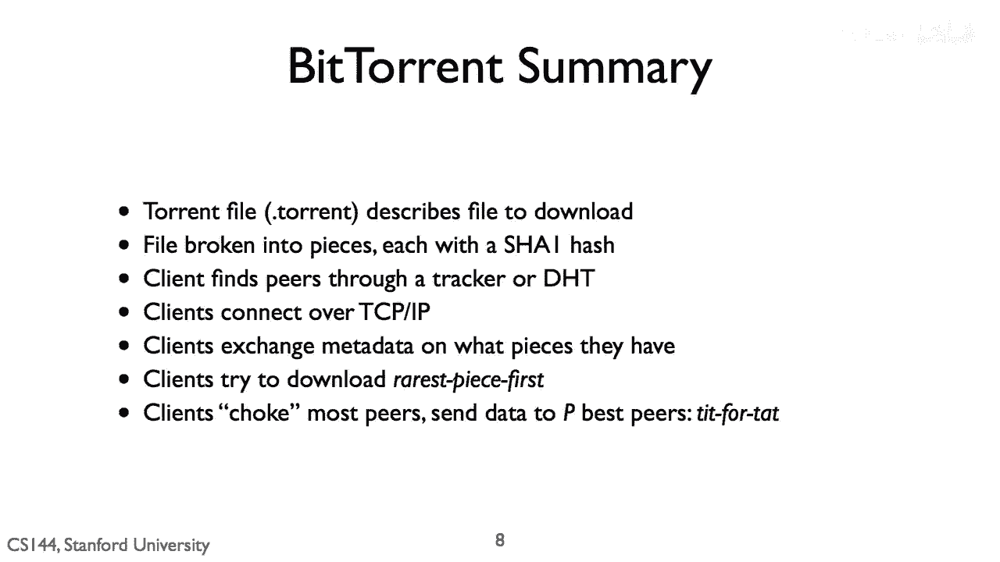