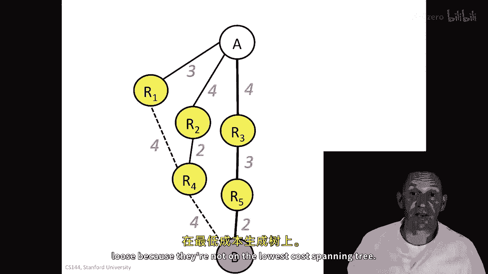
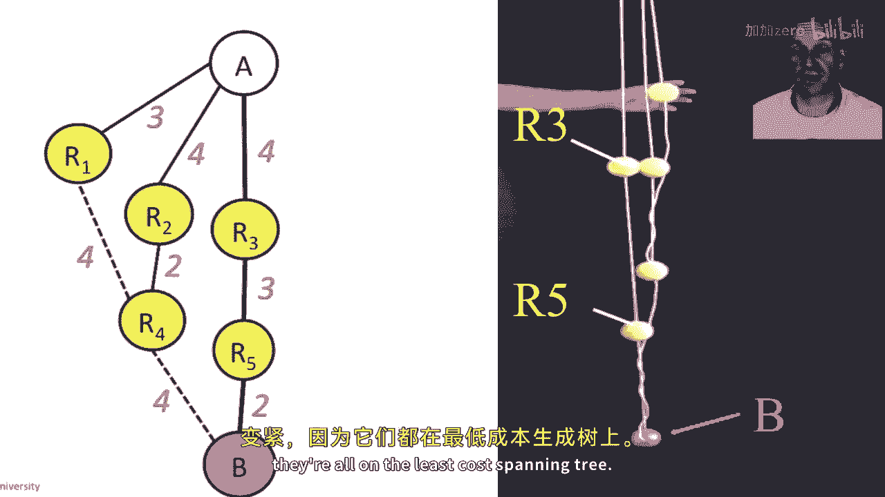

# 【计算机网络 CS144】斯坦福—中英字幕 - P87：p86 6-3 Routing - Dijkstra - 加加zero - BV1qotgeXE8D

在本视频中，我们将继续讨论路由的主题，我将向您介绍链接状态算法，特别是迪杰斯特拉的最短路径优先算法，这是链接状态协议的一个例子，在这个协议中，路由器首先开始向彼此广播，关于网络拓扑的所有信息。

有哪些链接，哪些链接是通的，哪些是断的，然后，从那里，每个路由器都将计算其最短路径树，从它到每个其他路由器，Dijkstra的最短路径优先算法，是更广泛称为链路状态算法的一个例子，在链路状态算法中。

路由器开始通过交换所有链路状态来启动，换句话说，它们通过与其他路由器交换来学习网络的拓扑结构，然后获取连接到每个路由器的链接状态，所以，我们的路由器将向每个其他路由器广播，连接到它的链接状态。

以便每个路由器都有一个完整的拓扑图，而且他们将定期这样做，并且每当链路状态改变时，以便他们能够快速更新，然后，特定于迪杰斯特拉的算法，我们将运行迪杰斯特拉的算法，换句话说，一旦我们有了那个拓扑图。

每个路由器都将独立运行迪杰斯特拉的最短路径优先算法，如果是不同的链路状态算法，然后我们将运行一个不同算法，但是，因为迪杰斯特拉被广泛使用，那就是例子，我在这里将要使用的，所以，到最后一天。

每个路由器找到到达其他每个路由器的最小成本生成树，让我们在这个拓扑结构上通过一个迪杰斯特拉的算法的例子，所以，这个拓扑结构有八个路由器通过链接连接，这些链接被注释为使用这些链接的成本。

我们将通过找到最低成本生成树的例子来演示，从第八个路由器开始，到每个其他路由器，所以让我来画一个这可能看起来的样子，这并不是正确的一个，但是嗯，它将给我们一个它可能看起来的样子的例子，嗯。

它可能看起来的样子，所以它将从这里开始，可能这样出去，这样出去，这样出去，走这条路，也许我们会得到这个，这两个再加上这个就会是一棵生成树，这并不是最低成本的生成树。

但我们将在一会儿使用迪杰斯特拉的算法来计算它，所以我只是想画出这将如何演变，我只是要按照步骤走，然后我会带你走一种更正式的方法来计算它之后，所以让我们从嗯，在底部右下角的R8开始。

迪杰斯特拉的算法的第一步，我们将添加具有最低成本路径的路由器回到我们的R8，所以那是R7，因为它有一条路径回到R8的成本为1，所以我会在这里画出它，R7的成本为1下一个。

我将查看直接连接到这棵树的路由器，这个正在成长的小树的最低成本路径回到我们的R8，我有两个选择，R4将回连接到成本为2，或R6将回连接到成本为2，所以我只是随便扔硬币并选择6，没关系。

所以它的成本为2下一个，我将添加下一个具有最低成本路径的路由器，那就是我们的R4，显然，每次我添加一个路由器，我都不会考虑再次添加它，当然，因为我已经将其添加到这个。

在这里的底部右下角的滑块中的树中下一个，我将添加具有，嗯，我已经添加了成本不超过2的路由器，所以是成本为3的路由器吗，不，没有，是成本为4的路由器吗，是的，我在这里有两个候选者，我有我们的3和R5。

两者都可以连接，好的，我会任意添加我们的5首先，它的成本为4，回到R8，然后我会添加我们的3，我有成本为5的路由器吗，是的，我有，我有两个成本为五的r，这增加了成本为五，回到r八，我有一个成本为六的吗。

嗯，我有两个成本为六的r，但他们已经在树中以更低的成本连接，所以r三和r四，所以我不会添加这些，它们已经在树上，但我也有我们的一个，我现在可以以成本为六添加那个，这就是一、二、三、四、五、六。

我现在已经将它们都添加了，我已经完成了，让我们走一遍那些步骤，嗯，基本上就是我刚刚走过的步骤，依次添加那些路由器，所以首先我添加了我们的六，因为它的成本是二，然后我添加了我们的四，因为它的成本是二。

然后我添加了我们的五，因为它的成本是四，然后也添加了r三，它的成本是四，然后我添加了我们的R2，然后再次，最后我添加了我们的R1，然后我就完成了，我们可以更系统地思考这个问题，通过遵循这个表格。

所以我将随着我的进展填充这个表格，然后我会向你展示它完全填充的样子，它看起来什么样子，完全填充后的样子，所以这只是要重复我刚刚做的步骤，所以，我从步骤零开始。

所有直接连接到我们八个路由器的候选路由器集合，所以，我的最短路径集将是，最短路径树中的路由器集，所以我从我们的八个开始，在我最短路径集中，候选集是直接连接到它的路由器，直接连接到它。

连接到当前的幼小子树，所以那就是r三，r五，r六和r七，而且我要选择回到我们的速率的最低成本路径的那个，但是R7所以我要先添加R7，所以我选择了R7，那么在这种情况下如果我选择了R7。

我要把它添加到我的最短路径集中，所以我的最短路径集将成为R8和R7，我的候选集是直接连接到这个子树的路由器集，所以直接连接到的是有R3和R5，当然仍然因为我还没有用过他们，R6因为我还没有用过那个。

我已经用过R7，所以现在候选集中增加了四个，我会从那个集合中挑选，成本最低返回R八的路径的那个，那可能就是我们四个，它的成本为二，或者是R六，我就随便选择R六，所以现在我最短路径的集合就是我们八。

我在这里的空间快用完了，但这并不重要，我们的六和我的候选人集将设置为r三五，我已经使用了我们的六，它将包含r四，因为我已经添加了我们的六，我现在不再向我的候选人集添加任何路由器，所以这将保持不变，等等。

最终，我会填满表格，直到我会添加的最后一个都将在其中，我会在这里选择我们的一个，所以到这个时候，我会将我的一个添加到我的最短路径集中，然后我就完成了，好的，我将在每个步骤中添加一个路由器。

我将添加路由器，这是最低成本路径，并且因为它是最低成本的路径，我们知道我们已经完成了我们的路由器，没有其他事情可以做了，它很漂亮，很简单，我们将始终运行迭代次数，等于网络中的路由器数量。

所以如果你填写这张表格，你会发现它看起来像这样，嗯，所以你可以检查一下那那是否与我之前做的匹配，所以如果你运行这个算法，然后我们会给你一些练习，让你运行并通过填写像这样的表格，你会看到。

并且在你做了几次之后，那，哦是的，当然，它实际上正在生成最便宜的最低成本最小生成树，所以关于迪杰斯特拉的算法有一些值得问的问题，第一个，算法运行需要多长时间，在k次迭代结束时，答案是简洁明了的。

我们在图中添加了k个路由器，我们开始时有n个路由器，它将在精确的n次迭代后终止，简单易懂，当链接成本改变时发生什么，或者路由器或链接失败时，再次简单易懂，每当链路状态发生变化，换句话说。

每当链路上升或下降，路由器会将该状态广播到网络中的所有其他路由器，然后他们重新运行迪杰斯特拉的算法，计算到其他路由器的最短成本生成树，我们又恢复了正常运行，换句话说，每当有变化。

我们从头开始重新计算并继续前进，所以我们不需要担心像坏消息这样的病例，旅行缓慢，等我们使用贝尔曼-福特算法时需要担心的问题，因为一切都从零开始重新计算，每次有变化。

所以让我们看看迪杰斯特拉的算法在实际中如何使用，迪杰斯特拉的算法是链路状态算法的一个例子，这意味着链路状态由每个路由器知道，换句话说，它在路由器之间被广泛传播，以确保所有路由器都知道整个拓扑结构。

以及网络中链路的状态，然后，每个路由器独立计算从自身到每个其他路由器的最短路径生成树，在网络中，迪亚斯算法是ospf或开放最短路径优先算法的基础，在互联网上广泛使用的路由协议，我们将在后续的视频中看到。

对迪克斯特拉的算法还有一种思考方式，我想在下一个视频中告诉你，我从教授让·伯克利那里首先了解到这个的，这是一个非常 nice 的方式来思考正在发生的事情，所以来看看这里的例子，由链接连接的一系列路由器。

和之前的红色数字代表每个链接的成本，实际上，我将它们表示为网球球，黄色路由器和一个白色和一个粉色的球，代表顶部和底部，A和b，我们将计算最低成本生成树，通过将每个球用绳子连接起来。

其中绳子的长度等于红色显示的成本，所以让我们从地上开始像这样，然后如果我们拉和拽它们向上，每个通向，或每个连接到，它将在那个从a到网络中的最低成本生成树上，所以最终我们会得到像这样的东西。

其中a通过r3和r5连接到b，总成本为9，这里的所有实心链接代表将被拉紧的绳子，所有点状标记的，底部左下角的两个点将会松动或松弛，因为它们不在最低成本生成树上。

我将把它们抬起来像这样，这就是之前的拓扑结构，所以从a到r的线会变得紧固，然后从a到r的二和三，从r到一的线也会变得紧固，因为它们都在最低成本生成树上，现在从a到四的线会变得紧固，然后是我们的五。

因为它们都在最低成本生成树上，我再把它抬起来，最终从a到r的三到五到b的线都会变紧固。

因为它们都在最低成本生成树上。

