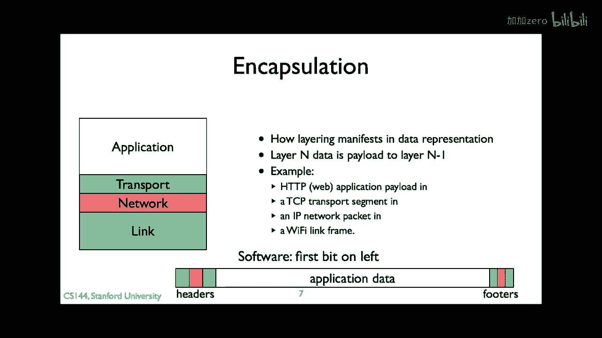
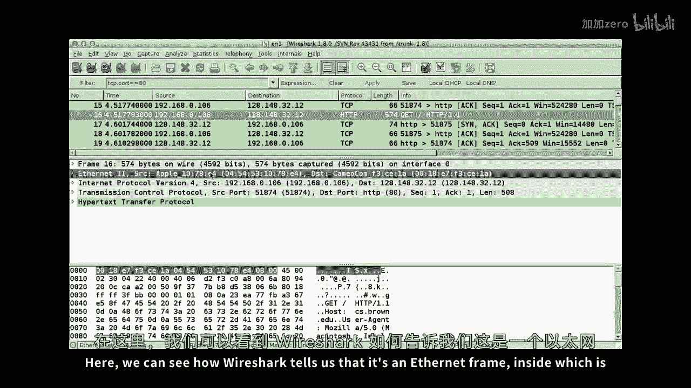
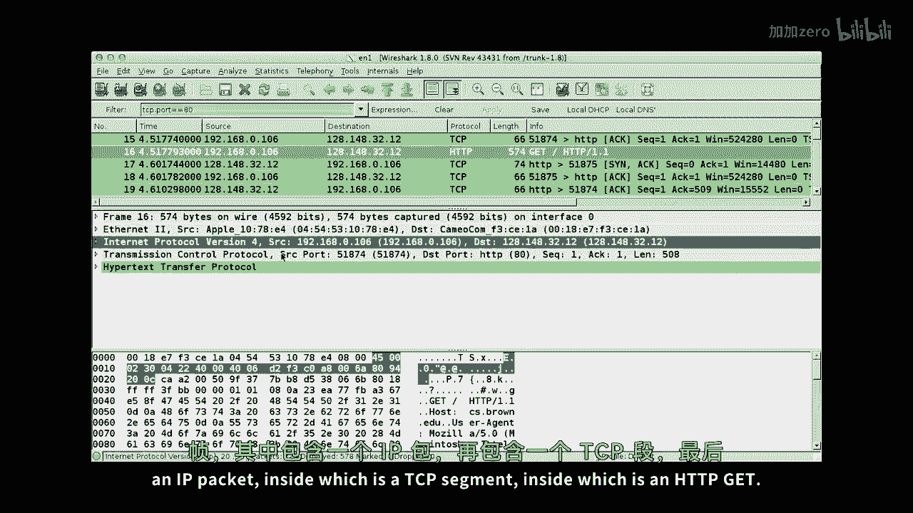
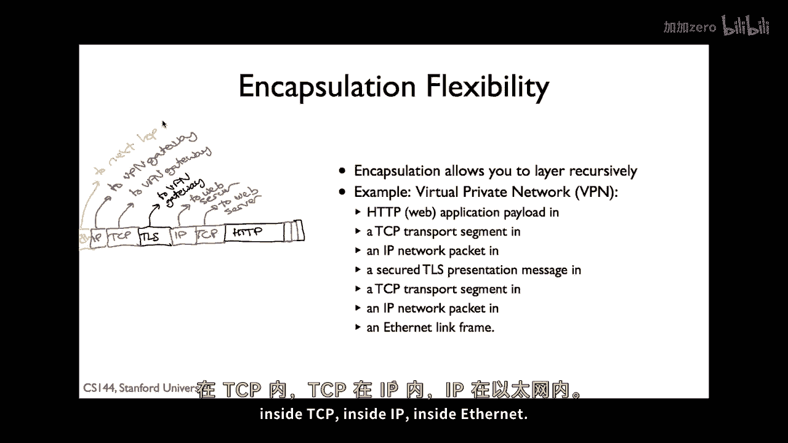
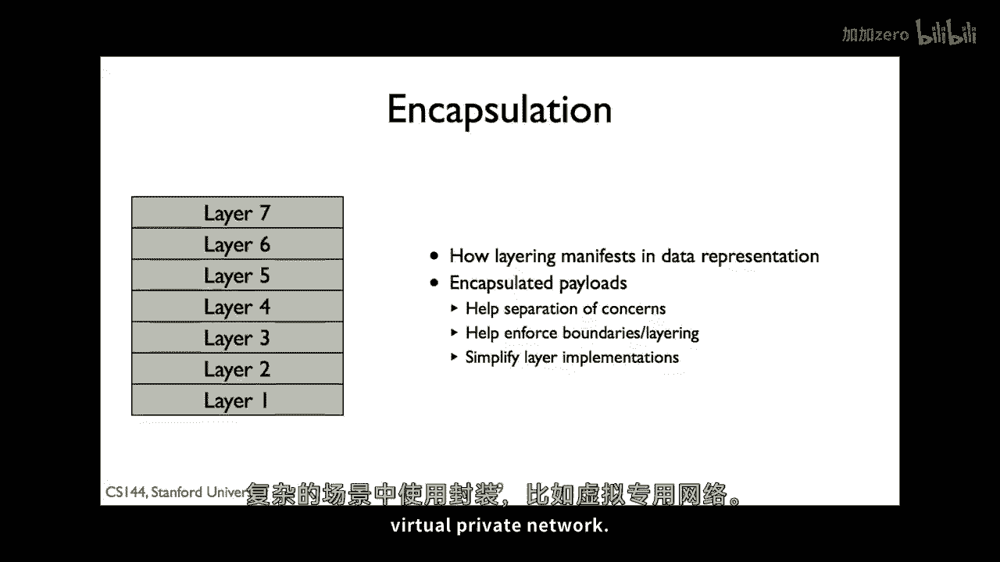

# 【计算机网络 CS144】斯坦福—中英字幕 - P8：p7 1-7 Encapslation principle - 加加zero - BV1qotgeXE8D

这个视频是关于我们称为封装的建筑学原理，封装是当您将分层和分组交换结合时发生的结果，我们想要将我们的数据分解为离散的单位，这些单位我们称为分组，但是，当您发送TCP分段时。

每个分组都包含来自多个层的数据，例如，它坐落在IP分组中，这是指，反过来，它坐落在以太网帧中，封装就是这样工作的，封装是您组织信息在分组中的原则，以便您可以维护层，但同时让他们共享分组的内容，记住。

分层让您可以将复杂的系统分解为较小的部分，每个层提供服务，对高层的抽象，它通过使用下面的层提供这种抽象，每个层都是自包含的，只要它提供预期的表面，上层不需要担心如何。

这种关注点的分离意味着每个层可以独立进化，就像IP，在网络层不需要担心TCP的变化，在传输层，应用层如HTTP不需要担心TCP的变化，例如，在过去的几年里。

大多数操作系统都已经改变了他们使用的确切TCP算法，以更好地处理增加的网络速度，但是，Web浏览器使用旧算法和新算法都工作得很好，请注意，这个关于层的图片使用OSI模型的七层模型。

所以让我们缩回到四个层模型，封装是让我们能够将协议层，并让他们轻松地共享分组中存储的原则，它是层化在实际数据表示中的表现，这是如何工作的，每个协议层有一些头部，跟随其负载，跟随一些尾部，例如。

一个IP分组头部有一个源地址和一个目的地地址，要发送TCP分段与IP，我们使TCP格式，IP分组的负载，这样，IP分组封装TCP分段，IP不知道或关心其负载，它只是将分组送达终点主机，当分组到达时。

主机查看负载，看到它是TCP分段并相应处理，所以，这里是一个更完整的例子，假设你在网上浏览，使用通过无线以太网连接的电脑，你的网页浏览器生成了一个HTTP GET请求，这个GET请求是TCP段的负载。

封装HTTP GET的TCP段，成为IP包的负载，这个IP包反过来封装TCP段，并且HTTP GET是WiFi帧的负载，如果你看看你的电脑发送的字节，他们会看起来像这样，最外面的封装格式是wi fi帧。

其中包含一个ip包，其中包含一个tcp段，最后，http get在内部，所以尼克如何绘制这个包可能会让你感到非常困惑，实际上，有两种方式可以绘制包，差异来自背景和你工作的系统部分，尼克在这里绘制了包。

其中，头部在右侧，包的第一个位位于右侧，并包的最后一个位位于左侧，这完全有道理，当路由器或交换机发送包时，我们绘制包从左到右移动，所以从路由器或交换机离开的第一个位是位于最右侧的位，但我绘制包。

以另一种方式，头部位于左侧，而尾部位于右侧，像这样，这种方法来自软件，当你阅读ietf文档时，你会看到这种方法，并且许多其他协议规范，想法是包的开始位于地址零，所以头部的第一个字节位于地址零。

因为地址从左到右增加，这意味着包的开始在左边，并且包的结束在右边，当然，这里有没有对或错的方法，包绘制的两种方式都有价值，取决于你使用绘制的目的，所以你应该对两者都感到舒适，嗯，我通常在右边绘制标题。

最终在左边绘制它们，Nick的背景是电子工程和开关设计，我的是计算机科学和协议，软件，所以现在让我们回到Nick的HTTP示例，进入一个TCP段，在一个IP包内部，在一个WiFi帧内部。

让我们看看这在实际网络中与Wireshark的外观如何，在我们开始录制之前。

我启动了wireshark并记录了一个包，网络请求的跟踪，让我们只看一个包在这里，我们可以看到wireshark告诉我们，这是一个以太网帧在里面。

这是ip，在里面的包是一个tcp段。

在里面，这是http get，如果我点击这些协议头中的每个，然后wireshark实际上在包字节中突出显示他们在哪里，这些这些胡言乱语，下面wi fi首先出现，在wi fi内部是ip。

在ip内部是tcp，并且在tcp内部，我们可以看到我们的http文本，得到这个非常简单的方法，将协议封装在彼此内部，给你巨大的灵活性，到目前为止，我们一直在谈论四层模型，作为一种完全静态和不灵活的东西。

在实际操作中，并不是那样，实际上，你可以通过封装来递归地层叠协议，例如，在今天的办公室里，商业公司非常普遍使用的一种东西被称为虚拟私人网络，通过虚拟私人网络，你可以打开。

一个安全的网络可以安全地连接到你信任的网络，例如，你的办公室，例如，使用传输层安全tls，当你与互联网通信并发送ip包而不是发送它们时，通常，所以ip包将发送到你的公司网络，在那个时候。

公司网络可以路由通常，这允许你做一些像访问公司内部私有受保护的网络资源这样的事情，所以，而不是到处撒布网络保护，你只需要小心一个服务，允许人们在虚拟专用网络上登录到网络的服务。

并将他们的流量转发到私有网络，那看起来什么样子，让我们假设，我正在很好地访问我内部的公司网站，我的Web浏览器生成HTTP，像往常一样，它将此放入TCP分段。

然后将此TCP分段放入目的地为公司内部Web服务器的IP包，而不是将此IP包放入链路层帧，我无法直接与内部Web服务器通信，我的电脑将此IP包放入TLS分段，一个安全的分段，TLS保护消息并保持其秘密。

此TLS会话位于TCP流中，在虚拟专用网络网关处终止，因此，外部TCP分段位于IP包中，目的地为虚拟专用网络网关，我们将此外部IP包放入链路帧并发送到下一个顶级正常，因此，它看起来像这样的HTTP。

在内部TCP内部IP内部TLS内部TCP内部IP内部。

你现在已经了解了封装，将层和分组交换统一起来的原理，封装是我们如何将协议层组装成包的方式，以一种灵活且保持其关注点分离的方式，你看到一个电脑如何电脑可以封装RIP的例子，好的，我将开始这个幻灯片再次。

我们需要只是保持它作为蓝色卡片，你现在已经听说过封装，将层和分组交换统一起来的原理，封装，是我们如何将协议层组装成包，以一种灵活的方式，并保持其关注点分离，你看到一个电脑如何封装Web请求的例子。

以及一个如何更复杂地使用封装的例子。

