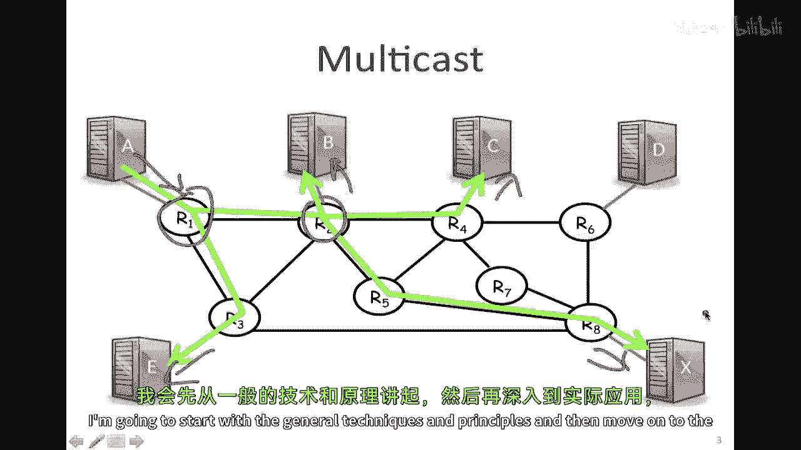
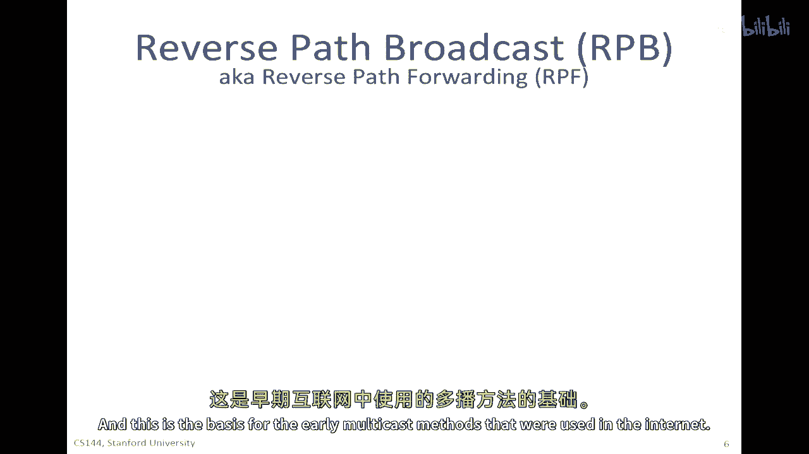
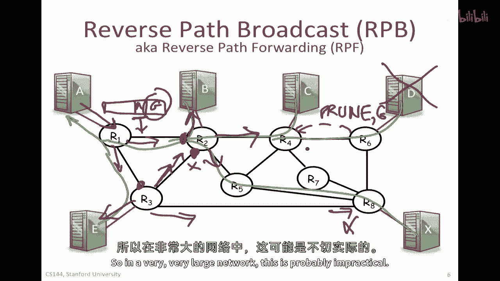
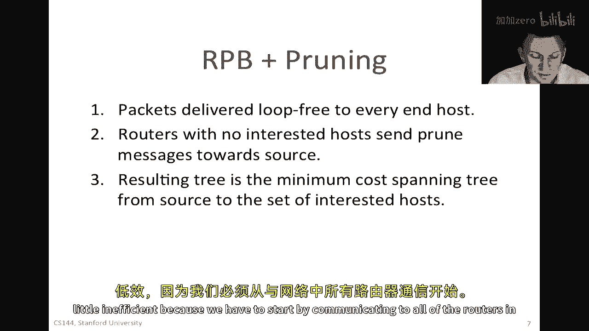
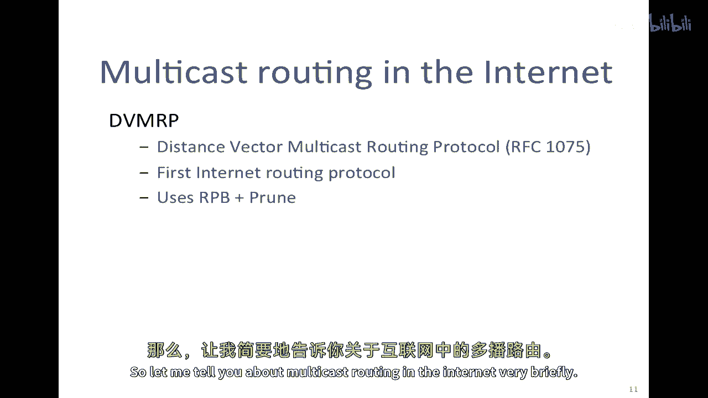

# 【计算机网络 CS144】斯坦福—中英字幕 - P90：p89 6-6 Routing - Multicast - 加加zero - BV1qotgeXE8D

在之前的关于路由基础的视频中，我向您解释了IP多播路由的基本原理，在这个视频中，我将向您介绍与IP多播相关的一系列技术。

到目前为止，我们假设所有包都发送到单个目的地，或者是单播，有一些应用中，我们想要包被复制到多个主机，到一组主机，例如，A可能想要发送包给B，C和X以及E，而不发送给DE，例如，它可以是广播电视。

其中BCX和E都在观看同一台电视或广播电台，它也可以是我们之间的视频会议，因为参与者的数量可以是自动更新到大量主机等，虽然我们可以很容易地将包发送给每个一个，在同一时间，到每个目的地，正如我展示的。

自然我们会问，如果网络能否或应该为我们复制包，例如，如果网络是，嗯，要复制包在R1这里，然后，它可以更有效地将包送达到终点主机，A只发送一个包，然而，包正确地送达到所有终点目的地，所以在这个视频中。

我将看一些实现这一目标的技术，我将从。

一般的技术和原理开始，然后转向实践，互联网上实际做的事情，我们总是已经看到了一种方式，包可以送达到大量主机，以一种相当简单的方法，即洪水，在洪水中，如果我有一个，嗯，一个源A，它在网络中通过A发送到B。

假设到多个路由器，让我们说，在这里，如果我说如果网络是洪水，如果我们使用洪水作为达到B的方法，那么来自A的包可以在路径上的每个路由器上复制，通过从每个接口发送，除了包到达的接口。

所以来自A的包可以到达这个第一个路由器，从这里发出去，从这里发出去，然后，当它到达这个，这个路由器，它可以从这里发出去，从这里发出去，同样在这里，并且显然，包最终将送达B，实际上。

它将送达网络的每个叶节点，洪水的基本问题是，包，嗯，嗯，当网络拓扑中有环路时，包可以无限循环，因为当它接收来自这个方向的包时，击中了这个路由器，这个路由器会说，啊哈，这个包是从这个接口进来的。

我将从所有接口中发送，除了它来的那条路之外，然后当然它会永远循环下去，所以在生成树中我们看到，嗯，协议，这些循环是如何被打破的，我们将看一种不同的方式，它们可以在一开始就避免。

这种方法被称为反向路径广播，这是早期在互联网上使用的多播方法的基础。

我将要描述的第一种技术被称为反向路径广播，也被称为反向路径转发，这是一种非常聪明的技术，被广泛使用，并且在最初的互联网多播路由协议中被使用，它基于一个非常简单的观察，这个观察是。

甚至在a开始发送多播之前，网络已经构建了一个到a可达所有主机的最小成本生成树，我们之前在单播路由协议中看到了如何做到这一点，例如，r一已经知道如何计算所有向a发送的包的最小成本生成树，所以。

网络实际上有一个最小成本生成树，因此，我们可以在发送多播包之前，利用该生成树来确定最佳路径，这就是为什么在网络中存在多播树的原因，这是由所有路由器一起构建的，用于达到某个的，所以。

你可以使用这个作为无环路方法，以便将数据包发送给其他所有人，所以，首先让我来描述广播情况，这相当于洪水，但没有有没有环路数据包持续存在，所以现在想象一下，a正在向其他所有人发送数据包。

并且这个数据包将包含一个地址，我会，我会晚些时候谈论地址，所以，它将有一个与发送对象对应的组地址，但它将包含源地址a，因为这个包来自一个，沿途的每个路由器，你可以问这个问题，这个包到达的接口是否是。

所以，这个接口在这里，它是否是从我到a的最短路径生成树，你可以在它的转发表中查找，来看它是否正在向a发送单播包，而不是从a发送组播包，如果它正在向一个单播地址发送数据包。

这是否是它从这个路由器离开时将通过的路径，所以它查找地址，它在其表中的源地址，它将在该转发表中查找该地址，如果这是通过它将发送数据的接口，如果它正在发送单播，那么它将接受并发送它出每个其他接口。

所以它将从每个其他接口发送它，同样，当它到达r2时，r2将问同样的问题，如果它正在向一个单播包发送，这是通过哪个接口它将发送它，答案是是的，所以因此它将从每个其他接口发送它，所以这就有点像洪水。

但它在问一个更详细的问题，这是通过哪个接口我将发送它，如果它是一个单播包，发送到，所以你可以看到这里，我们的三个也将问同样的问题，它会说是的，这是我将通过它发送到A的接口，因此。

我将从所有其他端口发送它，然而，当这个包到达R2时，它将通过这个接口到达，这个接口不在从A返回的绿色最短路径树上，因此，R2将丢弃那个包，它不会发送它，你可以看到它只是打破了循环。

在这里的R8也会发生同样的事情，这不是在绿色最短路径树上的，所以那个包将被丢弃，你可以说服自己实际上不会有循环，因为包四将跟随已经构建的生成树，这是一种聪明的想法，你可以看到为什么它被称为反向路径广播。

因为它在使用与原始方向相反的生成树，现在，所有这些都很好，作为一种广播的手段，但我们在谈论多播，在这个特定情况下，这个包原本应该被送达所有终点主机，但实际上我们想要它被送达每个终点主机，除了d。

那个是我们试图送达的宿主集，所以对于这个的简单扩展，有一件事是，嗯，被称为修剪，它通常被称为反向路径广播，加上修剪，或rpb加上修剪，在哪个，那些没有连接到对接收该数据包感兴趣的主机的路由器。

所以在我们的情况下，d不是多播组的一部分，所以路由器六将发送被称为修剪消息的消息，我将其显示为点线，所以它将发送修剪，并说嘿，实际上，我没有任何对，对这个地址组的结束主机感兴趣的包。

请不要再向我发送这个组地址的多播包了，因此，它将修剪g并说我对此不感兴趣，所以，在这种情况下，嗯，这将从从的嗯中删除，反向路径广播树，现在，那颗树只会达到对它感兴趣的终点主机。

所以它是一种减少广播效率的方法，然而，它显然仍然有开始时的效率不足，在每个路由器开始修剪之前，它将听到它，所以在一个非常非常大的网络中，这可能是嗯。

这可能是不现实的，所以总的来说，反向路径反向路径广播。

加上修剪的包被无兴趣的终点主机路由器以循环自由的方式送达，没有附着在其上的感兴趣主机将发送修剪消息回向源，当然，他们可以使用源的unicast地址来发送那个修剪消息，所以它会跟随树回向源。

结果树是最小成本的，从源到感兴趣的主机的最小成本生成树，所以，我们最终得到的是一个高效的树，尽管到达那里的方法有些低效，因为我们必须首先与网络中的所有路由器进行通信。

你可能在问的问题是我们是否构建一棵树，还是构建多棵树，在我的例子中，我展示了想要发送到目的地集的愿望，因为，X和e，但如果是视频会议，然后，当a说完话并向所有人发送包后，如果轮到b发送，什么是树。

b应该遵循的广播树，所以，从b回到a再次，他们将以相同的方式跟随，b到c和b到x，但从b到e，看起来包更可能以这种方式流动，换句话说，这棵树源特定，最短路径树源特定。

而且从我之前的反向路径广播例子中应该很清楚，在其中，包将跟随源对侧的最短路径生成树，因此，给定从每个源到每个目的地都有一个最短路径生成树，它不奇怪包将走不同的路径，一个不同的路径，因此。

我们希望为每个发送者构建一棵单独的树，源特定的树，以便所有包都跟随到终点主机的最短成本生成树，但在通信中，如果有，如果有多个，嗯，多个类群的终点主机非常小，那么它可能比构建大量的树更容易。

一个为每个源建立的树来建立一些汇合点，我们将在后来看到例子，所以例如，我们可能会选举我们的五个作为汇合点，通过其中所有多播包都将通过，所以当每个人都在发送多播时，他们可以将它们发送到r五。

然后我们的五将构建到组中其他所有人的短路径生成树，现在，我们的五有一个从其他来源到所有人的最短路径生成树，汇合点到所有人，并且每个人都使用正常的单播路由方法以到达我们的五，所以实际上，在实践中。

有一个设计选择，关于我们是否保持一棵树还是一棵为每个源的树。

我已经告诉了你一些技术和原则，让我告诉你一些实践，今天互联网如何使用多播，所以我还没有提到关于地址的事情，有一种类，I p，V，四地址，它们不同于单播地址，它们是一组，有16位。

所以有2的16种不同的多播地址，它们不对应于拓扑的特定位置，像单播地址一样，它们指的是一个组，所以所有接收包在组中的接收者都将收到具有相同多播地址的包，所以它有点像一种间接，嗯，路由器将查找，嗯。

在标签上，实际上，路由器通常维护对每个多播地址和源对的条目，以便他们可以将包发送到源，特定树。

我们还需要一个方式，让主机表示他们对加入一个组的兴趣，多播的一个有趣的地方是，一般来说，源不需要知道数据包被发送到谁，是网络，是树，它们找出了这些，所以树的每一片叶子。

每个主机都需要表示对接收数据包的兴趣，它这样做使用igg mp，互联网组管理协议，Rfc three three seven six，所以这就是一种在主机之间运行的协议。

在终端主机与其直接连接的路由器之间运行，嗯，主机会定期请求接收属于特定多播组的包，实际上，路由器会探测，或者向它们连接的所有主机发送请求，并说你对哪些多播组感兴趣，然后主机会响应。

然后我们会说他们想要接收哪些组，如果他们一段时间后没有收到任何回复，那么会员资格就会过期，换句话说，它说将不再发送属于这个多播组的数据包，如果没有人对此感兴趣，这是一个被称为软状态的例子，嗯。

状态仅被保持，嗯，嗯，它并没有明确地被删除，如果没有人实际重新表达对接收它的兴趣，那么它就会过期。

让我来简要地谈谈互联网上的多播路由。

第一个多播路由协议被称为dmrp，在rfc ten seventy five中描述的距离因素多播路由协议，它在十九八十年代首次被引入，它基本上使用了反向广播加剪枝，因此，它基于这个观察，因此。

名称以距离向量开头，它基于观察，单播路由协议已经构建完成，对我们来说，这是一个树，我们只是打算反向使用它，另一种方法是称为协议无关的多播或pym，并且这识别两种不同的多播模式，一种被称为密集模式。

在其中，所有的路由器，或预期将有很大一部分路由器参与多播，在这种情况下，Rpp加上修剪就足够了，因为大多数路由器都将参与，而且其中很少一部分需要修剪，因此它使用了dmrp或者类似于dmrp的方法。

并在rfc三九七三中进行了描述，另一种方法是，嗯被称为稀疏模式pin m，在其中，预计只有相对少数的路由器将参与多播，因此做lpb加修剪将非常低效，因为在网络上将有太多的修剪消息，在这种情况下。

它明确构建了会聚点，通过这些会聚点，发送的包将加入一个小的生成树集，从集合点的所有目的地，因此投入了大量的工作，你如何选择这些集合点，这是一个相当微妙的问题，嗯，在自身上是一个相当微妙的问题。

所以dmrp和pym，所以总的来说，有3个，嗯，好吧，广泛使用，嗯，方法，嗯。

在这里提到的三个rfcs中描述的协议协议，所以实际上，多播比最初预期的使用要少一些，最初预计它将用于大量的通信，而且在互联网，因为当时多播首次被构思时，当时，世界上大多数的通信还是为电视和广播。

这是广播媒介，因此，人们预计这将成为一种非常常见的通信方式，实际上，在实践中，这并没有像最初所想的那样真实，而且，似乎过去二十年左右，通信已经变得更加个性化。

我们倾向于要求我们特定想要观看的内容在特定时间观看，对广播的兴趣不如以前，除了像体育赛事这样的事件，大规模的政治集会，或者是嗯，火箭发射，或者是类似的事情，所以嗯，这个，这个个性化的时间调整，那就是。

那就是，那今天这种普遍性已经大大降低了网络中对多播的需求，而且一些早期的实现效率都很低，比如dvmrp，并且被发现存在扩展性问题，因此它减少了人们对今天引入多播的一些兴趣，或者人们对引入多播的热情。

它被用于一些广播，Iptv，分发，嗯，并且一些应用也进行了一些应用层特定的多播，不使用网络基础设施，但是为他们自己构建了自己的覆盖树，多播也引发了一些有趣的问题，嗯，它们是关于需要维护的状态的。

以便能够保持可靠的tcp，比如与终端主机的通信，所以，例如，想象一下，一个源正在向数百或数千，或数百万的目的地发送分组，如果你想要这种通信可靠，在其中保持跟踪，哪些包已经在哪些目的地可靠地接收。

这对单个源来说是一个恐怖的任务，实际上，任何需要状态的事情，比如流量控制或支持不同的用户在不同的终端支持不同的速度，如何做这一点并不清楚，或如何使它安全，所有这些都是相当大的问题，从研究角度来看。

人们对此产生了很大的兴趣，嗯，但一般来说，人们并不认为对这些问题有良好的解决方案，所以通常，多播主要用于传递主要单向数据的数据，例如，像电视，在这种数据从源未经修改地被移动到一组终端主机的情况中。

