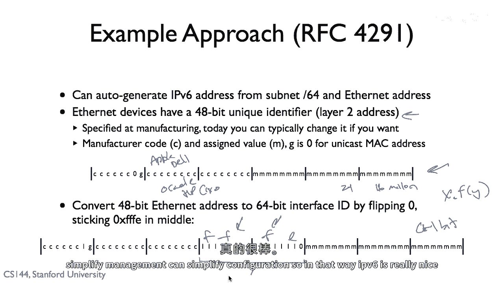

# 【计算机网络 CS144】斯坦福—中英字幕 - P92：p91 6-8 IPv6 - 加加zero - BV1qotgeXE8D

另一种IP地址类型是互联网协议版本六或IPv6，P，V，六，所以被称为，IPv6的目的是，P，V，最初的四地址设计是为了允许你将多个不同的网络连接在一起，因此，提供这种全球唯一标识符的私有网络。

这将在许多不同的网络中都可以使用，嗯，但是，尤其是最近出现的一个问题是，那里i的地址空间只有3个两位，P，V，所以，只有2个两位的i地址可以转换为3个两位的地址，所以。

2个两位的i地址可以转换为3个两位的地址，P，V，或大约4亿个地址，在当时，互联网只有六十个节点的时候，这看起来是巨大的，但现在，实际上，它是一个限制因素，总的来说，出于各种原因。

在任何这样的编号方案中，你看电话号码，等，或者使用率永远不会是百分之百，所以实际上，IP地址的利用率，V，基于四地址的利用率大约是35%，我们只占IP地址的35%，V，任何时间都有四个活跃的地址。

而且这里的挑战是，如果你没有IP，V，地址，那么，就有，你知道，有一种方式可以与IP地址通信，"四"，你需要一个IP地址，我，"V四个地址有iP"，"另一侧需要一个地址来发送IP数据包"。

"因此意识到可能存在这样的不足"，嗯，"地址的IP地址稀缺性"，再加上人们在市场上看到的一些巧妙的东西，在1994年，一项对新一代互联网协议的改进工作开始了，被称为IPv6，P。

IPv6或互联网协议版本6，IP的基本协议，IPv6在1998年发布，RFC2460，然后有一段长时间的停滞期，但是，我，你认为，1998年，嗯，这是，你知道，就在几两年前，在首次。

com繁荣和泡沫之前一年，互联网开始起飞，但远非地址空间即将耗尽的p之前，工作停滞，但是，兴趣增加，在2003年和2006年这个时间框架内，人们开始更好地理解1994年IP协议面临的挑战，IPv4网络。

重要的是，什么是不重要的，我们如何使用IP，P，V，六地址基于当前的口语化和设计，嗯，所以今天，IETF内部实际上有一个强烈的推动力，以及多个政府采用IP，P，V6，你可以想象。

特别是在增长连接性非常显著的国家或地区，例如，中国，嗯在那里，IP的稀缺性，P，V，四地址可能是一个更大的关注点，因此，今天有一大力推动将IPv6部署，V，六已经在整个互联网上广泛使用，所以。

IPv6地址看起来什么样子，那么，IPv6地址是什么，P，V，六地址，所以IPv6，与其局限于2到32位地址，IP地址有128位，所以这绝对巨大，2的128次方，所以大约是3点，4乘以10的38位地址。

这意味着你可以有两个1i，P，V，世界表面每平方英寸有6个地址，所以至少以i的想法，P，V，六地址将用于命名设备，嗯，只要我们每平方英寸的设备少于二十一个，嗯，我们就能至少承受，嗯，在地球，当然。

这些地址可能会被用于更多的事情，但是，但是仍然，一般来说，一个，I，P，六位地址被分成两部分，有子网前缀，子网前缀，这是说长度，并且在那个子网中，接口的ID是，128减去n位长，所以。

你可以把这个想象成一个Cider地址或Cider类，其中，网掩码描述了网络标识符是什么，然后，在那个子网中的所有节点，你现在真的不想写128位地址，十六，个小八位，嗯，他们经常有大片的零和重复区域。

因此我，P，V，六个地址的写法与ipv不同，在，我p，V，四被写成一系列的，嗯，周期性狂躁症，嗯，整数值，嗯，我，P，在十六进制中写了六个地址，嗯，作为八个十六位块的形式，所以这里有十六位。

这是两个数字十六进制，有两个零，零一，嗯，这里是第二个，这里是领先的这里，零在这里，它已经被设置为零四七轻，零八，零六，一：九，如果你有一段很长的零，你可以省略其中的一个零，用：所以这实际上是在说。

这是我们的第一个块，这是我们的第二个块，这是我们的第三个块，这是我们的第四个块，这是我们的第八个块，第五个，第六个和第七个都等于零，对，所以如果我要完全写出这个地址，你看到两千零一：七十：八，八。

零六d：一，零，零，零，零九，在这里有一个前缀六十四，说明的子网是六十四，最后六十四位表示，嗯，节点的实际地址，在这种情况下是嗯，你也可以，如果你想在我的pv六地址中使用HTTP在URL中。

嗯说在你的Web浏览器中，你可以这样做，把它放在括号中，这句话的意思是联系这个节点的IP地址，V6地址，端口80和IP地址，在URL中，我的意思是，也有可能，如果你想写低32位的IP地址，V4。

这是一个IP地址，V4地址，这是因为这是一种使IP地址的方法，V4地址可以从IV6地址访问，如果你有一个领先的，嗯，96，嗯位表示这是一个IP地址，V4地址，然后你将IP地址添加到末尾。

所以我们有这些巨大的128位地址，这些地址允许我们添加更多的设备到互联网，目前你怎么分配它们，所以你看PV4，你有Hannah和我可以，并分配8个，Ri拿走8个，16百万个地址的块。

并将其分配给公司或组织等，正如您所问，因此，实际上如何分配IP地址V6已经经历了几次迭代，IP，V，六地址，那些人有了更好的经验和精炼，例如，这个RFC的第一个版本，377，说通常你想要给人们48。

有时你想要给他们64，非常非常罕见给他们一个斜杠，128，好的，所以这将是，嗯，48位标识网络，80位给这个，然后他们可以使用接口ID，我们有时得到64或64，表示接口ID。

偶尔你基本上有单一的128位，嗯，只是为了给一个人分配一个地址，嗯RFC，六一七七，经过多年的经验，它，嗯，这不是个好主意，嗯，所以你至少想要分配六十四，我的意思是，你不想让六十四超过那个。

你不想分配一二八，所以分配六十四，或者也许六十s，即使你知道五十六按需分配，节约就是四十八比几乎任何人都需要的多得多，有很多情况下，人们需要超过六十四，所以你可以分配它，嗯，然后有点像我p。

V四当你去区域互联网注册时，你问他们要一个地址块，他们会问你要几个，他们会根据是否需要决定，如果你问，比如对于斜杠，嗯，所以你要一个斜杠，嗯，二三，他们会决定你是否真正需要那个数量的地址，在这个情况下。

嗯，512个地址，嗯，今天一样可以决定分配的大小，所以你得到一个六十四，你得到一个六十，你得到一个五十六，等等，太好了，我们有这种分配的方式，我p，V四的i p v六地址，嗯。

那么我们如何实际获取i p v六地址，如果你看像dhcp，嗯，你知道基本上你需要请求一个i，P，V，四地址，而且它独立于任何其他东西，但是i，P，V，六地址空间是如此之大，它可能，你可以做很多事情。

并只简化配置设备和它确切做什么，所以结果证明，如果你有一个六十四个子网，你知道你的组织有一个六十四，所以，六十四位子网或网络标识符，然后你可以自动生成一个你自己的i，P，V。

六地址仅从这个子网标识符中产生，因此，以太网卡假设如此，使用以太网，这基本上是今天几乎每个人都在使用的，以太网设备是四十八位，它们有一个四十八位的唯一标识符，这是他们的地址层，识别。

在实际生产中指定设备，它被烤入卡槽，通常你可以编程它，但它被烤入卡槽，因此IP地址，以太网地址看起来像这样，其中包含制造商代码，说，哦，这是由制造的，由苹果制造的，嗯，或者是由戴尔制造的。

或者是由甲骨文制造的，或者是由惠普或思科制造的，所以这些代码是一个组织发出的，然后当一个你知道的组织需要代码时，它可以使用较低的，嗯，二十四位来基本上产生一千六百万台设备使用那个代码，如果它是新的代码。

它会得到一个新的代码，这里的零是用来表示未转换的，不擅长，G是零，并且有一个单播MAC地址，所以你做的就是取这个以太网地址，这个四十八位以太网，一个唯一的标识符，然后你进行转换，你基本上添加一些一，嗯。

在中间，嗯，你翻转零，或者你翻转零，然后你添加一些fffef，所以fffef放入中间，嗯，然后你可以得到一个六十四位，Uh 标识符，所以如果我知道我的组织的64位子网ID，让我们假设它是x。

并且我知道从我的硬件卡中获取的以太网地址，那就是，嗯，你知道为什么，我可以然后取y，把它通过这个函数，现在我的i，P，V，六位地址仅仅是在这些后六十四位位中的前六十四位位。

因此这在rfc四十二中有所规定，九十一，所以这里是一个例子，说明你有一个多大的地址空间，并且地址空间的大小是一百二十八位，实际上这给你在分配地址方面提供了很大的灵活性，所以例如，你可以指出一件事。

每一台以太网设备中都有相同的两个字节，你不是，你不会重复使用它们，因此，从某种角度来看，这是灵活的，因为我们希望除了以太网之外还能做其他事情，我们只要确保不匹配这些位，那么我们就可以生成一个i，P，V。

六地址，不会和互联网设备碰撞，嗯，但本质上，仅仅是那无尽的地址数量给了我们很多灵活性，并且可以简化管理，可以简化配置，所以从那种方式，我，P。

