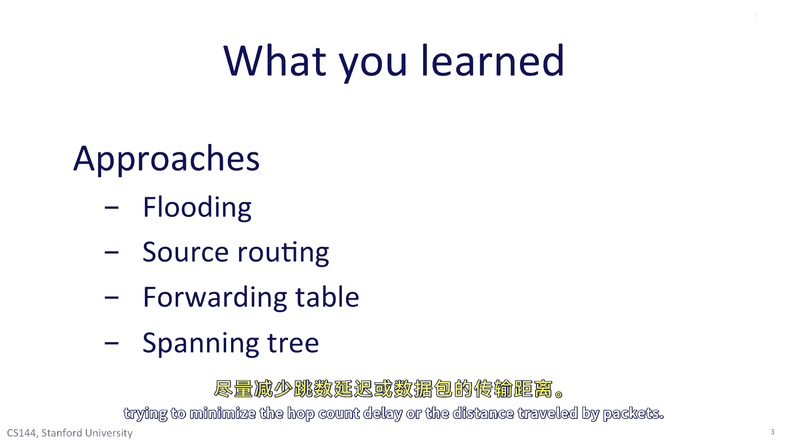

# 【计算机网络 CS144】斯坦福—中英字幕 - P93：p92 6-9 Routing - 加加zero - BV1qotgeXE8D

在本单元中，您将学习如何回答以下问题，来自达到达或多播情况下的包的应该怎么做，来自达到达bc和其他终点主机的包的应该怎么做，我们首先研究了路由单播包时使用的四种基本方法，从一个终点主机到另一个终点主机。

首先，路由器可以广播包到网络的所有链接，当包到达路由器时，它将被复制到所有接口，除了它到达的接口，这确保了广播的包最终将遍历网络的所有链接，因此，它将能够到达网络的任何和所有终点主机。

这显然是非常低效和昂贵的，并且需要与防止包永远循环的机制相结合，广播在不确定的时候使用，当拓扑结构改变时，并且我们没有其他方法可以确定我们可以达到其他所有主机，例如，当ospf路由器交换链路状态时。

它们会在ospf域中广播链路状态包，因此，拓扑结构被每个路由器所知道，即使拓扑结构改变，其次，我们可以在源路由中使用源路由，源主机将每个包的目的地放入包的头部，一个跳点列表，包应该通过网络反向传播。

显然，这是可能的，如果终点主机知道整个拓扑，源路由意味着，我们不需要在网络上交换路由表信息，路由器不需要包含转发表，实际上，可以说源路由非常符合强大的端到端原则，我们不应该让网络负担知道所有过路的责任。

但在实践中，源路由很少用于几个原因，最大的原因是安全，网络管理员不喜欢源路由，因为它要求他们暴露自己网络的完整拓扑，以便打开它，以便终点主机可以发送包到任何地方他们想要，互联网设计师认为。

在路由器中维护转发表是一个值得优化的措施，以防止需要将整个最新的拓扑信息分发到所有其他终点主机，第三，路由器可以包含转发表，它们显然今天这样做，而不是依赖源提供路由信息，路由器的转发表包含目的地的地址。

并且指示从路由器退出的接口，为了今天更接近目的地一步，所有的以太网交换机和互联网路由器都使用转发表，路由算法的任务是填充转发表，最后，你学习了如何无源路由算法通常构建一棵扩展树，以目的地为树的根。

它是一棵树因为我们不想有环路，它是扩展的因为它为所有源端主机提供了到达给定目的地的方法，一般来说，互联网上使用的路由算法，如ospf和rip，填充转发表以创建网络中的扩展树。

我们通常构建的扩展树是最小成本扩展树，我们在尝试最小化跳数，计数。

延迟，或数据包旅行的距离，你学习了两种广泛用于构建转发表和路由器的算法，第一种是贝尔曼-福特算法，通常被称为距离向量算法，每个路由器都构建一个从自身到网络中每个其他路由器的距离向量，在连续的步骤中。

路由器交换它们的向量，以便找到每个目的地的最近邻居，在等于或少于最长环路的迭代次数后，拓扑上的自由路径，算法将在每个路由器中定居于一组转发表，这告诉它如何将数据包路由到每个目的地的最短路径。

贝尔曼-福特算法的发展是rip的基础，路由信息协议，是互联网上广泛使用的第一个路由算法，rip的好处是其算法是分布式的，路由器一起构建一个完整的转发表，这在互联网的早期阶段很重要。

当路由器被假设具有非常少的计算能力时，然而，rip在找到正确答案时遇到了许多问题，当网络拓扑改变时，我们看到了所谓的计数到无穷的问题，在这种情况下，坏消息传播缓慢，并使用了如毒死法等方法来克服它今天。

rip很少使用，大部分已被ospf取代，和另一种算法isis，ospf基于第二种算法，ra的最短路径优先算法，该算法，假设每个路由器都有计算能力来构建自己的转发表，如果给它一个完整的拓扑。

路由器通过交换链路状态信息来学习拓扑，基本上表示哪些链接存在，一旦有了拓扑结构，就会开始工作，每个路由器都会开始计算自己的转发表，以便能够达到网络中的其他端主机，算法由于其简单和快速而显得欺骗性。

ospf在今天的企业和学院校园中广泛使用，除了rip和ospf，我们开始研究路由的其他四个方面，你学习了互联网如何使用层次化路由将路由分解为更易于管理的部分，本地控制的问题，每个自治系统。

或者根据选择的域间路由算法在内部路由数据包，例如，斯坦福在校园内使用ospf，正如使用bgp所需的，边界网关协议，以便与其他互联网上的自治系统交换路由信息。

bgp是唯一被批准的自治系统之间交换路由信息的方式，在今天的互联网上，基本上每个as都向其邻居广告其邻居，数据包将能够到达互联网上的每个 prefect，路径是s集的集合，包将在途中通过。

我们学习了如何每个bgp路由器都可以使用本地定义的策略来决定哪条路由，接受和用于路由包的广告，你也简要了解了多播路由，多播路由是网络中添加的优化，以避免源将包多次发送到一组目的地，九十年代。

多播非常流行，因为它被认为是许多如互联网电视这样的应用将使用多播分发，尽管你在视频中学习了许多许多发明和标准化的多播路由专辑，它们今天并不广泛使用，这是因为大多数应用程序和服务，如视频流媒体。

为我们提供了一种便利，即在我们需要时以单个，单播连接流媒体我们想要观看的内容，大多数时候，观看同一视频的人太少，以至于在网络中优化它值得支持，最后你学习了关于生成树协议的知识。

这并不是真正的互联网路由协议，因为它是乙网网络用于创建避免创建路由环路的机制，生成树协议允许一组交换机构建一个单一的生成树。

