# 【计算机网络 CS144】斯坦福—中英字幕 - P95：p94 7-1 Physical and Link Principles - Shannon Capacity and Modulation - 加加zero - BV1qotgeXE8D

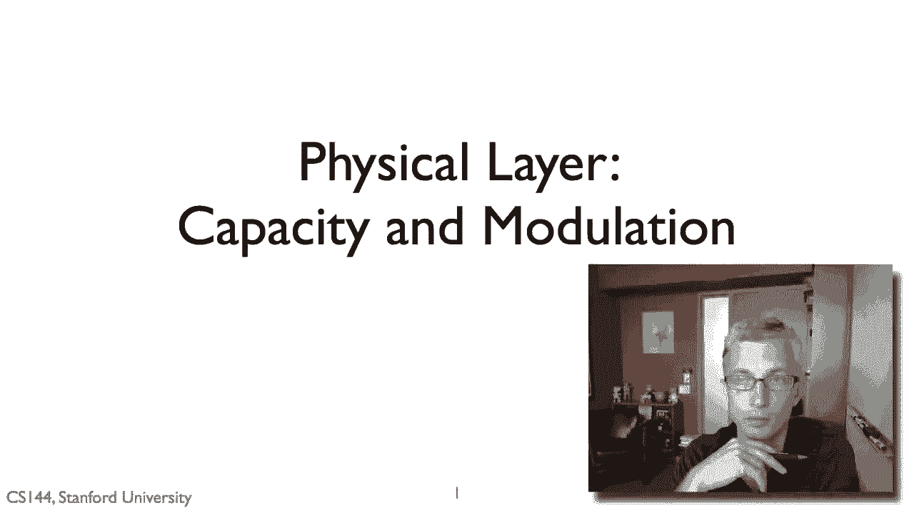

所以在这个视频中关于物理层的部分，我要讨论两件事，首先，容量，也就是我们如何确定一个给定的物理层可以支持的比特每秒，然后，调制。

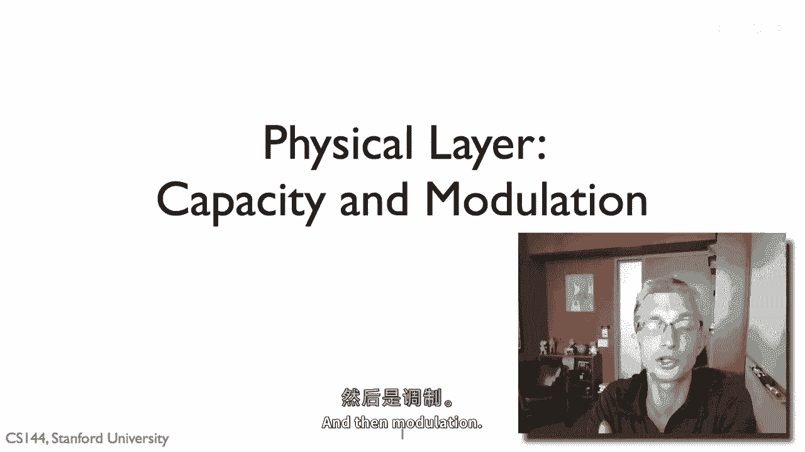

你是如何将这些比特在介质本身上表示的，结果发现，一个给定通道的信息传输有一个理论上的限制，或者换句话说，通道意味着你将你的信息放置的介质，这个通道可以是说一根线或无线的，嗯，它可以是声波。

你想要的任何东西，我，这只是一个用来谈论的术语，嗯，信息是如何被传达的，并且由香农所说，这个限制被称为香农极限，在克劳德之后，香农，嗯，谁建立了它，所以，如果你看一个给定的通信通道，在特定的假设下。

这些假设往往成立，有一个非常好的近似值，可以给你提供一个关于，什么可能是什么，通过特定通道的通道容量或每秒可以发送的位数是b底，等于两个对数一加上信号与噪声比，其中b是你通信的带宽。

这就是你可以使用这些频率的范围，假设我们在做这些事情，正弦波，等等，s是信号强度，所以信号有多强，嗯，当它到达接收器时，n是噪声，所以任何接收器都会有一些噪音，就像当你在听时，你可能觉得你听到寂静。

但是，有些声音太微弱，以至于你听不到，这是因为那些声音在下面，本质上是耳朵的噪音敏感度，或者如果房间里有白噪音发生器，它可以使听东西更加困难，因为存在這個，嗯，噪音，因此，所有通信设备都有噪音，嗯。

常常是由于硬件的熱力学性質，他们只是漂泊的电子，嗯，来自热效应，因为进入系统有一些噪音，当你工程它们时，这是一个大的事情，你怎么降低噪音，嗯，所以这里的基本观点是，我们发送的数量与带宽的数量成正比。

就像，我们可以使用的频率块有多大，然后信号与噪声比现在如何，如果我们想要更高的信号与噪声比，它就是信号除以噪声，它需要你或者你有更低的噪声，这可能真的很昂贵，嗯，它是，你知道。

制造出噪声更低或信号更强的硬件更困难，它需要信号更强大，例如，为什么当你的手机上有更多的条时，嗯，数据信号与噪声比值提高，所以传输速度更快，因为信号与噪声比值更高，嗯。

结果发现为极高带宽构建硬件并不容易，所以，带宽极大的信号实际上非常困难，所有这些复杂性都发挥作用，所以，你不能轻易地构建一个具有任意通道容量的通信系统，嗯，通道容量，总是有一些工程问题会涉及到。

这就是为什么我们突然看不到，嗯，你知道，一个太比特，以太网。

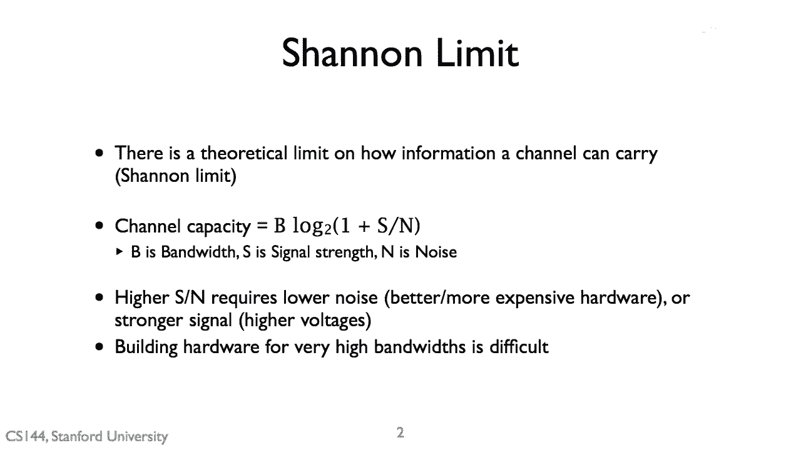

但本质上我们在谈论一个通道的容量，在谈论带宽和信号，噪音，你可以这样想，这就是我们通常如何表示信号的，就是以模拟信号的形式，所以想想正弦波，嗯，当我们谈论正弦波时，这里有一个简单的，这里有一个简单的。

嗯，我们有几个关心的属性，他们将在剩余的部分和一些未来的视频中讨论，视频，第一句是振幅的大小，所以这就是，嗯，所以振幅，嗯表示实际的理解方式是嗯，它的音量，信号强度，音量，信号强度，嗯，第二属性是波长。

所以这些波有多长，所以光速大约是c，你知道，在真空中大约是每秒一英尺，所以这是一个好的粗略估计，所以一，嗯亿，嗯，英尺每秒，嗯，所以如果，例如，我正在发送一个信号，其波长是一。

这将意味着它的波长是一英尺，因为波正在每秒一亿英尺旅行，这意味着必须每秒有一亿个波，因为波正在每秒一亿英尺旅行，波长为一英尺必须每秒有一亿个波，所以这给了我频率，所以每秒期待多少波，所以一亿。

嗯每秒变成一吉赫兹，所以一吉赫兹，在这个电磁学中，一个波是，这只是光在更低频率下的情况，一个一英尺，一个一吉赫兹的信号大约有一英尺的波长，所以今天的wi fi，例如，运行在2。4，或5吉赫兹左右，嗯。

所以这些有波长，你知道大约是，你知道，嗯，嗯，嗯，五英寸，嗯，你知道，两点，四英寸，所以我在这里谈论的是频率，嗯，给定波的波长，给定波的振幅，但结果是我们发送信号，你不使用单个频率。

你实际上使用频率的范围，带宽是我们使用的频率范围的大小，例如，如果你看一个802。11b Wi-Fi标准，它是旧的，它将用作一个常见的例子，因为它是简单的，因为它在802。11b中是旧的，如果你。

使用过它，你需要选择一个频道，所以从一到十一，嗯，人们经常使用十六和十一，嗯，每个频道都是二十兆赫兹宽，所以当你看802。11b的频率图时，你可以看到所有这些频道，你知道这里是一这里是十一。

它们占据了大约二十兆赫兹的频率范围，像这样嗯，所以你实际上使用频率的范围，我会告诉你这是为什么会发生和如何发生的，最后，嗯，我们有一个叫做相位的东西，所以这实际上是波形内的波的时间，所以这里我们有。

这里有一个波，它在这个特定的相位，在哪里峰值在这里发生，让我们叫这个t0，当然有可能发送，嗯，这个相同的波，但在不同的相位，例如，我们可以发送它像这样，它是同样的波，但相位偏移了一半，嗯，嗯，波长。

因此是一百八十度，所以结果就是我们所做的控制事情，正如我们将在第二个看到的那样，我们控制波的方式，我们做的事情，即发送信号，涉及改变波的振幅，改变波的频率，以及改变这些波的相位。

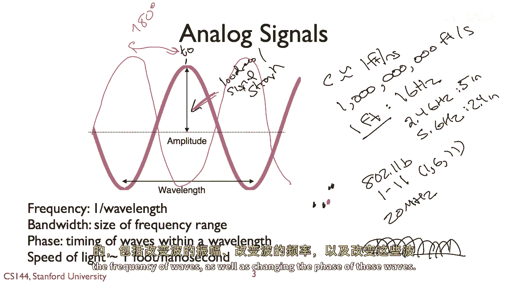

但本质上，这些波在系统中一直在进行，所以，考虑到我们正在使用波，有很多种方式可以表示位，嗯，其中一种最简单的方式是我们称之为幅度调制键控或ASK，这个过程被称为调制，我怎么把一个信号或特定的数据位。

然后调制我的波形来表示那个信号，所以这里嗯，来表示那个数据，我怎么调制信号来表示数据，所以这里为例，我有一个幅度偏移键控，当一个人有一个小幅度时，对不起，零有一个小的幅度，并且一个有更大的幅度。

所以我想要发送一个零，我发送这个小波，我想要发送一个一，我发送这个大波，另一种方法，你可以使用被称为频率移位键的技术，其中你使用两个不同的频率，所以这里是一个一，这里是一个零，零恰好是高频，一是低频。

然后当我想要发送一系列的零和一时，我只需要将这些频率来回移动，哦，我正在发送一一一，所以他比零更长，零零零更短更短更短更短。

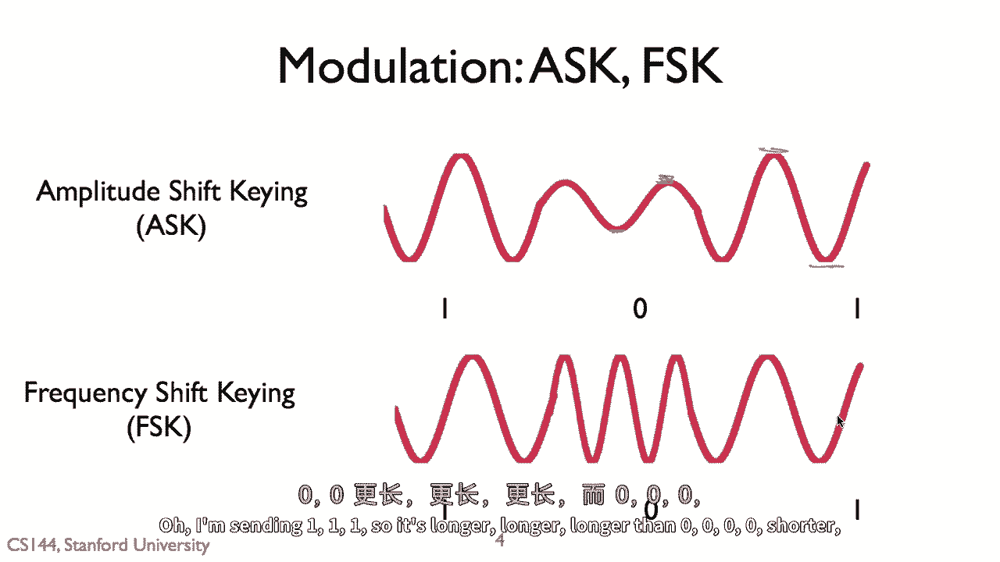

另一边可以解码这些，然后找出正在发送的位，所以幅度移位键发现非常，嗯，它被广泛使用，尤其是在有线网络中，原因是当你有一个线，你的中间是控制信号，你把它放在一边，在另一边稍微降低，但不是通过很多线缆。

电阻不大，这就是他们使用它来传输电力的原因，嗯，因此，幅度移位键调制在有线系统中广泛使用，因为它非常简单，而且效果很好，所以，今天的大多数有线以太网都使用幅度移位键调制，嗯，例如，嗯。

一百个基础t和一千个基础t是一百兆字节，千兆以太网，嗯，使用被称为pam五的东西，这意味着五个幅度调制级别，它们被称为脉冲，你在发送这些不同幅度的脉冲，嗯，所以可以想象这些基本上作为电压减去二，减去一。

零加壹，嗯加贰，所以您在这些电线上发送不同电压，结果十进制的GB或十吉字节，在那种即将采用的一种标准中，嗯需要使用嗯，更多的幅度级别以获取其所有数据，所以它使用PAM十六，所以十六级别，嗯。

而不是 uh 五。

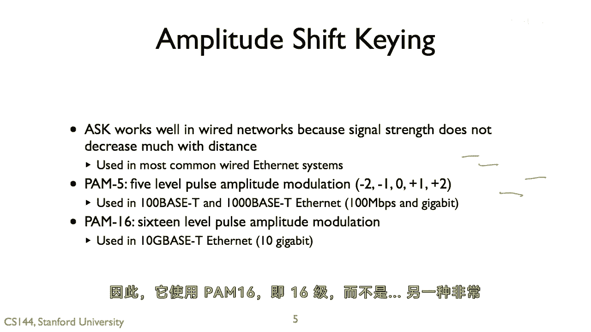

所以另一种非常流行的调制形式，叫做相位移键控，所以与幅度移键控不同，你是通过波或频率移键控来调整信号的，我们使用不同频率，在相位移键控中，你调整波的相位，所以这里，例如，让我们假设为零。

这是零度的一个阶段，但是然后发送一个一，正如你看到我的阶段被反转了，这是一百八十度的一个阶段，对吧，或者是负一百八十度，两者是一样的，然后到这里再次发送一个零，我开始以零度的阶段发送。

所以相位偏移真的很有用。

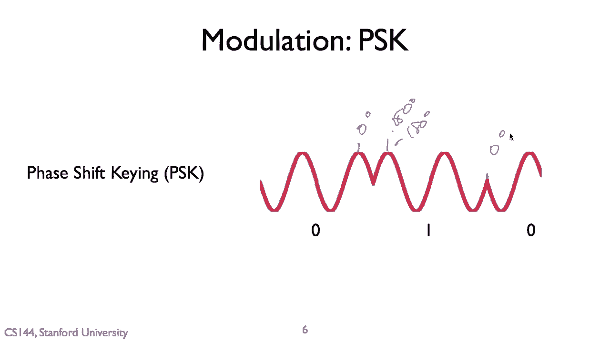

当你的频道，当你的媒介是如此的，你可以有显著的信号强度变化，所以国王的幅度，你需要能够找出，所有不同的幅度都在幅度中如此，当实际的衰减与信号强度稳定时，就像在一根很好的线中，但是例如，在无线情况下。

幅度稍微困难，相位可以更容易，所以使用相位键调制的情况下，它是DSL，数字用户线路，沿着长电话线延伸，在那里可能存在天气和电线摇晃以及连接不良的情况，但是实际上很长的线，调制解调器就是正确的。

那些通过整个社区伸展的，无线系统，所有这些都使用相位，键调制，我仍然也使用幅度，但它们不同于，你知道，有线以太网，所有这些系统都使用相位，所以有一种相位键调制是二进制相位键调制或bps k。

所以你基本上有两个相位，嗯，零，零度到π是一百八十度，所以在那个之前的图片里，你正在发送这个相位，让我们假设这是零，或者你正在发送这个相位，这是假设为180度，这是180度，这是零，零，所以，例如。

bps k在8到11b和更旧的Wi-Fi标准中用于低速，1兆比特和2兆比特/秒，还有正交相位键调制，KpQpk，现在我们有四个相位，嗯，正如你可以想象，就像我们有零，一百八十度，使用q pk。

我们拥有零，九十度，一百八十度，二十七或零除以二派，分别增加三派除以二弧度，因此，q ps sk也在这个旧的wi fi标准中被使用，A211b，它在更高速度下使用，五点，五兆比特每秒和十一兆比特每秒。

现在，从这个中应该出来的一件事是，我们可能使用q psk的原因，相对于bpk或pam十六，而不是pam五，是因为对于给定的信号，我们正在发送，我们可以发送更多的信息，例如，bps k。

我们每个发送的波形携带一个比特的信息，是零还是二派，相比之下，对于q psk，我们每个在波形上发送的符号，我们物理层发送的每个小数据块包含两个比特，是零、二派除以二或三派除以二。

你可以说这些表示为0001，0101，0110，0111，0101，0110，0111，这并不是实际做的方式，但是，想法是，通过这些更密集的表示，你现在正在发送更多的信息单位时间。

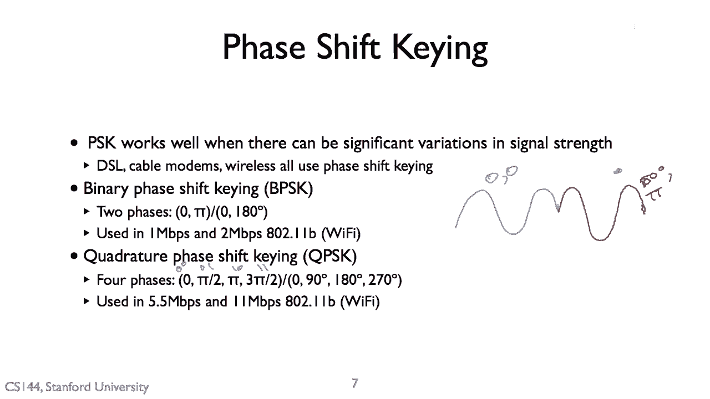

为什么相位键调制非常受欢迎，实际上，它们发现它非常容易改变相位，例如，在这里，如果我只有，说零度的载波波形和一个，你知道，负九十度的载波波形，那么任何这些两个波形的线性组合都允许我创建任何中间频率。

例如，在这里，如果我将零度和负九十度结合，只是添加这两个波形，我将得到负四十五度，这如果是一种，你知道，一对一的等式，如果例如，我没有零点五一，那么我们将得到稍微接近于，嗯，到零度的右。

假设这是负九十度，这里是零度，对吧，同样，如果我做，嗯，而不是一一，如果我做负一一，所以这是负九十度，零度，那么，我们看到的就不会是这两者之间的波纹，波纹将是，波纹就在这里对吧，以这种设置。

它将是加上四十五度，所以，只有这两样东西，你就可以结合并创建你想要的任何中间频率。

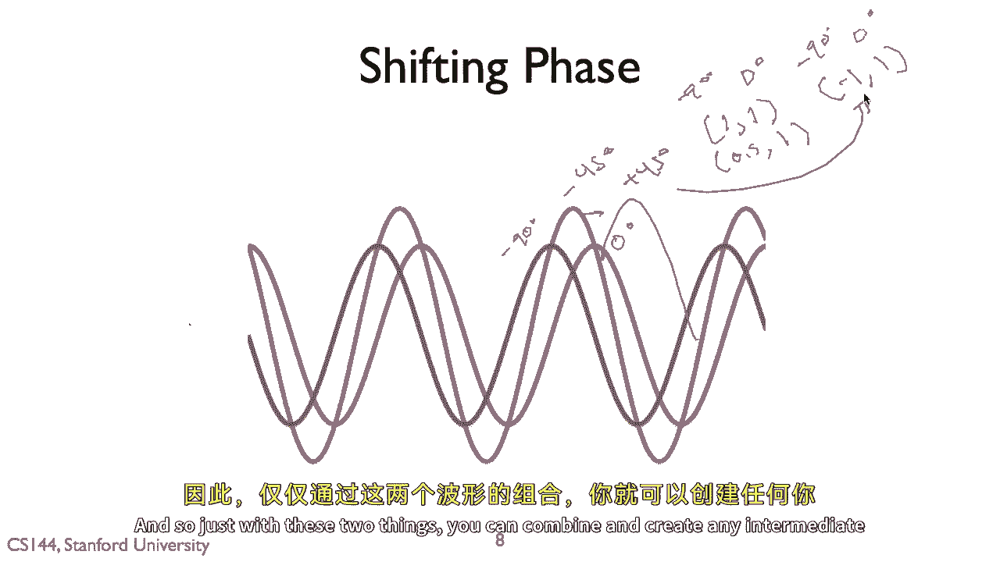

这在硬件中非常有用，实际上，这就是硬件如何使用被称为iq调制的东西来实现的，嗯，所以i代表相位成分，所以，当是零度时，Q是正交成分和减去九十度，这只是一种复杂的说法，意思是嗨，如果我们想要创建任何任何。

嗯，从零到你说的三百的相位，你知道零和基本上等于零，环绕着嗯，我们可以将这些i和q与一些线性因子结合，得到那个，嗯，所以例如，让我们看看那两个，我们之前有bps pk和q这两样东西，pk。

所以bps pk有两个阶段，零度和一百八十度，那些井的iq值是多少，所以对于零度，它将会是一逗号零对吧，我们想要完全零度的一百八十度，嗯，这是与零度相反的，正确，如果你仔细想想，你知道在单位圆上。

假设这里是零，这里是一百八十度，所以正如这里我们有正一在这里，我们将有负一，所以负一，零为q pk，我们将有四个相位，让我们说零二七一，八十九，所以再次，零是要变成一逗零，但是现在是二七十。

二七十在这里对吧，所以这里是减九十二，七十，所以二七十是要变成零逗，逗零和九十是要变成零逗减一，所以我们只需要通过改变i和q的缩放因子就可以，创建任何相位，我们想要一个信号，这就是硬件上看起来的样子。

是我们有这些iq值输入这些数字值，然后我们有两个载波频率，最后我们将它们相加，以在rfs上输出，这就是从天线出来的东西。

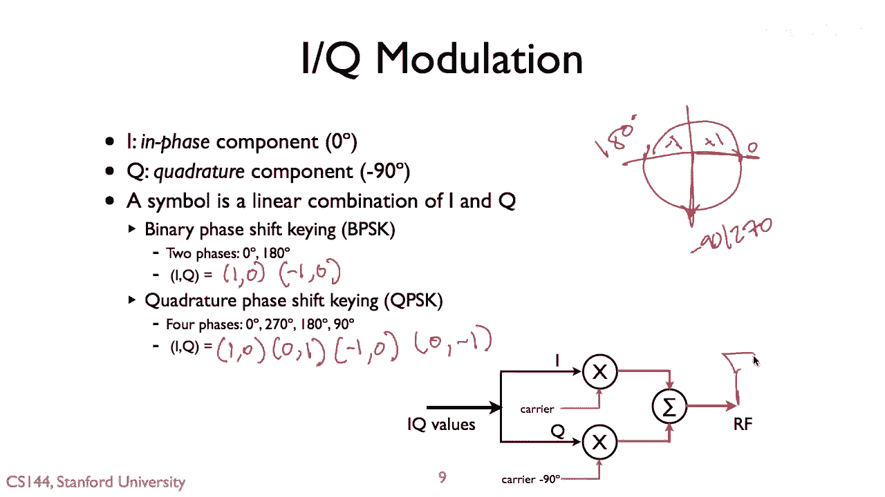

这实际上是如何使用iq来构建硬件的，这些iq值，但真正有价值的，以及我之所以要谈论iq星座的原因，是因为它们实际上非常适合一种非常简单和易于理解的，图形表示，直到物理层，所以我认为。

如果我们将这些iq值表示在一个二维网格中，对吧，我们可以使用被称为iq星座的东西，这个二维图在这种情况下，在这两个二维图中，向量的角度代表信号的相位，就像这里说，我们有45度，在这里我们有135度。

然后向量的长度代表信号的幅度，所以如果我们看像on off keying这样的东西，你可以发送或保持沉默，我们看到这里有一个幅度为一，幅度为零，有更多的on off keying，对吧，没有相位的变化。

幅度移位键，我们有两个不同的使用的幅度，看这里有一个一和一个零，我们只是在改变幅度，我们实际上没有改变相位，我们只是在改变值，记住，bpk有兩個相位，零和一百八十度，这就是我们在这里看到的。

所以这里说一百八十度，代表一个一，代表一个零，说代表一个零，q pk也有四个点，与这四个不同相位，我也可以旋转它们并说画成这样，但更容易看到，当有这四个角时，这是一种表示无线信号的方式。

这是一种漂亮的图表表示，当我们开始谈论信号和噪声时，那些比例开始，事情开始变得稍微有意义，这将是一个对正在发生的事情非常清晰的描绘。

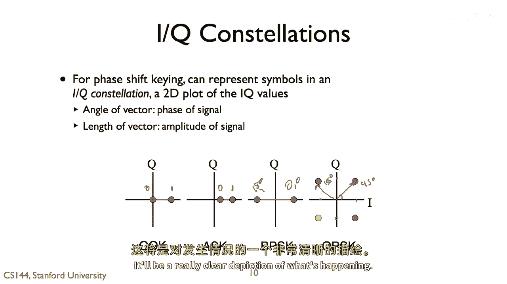

所以请记住，我们可以从零和负九十这两个极端阶段中表示出任何中间阶段。

这只是那两个的线性组合，在链路层某个点，我们有位，位正在进入，我们有一些包，你知道来自网络层，我们有一些，嗯，在链路层我们有帧，有一些零一零一零一零一的位被组织成字节和八位，但是，但是到物理层。

我们未必不能传输整个字节，它可能只是我们一次只能传输几位，所以在物理层我们谈论符号，符号是物理层可以提供的传输单位，我们经常谈论链路层的事情，我们谈论，哦，我们添加一个字节，但这可能不是物理层的边界。

原因是我之前说过的，一个符号可以包含多个位，bps有每个符号一个位，有两个阶段，qps有四个阶段，有每个符号两个位，但你也会遇到这种情况，比如 pam 五，它在一百兆比特中被使用。

和一千兆比特以太网在 cat5 上，五电缆，这里有这五个电压水平，你可以使用五种不同的象征，甚至这不完美地映射到比特的数量上，五个象征大约等于两个比特，重要的是要理解。

尽管我会把链路层放在物理区域的下方，一个比特序列，在下层物理层会发生转换，将那个比特序列转换为符号序列。

最后我谈到了幅度键，我谈到了 uh，相位键，你现在使用的这种方法，非常 非常常见，你看到它，几乎所有现代通信系统都叫做 quam，这实际上代表四相幅移调，或者基本上这意味着相位和幅度键，同时，嗯，然而。

询问国王的幅度仅使用幅度和相位偏移量，国王仅是相位和量子，我们使用两者，以便给您一个例子，这种方式通常被谈论，说十六量子意味着我们有十六种不同的象征，因此，我们可以表示符号，我们表示四个位，两个五。

六量子意味着有256种不同的象征，意味着我们可以为每个符号表示，我们可以表示八位。

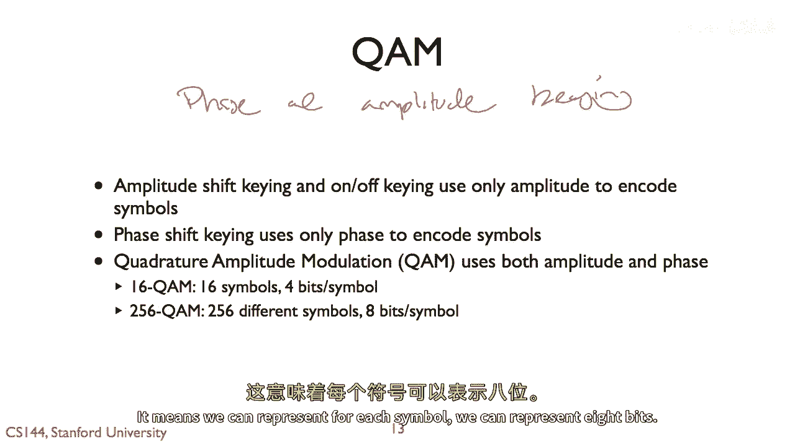

因此，回到iq图或调制图，十六量子看起来像这样，所以这就是星座，在pda中使用的iq星座，这是一个三，G，嗯，数据标准，因此，您可以看到这些值从三三到负三负三，它们映射到不同的位，因此。

我在这里用灰色显示了，i和q的值，所以这里是i的三，q的一，i的三，q的三，我有-一，q的三，q的一，抱歉，然后所代表的是什么，嗯，位在物理层之上，所以这里是一个例子的i，q，十六进制星座。

正如我们可以看到，它在调整，不仅幅度，那就是从原点出来的向量的长度，而且还有相位，那就是从原点出来的向量的取向，这里是一个例子的i，q，在现代三g系统中使用的星座，十六量子，十六种不同的象征。

这里是如何将位映射到这些符号的，所以，例如，如果我想要发送，嗯，一一零一零一零一，我会发送一一零一零一，所以首先发送这个，这将是第一个我发送数字一的符号，然后零一，一零，我会发送，这个符号第二个，所以。

如果我们要深入挖掘，并看看物理层发生了什么，我们将看到一个以相位大致为，嗯，一百三十五度的信号传输，这是一百三十五度和振幅，嗯，让我们假设为x，然后下一个符号将以这个角度发送，对，以这个相位，它是。

你知道的，大约，让我们假设为一百零五度，振幅稍微小一些，对，因为这个向量更长，这就是你在物理层看到的实际方式。

所以今天使用的主要是相位移键，嗯，基本上所有比那宽的都使用相位移键，嗯，通信系统很少使用频率移键，嗯，有一些例子如国家气象服务，天气广播和蓝牙实际上使用它，嗯，在某些形式，嗯。

二进制相位移键基本上由所有wi fi标准使用，嗯，Abg n，它也在y max四相位移键的wi fi中使用，嗯，这种低功率无线如zb叫做八二一五四三g，lte，y max十六相位移键在wi fi中使用。

以及这些数据标准用于移动电话，对于移动电话，六十四相位的移动电话在wi fi中使用，以及lt和y max，所以，你可以看到，存在这些，更旧的，以及更现代的标准，使用更密集星座的那个。

人们已经使得事情越来越快。

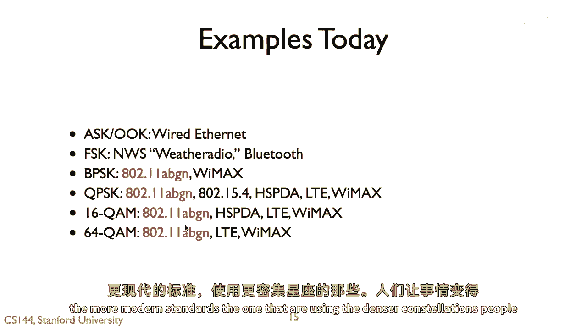

所以，这里有一个概述，你可以以许多不同的方式处理你的数据，然后，将它们以物理介质的形式表示，将它们转换为电压，相位，频率，等等，有线以太网和有线系统通常使用幅度来代表信号对我们，当今大多数技术，嗯。

比如无线技术，或者是在控制较少的媒体上的东西，比如调制解调器，DSL，使用相位移键，或者是相位和幅度的组合，叫做正交四相位幅度调制，你可以用一个线性组合来代表一个qualm符号，实际上，任何这些。

都可以作为一个由两个东西组成的线性组合，在相位组件i为零度和正交组件q为负九十度的地方，这实际上是今天电路如何做的，真的很好，是它给你提供了一个非常好的图形表示信号的样子，以及它是如何控制的。

它是如何调制的。

