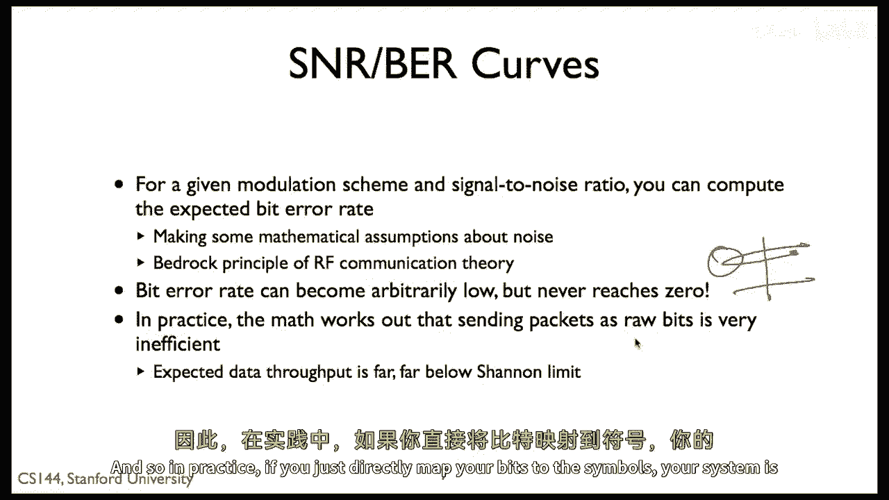
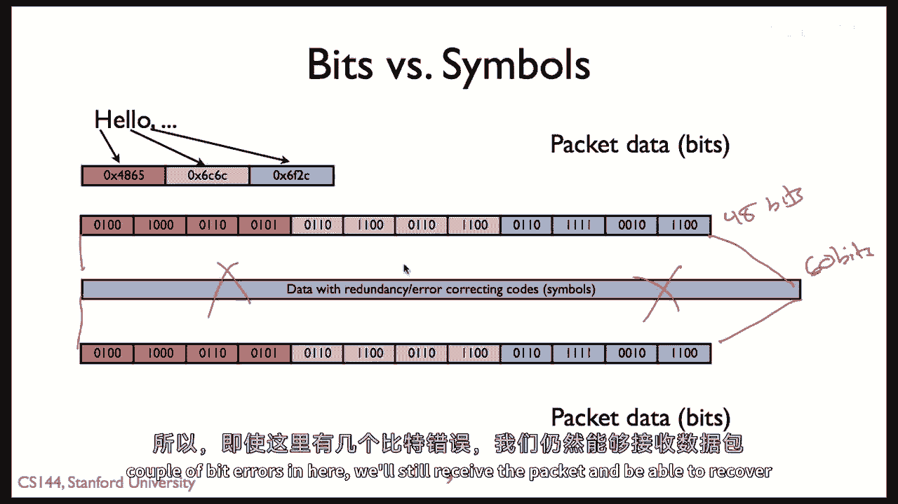
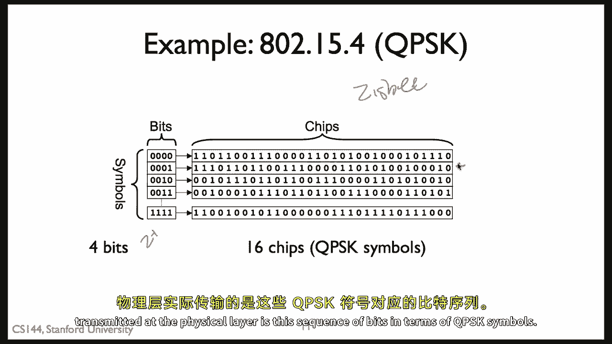
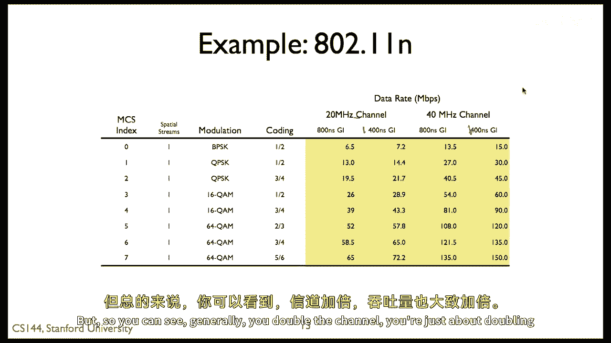

# 【计算机网络 CS144】斯坦福—中英字幕 - P96：p95 7-2 Physical and Link Principles - Bit Errors - 加加zero - BV1qotgeXE8D

所以，在这个关于物理错误的视频中，当我们谈论位错误时，编码，是一种在数据中引入冗余的方法，那就是你可以保护自己免受位错误的影响，所以记住香农极限。

通信的容量由带宽决定，然后，二进制对数的底一加上信号与噪声比，所以基本上这意味着在实际应用中，可用的数据率，可能的数据率由信号与噪声比限制，所以如果你的信号更强，你可以发送数据更快。

如果你的电路噪声更低，你可以发送数据更快，重要的是，这是一个理论极限，即使我们知道我们不能做得更好，并不意味着我们知道如何到达那里，实际上，一些系统今天实际上可以到达那里，我们正在接近。

但它实际上没有说如何做，只是意味着无法做得更好，所以，出于各种原因，你的带宽通常被固定，例如，如果你在未授权的频谱中操作，比如你的Wi-Fi或什么，FCC说，你不能做更多，你不能使用更多的带宽，所以。

系统通常试图改进信号与噪声比，但基本上意味着，如果你的信号强度更高，那么你可以传输数据更快，你可以要么传输符号更短，你可以传输它们的时间更短，或者你可以在每个符号中放入更多的位。

你可以使你的实际星座更密集。

iq星座，在这里我们正在传输这个完美的黑色信号，但是，问题是这个完美的波，因为接收器上有噪声，仅仅是在硬件中。

我们接收到的是更接近这个红色信号的，所有的噪声引入，所以让我们退一步思考，这意味着什么，这对接收器来说会出现什么，所以让我们回到这个十六点星座，我在谈论iq调制和信号调制时展示了它。

这是HPDA 3G数据标准的一个星座，所以记住，我们有这些十六点，每个点都有不同的i和q值，如果系统中没有噪音，那么当信号到达时，它将精确地落在这些点之一，但实际上，系统引入一些噪音并不正确。

所以让我们假设，例如，我们有一些非常低的噪音接收，这样信号强度远高于噪音，那么很好，而不是在这里看到精确的点，我们将看到像这样的东西，噪音可能会导致信号周围有些波动，但从星座上看，信号仍然很清楚。

就是它，同样地，如果我们接收到这个符号良好，可能会有一些噪音，但由于信号比噪音强得多，这些小抖动并不大，而且很清楚，就是它，但如果我们现在在一个更高的噪音环境中，那意味着而不是信号，接收到的信号。

或者我们观察到的像这样，它可能像这样，加上噪声，导致接收到的信号具有不同的相位和幅度，与我们预期不同，由于系统中的噪声，并且本质上，这意味着我们将在某些点上得到您，因此可能会对符号的含义做出错误的结论。

在这些情况下，例如，我们以为接收到的，我们试图接收的零零零零，我们的系统可能认为它是零零一一一，或零零一零一或一零零一零零，或一零一零零，所以这就是位错误如何引入的，它是当你的星座。

它是当信号与噪声比达到如此程度，使得一些符号被误记录或误解，"你可以想象如果我们有一个像斯巴达的星座一样"，"让我们假设这里和这里只有兩個點"，"那么这种程度的噪音就是可以接受的"。

"这不会让我们从这里跳转到那边去"，"但是，对于这个特定的星系密度"。

"噪音之大，足以引入一些位错误"，因此，我们发现有一个关于这是如何工作的非常深入的理论，"并且，什么是可能的，什么比特率是"，"所以可以说"，"根据给定的调制方案和信号与噪声比"。

你可以仅仅通过分析计算出你预期的位错误率，这里有一些数学假设被做出，但这是基础假设，无线电通信理论中的基础原则，曾经为我们服务得很好，在这里，重要的是位错误率可以变得任意低，但它永远不会达到零。

像噪声的行为一样，有可能，尽管非常非常你可能有巨大的噪声峰值，只是一瞬间，那就是那个点，很多事情同时发生，因此，位错误率永远不会达到零，嗯，在实际中。

这种转变的结果是大多数情况下发送包就像发送原始位一样，比如，选择星座，这样你就可以有每个符号的正确位数，然后直接从包中的位直接翻译成位和符号，结果，使用通道的最有效方式往往很少是这种方式。

只是因为存在一个非零的小概率位错误，但是问题在于，当然，是如果你想要使那个概率非常，非常低，低到以至于它不太可能任何位都是错误，那么由于这种方式工作，你将会比一般需要更好，通过优化为这种非常罕见的情况。

即微小的峰值，这可能在任何位说你的话说，你明白，十二千位长或一千五百字节的包，嗯，在符号的实际表现和星座转换的术语中，许多位，绝对棒极了，但你对这个异常值有点过度保护，因此在实际应用中。

如果你直接将你的位映射到符号。

你的系统将远远低于容量运行，远远低于香农极限，因此，在实际应用中，你对物理层的处理方式是，你接收，在这里有一些比特，假设我们有一条消息说hello，所以h e l l oh，压扁逗号。

这些是ascii值，映射到这些比特，这是我们的包，这是我们的包数据，然后做的就是将包数据转换为，嗯，含有一定冗余度的符号，所以需要一些错误纠正码，所以数据包实际上会变得稍微长一些。

从物理层发送比特的数量来说，假设我们有，嗯，四十八位，我们可能会以符号的形式发送，比如六十位，所以有十二个额外的位，我们安排成这样，有一种叫做编码的东西，所以如果那几个位错了，我们可以恢复过来。

仍然可以得到原始的四十八位，即使这里有几个错误。

仍然可以接收到数据包并成功恢复数据，这就是编码，在物理层添加一些冗余性的想法，你可以在任何地方做，但几乎总是在物理层做，所以编码不是物理层的特定想法，是一种提高链路层通量的方法，通过添加冗余性。

你可以保护对几个位错误或你预期的位错误率的保护，嗯，总的来说，尽管你使它变长了，系统的通量确实会提高是真的，在理论和实践中都是如此，这是一个经常被使用的术语是编码增益，它是链路层比特与物理层比特的比率。

如果你听到有人说，比如一半的代码，那意味着，如果我有一个在链路层长度为n的包，我将其转换为在物理层长度为2n的包，或一个三四代码，是每个三比特，所以三比特变成四比特在物理层，我们有这种冗余性。

所以我们可以纠正一些位错误。

这里是一个非常，这是一个非常非常简单的，嗯无线物理层例子，嗯八二到十五但四，也被称为zig，它也在zigbee中使用，嗯二到十五四使用正交相位移键，因此，每个实际传输的符号都有两个位，那么。

八零二一五四代表什么，它是将这两个q pas q pk符号组合成一个四位符号，所以，它被称为，这些四位符号，共有十六个，在每个符号中，都是二的四次方，然后映射到三二，嗯，q pk芯片，所以。

这里是链路层的符号，这里是物理层的符号，因此，我们在链路层取说四个位，并将其转换为三个，物理层两个位，这是十六杯sk符号，因此，如果我说我想要传输一个包，它有零零零一，实际上传输的是什么。

物理错误是这个位序列，以杯sk符号表示。

sk符号，因此，我们可以计算出数据率或符号率，八到二一五四的情况，所以结果就是这样，链路层的比特率是二百五十千比特每秒，你选择的编码率是十六个两比特的芯片，所以那是三十二比特。

物理层在链路层变为四个比特，所以我们有一个八分之一的代码，四个物理层比特变为一个链路层比特，尽管它们以四和三十二的簇出现，基于这个，如果我们在链路层传输二百五十千比特每秒，并且我们有一个八分之一的代码。

我们每秒传输多少符号，八零二到一五四的十六进制数如何快速地调制信号，每个符号都有两个位，这就是这个第八位代码，所以当我们看它时，这是不是物理层，我们每秒传输八次位，所以八次二百五十千比特每秒。

这在物理层等于两兆比特每秒，因为每个物理层的符号都有两个位，这表示八到二千五百八十零二一五九四传输一百万，每秒，或者用另一种方式说，每个符号是一微秒。

所以让我们来看看一种更现代或者可以说是更先进的，嗯，物理层，这就是e o two到十一n，非常合理的最近Wi-Fi标准使用，所以大多数你知道，你今天购买的Wi-Fi设备是一种211n的，因此。

我们发现有许多不同的使用方案，但这只是它们的一部分，因此，你可以看到对于这八个，有各种各样的调制方式，Bpk二进制相位偏移键，正交相位偏移，King十六十六qualm，六十四qualm，不同的编码增益。

所以，一半加一半等于三又四分之一，一半加上五又六分之一，从那里，你可以根据数据率计算出来，这里是实际的数据率，每秒百万比特，这些物理空气支持的不同数据率如下，例如，如果你在使用mcx索引七。

这是对编码系统的一种标准确定，我们可以达到每秒一百五十百万比特，那是如果你在使用一个六十四颗星的星座，并且有一个五，六层涂层，嗯，正如您在这里注意到的，这些是不同的通道，对，请记住。

我们得到的数据不仅仅是信号与噪声比，而且还基于通道，所以，在这里，使用40MHz的第一个40MHz通道，嗯，您可以看到，使用40MHz通道，我们比使用20MHz通道快大约两倍。

我们稍微好一点的原因是因为这些时间值是固定的，嗯，所以这些事情是固定的，我们可以比一半稍微好一点，如果没有时间值，将会直接，嗯，一半，再加上还有一些守卫，但是，你可以看到一般来说是双通道。

你基本上在翻倍，嗯，吞吐量，所以我们要讨论的是关于物理层的芯片，单物理层与位的表示，这是链路层的表示，链路层有很多位，然后将它们传递到物理层，它们现在变成了芯片，物理错误必须处理噪声。

这是真实的物理介质，来自硬件电路的噪声，来自环境等，这可能会导致芯片错误，如果你有更密的调制，那么你可以处理更高的吞吐量，因为你可以代表更多的位符号，但是更密的调制对噪声更不 robust。

因为仅仅符号之间的距离，以及稀疏的调制有更少的错误，所以，一个重要的问题是确切地使用哪种调制，我们看到了一个八零二一一 n，有许多不同的调制被用于四个不同的信号到噪声比，这些给你不同的实际吞吐量，嗯。

所以现在如何将这些链路层位转换为物理位，结果，一个简单的一对一映射很少是一个好主意，嗯，从纯粹的位来看，它可能是最有效的，但是，位错误的概率意味着你想要一些冗余，这很少能让你接近香农容量。

所以你谈论一些叫做编码增益的东西，这是层二到层一的比率，因为层一会在链路层中代表每个位，以多于一个位的层形式出现，你可以从一些芯片错误中恢复，我们看到了一个例子，八零二 of n。

你在这里看到从一半的编码增益到五六的编码增益，在各种不同的星座下，从 bpk，二进制，相位，移位，国王，到六十四 qualms，六十四四象限幅。

