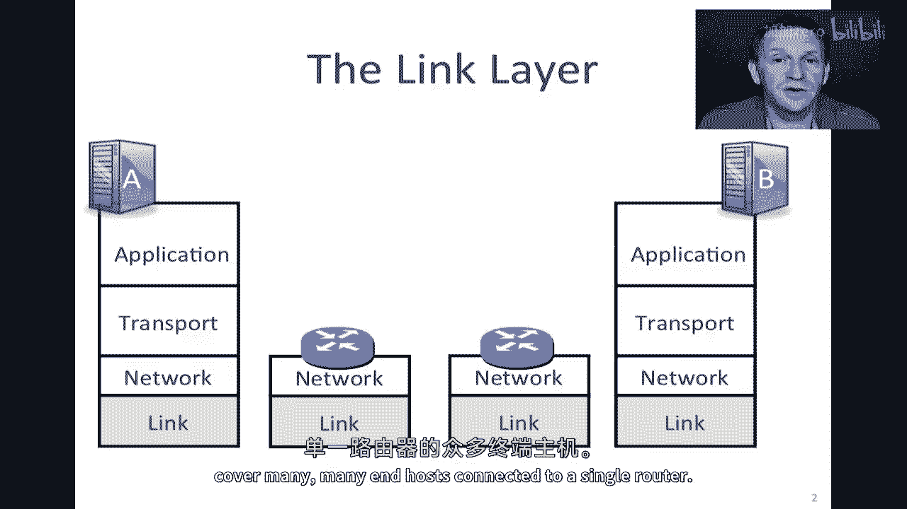
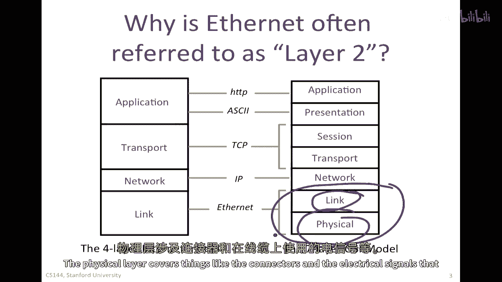
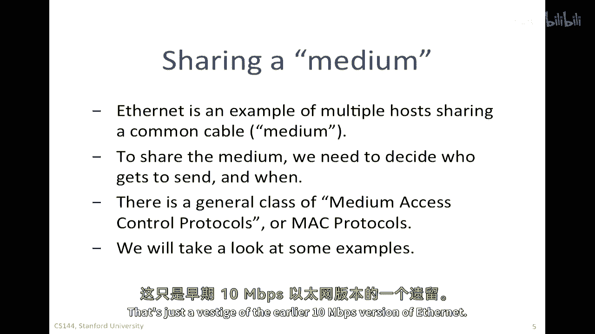
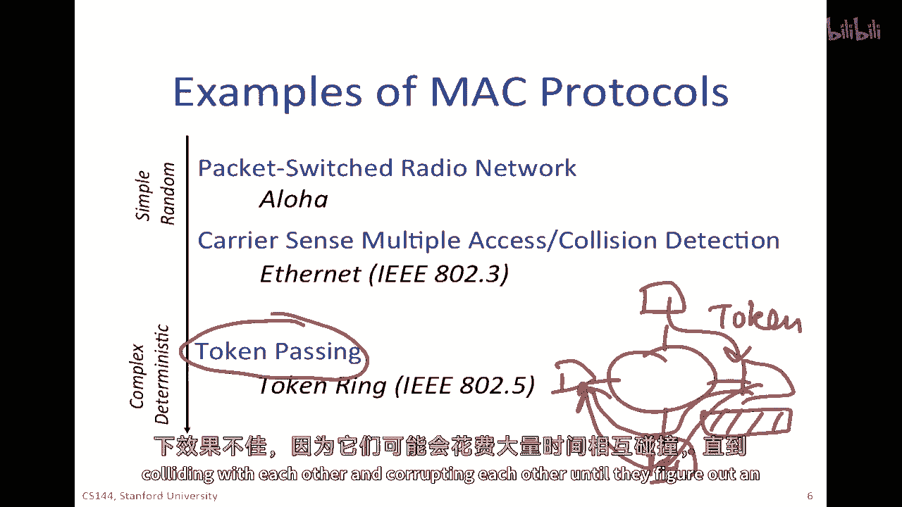
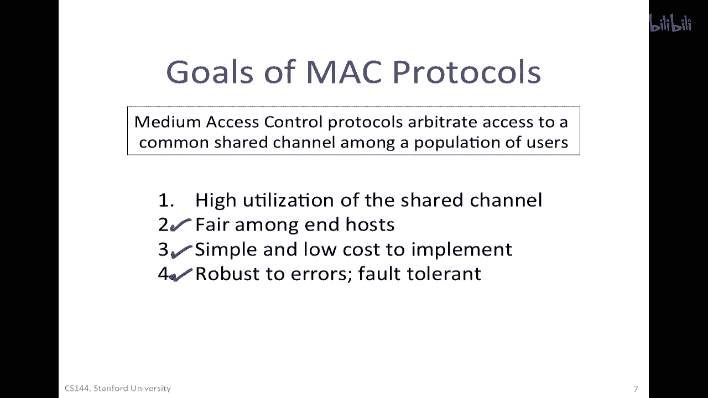
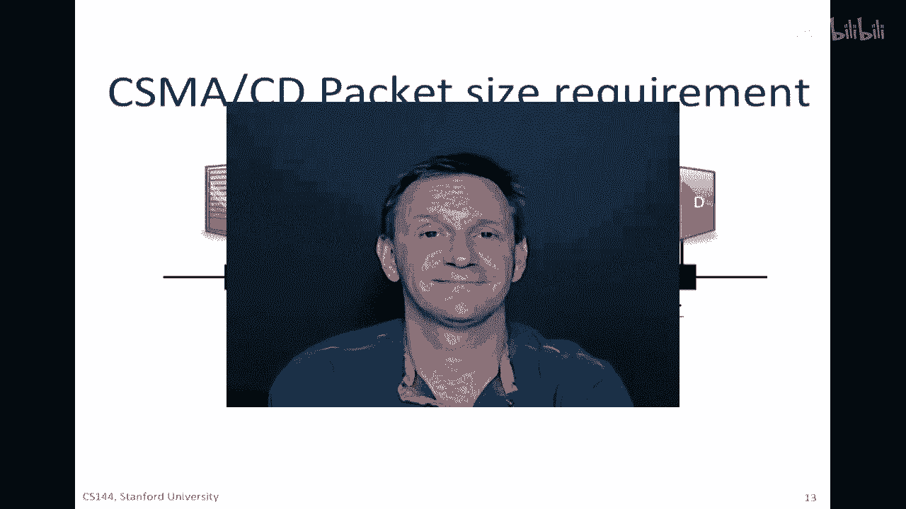

# 【计算机网络 CS144】斯坦福—中英字幕 - P99：p98 7-5 Physical and Link - Principles MAC and CSMACD - 加加zero - BV1qotgeXE8D

当我们今天将电脑连接到网络时，我们通常使用wi fi进行无线连接，或者以太网进行有线连接，以太网是当今互联网上最广泛使用的链路层机制。

所以链路层覆盖了如何终端主机连接到路由器，一个路由器如何连接到下一个，一般来说，我们看到的，IP层的包被封装在一个链路层帧中，大多数情况下是以太网，以便被发送到第一个路由器。

所以在这个视频和下一个视频中，我将描述一种叫做cma cd的东西，这是以太网工作的核心，并且非常深深地融入了原始的以太网，接下来，我将描述以太网如何多年来经历了其进化，然后。

以太网交换如何成为一种非常普遍的方式扩展，扩展链路的范围，以覆盖连接到单个路由器的许多许多终端主机。

您经常会听到以太网被称为第二层，这追溯到我们在早期视频中看到的七层osi模型，而在四层互联网模型中，以太网是最低层，在七层osi模型中，以太网涵盖了链路和物理层，这两个底层，因此。

以太网经常被称为第二层，由于链接，链接实际上只覆盖了帧格式，以及决定包何时可以在电线上发送的算法，稍后我们将看到这一点，这就是csm，一个cd um机制。

物理层覆盖了像连接器和电线上使用的电气信号这样的东西。

以太网最初作为一种将多个计算机连接到同一根电缆上的手段开始，那根电缆被安排成一条长，一条长串或总线，"如所示"，实际上，一条粗大的黄色电缆，蜿蜒地缠绕在墙壁上，"天花板或地板下面"。

"并且计算机将被连接到它里面"，"然后然后他们所有人都可以共享这个相同的公共线缆"，"想法是，他们应该共享它，以便能够相互发送数据包。"，"但是，每次只能允许一个包通过电缆"，"否则，它将碰撞或腐蚀。

干扰其他数据包。"，"所以这就是我们所说的共享媒介"，以太网是多个主机共享同一根电缆的示例，这就是我们所说的介质，所以，要共享介质，我们需要决定谁有权发送，以及何时。

因为如果只有一份数据包可以在同一时间通过介质发送，我们需要决定介质何时变空闲，是谁在下一次有机会使用，他们是否按照轮询顺序进行，他们是否随机进行，谁首先有权发送，这是如何实现的机制。

通常存在一类被称为介质访问控制协议或mac协议的类，这些是决定谁有权发送下一个的协议或算法，我们将看一下一些例子，但是，这里有一件事需要注意的是，你可能以前听说过以太网地址被称为mac地址。

你可能甚至在你的电脑底部看到这样写，Mac，它代表介质访问控制，尽管我们稍后会看到，以太网不再广泛使用这机制，那只是早期十兆比特每秒。

以太网的第二版，让我们来看看一些介质访问控制协议的例子，实际上，多年来已经描述了、出版和发明了数十或数百种，并且许多都被标准化，但是，因为许多已经过时，我真的要专注于只有一种以太网或载波感知。

多路访问与碰撞检测，Cma cd，这就是我们要关注的一个，但我只是想把它放在一个稍微大一点的背景下，所以有mac协议，这些协议简单且随机，其中最简单的一种被称为aloha，我会稍后描述。

而在另一个极端是一种叫做令牌通过的方法，让我来大致描述这些是如何工作的，让我从简单且随机的机制开始，一种随机访问协议是任何主机都可以在任何时间尝试发送，它具有发送数据的能力，它。

不需要等待中央权威给它批准，或者等到它的轮次到来，它只是试图发送，它，可能会倾听并看看是否有其他人在说话，或者它可能直接继续，所以从随机性的角度来看，它可能随时开始说话，在另一边。

极端的确定性协议如令牌传递，有一些方法可以明确控制谁下一个，换句话说，下一个发送数据包的主机是哪个，最常见的方法是叫做令牌传递，在其中，一个特殊的包或令牌从一个主机发送到下一个主机。

所以它们可能会被安排，例如，在一个环形中，会有一个被称为令牌的包，它们会围绕，这就是令牌包，当您持有令牌时，您被允许发送数据包，因此，它可以然后向另一个主机发送数据包，所以这就是被发送的数据包，然后。

当它完成发送数据包时，它然后将令牌传递给邻居，然后，邻居有机会发送数据包，然后，我们再次发送令牌，所以令牌会像《蝇王》中的螺壳一样循环，如果您读过这本书，或者在任何机制中，我们我们有一个轮询的机会发送。

并且令牌指示下一个谁可以发送，这给了每个主机发送在确定顺序的机会，但这需要我们 both 生成和维护这个令牌，结果发现，这个机制有许多失败的方式，令牌可能会丢失或令牌可能会被复制，因此。

这些通常已经过时并被更简单的以太网所取代，以太网机制，其中每个主机只是基本随机发送，但我们将在下一刻看到如何使用caccd机制来控制它，所以总的来说，随机访问协议易于实现。

当发送者的数量较小且随机发送数据时，它们可以提供很好的性能，但在负载非常重时，它们工作得不太好，因为它们可能会花费大量时间与其他数据包碰撞并腐蚀它们。

直到它们找到发送机会，当我们设计mac协议或选择一个时，然后我们有一些，我们通常有一些目标在 mind 中，我们想要共享通道的高利用率，我们喜欢确保大部分时间都在发送数据，不在尝试从碰撞中恢复。

或者在多个终点主机同时讲话时，我们想要公平，我们想要公平，在平均意义上，每个人都应该有发送机会，我们想要简单且低成本实现，以便它可以被广泛部署，我们想要它对错误 robust，所以我们想要。

如果终点主机失败，那么 chances 是它不会把整个网络带下来，让我从一个例子开始，我将使用的例子是，其中一个最早的媒体访问控制协议叫做 aloha 协议。

那是在夏威夷的 aloha 网络中使用的，所以这里是夏威夷群岛，基本上有一个中心站在欧胡岛，那就是檀香山，然后有中继站，在毛伊岛、卡胡拉乌岛和大岛等，所以这就是 aloha 网络，或者或者嗯。

在卡乌艾岛的无线电发射站上结束附件，莫洛凯伊，毛伊岛和夏威夷，并且每个发送的包都将从终点主机发送到中央站，然后它将重新广播给所有人，因此这是基于无线电的，基于rf的，没有电线，因此在这种情况下。

介质是空气。

阿拉霍的工作方式是所有有主的设备都会在一个频率上进行传输，所以如果一个有主设备有东西要发送，它就会在，比如说频率零，这个蓝色只是代表对应频率零的频道，这将被发送到主中继站或夏威夷岛的中央中继站。

然后那个将被重新传输，数据包将被重新传输到频率一上，一个单独的频率，所以本质上是一个单独的正交频道，那么这将被重复到所有终端主机上，因此我们需要一种方法来决定谁可以何时发送，为了实现这一目标。

我们需要一种所有人都同意的协议，以便系统能够正常工作，第一个使用aloha mac协议的aloha网络，它非常简单，如果你有数据要发送，发送它，如果你的传输与其他传输碰撞，稍后重试，这就是全部。

非常简单，你发送，然后如果你发现它碰撞了，那么你就会重新发送，你怎么知道它碰撞得好，你会列出你将在频率零上发送，并在频率一上监听，如果回来的不是频率零上你将发送内容的正确副本，你知道它必须已经碰撞了。

因此你需要再次发送，并在稍后的时间尝试，阿拉哈协议的一个好处是非常简单，它对终端主机的失败具有很强的抵抗力，我的意思是什么，如果终端主机失败并停止发送，那么机制不依赖于任何终端主机被供电或正确运行。

因为它只会停止发送数据包，存在一个失败条件，如果它只是开始乱发数据包，嗯，那些没有意义的数据包，它实际上可以中断其他所有人的通信。

这就是为什么我们说它非常 robust against failure 的，协议是分布式的，它以这种方式分布式的，嗯，它，实际上在所有终端主机上都独立运行，在负载低时，它们都独立地为自己做出决定。

当只有很少的，要么，只有很少的主机发送，或者他们以非常低的速率发送，他们发送频率很低，我们可以预期延迟会很小，几乎任何有数据要发的主机都会找到通道空闲，当它想要发送其包，所以非常有可能第一次就顺利通过。

几乎没有麻烦，它不需要等待某种协调机制，它就发送，发现它通过，在高负载下这很棒，发送碰撞的包可能会浪费很多时间，因为负载高，那么，在其他主机也想在同一时间发送数据的情况下，成功的机会可能会降低，因此。

作为结果，一般来说，阿拉霍协议被认为性能极低，实际上，研究和理论和模拟都表明，在负载高时，你可以证明浪费的时间是如此之高，我们只能实现大约百分之二十的吞吐量，百分之十八，实际上，在大多数情况下。

超过百分之八十的时间都被用于在负载非常重的情况下碰撞的传输，显然我们需要提高性能，有很多，在十九世纪七十年代和八十年代，有很多关于如何改进这种网络的论文，其中，采用最广泛的技术被称为caccd。

它主要用于有线网络，并且被用于以太网，你可以在这里看到一些提高性能的想法，一个是，而不是只是直接发送，无论其他人是否正在发送，实际上，你可以首先监听活动，这是载波感知，CMA CD的一部分。

所以你首先听以检查是否有其他人正在发送，然后发送一个包，如果他们在，你就等待，如果他们不在，然后可能你的数据包会通过，好的，下一个是尝试快速检测碰撞并停止传输，如果你如果你花时间来检测碰撞。

或者你等到数据包结束，那么你就浪费了所有的时间，如果你能够非常快速地检测到它，就后退，然后稍后再试，那么你可以提高性能，第三个是在碰撞发生后，选择一个基于负载的随机等待时间，换句话说。

选择一个在尝试再次发送之前随机的时间，如果负载高，那么等待很长时间，因为那会给别人发送数据的机会，如果负载低，那么等待很短的时间，因为可能下次你会成功，如果负载高而你等待很短的时间。

碰撞再次发生的可能性很大，那就是一个浪费的机会，这自然使我们从简单的 aloha 机制过渡到广泛使用的 cma cd 协议。

这就是它如何工作的，所以这是用于原始 10 兆比特每秒以太网的，所以所有主机都可以在同一通道上发送和接收，这就是这条线，这是共享介质，数据包的大小是变量的，当然，当主机有包要发送时，首先。

它会携带一个感测，这就是 cma cd 的 cs 部分，它检查线路在传输前是否安静，所以它在听，如果电线安静，那么它说可能我的包会通过，如果发生碰撞，它会尽快检测到它，它会检测，尽快检测到碰撞。

如果检测到碰撞，它会停止传输，等待一个随机的时间，然后它会回到一，换句话说，它会回到，听电线是否安静，然后尝试传输，如果发生碰撞，它会继续这样做，它会一直这样做，直到成功。

这个随机时间被称为二进制指数后退，它只意味着随着给定包的碰撞次数增加，后退的次数也会增加，它将等待更长的时间，换句话说，如果存在如果存在太多的碰撞，这意味着有其他许多传输者。

因此我应该尝试等待更长的时间，以便每个人都有机会发送。

让我们看看ccd在实际中如何工作，假设，嗯，我有一个包，想要，嗯，想去d，所以它有d的以太网地址，会发送数据包，数据包的比特，数据包会在线缆中向下传播，所以我在这里沿着线缆全部画出来，里面包含d。

就像从左到右移动一样，它会以光速传播，嗯，沿着线缆，然后它会上升到d，d会识别以太网地址，并且第一个比特将被正确地送达，那就是第一个比特，在包的前面，第一个比特将由这里被放入线缆中，然后它会传播。

它会花费l over c的时间，如果l是从a到d的电缆长度，它将花费l over c秒到达，D在听，这里是包和嗯，在此期间，当那个包正在进来时，那，线路正忙，所以b、c和d都会听到线路正忙。

并且不会尝试发送包，所以如果他们有任何要发送，他们会说他们会做载波感知，第一步说网络正忙，我现在不会尝试发送，我会等到稍后，现在让我们看看导致网络碰撞的条件，所以，如果a再次有一个目的地为d的包。

并且d有一个目的地为a的包，a将发送它的包，所以让我们来看看第一个位，我正在谈论第一个位，从a到d沿着电线传播，它将需要l超过c秒，如果这个包沿着电线走，这里是整个包，d听并说，啊哈，现在很安静。

因为第一个部分还没有到达，开始发送其包，所以其包正朝这个方向移动，其第一个部分在这里移动，所以有一天，这个包的前面将与这个包的前面碰撞，然后它们将通过彼此，互相腐蚀，所以看到它的每个人都会。

首先c会看到它，在这种情况下，所以它会听到有碰撞，它检测碰撞的方式是通过多种机制，一种是它开始接收到混乱的消息，它保持一个非常大的数量的转换，基本上在线上的两倍转换，或主要频率成分被加倍。

或电压水平已被提高，任何这些机制都可以用于检测碰撞，随着，随着来自d的包继续向a移动，碰撞将在b很快被注意到，当包的前面到达b时，所以它会听到碰撞，最终这个包将到达a，它会听到碰撞，当然。

这个包在这里会撞击d，所以它会听到碰撞，所以稍微不同的时间他们都听到碰撞，取决于包被发送的特定时间，所以携带一种感觉，听，看是否线路安静，发送包，听碰撞，然后后退，二进制指数后退被设置。

所以有很好的机会他们可能会以不同的数量后退，因此不碰撞，下次他们发送，CDAC网络有最小包大小要求，让我来解释为什么那是回到我的关于，当a和d在发送包时，想象现在a和d在这个网络中发送包，长度为，L。

传播速度为，C，想象第一个包的部分来自a，记住我们有来自a的包到d，哦ops到d，我们有来自d的包到a，d在这里听，这里线是安静的，在时间零，所以这是t等于零，来自a的第一个包部分开始向下传播到d。

现在想象在a的时间只比c减去delta稍微大一点，在那第一个数据包到达主机之前的一小段时间，主机决定发送它的数据包，它监听电线，说它空闲，然后开始传输它的数据包，所以数据包几乎立即碰撞，一段时间后。

碰撞将在主机d上被检测到，现在主机d几乎立即停止传输，尽管主机d知道发生了碰撞，A还没有知道碰撞的事情，因为那个信息或者那个碰撞还没有传播到一个，所以那个小片段的d的一部分会传播到这里。

所以这是碰撞向下传播的，所以最终传播，第一个部分会到达这里，如果a还在向d发送包，换句话说，如果它没有到达包的末尾，那么a也会检测到碰撞，当它开始发送后，从l超过c的距离开始，它会检测到碰撞，然后。

直到包完成，另一个l超过c，所以，这里有两个l超过c在，在最坏的情况下是从a开始发送包的时间，直到它听到碰撞，如果a在碰撞传播到它时已经完成了其包的发送，a不会意识到碰撞已经发生，当它听到碰撞时。

它不知道是哪个包引起了碰撞，如果是它的自己包，如果是来自其他主机的包，因此，为了提供一个简单的方式，让一个，确保它停止并意识到发生了碰撞，需要后退并重新传输包，一种简单的方法是确保a正在发送其包。

至少为c的2倍，换句话说，在最坏的情况下，在它停止传输包之前，它肯定会听到碰撞的消息，这意味着我们有一个要求p超过r，包长度除以速率大于或等于2l/c，这是CCD网络能够检测到碰撞的一般要求。

在仍然传输包时，我们来看一个例子，假设我有一个CMA-CD网络，其运行速率为10兆比特/秒，然后，它，让我们假设它是10，000米长，10公里长，这是一个很大的网络，并且传播速度是每秒两亿米。

那么我们需要p除以r大于或等于2l除以c，所以可以说p必须大于或等于2l乘以10的4次方，那么，我刚刚将r移到了另一边，所以10的7次方除以2，乘以10的8次方，所以两个2会取消。

我有11除以8等于1000位，那么那将告诉我什么，那是否需要一个cma cd网络以在那个大小上正确运行，以及那些率，最小数据包大小必须为一千位，或大约一百二十八字节。

所以总的来说，我们已经看到了中继访问控制协议是如何使用的，从阿拉哈开始，这是一个简单、友好的随机访问协议，然后通过提高性能创建了cma cd，我们看到ccd非常简单，良好的随机访问机制，我们学到了。

过载包大小p除以重传间隔r的最小值必须大于2，L除以c，以便能够可靠地检测碰撞，在我们在下一个视频中完成包传输之前，我将解释原始以太网如何使用ccd，然后，以太网如何随时间演变。

