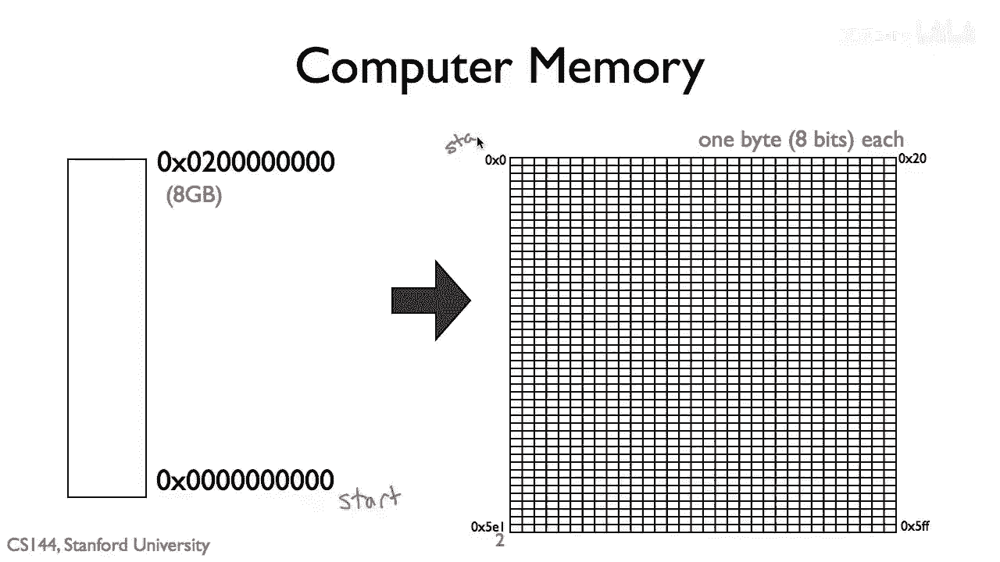
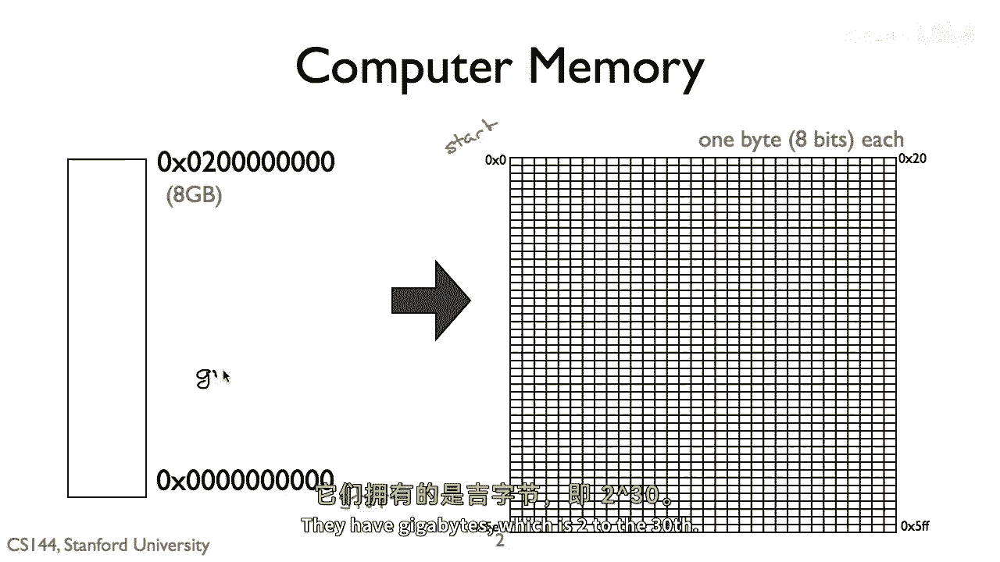
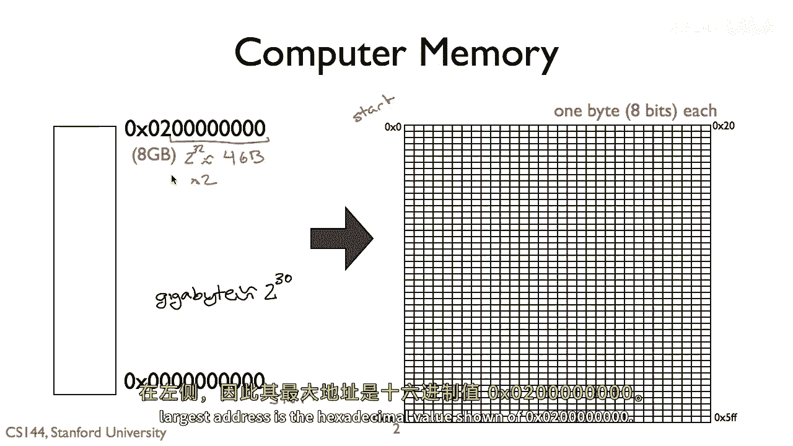
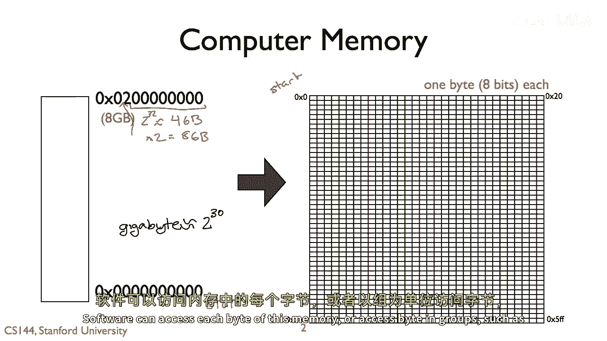
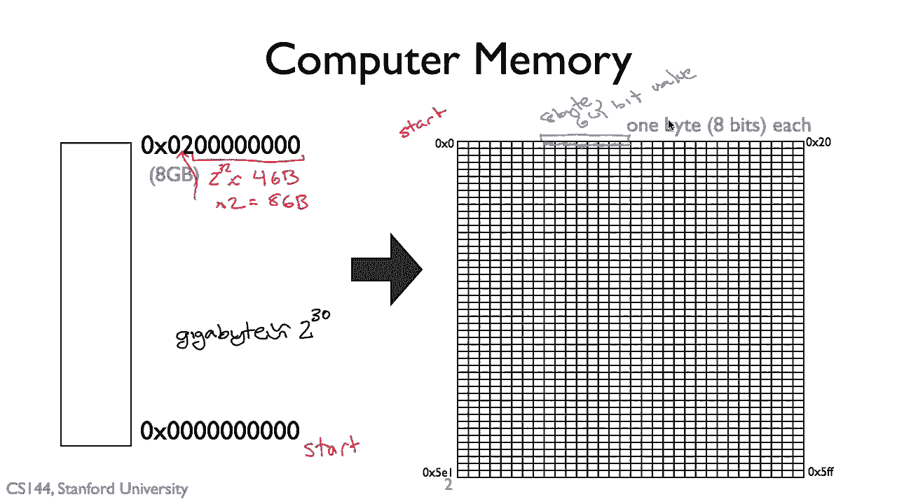
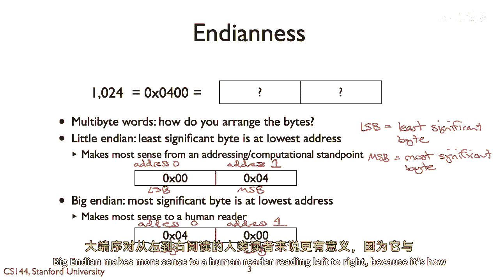

# 【计算机网络 CS144】斯坦福—中英字幕 - P9：p8 1-8a byte order - 加加zero - BV1qotgeXE8D

对于两个通信方来说，他们需要同意他们交换的消息，如果一方假设消息是西班牙语的，而另一方假设它们是柬埔寨语的，计算机将无法通信，这意味着他们需要同意消息的字段，它们如何排列和格式化。

以及它们如何表示以生成要发送的消息，软件通常需要在内存中创建它的副本，然后传递给网络卡，同样，当计算机接收消息时，网络卡将那个消息放入内存，软件可以然后访问它，理解这是如何工作的。

以及你可能遇到的一些陷阱是非常重要的，如果你想理解网络协议并编写网络协议软件。

所以让我们从计算机内存的一个简单模型开始，在大多数计算机中，内存以字节为单位组织，八位内存块，一个程序有一个从地址零开始的地址空间，大多数计算机今天都是六十四位的，这意味着内存地址是六十四位的长。

所以计算机最多可以处理到二的六十四次方字节，或一十八六万亿字节，在实际中，今天的计算机并不具有这些内存，它们有吉字节，这是一个二的三十次方。

在这个例子中，我们的计算机有八个吉字节的内存，在左边显示了八个吉字节的内存，所以它的最大地址是显示的十六进制值零 x 零 二零。

零，零零，零，零零零零软件可以访问每个字节的内存。

或访问字节的组，例如，加载一个六十四位整数从内存中连续的八个字节单元在一个指令中，但计算机如何表示多字节值，让我们说，我们要表示数字一千二百二十四。

这相当于十进制零 x 零 四零零或四次二百五十六，这个数值需要十六位或两个字节，哪个字节先来零零，零或零零四，你如何在内存中布局多字节值被称为字节顺序，并且有两种选择在小端模式。

最不显著的字节位于最低地址，所以最不显著的字节首先在内存中，在小端模式下，最不显著的字节首先在内存中，结果，从计算架构的角度来看，这是最有意义的，另一个选项是大端模式，其中最显著的字节是最低的地址。

大端模式对从左到右阅读的人类读者来说更有意义。

