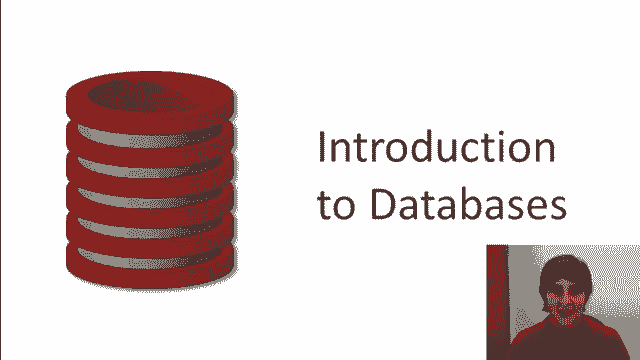
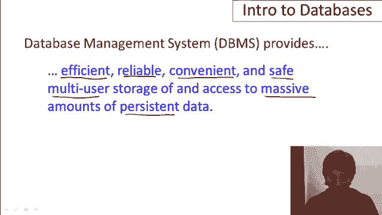
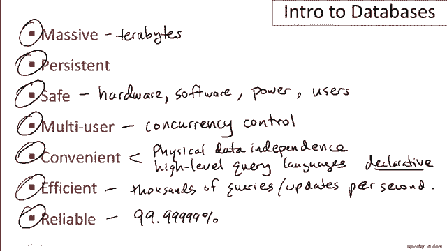
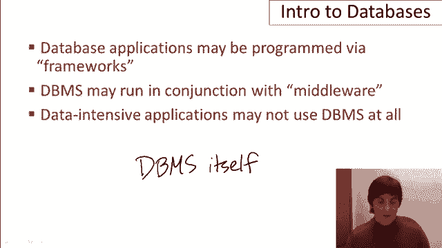

# 课程 P1：01-01 - 数据库导论 🗄️

在本节课中，我们将要学习数据库及数据库管理系统的基本概念。我们将从数据库应用的设计者、用户和开发者的角度，探讨数据库系统为何如此普及，以及它们提供了哪些核心功能。

## 数据库管理系统的核心功能

数据库管理系统为应用程序提供了一系列关键功能。这些功能可以用一个长句来概括：它提供了**高效、可靠、方便、安全的多用户存储和访问大量持久性数据**的方法。接下来，我们将逐一详细解析这些形容词，以理解数据库系统为何如此流行。

### 1. 海量数据

数据库系统的第一个特点是能够处理海量数据。当今世界每天产生的数据量巨大，有时甚至达到几TB。数据库管理系统被设计用来处理那些远超计算机内存容量的数据。

### 2. 持久性

数据库中的数据是持久的。这意味着数据比操作它的程序存活得更久。一个典型的程序结束后，其数据会消失；而数据库中的数据在程序停止后依然存在，并且可以被多个程序反复操作。

### 3. 安全性

数据库系统运行着银行、电信等关键应用，因此必须保证数据的一致性，即使在发生硬件故障、软件故障或停电时，数据也不会丢失或被破坏。系统内置了多种机制来抵御故障和恶意攻击。

### 4. 多用户

多个程序或用户可以同时操作同一个数据库。系统通过**并发控制**机制来协调这些访问，确保数据的一致性。这种控制发生在数据项级别，允许多个用户高效地并行工作。

### 5. 便利性

数据库系统旨在让处理大量数据变得更容易。这主要体现在两个概念上：
*   **物理数据独立性**：数据在磁盘上的实际存储方式与程序如何看待数据是相互独立的。存储方式的改变通常不需要修改应用程序。
*   **高级查询语言**：用户使用声明式语言来描述想要获取什么数据，而无需指定如何获取的算法。系统会自动寻找最高效的执行方式。

### 6. 高效性

性能是数据库系统的重中之重。系统必须能够在海量数据（如TB级别）上，每秒执行成千上万次复杂查询或更新操作。

### 7. 可靠性

对于关键系统，高可用性至关重要。数据库管理系统为其应用程序提供极高的正常运行时间保证（如99.9999%）。

综上所述，数据库系统集成了处理海量、持久、安全、多用户数据的便利且高效的方法。如果你有一个需要处理数据的应用程序，利用数据库系统来实现这些功能将是理想的选择。

## 课程范围与相关概念

上一节我们介绍了数据库系统的核心功能，本节中我们来看看本课程的范围以及一些相关的技术概念。

并非所有数据处理都通过数据库系统完成。在构建数据库应用时，还会涉及其他工具和方式：

*   **框架**：如Django、Ruby on Rails，它们帮助开发程序并生成数据库调用。本课程不深入讨论框架。
*   **中间件**：如应用服务器、Web服务器，它们帮助应用程序与数据库交互。这部分内容也超出本课程范围。
*   **替代方案**：历史上，很多数据存储在文件或Excel表格中。像Hadoop这样的处理框架可以直接对文件中的数据进行操作。

本系列课程将专注于**数据库管理系统本身**，以及如何通过它来存储和操作数据。

## 数据库核心概念

了解了课程范围后，我们来看看数据库领域的几个核心概念。

### 数据模型

数据模型描述了数据如何被结构化。常见的数据模型包括：
*   **关系数据模型**：将数据视为一组记录（行）。
*   **XML文档模型**：将数据组织为带标签值的层次结构。
*   **图数据模型**：将数据表示为节点和边。

### 模式与数据

可以将其类比为编程语言中的**类型与变量**。
*   **模式**：定义了数据库的结构，相当于类型。通常使用**数据定义语言**来设置。
*   **数据**：是存储在模式中的实际内容，相当于变量。模式相对稳定，而数据变化频繁。

### 数据操作

一旦模式建立且数据加载完毕，就可以对数据进行查询和修改。这通常通过**数据操作语言**来完成。

## 数据库系统中的角色

数据库系统的建设和使用涉及不同的人员角色。

以下是参与数据库系统的主要角色：

*   **数据库实现者**：负责构建数据库管理系统本身。这不是本课程的重点。
*   **数据库设计者**：负责为特定应用程序设计数据库的**模式**。这是一项关键且复杂的工作。
*   **应用程序开发者**：负责编写在数据库上运行的程序，作为最终用户与数据之间的接口。多个程序可以操作同一个数据库。
*   **数据库管理员**：负责加载数据、启动系统、进行性能调优和保障系统平稳运行。这是一个非常重要且高薪的职位。

在本课程中，我们将主要从**应用程序设计者和开发者**的角度来学习和思考。

## 总结

本节课中，我们一起学习了数据库管理系统的基础知识。我们了解了它提供的七大核心功能：处理**海量数据**、保证数据**持久性**与**安全性**、支持**多用户**并发访问、提供使用**便利性**、追求运行**高效性**以及确保系统**可靠性**。我们还明确了本课程的范围，介绍了数据模型、模式等核心概念，并认识了数据库系统中涉及的各类角色。无论你是否意识到，数据库系统已经渗透到日常生活的方方面面，支撑着众多关键应用。