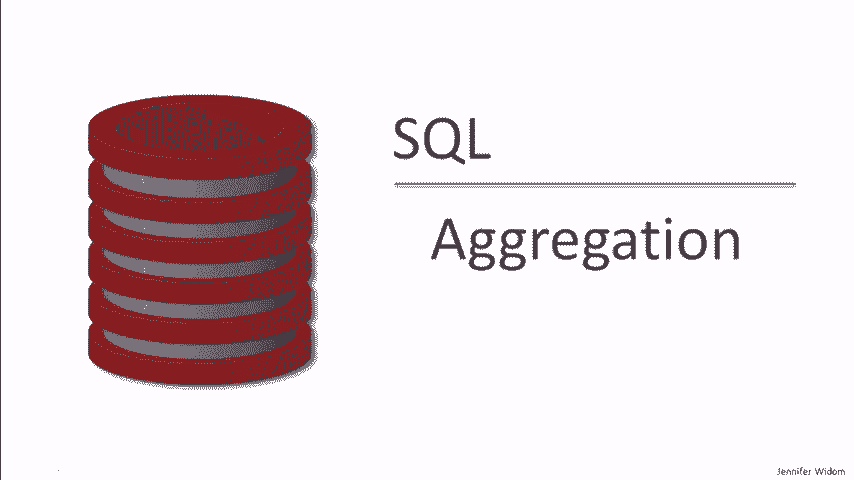
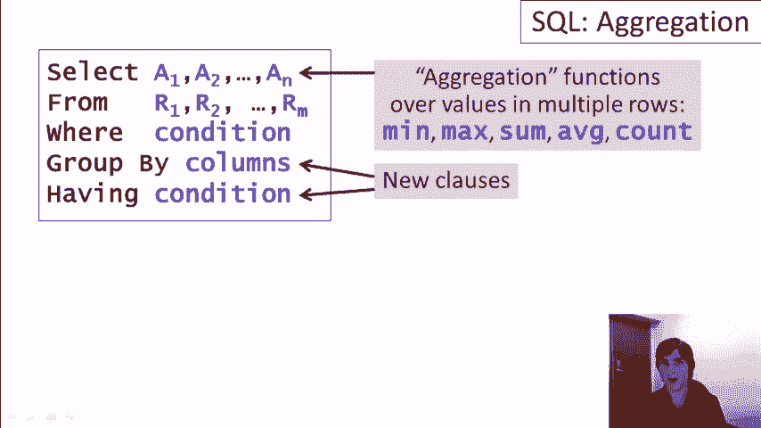
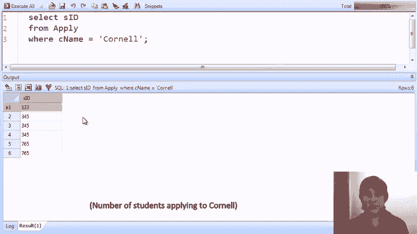
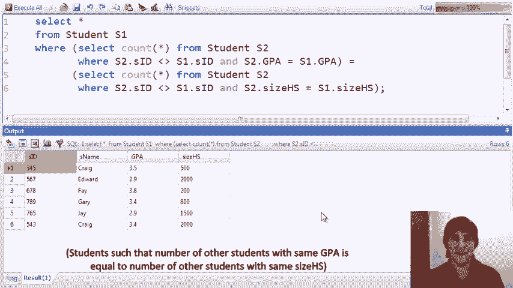
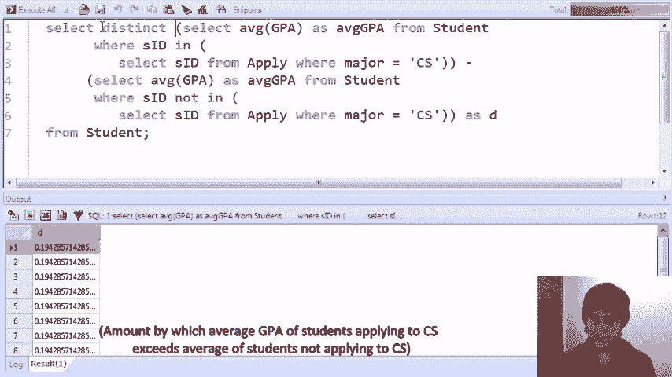
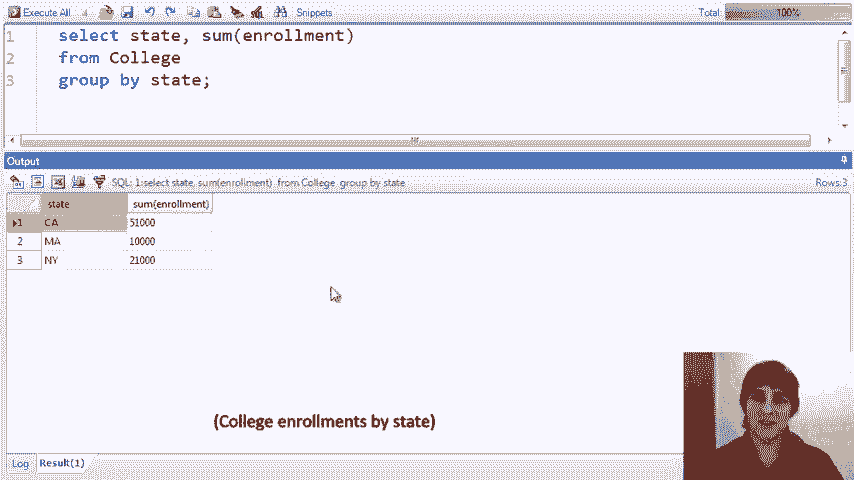
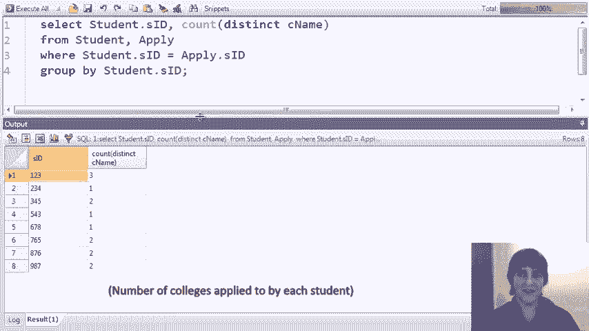
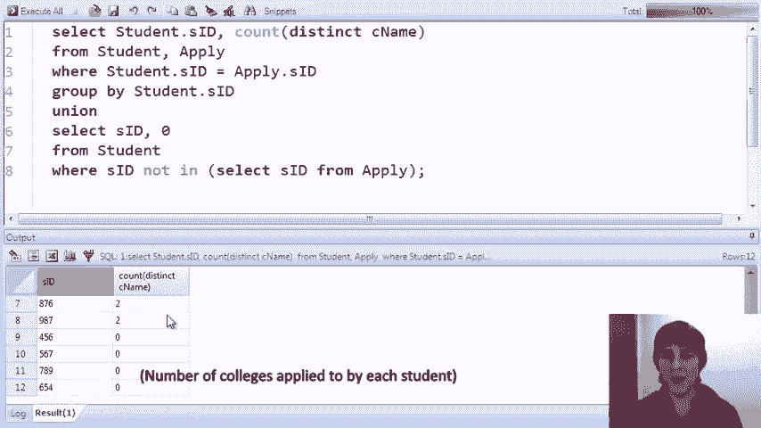
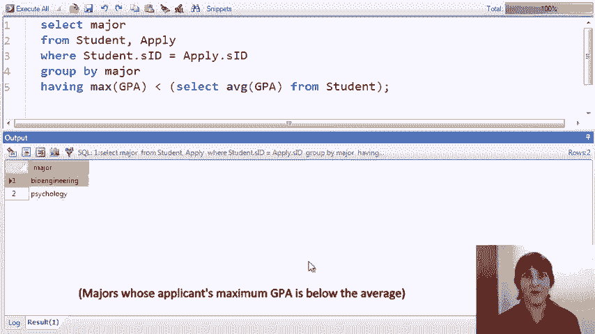

# P10：06-06-aggregation.mp4 - 哈库那玛塔塔i - BV1R4411u7dt

 The next set of queries will show introduce the concept of aggregation in SQL。

 Once again， we start with the basic select from where construct。

 and this time we're going to introduce what are known as aggregate or aggregation functions。

 These are functions that will appear in the select clause initially。

 and what they do is they perform computations over sets of values in multiple rows of a relation。

 And the basic aggregation functions supported by every SQL system are minimum， maximum， sum。

 average， and count。 Now， once we've introduced aggregation functions。

 we can also add two new clauses to the SQL select from where statement。

 the group by and having clause。 The group by allows us to partition our relations into groups。

 and then we'll compute our aggregate functions over each group independently。

 The having condition allows us to test filters on the results of aggregate values。

 The where condition applies to single rows at a time。

 the having condition will apply to the groups that we generate from the group by clause。

 All of these constructs will become very clear when we show some examples。

 As usual， our examples will use our simple college admissions database that has a table of colleges。

 a table of students， and information about students applying to colleges。 As usual。

 we have four colleges， a bunch of students， and applications of students to colleges for specific majors。

 Our first aggregation query is a very simple one that computes the average GPA of the students in the database。

 Here's the query， but just to explain the query， let me first replace the aggregation with star。

 When we run select star from students， we get a result here。 Specifically。

 when we look at the GPA column， what the aggregation is going to do is perform a computation over all values in the column。

 and then produce just one tuple in the result that has that value。 So we'll write average GPA。

 We'll run the query， and we see now the average GPA in the database。

 Our second query is a bit more complicated。 It involves a join。

 What it finds is the minimum GPA of students who have applied for a CS major。

 So we do the join a student and apply on student ID， filter for major equals CS。 Once again。

 let me just remove the aggregation first so we can see the result without aggregation。

 Here we see all of the information about students who have applied to a CS major。

 The aggregation is going to look at the GPA column。

 and it's going to take the lowest value in that column。 So we write min GPA， run the query。

 and we discover that the lowest GPA is 3。4。 Now let's go back to the average aggregate function again。

 So let's compute the average GPA of the students who have applied to computer science。

 run the query， and we see the result is about 3。7。 In fact。

 this result is probably not precisely what we were looking for。 In a previous video。

 we talked in some detail about this particular form of query versus using a subquery to find the GPA of students who have applied to CS。

 The issue with this particular query， and let's go back to the select star version。

 is that if a student applied to CS multiple times， for example。

 student 1-3 Amy applied to both Stanford and Berkeley， then when we compute their average GPA。

 we're going to be counting their GPA twice。 Presumably what we actually want is to count the GPA once for each student who applied to CS no matter how many times they applied。

 So in order to do that， we use the subquery form where we select from student。

 and then we just check for each student whether their ID is among those who applied to CS。

 So let's just do a bit of editing here。 From apply， where major equals CS。

 I'm not a very good typist。 Let's just first take a look at the subquery form。

 and we see that we made a mistake here， and it says that we forgot a word here， which is in。

 apologize for that。 Okay， now we have the students who applied to CS。

 and in this case we only have one instance of each student。 So now if we run the aggregation。

 when we compute the average GPA， we'll correctly count each student's GPA only one time。

 So remember with 3。7 approximately before， now we run the query and we see that the correct result is 3。

68。 Not that different， but this one is the numerically correct result。

 So far we've seen the average and min aggregate functions。 This query shows the count function。

 So not surprisingly， the count function just returns the number of tuples in the result。

 So this particular query finds the number of colleges in our database whose enrollment is greater than 15。

000。 Just for to be thorough， let's run the query without the aggregate function。

 and we see that there are two of them， and the aggregate function simply counts those number of tuples。

 We run the query， and the result is two， as expected。

 Let's do another count query that looks very similar。 In this case。

 we're counting the number of students who have applied to Cornell。 So the query looks the same。

 We'll run the query， and we discover six students have applied to Cornell。 Well， in reality。

 what we've actually counted is the number of applications to Cornell。

 not the number of students who have applied to Cornell。 If a student applied three times。

 then we're counting them three times in this result。 So in some sense。

 this is similar to the previous one we saw。 We were over counting。

 and we could try to fix it with a subquery in the in and so forth， but actually， C。B。E。E。E。

 provides a very nice way for us to perform the query that we want。 In the count function。

 we can put a special keyword distinct， and then the name of one or more attributes。

 And in this case， what the count will do is we'll look at the result。

 and then it will count the distinct values for the particular attributes。 So we run the query。

 and we find that there are three distinct student IDs。 If we ran it without， just like this。

 when we see， we would look， and again， we would find that there are three distinct student IDs。

 So count distinct actually turns out to be a very useful feature in SQL。

 Here's a rather complicated looking query， and I have to admit。

 it computes something fairly obscure， but it does demonstrate some features。

 What this query computes is it gives us back all students where the number of other students who have the same GPA as the student is equal to the number of other students that have the same high school size as the student。

 Again， I admit it's a little bit obscure， but let's take a look at how it works。

 So it looks at the student relation， and for each student， it counts the number of other students。

 That's by testing that the ID is different， that have the same GPA。

 It also counts the number of other students that have the same size high school。

 and if those two values， and these subqueries both produce a single value。

 which is why we can test equality， if those two values are the same。

 then the student comes out in the result。 Let's run the query， we get our answer。

 I'll leave it to you to verify by looking at the data that this is indeed the correct result。

 Here's another complicated looking query， although this one computes something quite a bit more intuitive。

 What this query computes is the amount by which the average GPA of students who apply to computer science exceeds the average GPA of students who don't apply to computer science。

 and we're going to assume it does in fact exceed。 So we're using in this example subqueries in the From clause。

 which I hope you remember from the previous video。

 A subqueries in the From clause allows you to write a select from where expression。

 and then use the result of that expression as if it were an actual table in the database。

 So we're going to compute two subqueries in the From clause。

 one of them which is the average GPA of CS applicants， and one the average GPA of non CS applicants。

 Let's look a little closer here。 So this query here says。

 let's find the students who have applied to major in CS， let's compute their average GPA。

 and we'll call it average GPA。 We'll take the whole result， and we'll name it CS。 Similarly。

 the second new relation that we're computing in the From clause computes the average GPA of students who do not apply to CS。

 so their student ID is not in the set of students who applied to CS。 We'll call that one non CS。

 So now with this From clause we have a relation called CS with an attribute called average GPA。

 and a relation called non CS with an attribute called average GPA。

 And then the select clause will simply do the subtraction of the non CS GPA from the CS GPA。

 We run the query and we discover that the CS applicants exceed on average the non CS by 。19。

 Now just for demonstration purposes， let me show that we can write this same query by using sub queries in the select clause。

 You right remember from the previous video that in a select clause we can write a sub query as long as it returns a single value。

 We're going to go even further， we're going to write two sub queries that return single values and subtract them。

 So I'm going to replace this From with select。 I'm going to take out this whole first line here。

 and then I'm going to， let's see， what else do I need to do？ I'm going to take out the As here。

 and I'm going to replace it with a minus。 I'm going to take out the As here。

 So now what we've got is we've got the average GPA of CS students in the select clause producing a value。

 The average GPA of non CS students， we perform the subtraction as part of the select clause。

 The last thing we need is something in the From clause， so we'll say From student。

 We'll call the result of the subtraction D， let's say， for difference。

 We run the query and we get almost the same result except for a bunch of duplicates。

 The reason for the duplicates is that we computed this result once for each tuple in student。

 We can add distinct and now we get the single result。

 Now let's learn about the group by clause， which is only used in conjunction with aggregation。

 Our first query is going to find the number of applicants to each college。

 and it's going to do so by using grouping。 Effectively what grouping does is it takes a relation and it partitions it by values of a given attribute or set of attributes。

 Specifically in this query we're taking the apply relation and we're breaking it into groups where each group has one of the college names。

 so that would be the Stanford group， the Berkeley group and so forth。

 Then for each group we'll return one tuple in the result containing the college name for that group and the number of tuples in the group。

 To illustrate what's happening with grouping very clearly。

 let me start by replacing the select clause with select star。

 removing the aggregation and doing an order by on the college name。

 That just illustrates the groups that we're going to be using in the actual query。

 So we see there are three tuples for Berkeley， there are six tuples for Cornell and so forth。

 Within each group then for the particular query we're doing we're simply going to count the number of tuples。

 So going back to the group by form we return the college name and we return the count of the number of tuples。

 Now before I actually run the query one thing to notice is what it makes sense to put in the select clause here。

 We're grouping by the college name， so the college name is going to be the same for all of the tuples in the group。

 So it's sensible to include that but it wouldn't really be sensible to include one of the other attributes that differs。

 Although we'll see an example later where we include that in interesting things happen。

 For now we'll just put the name of the grouping attribute and then we can perform aggregation over that in this case count。

 We run the query and we see that there are three applicants to Berkeley。

 six to Cornell and so forth。 Here's a very similar query just as a second example。

 In this example we're finding the total enrollment of college students for each state。

 Now we only happen to have three states and four colleges in our database but what this query does is it takes the college relation。

 it breaks it up into partitions by state and then within each partition or group it will return the state for that partition and the sum of the enrollments。

 We run the query and we see the expected result。

 Here's a more complicated group by query。 In this case we're grouping by two attributes。

 we also have a join involved and we're going to compute two aggregate functions in our result。

 What this query computes is for each college and major combination。

 the minimum and maximum GPAs for the students who have applied to that college。

 As usual before we do the aggregation let's replace the query with one where we can see the groups explicitly。

 I'll put GPA here and instead of grouping I'll order by and we run the query and we see for Berkeley biology we actually only have one applicants。

 For Berkeley CS we have two， I think Stanford CS has the largest number of applicants at three。

 Once we put the aggregation back each of these combinations of college and major is going to be considered individually and for each one we'll compute the minimum and maximum GPA。

 Let's go ahead and do that。 All those parentheses。 Okay， change this to group by。

 run the query and here we see for Berkeley biology the minimum and maximum is the same because we saw that there was only one。

 Student who applied to Berkeley biology， Stanford CS we had three。

 we can see the spread of their GPAs and so forth for each college major combination。

 Now what if we were interested in finding information about the spread of GPAs for each college and major？

 What the difference is between the minimum and the maximum。

 So let's suppose in fact what we wanted to find was the largest spread but let's take that in steps。

 I'm going to take this current query here and I'm just going to slap it into the front clause。

 So now in the front clause I'm going to have a relation we'll call it M that's going to have the college major combinations in the minimum and maximum GPA。

 This M is going to now have the result that we see below。

 Now once we have that result to work with in the select clause we can access the attributes here。

 Let me call this one M and this one M X and if we write just M X minus M N here what we're going to get is a list of the spreads of the minimum and maximum GPA for each college and major。

 So we see many of them are zero。 Those are all of the combinations that had just one student but in some cases we actually have a spread。

 What we want to find is the largest spread。 Watch this。 It's very cute。

 We just simply put a max function right here。 Run the query and we find that the largest spread between men and max is approximately one。

 Our next sequence of queries introduces some subtleties of the group by clause。

 What our query finds is the number of colleges that have been applied for the number of colleges that have been applied to by each student。

 So the query joins student and apply。 It groups the result for the student ID on the student ID and then for each student ID find the number of distinct colleges in that group。

 So once again just to illustrate let's take away the aggregation。

 Let's replace the group by by an order by just so we can see the data that we're working on。

 And run the query and we see that student one two three has four applications to Stanford。

 Berkeley and Cornell three distinct colleges。 Two three four has one and so forth。

 So now let's return to our original query group by student。 We'll count the distinct college names。

 Run the query and we get the expected answer。 Student one two three applied to three distinct colleges two three four to one and so forth。

 Maybe we'd like to have the student's name and the result as well。 That's easy to do。

 We just add the student name to the select clause and we run the query and now we've added Amy is one two three。

 Bob is two three four and so forth。 That worked out fine in this case but we're going to see in a moment where it's simply adding a attribute to the select clause in the case of a group by does something a little strange。

 In fact the only reason that it worked nicely in this case is that when we group by the student ID within each group we have the same student name。

 Let's see that let's just take a look at that。 Again we'll replace the group by with an order by。

 We are sorting by student ID and we see for the first group which is one two three we have all Amy's for the three four five group we have all Craig's and so on。

 So when we put student name in the select clause for a group by query it was okay because for each group we had the same name of the student。

 That's not the case we should presumably get an error but let's see what happens。

 So let's say that we're interested now not only in finding the student name in our query but we're further going to add a college name。

 So let's go back to the original query。 Think college name。

 Let's add college name in our result and let's go back to grouping by student。

 Now for each student we're going to return the for each group which is identified by the student ID we're going to return the ID the name the number of distinct colleges and then a college。

 Let's run the query and we do get a result we don't get an error so we've got Amy one two three she applied to three distinct colleges but for whatever reason the system decided to tell us about Stanford。

 Craig applied to two colleges and the system tells us about MIT。

 Let's go back again revert now to our order by form of this query and take away the aggregation。

 And when we run the query we see there's Amy and she did apply to four different colleges but when we put the college name in the grouping query it chose to tell us about Stanford。

 What this system is actually doing is when we include in the select clause of a grouping query again if we go back to group by and we put in the select clause an attribute that's not one of the grouping attributes it actually chooses a random value from the group to include。

 In the case of the student name the random value was always the same because the student name is always the same for the same student ID。

 In the case of the college it chose a random value among the colleges。

 I personally am not crazy about this behavior among the three open source database systems that we've been using for our demos two of them allow this behavior sequel light and my sequel I happen to be using my sequel today。

 If we were using Postgres it would actually throw an error in this case。

 Let's go back to the original query that finds a number of colleges applied to by each student。

 Here it is as we originally wrote it and here's the result。

 Now there may be some students in the database who haven't applied to any college at all and they're not going to be represented in our result because they're not going to be in the results of the join and we don't see any zero counts here。

 What if we wanted to actually list the student IDs of students who haven't applied anywhere and include a zero in the result。

 This is actually one of my favorite queries to give as an exercise or an exam question in my class because it takes a little innovation to figure out how to write it。

 The way we write it actually is by using the union operator which I hope you remember from a previous video。

 We're going to take the union of the students who have applied somewhere in the number of places they've applied together with the students who haven't applied anywhere and for those students we're going to put a zero in the result directly。

 So let me just write the beginnings of this so we're going to find those students who haven't applied anywhere at all。

 So those are the students whose SID is not in at all the set of SID's in the apply relation。

 So that finds the students who didn't apply anywhere。

 For each student will return their student ID and then we want to have a zero in the result。

 Very simple to do。 We simply write zero。 We run the query and now if we scroll down we'll see that in addition to all the students who have applied somewhere we get zeros in the result for the students who haven't applied anywhere。

 The last clause that we're going to introduce in this video is the having clause and the having clause is also only used in conjunction with aggregation。

 What the having clause allows us to do is apply conditions to the result of aggregate functions。

 So the having clause is applied after the group by clause and it allows us to check conditions that involve the entire group。

 In contrast the where clause applies to one tuple at a time。

 So this particular query is finding colleges that have fewer than five applicants。

 So we look at the apply relation we group it by college name so we're going to have one group for each college。

 Then we're only going to keep those groups where the number of tuples in the group is less than five indicating that we have fewer than five applicants to the college。

 We'll run the query and we'll see that Berkeley and MIT each have fewer than five applicants。

 So presumably Cornell and Stanford have greater than or equal to five applicants and you can check that by examining the data。

 Now it is possible to write this same query without the having clause and in fact without the grouping clause and let me show you how that's done。

 We're going to select again the C name from apply and here's what we're going to do。

 We're going to add an attribute there。 We're going to a table variable。

 We're going to raise this whole business and we're going to find all applicants。

 So all applications where let me just type this out for you。

 Five is greater than the count from apply A2 where A2。C name equals five。 C name equals A1。C name。

 And let's take a look at what this is doing。 So what we're doing here is we're looking at each application record and we're checking whether the number of other applications to the same college。

 We're going to find all the applications the same college。

 We're going to count them and we're going to see if that number is less than five。

 So it's a little bit non-intuitive。 Now remember the result should be Berkeley MIT。

 Let's run the query and we do get Berkeley MIT。 We again get duplicates however。

 The reason is that we're checking this condition for each application record。

 So for each application to Berkeley we check the condition that may be many of them and for each one to MIT and so on。

 Of course as usual we can add distinct。 We can run the query and now we get the result。

 It does happen actually that every query that can be written with a group by in a having clause can be written in another form。

 Sometimes it can be extremely contorted but another sort of complicated exercise I like to give sometimes in my class is to prove the fact that you can write every group by having query without using those clauses。

 Now let's go back to our original form of the query where we use the group by in the having。

 So we'll just get rid of all this。 I'm sorry I'm such a terrible typist。

 Group by college name having count star less than five。

 And we'll run the query we'll get the same result。

 What if we were interested not in those colleges that have fewer than five applications but rather those colleges that have fewer than five applications。

 It's a subtle point but instead of counting the number of apply tuples for each college what we want to count is the number of distinct student IDs that appear in the group of apply tuples for that college。

 So again now we're looking for the number of colleges who have fewer than five distinct people distinct students applying to them。

 And now we see that one more college joins the group so Cornell had more than five applications or at least five applications but it has fewer than five applicants。

 Here's our grand finale query。 It has a having clause in group by and in addition it has a sub query within the having clause that also uses aggregation。

 What this query finds is all majors represented in the database where the maximum GPA of a student applying for that major is lower than the average GPA in the database。

 So we join student and apply and we group by the major so we can look at each major one at a time。

 Within the major we find the maximum GPA of a student applying for that major and we check whether it's lower than the average GPA in the student relation。

 We run the query and we discover that bioengineering and psychology at this point in time are garnering applicants whose highest GPA is lower than the average in the database。

 Of course that does not represent reality。

