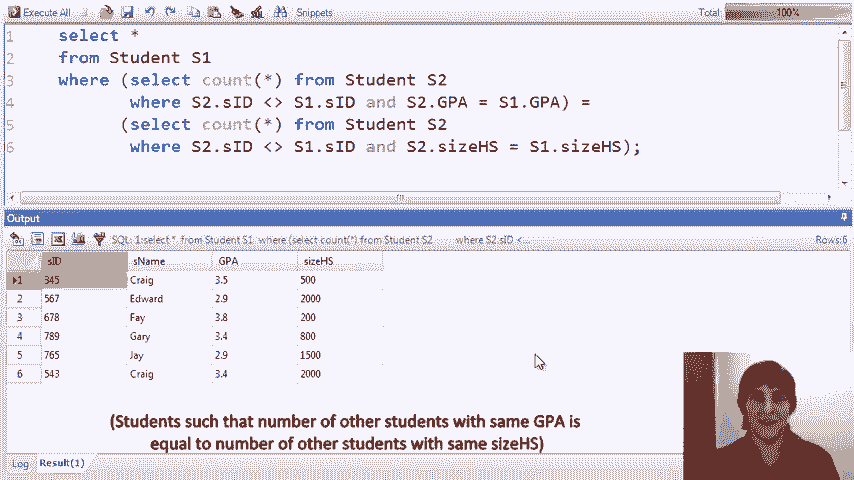

# 课程 P10：SQL 聚合操作详解 🧮

在本节课中，我们将要学习 SQL 中的聚合操作。聚合是数据分析的核心，它允许我们对数据集中的多行数据进行计算，例如求和、求平均值、计数等。我们将从基本的聚合函数开始，逐步深入到 `GROUP BY` 和 `HAVING` 子句，并通过一系列示例来理解它们的工作原理。


## 聚合函数简介

上一节我们介绍了 SQL 的基本查询结构。本节中我们来看看如何对数据进行汇总计算。

聚合函数对关系中多行的值集进行计算。所有 SQL 系统都支持以下基本聚合函数：
*   **最小值**：`MIN(column_name)`
*   **最大值**：`MAX(column_name)`
*   **总和**：`SUM(column_name)`
*   **平均值**：`AVG(column_name)`
*   **计数**：`COUNT(column_name)`

一旦引入聚合函数，我们就可以向 `SELECT FROM WHERE` 语句添加两个新子句：
*   `GROUP BY`：允许我们将关系划分为不同的组，然后对每个组独立计算聚合函数。
*   `HAVING`：允许我们在聚合值的结果上进行筛选。`WHERE` 条件适用于单行数据，而 `HAVING` 条件将应用于 `GROUP BY` 生成的各个组。

## 基础聚合查询示例

我们将使用一个简单的大学招生数据库来演示，其中包含 `college`、`student` 和 `apply` 表。

### 计算平均 GPA

第一个查询计算数据库中所有学生的平均 GPA。

```sql
SELECT AVG(GPA) FROM student;
```
该查询对 `student` 表的 `GPA` 列所有值执行计算，然后生成一个包含该平均值的元组。

### 查找特定专业的最低 GPA


第二个查询涉及连接操作，查找申请计算机科学专业的学生的最低 GPA。

```sql
SELECT MIN(s.GPA)
FROM student s, apply a
WHERE s.sID = a.sID AND a.major = ‘CS’;
```
此查询先通过学生 ID 连接 `student` 和 `apply` 表，并筛选出专业为 ‘CS’ 的记录，然后取 `GPA` 列中的最小值。



### 避免重复计算的聚合

计算申请计算机科学专业的学生的平均 GPA 时，需要注意重复申请的情况。

```sql
-- 可能重复计算的查询
SELECT AVG(GPA)
FROM student s, apply a
WHERE s.sID = a.sID AND a.major = ‘CS’;

-- 正确的查询：使用子查询确保每个学生只计算一次
SELECT AVG(GPA)
FROM student
WHERE sID IN (SELECT sID FROM apply WHERE major = ‘CS’);
```
第一个查询中，如果一名学生多次申请同一专业，其 GPA 会被重复计算。使用子查询可以确保每个学生只被计入一次。

### 使用 COUNT 函数

`COUNT` 函数返回结果中元组的数量。

```sql
-- 计算录取人数超过 15000 的大学数量
SELECT COUNT(*)
FROM college
WHERE enrollment > 15000;
```
该查询统计满足 `enrollment > 15000` 条件的大学数量。


### 使用 COUNT(DISTINCT ...)

`COUNT(DISTINCT column_name)` 用于计算特定列中不同值的数量。

```sql
-- 计算申请康奈尔大学的不同学生人数
SELECT COUNT(DISTINCT sID)
FROM apply
WHERE cName = ‘Cornell’;
```
如果不使用 `DISTINCT`，查询将统计申请次数，而非学生人数。`COUNT(DISTINCT sID)` 确保了每个学生只被计数一次。

## 使用 GROUP BY 进行分组聚合


上一节我们介绍了基础的聚合函数。本节中我们来看看如何将数据分组后进行聚合计算。

`GROUP BY` 子句将一个关系按照给定属性的值进行划分，然后对每个组独立计算聚合函数。

### 按单属性分组

以下是按单属性进行分组的示例。

查找每所大学的申请人数。
```sql
SELECT cName, COUNT(*)
FROM apply
GROUP BY cName;
```
该查询将 `apply` 关系按 `cName`（大学名称）分组，然后返回每个大学的名称及其对应的申请记录数量。

查找每个州的大学生总入学人数。
```sql
SELECT state, SUM(enrollment)
FROM college
GROUP BY state;
```
该查询将 `college` 表按 `state`（州）分组，然后返回每个州的名字及其所有大学入学人数的总和。

### 按多属性分组

我们可以按多个属性进行分组。

计算每个大学和专业的组合中，申请学生的最高和最低 GPA。
```sql
SELECT cName, major, MIN(GPA), MAX(GPA)
FROM student s, apply a
WHERE s.sID = a.sID
GROUP BY cName, major;
```
该查询先连接 `student` 和 `apply` 表，然后按 `cName` 和 `major` 的组合进行分组。对于每个分组，计算申请学生的 `GPA` 最小值和最大值。

### GROUP BY 的注意事项

在 `SELECT` 子句中，通常只应包含分组属性和聚合函数。包含非分组属性可能导致不可预测的结果，因为系统会从该组中随机选择一个值返回。

```sql
-- 可能产生意外结果的查询
SELECT s.sID, sName, COUNT(DISTINCT a.cName), a.cName
FROM student s, apply a
WHERE s.sID = a.sID
GROUP BY s.sID;
```
在这个查询中，`a.cName` 不是分组属性，其返回值是未定义的（取决于数据库系统，可能返回组内一个随机值或报错）。

## 使用 HAVING 筛选分组结果

上一节我们学习了如何分组数据。本节中我们来看看如何对分组后的结果进行筛选。


`HAVING` 子句在 `GROUP BY` 之后应用，允许我们对聚合函数的结果设置条件。

### 基础 HAVING 查询


查找申请人数少于五人的大学。
```sql
SELECT cName
FROM apply
GROUP BY cName
HAVING COUNT(*) < 5;
```
该查询先按大学名称分组，然后只保留那些元组数量（即申请人数）少于 5 的分组。

### HAVING 与子查询结合

查找数据库中所有专业，其中申请该专业的学生的最高 GPA 低于全体学生的平均 GPA。
```sql
SELECT a.major
FROM student s, apply a
WHERE s.sID = a.sID
GROUP BY a.major
HAVING MAX(s.GPA) < (SELECT AVG(GPA) FROM student);
```
该查询先连接表并按专业分组。在 `HAVING` 子句中，它检查每个专业的最高 GPA 是否小于子查询计算出的全体学生平均 GPA。

## 复杂查询与技巧

### 在 FROM 子句中使用子查询进行聚合

计算申请 CS 专业的学生与未申请 CS 专业的学生之间的平均 GPA 差值。
```sql
SELECT cs.avgGPA - noncs.avgGPA AS GPA_difference
FROM (SELECT AVG(GPA) AS avgGPA FROM student WHERE sID IN (SELECT sID FROM apply WHERE major=‘CS’)) cs,
     (SELECT AVG(GPA) AS avgGPA FROM student WHERE sID NOT IN (SELECT sID FROM apply WHERE major=‘CS’)) noncs;
```
该查询在 `FROM` 子句中创建了两个临时关系：`cs`（CS申请者的平均GPA）和 `noncs`（非CS申请者的平均GPA），然后在主查询中计算两者的差值。

### 列出所有学生及其申请大学数量（包括零申请者）

要列出所有学生，包括那些没有申请任何大学的学生，并显示其申请大学数量，可以使用 `UNION` 操作符。
```sql
-- 已申请大学的学生
SELECT s.sID, COUNT(DISTINCT a.cName)
FROM student s, apply a
WHERE s.sID = a.sID
GROUP BY s.sID
UNION
-- 未申请任何大学的学生
SELECT sID, 0
FROM student
WHERE sID NOT IN (SELECT sID FROM apply);
```
该查询首先找出已申请大学的学生及其申请的不同大学数量，然后与未申请任何大学的学生（申请数量为0）合并。

---


本节课中我们一起学习了 SQL 聚合操作的核心概念。我们从 **`MIN`、`MAX`、`AVG`、`SUM`、`COUNT`** 等基本聚合函数开始，理解了它们如何对多行数据进行汇总。接着，我们深入探讨了 **`GROUP BY`** 子句，它允许我们将数据划分为逻辑组并对每个组进行独立计算。最后，我们学习了 **`HAVING`** 子句，它用于对分组聚合后的结果进行条件筛选，这与针对单行数据的 `WHERE` 子句形成了对比。通过结合子查询、连接和集合操作，聚合功能成为了 SQL 中进行复杂数据分析的强大工具。