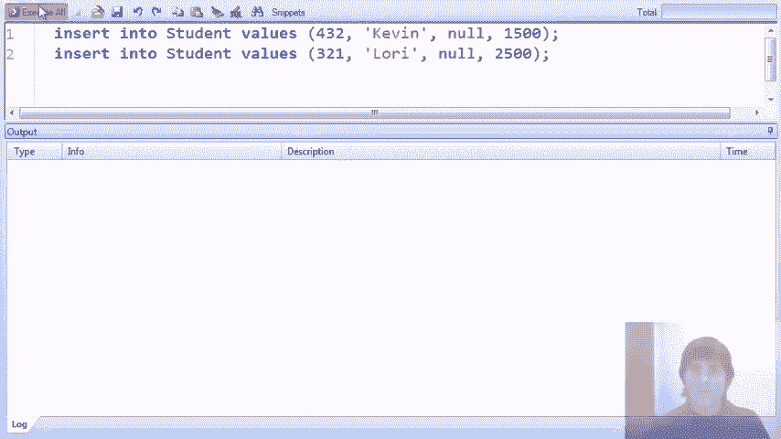
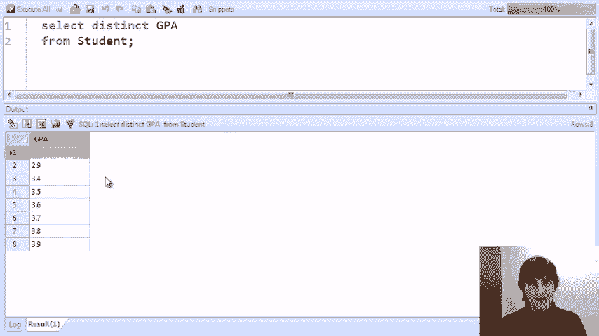

# P11：06-07-null-values.mp4 - 哈库那玛塔塔i - BV1R4411u7dt

在这段视频中，我们将学习 SQL 中的空值。

和往常一样，我们将考虑一个简单的大学招生数据库，并探索 select from where 查询表达式。现在，在这个视频中，我们将不再扩展查询中的书写内容，而是扩展数据中的内容。特别是在关系数据库中，

除非另有说明，属性中的任何值都可以取特殊值 null。Null 通常表示该值未定义或未知。例如，我们可能有一个 GPA 未知或没有 GPA 的学生，我们会用 null 来表示这一点。

或者我们可能会创建一个应用关系，其中的决策尚未确定，而这些决策值也会是 null。所以在我们的演示查询中，我们将查看当我们有空值时发生了什么，并在数据库上运行查询。

这是我们数据库中的学生集合。为了探索当我们有空值时会发生什么，让我们插入两个新学生，Kevin 和 Lori，他们的 GPA 都是空值。我们返回并查看我们的学生表，现在我们看到了 Kevin 和 Lori。

作为该表的一部分，在这个特定的界面中，空值被表示为空白。现在让我们运行一些查询。我们的第一个查询是查找 GPA 大于 3.5 的学生。这个查询很简单。我们运行查询并发现了一些学生，在结果中我们没有找到 Kevin 和 Lori，因为他们的 GPA 是 null。

所以我们不能确定他们的 GPA 大于 3.5。我们再运行一个查询，要求 GPA 小于或等于 3.5。我们会得到一组不同的学生，正如我们所看到的，但我们仍然得不到 Kevin 和 Lori。现在让我们运行一个查询，要求 GPA 大于 3.5 或小于或等于 3.5。

这个有点好笑。实际上，我们在讲解关系模型时就讨论过这个查询。当你看这个查询时，你会认为你会得到数据库中所有的学生，因为每个学生的 GPA 显然要么大于 3.5，要么小于或等于 3.5，或者从更逻辑的角度来看，

这是一个始终为真的表达式。但你可能不会感到惊讶，当我们运行查询时，我们仍然得不到 Kevin 或 Lori，因为我们无法确定他们的 GPA 是否满足这两个条件中的任何一个。所以即使我们有一个看起来像是“where”子句的永真式（逻辑表达式总是为真），我们仍然得不到所有数据。

如果我们希望这个查询返回数据库中的所有学生，我们可以通过在`where`语句中添加一个额外的条件来实现，那就是`or GPA is null`。现在，这的确是一个会被每个元组匹配的条件，因为无论是GPA大于3.5，小于或等于3.5，还是GPA为null，它都会匹配。

`is null`是SQL中的一个关键字短语，用于匹配null值。当我们运行查询时，最终我们得到了数据库中的所有学生，包括Kevin和Lori。为了进一步阐明这个问题，让我们继续查看涉及null值的`where`子句的查询。在这个查询中，我们正在查找GPA大于3.5或某些其他条件的学生。

高中规模小于1600。因此，让我们运行查询，看看结果如何。我们得到了所有这些学生，包括Kevin。所以，尽管他的GPA为null，因此我们无法确定它是否满足条件的这一部分，但由于他的高中规模是1500，他确实满足条件的第二部分，并且出现在我们的结果中。

现在，让我们添加一个条件，那就是`or size high school is greater than or equal to 1600`。所以现在，我们又有了一个看起来像拓扑的条件。它看起来应该总是为真。每个人的高中规模要么小于1600，要么大于或等于1600。而且在这种情况下，我们没有高中规模为null的值。

因此，当我们运行这个查询时，我们应该得到所有的学生。确实，当我们运行查询时，我们得到了所有学生。现在我不会详细讲解，但你当然可以阅读相关内容。涉及null值时，`where`子句的评估方式使用的是三值逻辑，其中每个表达式要么为真，要么为假，要么为未知。

这些逻辑值被组合在一起，最终生成一个`where`表达式的值，用于确定一个元组是否在结果中。我们的最后一组查询探讨了null值与聚合函数之间的相互作用，具体来说是在这种情况下的`count`函数。实际上，null值与聚合以及null值与子查询之间有许多细微的差别。我们这里不会对这些细微差别进行详尽的探讨。

但我们会给出一个示例。如果你正在使用带有null值的数据库，我们鼓励你在编写查询时非常小心，确保你理解null值如何影响结果。好吧，我们这里的查询是先统计那些GPA非null的学生人数。所以我们运行查询，发现有12个学生的GPA是非null的。

这些是我们最初在数据库中的12个学生，之后我们添加了GPA为null的Kevin和Lori。现在，我们不只是在计数学生，而是要统计不同的GPA数目。那么，在这12个学生中，有多少种不同的GPA呢？

事实证明，在那些非空的记录中，有七个不同的 GPA。现在我们进一步去掉非空条件，只计算所有学生的不同 GPA。这将告诉我们 `count distinct` 是否包括空值。我们执行查询后，得到相同的答案。所以我们仍然有七个不同的 GPA，且没有计算空值。

现在让我们做最后一个查询，去掉计数，仅查看不同的 GPA。我们在做计数时得到的是七个。现在我们运行查询，结果是八个。发生了什么？

好的，前面这几个例子，使用可视化时有些难度。第一个答案是空的，这实际上是空值（null）。所以，当我们使用 `select distinct GPA` 时，如果存在空的 GPA，我们会将空值包含在结果中。然而，当我们计算不同的值时，我们不会将空值包括在内。

这实际上只是当我们处理空值时可能遇到的微妙差异和意外行为的一个例子。因此，再次提醒你，在写涉及空值的数据库查询时，务必小心，确保清楚你将得到什么样的结果。

