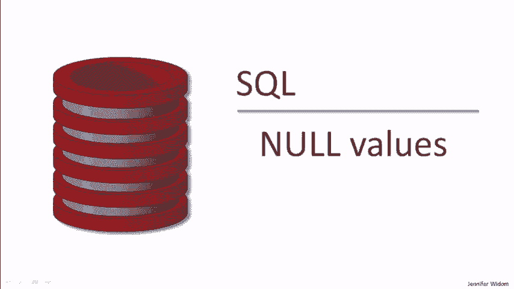
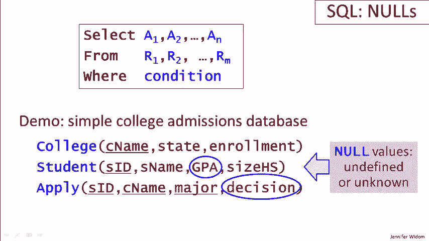
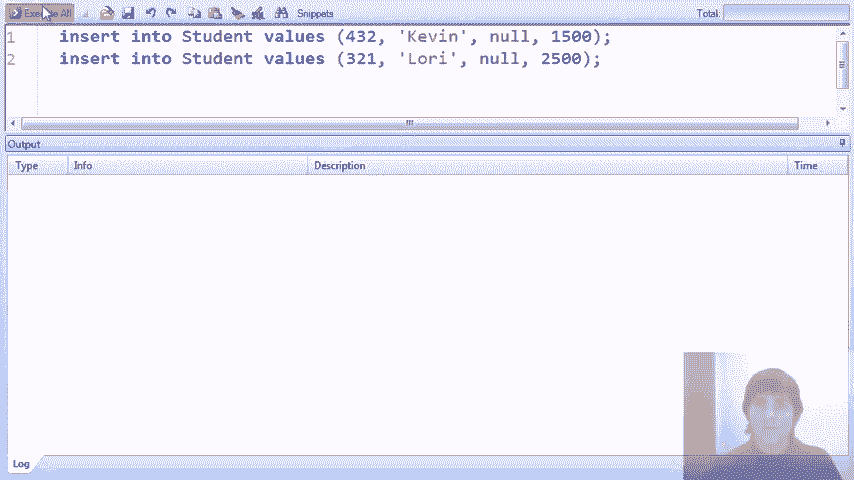
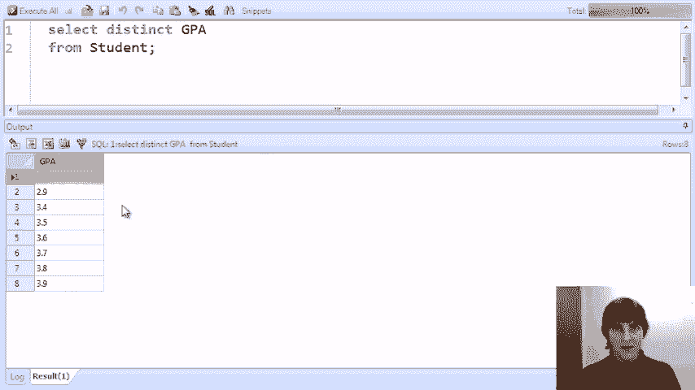

# SQL 课程 P11：空值处理 🧩

在本节课中，我们将学习 SQL 中一个特殊且重要的概念——空值（NULL）。我们将了解空值的含义，探索它在查询中的行为，并学习如何正确地处理包含空值的数据。

---

## 空值简介



上一节我们介绍了基础的查询结构，本节中我们来看看数据中可能存在的特殊值——空值。

在关系数据库中，除非另有规定，任何属性的值都可以取一个特殊值 `NULL`。`NULL` 通常表示该值**未定义**或**未知**。



例如：
*   一个学生的 GPA 可能未知，我们会用 `NULL` 表示。
*   一个申请关系中的决定可能尚未做出，该决定值也可能是 `NULL`。

## 空值在查询中的行为

为了探索空值在查询中的影响，我们向示例的“学生”表中插入了两名 GPA 为 `NULL` 的新学生：Kevin 和 Lori。

以下是包含空值的学生表示例（在界面中，`NULL` 通常显示为空白）：

| 学生 | GPA |
| :--- | :-- |
| Alice | 3.9 |
| Bob | 3.2 |
| Kevin | |
| Lori | |

### 条件查询与空值

让我们运行几个查询，观察空值如何影响 `WHERE` 子句的结果。

**查询1：查找 GPA > 3.5 的学生**
```sql
SELECT * FROM students WHERE GPA > 3.5;
```
**结果**：返回 GPA 明确大于 3.5 的学生，**不包含** Kevin 和 Lori。因为无法确定 `NULL > 3.5` 是否为真。

**查询2：查找 GPA <= 3.5 的学生**
```sql
SELECT * FROM students WHERE GPA <= 3.5;
```
**结果**：返回 GPA 明确小于等于 3.5 的学生，同样**不包含** Kevin 和 Lori。因为无法确定 `NULL <= 3.5` 是否为真。

**查询3：查找 GPA > 3.5 或 GPA <= 3.5 的学生**
```sql
SELECT * FROM students WHERE GPA > 3.5 OR GPA <= 3.5;
```
**结果**：这个看似“永远为真”的逻辑表达式，仍然**不会返回** GPA 为 `NULL` 的学生。因为对于 `NULL`，这两个比较运算的结果都是“未知”，而非“真”。

为了在条件中明确包含空值，我们需要使用 `IS NULL` 操作符。

**查询4：查找所有学生（包含空值）**
```sql
SELECT * FROM students WHERE GPA > 3.5 OR GPA <= 3.5 OR GPA IS NULL;
```
**结果**：这次查询将返回**所有**学生，包括 Kevin 和 Lori。`IS NULL` 是 SQL 中专门用于匹配空值的关键短语。

### 三值逻辑

涉及空值的 `WHERE` 子句评估基于**三值逻辑**：真（TRUE）、假（FALSE）、未知（UNKNOWN）。只有当整个 `WHERE` 条件最终评估为“真”时，元组才会被包含在结果中。

## 聚合函数与空值

空值与聚合函数（如 `COUNT`, `SUM`, `AVG`）的交互也需要特别注意。以下是 `COUNT` 函数与空值交互的例子。

假设我们最初有 12 名 GPA 非空的学生，后来加入了 GPA 为空的 Kevin 和 Lori。

**查询5：统计 GPA 非空的学生数量**
```sql
SELECT COUNT(GPA) FROM students;
```
**结果**：返回 `12`。`COUNT(column)` 只统计该列中**非空值**的数量。

**查询6：统计不同的非空 GPA 数量**
```sql
SELECT COUNT(DISTINCT GPA) FROM students;
```
**结果**：返回 `7`（假设在12个非空GPA中有7个不同的值）。`COUNT(DISTINCT column)` 同样**不计算**空值。

**查询7：查看所有不同的 GPA（包含空值）**
```sql
SELECT DISTINCT GPA FROM students;
```
**结果**：返回8行数据，其中包含一个 `NULL` 值。`DISTINCT` 会将 `NULL` 视为一个独立的值包含在结果集中。

**关键差异**：`SELECT DISTINCT` 会列出 `NULL`，而 `COUNT(DISTINCT ...)` 却不会统计它。这是处理空值时需要留意的微妙之处。

---

## 总结

本节课中我们一起学习了 SQL 中的空值（NULL）。

我们了解到：
1.  `NULL` 表示未知或未定义的值。
2.  在 `WHERE` 条件中，任何与 `NULL` 的比较运算（如 `=`, `>`, `<`）结果都是“未知”。要检查空值，必须使用 `IS NULL` 或 `IS NOT NULL`。
3.  大多数聚合函数（如 `COUNT`, `SUM`, `AVG`）在执行计算时会**自动忽略**空值。
4.  空值的行为可能带来非直观的结果（例如 `DISTINCT` 与 `COUNT(DISTINCT)` 的差异），因此在编写涉及可能为空的数据的查询时，必须格外小心，明确理解查询的预期行为。



处理空值是编写健壮、准确 SQL 查询的关键技能。