# P12：06-08-data-modification-statements.mp4 - 哈库那玛塔塔i - BV1R4411u7dt

 In this final video， we'll learn the modification statements of SQL。

 There are statements for inserting data， for deleting data， and for updating existing data。

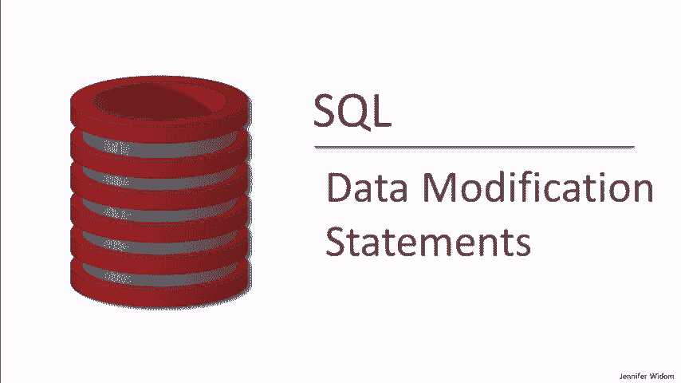

 For inserting data， there are two methods。 The first method allows us to insert one tuple into the database by specifying its actual value。

 So that's the command here。 We say "Insert into a table。"， We specify the values of a tuple。

 and the result of that command will be to insert one new tuple into the table with that value。

 The other possibility is to run a query over the database as a select statement。

 That select statement will produce a set of tuples。

 and as long as that set of tuples has the same schema as the table。

 we can insert all of the tuples into the table。 So those are the two methods of inserting data。

 and we'll see those shortly in our demo。 To delete data， we have a fairly simple command。

 It says we delete from table where a certain condition is true。

 So this condition is similar to the conditions that we see in the select statement。

 and every tuple in the table that satisfies this condition will be deleted。

 Now this condition can be fairly complicated。 It can include subqueries。

 It can include aggregation over other tables， and so on， again to be seen in our demo。 Finally。

 we're interested in updating existing data。 And that's done through a command。

 Similar to the delete command， it similarly operates on one table。

 It evaluates a condition over each tuple of the table， and now when the condition is true。

 we don't delete the tuple。 Instead， we modify the tuple。

 We take the attribute that's specified here， and we reassign it to have the value that's the result of the expression。

 As we'll see in the demo， this condition here can be fairly complicated。

 It can have subqueries and so on。 And this expression can also be quite complicated。

 It can involve queries over other tables or the same table in the database。 Finally。

 I wanted to mention that we can actually update multiple attributes in a tuple。

 So if we're updating a table， again exactly the same， a single table。

 a condition identified with the tuples update， but now we can update simultaneously any number of attributes。

 each by evaluating an expression and assigning the result of that expression to the attribute。

 As always， our demos will use the simple college admissions database with colleges， students。

 and applications。

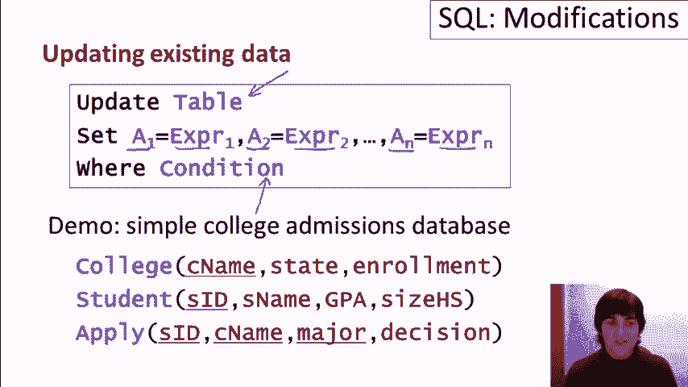

 As usual， we have four colleges， a bunch of students。

 and a bunch of applications for the students to the colleges。 We'll first see some insert commands。

 then some delete commands， and finally some update commands。 As I mentioned。

 there's two different forms of insert command。 One that inserts a tuple at a time by specifying the values。

 and another that uses subqueries to insert tuples。 So let's start with the simple one。

 Let's add a new college Carnegie Mellon to our database。

 We do that by saying we want to insert into college， we use the keyword values。

 and we simply list the values we want to insert。 The name of the college， the state。

 and the enrollment。 We run the query， and we go take a look now at the college relation。

 Let's go to college。 Here we go， and we see now that Carnegie Mellon has been added to our database。

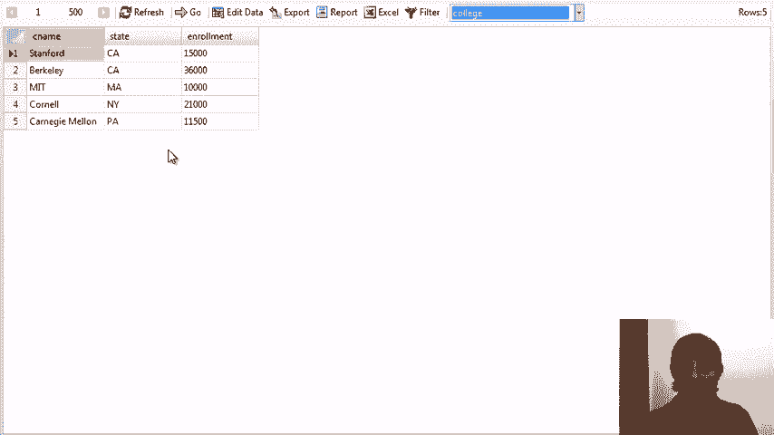

 Now let's do a little more complicated insert commands。 Now that Carnegie Mellon is in our database。

 let's have some students apply。 What we're going to do is have those students who haven't applied anywhere yet。

 apply to Carnegie Mellon to be a computer science major。 Let me take it step by step。

 Let's start by finding those students who haven't applied anywhere。

 So this is a review of what we saw earlier。 We're going to find those students whose ID is not in the subqueries that selects all of the IDs in the apply relation。

 We run the query， and we discover that we have four students who haven't yet applied anywhere。

 The next thing we're going to do is turn this query into something that constructs the tuples that we want to insert into the apply relation。

 As a reminder， the apply relation has the student's ID， the name of the college。

 the major that they're applying for， and the decision。 So we'll construct the student's ID。

 of course。 We want them to apply to Carnegie Mellon。 We want them to major in CS。 And for now。

 let's say that we don't know what the decision is， so we'll put a no value in for the decision。

 So let's run this query， and now we see for our four students， we've constructed a tuple。

 four tuples， that are ready to be inserted into the apply relation。

 They have the appropriate schema。 So now that we have that query all ready to go。

 we say insert into apply， and we run the query， and we'll see that four tuples are inserted into the apply relation。

 Let's go take a look at the relation。

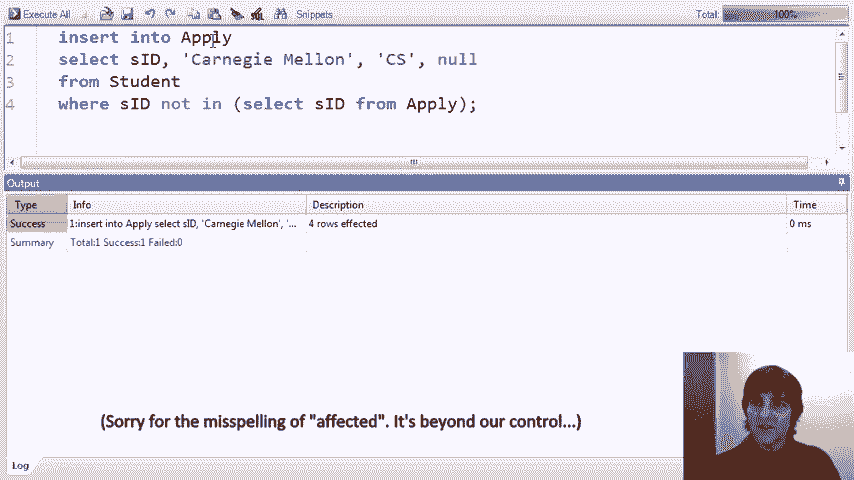

 Let's try again。 Here we've got apply， and now we see we have our four new tuples。

 and as a reminder， in this user interface， a blank cell is what's used for a null value。

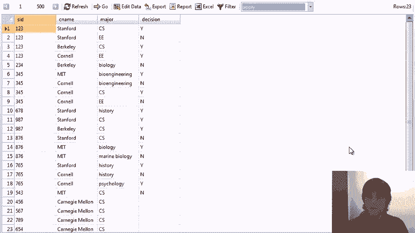

 Now let's see a little more action for Carnegie Mellon。

 Let's find students who have applied for an EE major at other colleges， and have been turned down。

 and let's have them apply to Carnegie Mellon， and let's accept them right away。 So again。

 I'm going to do this step by step。 The first thing we'll do is we will find students who have applied for EE at another college。

 So we'll change this to N， where the major equals EE。 And we want students who are rejected。

 so the decision equals no。 So we have YN for our decision。

 and let's just check how many students we have in that category。 Let's run the query here。

 and now we see there's two students， and if we went back and looked at the apply relation。

 we would find indeed they'd apply to EE and been rejected。

 Now let's turn this into a query that constructs tuples that we'd like to insert into the apply relation。

 So we need the student ID。 We want them to apply to Carnegie Mellon。 Excuse my slow typing as usual。

 This time they're going to apply to EE， and we're going to accept them right away。

 So let's just check that query。 So now we've produced two tuples that are ready to be inserted into the apply relation。

 We say insert into apply with the subquery。 We run it。

 and we see that two rows of an insert into apply。 Let's go take a look at that。

 and we need to refresh here。

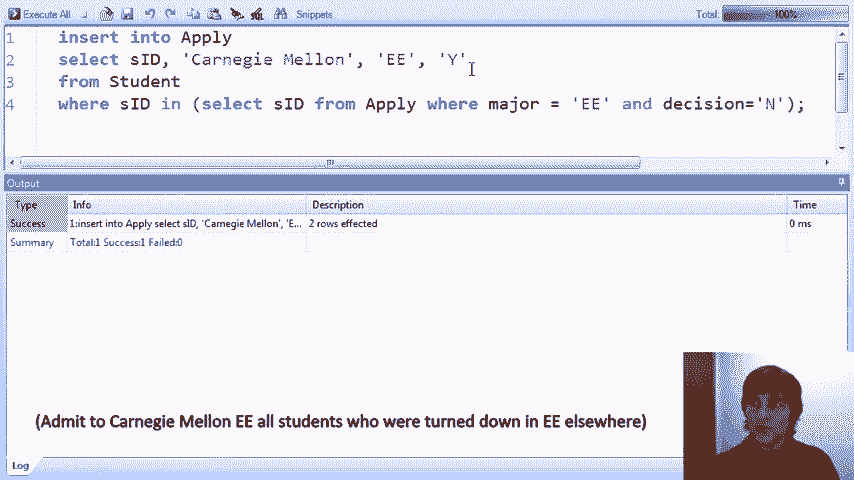

 and we look down and we see that indeed the two students have applied to EE。

 and they've been accepted。 Now let's explore the delete command。

 What we're going to do in this example is we're going to find all students who have applied to more than two different majors。

 and we're going to decide those are unreliable students。

 and we're going to entirely delete them from the database。

 So let's start by forming the query that finds the students who have applied to more than two majors。

 Here it is。 You may want to remember the group by and the having clause。

 So it says we go to the apply relation。 We form groups or partitions by SID。

 so we're going to consider the set of applications for each student individually。

 We're going to count how many distinct majors there are in each group。

 and if that number is greater than two， we're going to return the student's ID。

 and for now let's look at how many majors they applied for。

 So we find in our database that there are two students who have applied for three majors。

 and we don't like those students， so we're just going to get rid of them。 Here's how we do it。

 We say delete from student where， and as a reminder。

 the delete command is of the form delete from the table where。

 and then you can have a simple condition or a complicated condition。

 so this is a sort of complicated condition。 We're going to say where their SID is in。

 and we're going to turn this into a subquery。 We don't need to count the distinct here。 In。

 let me just format this a little better， is in the set of student IDs who have applied to more than two majors。

 So we should be deleting student 345 and 876 if all goes well。 Let's run the query。

 We did delete two rows。 Let's go back and take a look at the students。

 and we should find that 345 and 876 are gone， and indeed they are。

 Now we've deleted them from the students， but we haven't deleted them from the apply relation。

 so we can write the same deletion statement exactly as a matter of fact， and just delete from apply。

 Now I want to mention that not all database systems allow this particular deletion。

 Some database systems don't allow the， they'll allow deletion commands where the subquery includes the same relation that you're deleting from。

 and it can be a little tricky， but some do postgres does。 That's what we're running today。

 and so we'll run the query， and this time 8 rows were affected。

 so we had 8 applications for students who had applied to more than two distinct majors。 And again。

 it will be those same students， but we could go back and check if we want to look in the apply relation。

 We'll see that 876 and 345 are now gone from the apply relation as well。

 Now going back to our query， as I mentioned， some database systems don't support this form of deletion。

 and so it's a bit more complicated to do this exact deletion in those systems。

 The way to do it would typically be to create a temporary table。

 put in the results of this subquery， and then delete from apply where the student ID is present in that temporary table。

 You could give that a try on SQLite or MySQL， and see if you get the same result you ought to。

 Let's see one more deletion。 In this example， we've decided that any college that doesn't have a CS applicant is probably not worth keeping in the database and will delete it。

 We'll start by doing the select command， and then we'll translate it to a delete。

 So this select command finds colleges where their college name is not among the college names in the apply relation where the major is CS。

 In other words， this finds all colleges where nobody has applied for CS。

 We run the query and we discover that nobody's applied for CS at Cornell。

 If we want to now delete the tuple， what we do， it's very simple transformation here。

 We just say delete from college， and then the rest is the same where the college name is not among those where someone's applied to CS。

 We run the query， it's successful， and if we go back and now we look at our college relation。

 we will see that Cornell is indeed gone。

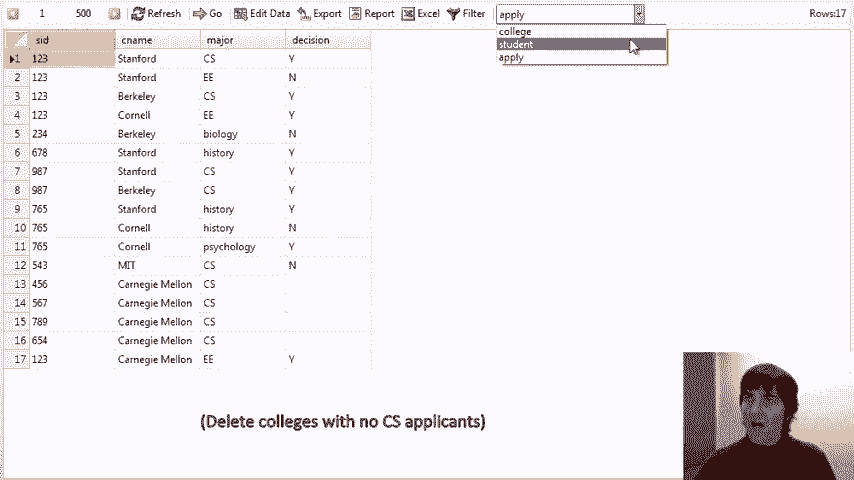

 Finally， let's take a look at some update commands。 In this first command。

 we're going to find students whose GPA is less than 3。6 and who have applied to Carnegie Mellon。

 We're going to accept those students， but we're going to turn them into economics majors。

 Let's start by finding the students who have applied to Carnegie Mellon with a GPA less than 3。6。

 Here's the query。 Again， this is a review from previous videos。

 We find in the apply relation where the college is Carnegie Mellon and where the student ID is among those students whose GPA is less than 3。

6。 We run the query and we find that there are two such applications。

 Now what we want to do is update the apply relation and we're going to accept these students but for an economics major。

 We change the select to an update and this is we're going to update the apply relation。

 We're going to update every tuple that satisfies the condition。

 We happen to know it's these two tuples and we're going to set the decision for these students to be equal to yes and we're going to set the major to be equal to economics。

 We run the query。

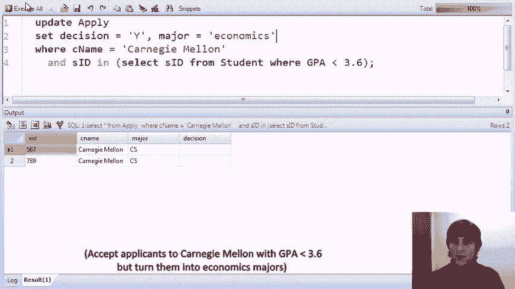

 It's succeeded and we go now and we look at the apply relation and we find these two students have now applied to economics and they've been accepted。

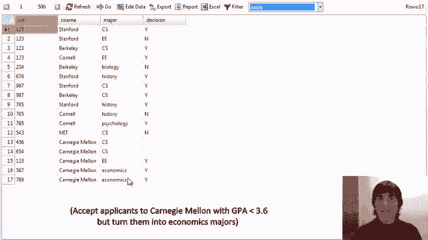

 Here's a more complicated and highly motivated update command。

 In this command we're going to find the students who have the highest GPA and has applied to major in EE and we're going to change them from an EE major to a CSE major。

 a computer science and engineering rather than just having them waste their time on electrical engineering。

 All right， so let's take a look at this query which is going to find the applications that we're going to modify。

 This query is an excellent review from previous videos because it has triply nested subqueries。

 So again our goal is to find students who have applied to major in EE。

 So here are students who have applied to major in EE but we want them to have the highest GPA of anybody who's applied to major in EE。

 So in the innermost we found this find the students who have applied to EE， their student-90s。

 then moving out one level we find the GPA's of all the students who have applied to major in EE。

 Now we find all students whose GPA is at least as high as the highest EE major， EE applicant。

 And finally we find all students who have applied to EE and have that highest GPA。 Phew， okay。

 let's run the query and see who this is。 We discover that it's student one， two。

 three and that student has applied three times actually to EE to Stanford。

 Cornell and Carnegie Mellon。 So now that we have identified those students transforming this command to do the update is actually relatively simple。

 We update apply and instead of having the major be EE we have the major be CSEE。 That major equals。

 sorry， CSEE。 That's it。 We run the query and it's succeeded and we go back and we look at the apply relation and we refresh。

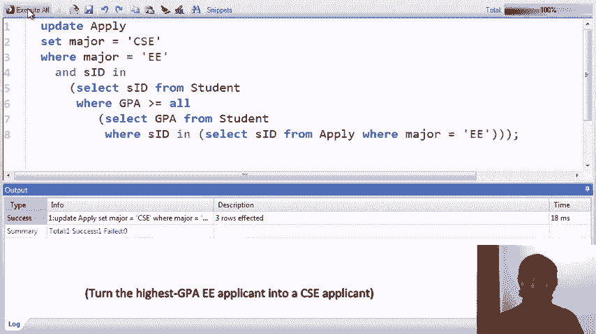

 And here we see that student one to three has now applied to CSEE rather than EE at those three universities。

 Let's see a couple more updates that are a little silly but demonstrate some features。

 In this example we're going to give every student the highest GPA and the smallest high school in the database。

 So what it's demonstrating is that in the set command the right hand side of the equals can itself be a sub query。

 Here we're updating every student， there's no where clause。

 so that means every table is going to satisfy the condition。

 And for each student we're going to set their GPA to the result of finding the maximum GPA in the database。

 And we're going to set their size high school to the result of finding the minimum size high school。

 We run the query and we go take a look at the student relation and we will see now that every student has a GPA of 3。

9， and every student has a size high school of 200。

 What we're formerly the largest and smallest values in the database。

 Our very last query says we're in a great mood today。

 let's go to our apply relation and let's accept everybody。 Very simple query just says update apply。

 there's no where condition so every couple satisfies the query。 We set the decision equal y。

 here we go make a lot of students happy， let's take a look at the apply relation and we will see now that everybody has been accepted。

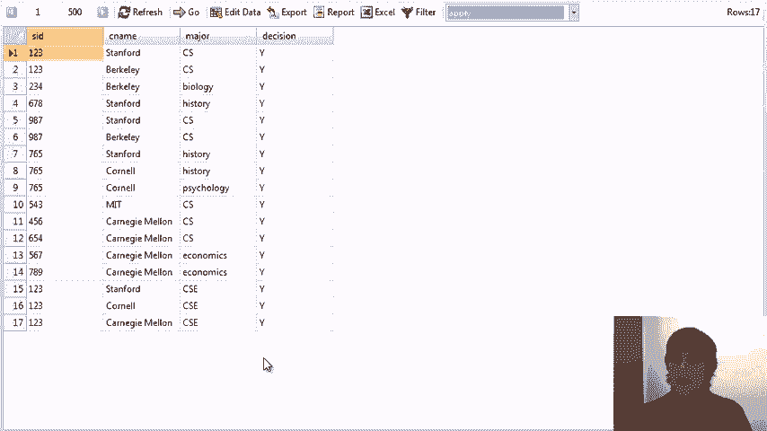

 it。