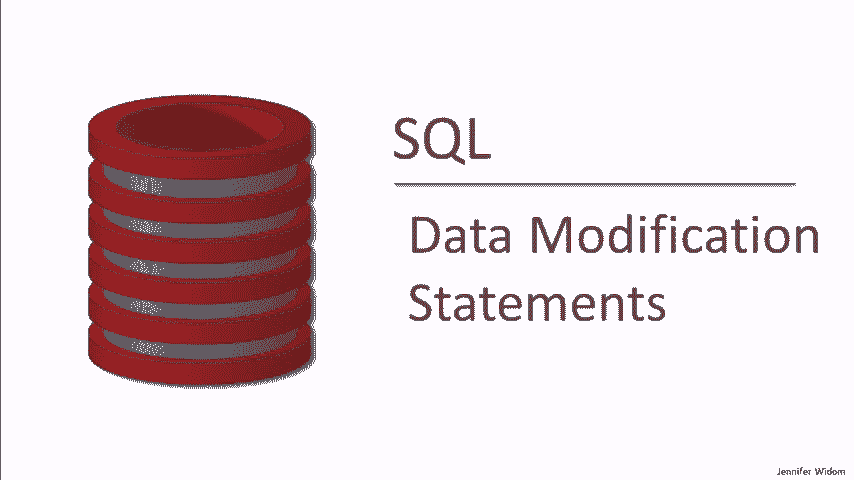
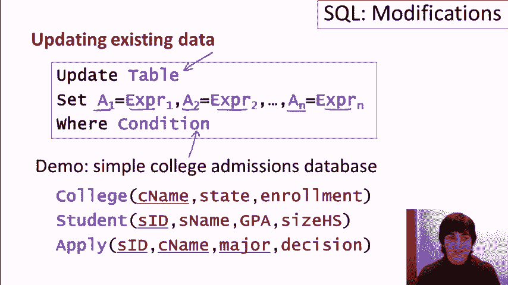
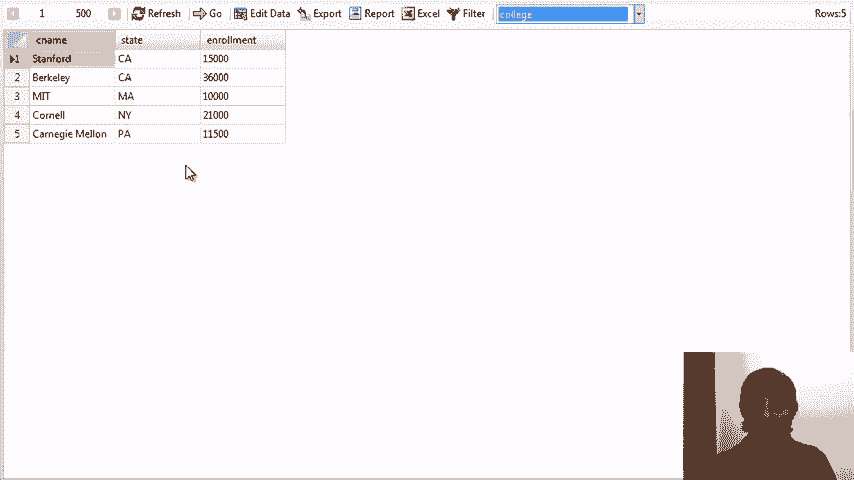
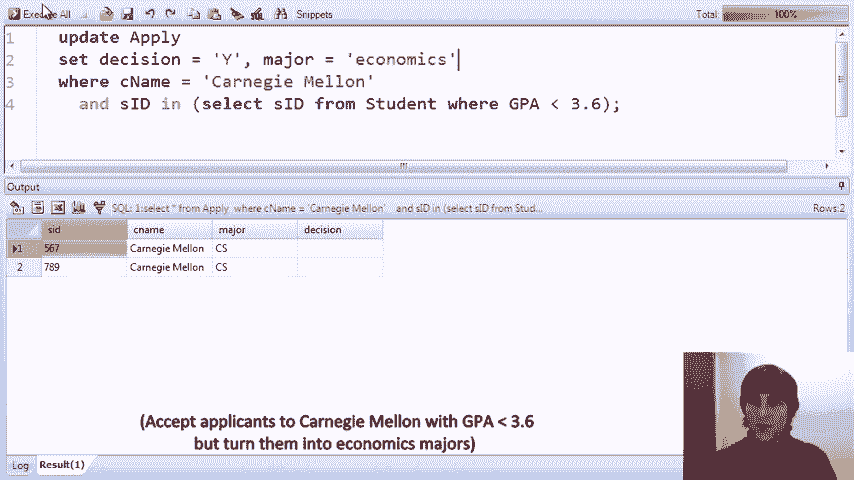
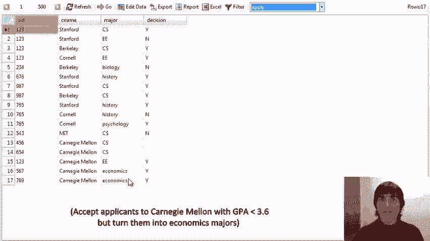
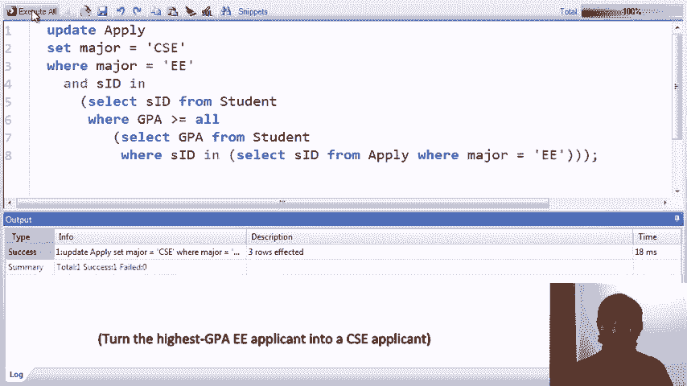

# 课程 P12：SQL 数据修改语句 🛠️

在本课程中，我们将学习 SQL 中用于修改数据库数据的核心语句，包括插入（INSERT）、删除（DELETE）和更新（UPDATE）数据。这些操作是管理和维护数据库内容的基础。

---

## 概述 📋

在之前的课程中，我们学习了如何查询数据。本节课程将重点转向如何修改数据。我们将通过具体的例子，学习三种主要的数据修改语句：`INSERT`、`DELETE` 和 `UPDATE`。我们将使用一个简单的“学院招生”数据库进行演示，该数据库包含 `college`、`student` 和 `apply` 三个表。

---



## 1. 插入数据（INSERT）

插入操作用于向数据库表中添加新的数据行。SQL 提供了两种主要的插入数据方法。

### 1.1 插入指定值



第一种方法是直接指定要插入的元组（行）的各个字段值。其基本语法如下：

```sql
INSERT INTO 表名 VALUES (值1, 值2, 值3, ...);
```

执行此命令后，一个具有指定值的新行将被添加到目标表中。

**示例**：向 `college` 表中添加一所新大学“卡内基梅隆大学”。


```sql
INSERT INTO college VALUES (‘Carnegie Mellon‘, ‘PA‘, 11500);
```


执行后，查询 `college` 表，可以看到新大学已被成功添加。

### 1.2 通过查询插入数据

第二种方法是通过 `SELECT` 查询语句生成一组元组，并将这组元组插入到目标表中。这要求查询结果的列结构与目标表完全匹配。

**示例**：让尚未申请任何学校的学生申请卡内基梅隆大学的计算机科学专业。


首先，找出未申请任何学校的学生：
```sql
SELECT sID FROM student
WHERE sID NOT IN (SELECT sID FROM apply);
```

然后，将此查询转化为插入语句，构造包含学生ID、大学名称、专业和决策（设为NULL）的元组：
```sql
INSERT INTO apply
SELECT sID, ‘Carnegie Mellon‘, ‘CS‘, NULL
FROM student
WHERE sID NOT IN (SELECT sID FROM apply);
```

执行后，这些学生的申请记录就被添加到了 `apply` 表中。

---

## 2. 删除数据（DELETE）

删除操作用于从表中移除满足特定条件的行。其基本语法如下：

```sql
DELETE FROM 表名 WHERE 条件;
```
`WHERE` 子句中的条件可以像 `SELECT` 语句中的条件一样复杂，可以包含子查询和聚合函数。

**示例**：删除所有申请了超过两个不同专业的学生。

首先，找到这些学生：
```sql
SELECT sID FROM apply
GROUP BY sID
HAVING COUNT(DISTINCT major) > 2;
```

然后，从 `student` 表中删除这些学生：
```sql
DELETE FROM student
WHERE sID IN (
    SELECT sID FROM apply
    GROUP BY sID
    HAVING COUNT(DISTINCT major) > 2
);
```

需要注意的是，某些数据库系统可能对 `DELETE` 语句中的子查询有限制。如果遇到限制，可以先将子查询结果存入临时表，再进行删除。


**另一个示例**：删除没有任何学生申请计算机科学专业的学院。
```sql
DELETE FROM college
WHERE cName NOT IN (
    SELECT cName FROM apply WHERE major = ‘CS‘
);
```

---

## 3. 更新数据（UPDATE）

更新操作用于修改表中现有行的数据。它可以同时更新一个或多个列。其基本语法如下：





```sql
UPDATE 表名
SET 列名1 = 表达式1, 列名2 = 表达式2, ...
WHERE 条件;
```
`WHERE` 子句用于筛选需要更新的行，`SET` 子句指定如何修改这些行的值。表达式和条件都可以非常复杂。

**示例**：接受所有GPA低于3.6且申请了卡内基梅隆大学的学生，并将其专业改为“经济学”。
```sql
UPDATE apply
SET decision = ‘Y‘, major = ‘economics‘
WHERE cName = ‘Carnegie Mellon‘
AND sID IN (SELECT sID FROM student WHERE GPA < 3.6);
```

**复杂示例**：将所有申请了EE（电气工程）专业且GPA最高的学生的专业改为“CSEE”（计算机科学与电子工程）。
```sql
UPDATE apply
SET major = ‘CSEE‘
WHERE major = ‘EE‘
AND sID IN (
    SELECT sID FROM student
    WHERE GPA >= ALL (
        SELECT GPA FROM student
        WHERE sID IN (SELECT sID FROM apply WHERE major = ‘EE‘)
    )
);
```

**全局更新示例**（无 `WHERE` 条件）：将所有学生的GPA设置为数据库中的最高GPA，并将所有学生的高中规模设置为最小值。
```sql
UPDATE student
SET GPA = (SELECT MAX(GPA) FROM student),
    sizeHS = (SELECT MIN(sizeHS) FROM student);
```

**接受所有申请者**：
```sql
UPDATE apply SET decision = ‘Y‘;
```



---

## 总结 🎯

在本课程中，我们一起学习了 SQL 中三种核心的数据修改操作：

1.  **INSERT**：用于向表中添加新数据，可以通过直接指定值或通过 `SELECT` 查询结果来实现。
2.  **DELETE**：用于从表中移除满足特定条件的数据行，条件可以包含复杂的子查询。
3.  **UPDATE**：用于修改表中现有行的数据，可以同时更新多个列，并支持在 `SET` 和 `WHERE` 子句中使用子查询。


掌握这些语句，你就能有效地对数据库中的数据进行增、删、改操作，这是进行数据库管理和应用开发的重要基础。请务必通过实践来巩固对这些命令的理解。