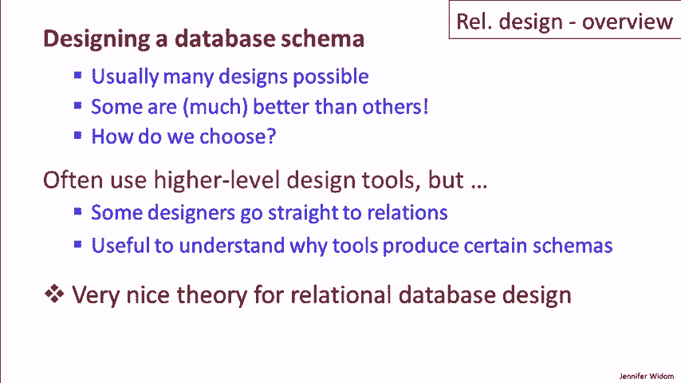
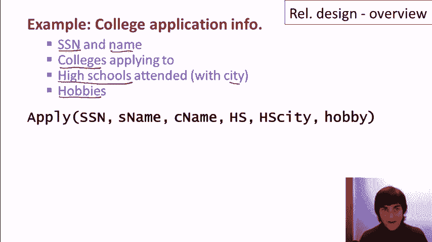
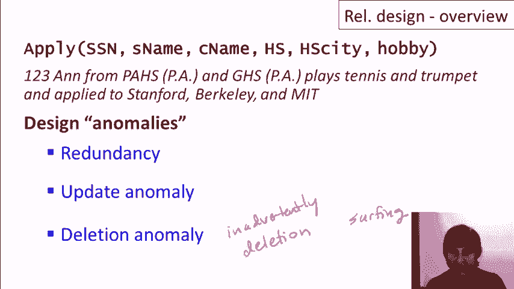
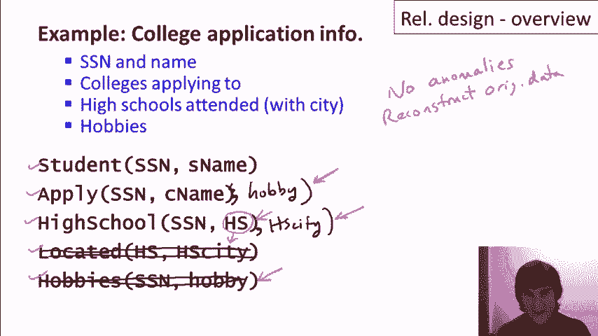
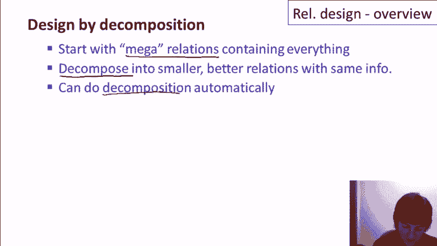
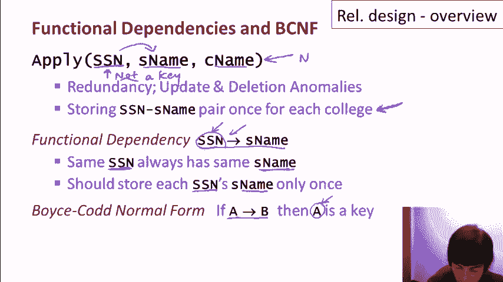
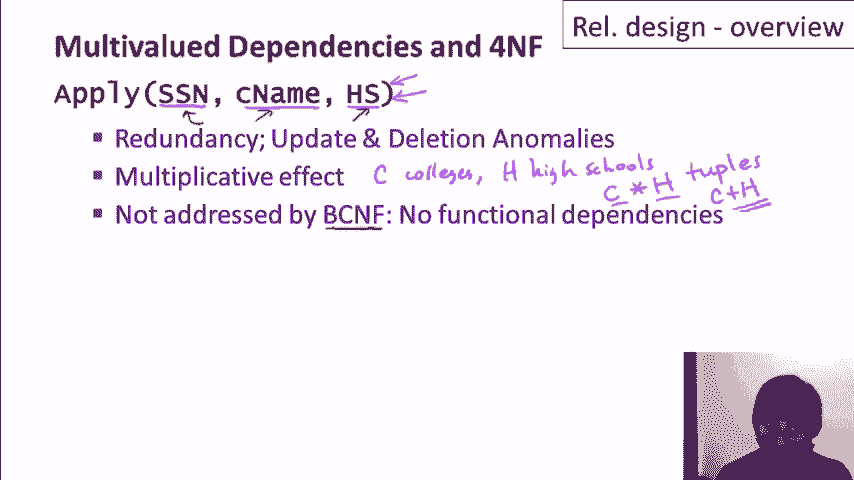
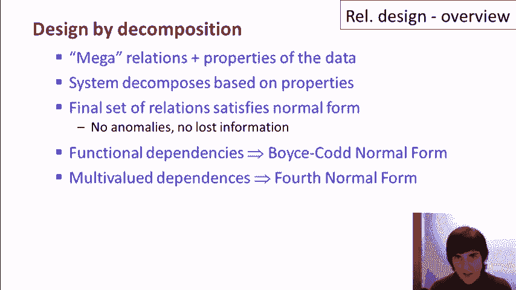

# P13：07-01-relational-design-overview.mp4 - 哈库那玛塔塔i - BV1R4411u7dt

 In this sequence of videos， we'll learn about designing good schemas for relational databases。

 So let's suppose we're building a database for an application or set of applications。 and we have to figure out what schema we want to store our data。 Usually。 there are many different possible schema designs for a database。 and databases do tend to get quite complicated， and some designs are much better than others。

 So how do we choose what design to use？ Now， the reality is that people often use higher level tools。 to design relational databases， and don't design the schemas directly themselves。 But some designers do go straight to relations， and furthermore。 it's useful to understand why the relations that are produced by design tools， are what they are。

 Furthermore， from an academic point of view， it turns out there's a very nice theory。

 for relational database design。 So let's consider the process of designing the schema for our database about students applying to colleges。 Specifically， for a given student， let's suppose we have their social security number。 and their name， the colleges that student is applying to。 the high schools they attended and what city those high schools were in， and the students' hobbies。

 So if that's what we want， we can create a single relation called apply。 that has one attribute for each of those pieces of information。

 Now let's take a look at how that database would be populated。 Let's suppose that we have a student and with Social Security number 123。 she went to two different high schools in Palo Alto， she plays tennis and the trumpet。 and she's applying to Stanford， Berkeley， and MIT。

 So let's look at some of the tuples that we would be having in the apply relation。 to represent this information about Anne。 So we'll have 123 Anne， her name。 she's applying to Stanford， she went to Palo Alto High School and that's in Palo Alto。 and one of her hobbies is tennis。 And then we also have 123 Anne， she applied to Berkeley。

 and went to Palo Alto High School in Palo Alto， and tennis there as well。 Of course。 she also has a tuple representing the fact that she's applying to Berkeley。 and we'll stick with Palo Alto High School and she played the trumpet。 And as you can see。 we'll have more tuples， we'll have various Stanford and Berkeley's。

 we'll have some for her other high school， it's called Gun High School， also in Palo Alto。 and so on。 So if we think about it， we will need a total of 12 tuples。 to represent this information about Anne。 Now， do we think that's a good design？

 I'm going to argue no， it's not a good design。 There are several types of anomalies in that design。 First of all， we capture information multiple times in that design。 and I'll give some examples of that。 For example， how many times do we capture the fact that 123。 the Social Security number， is associated with a student named Anne。

 we capture that 12 times in our 12 tuples。 How many times do we capture that Anne went to Palo Alto High School？

 We're going to capture that six times， and we're going to capture the fact that she plays 10 as six times。 and we're going to capture the fact that she went to， applied to MIT four times。 So for each piece of information， in fact， we're capturing it many， many times。 So that doesn't seem like a good feature of a design。 The second type is an update anomaly。

 and that's really a direct effect of redundancy。 What update anomalies say is that you can update facts in some places。 but not all， or differently in different places。 So let's take the fact， for example。 that Anne plays the trumpet。 I might decide to call that the cornet instead。 but I can go ahead and I can modify， say， three of the instances。

 where we capture the fact about her playing the trumpet， and not the fourth one。 and then we end up with what's effectively， an inconsistent database。 And the third type of anomaly that can occur is called the deletion anomaly。 And there is a case where we can inadvertently， completely do a complete deletion of somebody in the database。

 Let's say， for example， that we decide that surfing is an unacceptable hobby。 for our college applicants， and we go ahead and we delete the tuples about surfing。 If we have students who have surfing as their only hobby。 then those students will be deleted completely。

 Now you may argue that's the right thing to do， but probably that isn't what was intended。 So now let's take a look at a very different design for the same data。 Here we have five different relations， one with the information， about students and their names。 one where they've applied to colleges， one where they went to high school。

 where their high schools are located， and what hobbies the student has。 In this case。 we have no anomalies。 If we go back and look at the three different types。 they don't occur in this design。 We don't have redundant information。 we don't have the update anomaly， or the deletion anomaly。 Furthermore。

 we can reconstruct all of the original data from our first design。 So we haven't lost any information by breaking it up this way。 So in fact。 this looks like a much better design。 Now let me mention a couple of modifications to this design that might occur。 Let's suppose， for example， that the high school name alone is not a key。

 So when we break up the high school name in high school city。 we no longer can identify the high school。 In that case。 the preferred design would be to move the high school city up here。 So we'll have that together with the high school name， and then we don't need this relation here。

 And actually， that's a fine design。 It does not introduce any anomalies。 That's just based on the fact that we need the name of the high school together。 with the city to identify it。 As another example， suppose a student doesn't want all of their hobbies revealed。 to all of the colleges that they're applying to。 For example。

 maybe they don't want Stanford to know about their surfing。 If that's the case。 then we can modify the design again。 And in that case。 we would put the hobby up here with where they're applying to college。 And so that would include the hobbies that they want to reveal， to those particular colleges。

 and we'll take away this one。 So it looked like we were taking our nice small relations and moving back to a design。 that had bigger relations。 But in this case， it was very well motivated。 We needed these attributes together to identify the high school。 and we wanted to have our hobbies specific to the colleges。

 So what that shows is that the best design for an application of relational databases。 depends not only on constructing the relations well， but also in what the data。

 is representing in the real world。 So the basic idea of what we're going to do is design by decomposition。 Specifically， we're going to do what we did at the very beginning of this example。 which is start by creating mega relations that just contain attributes。 for everything that we want to represent in our database。

 Then we're going to decompose those mega relations into smaller ones。 that are better but still capture the same information。 And most importantly。 we can do this decomposition automatically。

 So how does automatic decomposition work？ In addition to the mega relations。 we're going to specify formally properties of the data。 The system is going to use the properties to decompose the relations。 and then it's going to guarantee that the final set of relations satisfy what's。

 called a normal form， and we'll be formalizing all of this。 But the basic idea behind normal forms is that they don't have any of those anomalies。 that I showed， and they don't lose any information。 So specifically。 for specification of properties， we're going to begin by looking at something called functional dependencies。

 And once we specify functional dependencies， the system will generate relations that are in what's called Boyce-Codd normal form。 And Boyce-Codd， by the way， were two early pioneers in relational databases in general。 Then we're going to look at another type of specification called multi-value dependencies。 which will add to functional dependencies。 And when we have both functional and multi-value dependencies。

 then we can have what's called fourth normal form。 And again。 that would be relations that are generated by the system that satisfy the normal form。 Boyce-Codd normal form is stricter than fourth normal form。 Specifically。 if we make a big Venn diagram here of all the relational designs。

 that satisfy Boyce-Codd normal form， which， by the way， is very often abbreviated B， C， and F。 then that contains all of the relations that satisfy fourth normal form。 normally abbreviated four and F。 So every relation that's in fourth normal form is also in Boyce-Codd normal form。 but not vice versa。 Now you might be wondering what happened to first， second。

 and third normal forms。 So first normal form is pretty much just a specification that relations are real relations。 with atomic values in each cell。 Second normal form is specifying something about the way relations are structured。 with respect to their keys。 Neither of those is discussed very much anymore。 Third normal form is a slight weakening of Boyce-Codd normal form。

 And sometimes people do like to talk about third normal form。 So you can think of third normal form as a little bit of an even bigger circle here。 We're not going to cover third normal form in this video。 because Boyce-Codd normal form is the most common normal form used。

 if we have functional dependencies only and fourth normal form。 if we have functional and multi-dependence。 So what's going to happen next is I'm going to give some examples。 to motivate these four concepts， functional dependencies， Boyce-Codd normal form。 multi-value dependencies in fourth normal form， and then later videos will go into each one in much greater depth。

 So let me just give the general idea of functional dependencies and Boyce-Codd normal form。 And we'll use a very simple example， an abbreviated version of our apply relation。 that has student social security numbers， the student's name。 and their colleges that the student is applying to。

 Even this small relation actually has redundancy and update and deletion anomalies。 Specifically。 let's say that our student 123-AN applies to seven colleges。 then there will be seven tuples and there will be seven instances。 where we know that the student with social security number 123 is named AN。 Specifically。

 we're going to store for every student the name， and social security number pair once for each college that they apply to。 So now let me explain what a functional dependency is。 and then we'll see how functional dependencies are used to recognize。 when we have a bad design like this one and to see how we can fix it。 A functional dependency。

 in this case from social security number to name， and we're saying social security number functionally determines。 to the student name， says that the same social security number always has the same name。 In other words， every time we see 123， we're going to see AN。 Now。 it doesn't necessarily go in the other direction。 It might not be that whenever we see AN it's 123。

 but whenever we see 123 it is AN。 And so what we'd like to do is store that relationship just one time。 one time say that for 123 the name is AN。 Now what Boyce-Codd Normal form says is that whenever we have one of these functional dependencies。 then the left-hand side of that functional dependency must be a key。 And think about what that's saying。 Remember， a key says that we have just one tuple with each value for that attribute。

 So if we have say social security number to name as a functional dependency。 and we satisfy Boyce-Codd Normal form， then we're going to say that social security number has to be a key in our relation。 and we'll only have one tuple for each social security number。 Specifically。 we can go back to our original relation。 We have this functional dependency。

 Social security number here is not a key， right？ So then we know that this is not in Boyce-Codd Normal form。

 So we're going to use functional dependencies to help us decompose our relation。 so that the decompose relations are in Boyce-Codd Normal form。 And here's what would happen in this example。 Our functional dependency would tell us to pull out the social security number and student name。 into its own relation where the social security number is a key。

 and then we have just one time for each social security number， that student's name。 and then separately we'll have the information about the students and which colleges they applied to。 Again， we'll completely formalize this whole idea， the definition of functional dependencies。 their properties， the normal form， and how we do the decomposition in a later video。

 Now let's similarly motivate the concept of multi-value dependencies and fourth normal form。 It is actually a little bit more complicated， but follows the same rough outline。 Now let's look at a different portion of the information about applying。 and let's suppose for now that we're just concerned about students。

 what colleges they're applying to， and what high schools they went to。 We still have redundancy and update and deletion anomalies。 For example。 a student who applies to Stanford is going to have that fact captured once for every。 high school that they went to。 A student who went to Palo Alto High School will have that fact captured once for every college they apply to。

 In addition， we get a kind of multiplicative effect here。 because let's say a student applies to C colleges and they went to H high schools。 I know students don't go to a lot of high schools， but let's suppose this is one who moved a lot。 In that case， we're going to have C times H tuples。

 What we'd really like to have is something more on the order of C plus H。 because then we'd be capturing each piece of information just once。 Now the interesting thing is that the badness of this particular design is not addressed by。 Boy's Cod Normal form。 In fact， this relation is in Boy's Cod Normal form because it has no。

 functional dependencies。 It's not the case that every instance of a social security number is。 associated with a single college name or a single high school。 As we'll see later。 if there are no functional dependencies， then the relation is automatically in Boy's Cod Normal form。 But it's not in fourth normal form。

 So fourth normal form is associated with what are called multi-value dependencies。 When we specify a multi-value dependency， as we've done here with the double arrow。 what this is saying is that if we take a particular social security number， in the relation。 we will have every combination of college names that are associated with that。

 social security number with every high school that's associated with that social security number。 We'll actually see that when we have this multi-value dependency。 we automatically have this one too。 You know， it seems a bit complicated。 We will formalize it completely， but for now， just think about the English statement that multi-value dependency is saying that we're。

 going to have every combination of those two attributes or the values in those attributes。 for a given social security number。 In other words。 those values are really independent of each other。 So if we have that situation。 then what we should really do is store each college name in each high。

 school for each social security number one time。 And that's what fourth normal form will do with that。 do for us。 Fourth normal form， similarly to Boyzka normal form， says if we have a dependency。 then the left hand side must be a key。 In this case， it's a multi-value dependency we're looking at。 so it's really saying something different。 But the basic idea is the same， which is that we want。

 only one tuple that has each value that appears on the left hand side of a multi-value dependency。 So let's see what would happen in this example。 If we use our multi-value dependencies。 to decompose the relation based on the idea of fourth normal form， well it is the intuitive。 thing that happens。 We separate the information about the college names that a student applies to。

 from the information about the high schools themselves。 and then we'll see that we only store each fact， once and we do get the behavior of having C plus H tuples instead of C times H tuples。 Like with functional dependencies in Boyzka normal form will be completely formalizing all of this。 reasoning and the definitions in later videos。 To summarize， we're going to do relational design。

 by decomposition。 We're going to start by specifying mega-relations that contain all the。 information that we want to capture， as well as specifying properties of the data， usually。 reflecting the real world in some fashion。 The system can automatically decompose the mega-relations。 into smaller relations based on the properties we specified and guarantee that the final set of。

 relations have certain good properties captured in a normal form。 They will have no anomalies and。 they'll be guaranteed not to lose information。 We'll start by specifying properties as functional。 dependencies and from there the system will guarantee Boyzka normal form。 and then we'll add to that， property specified as multi-valued dependencies and from there the system will guarantee fourth normal。

 form which is even stronger than Boyzka normal form and is generally thought to be good relational design。

