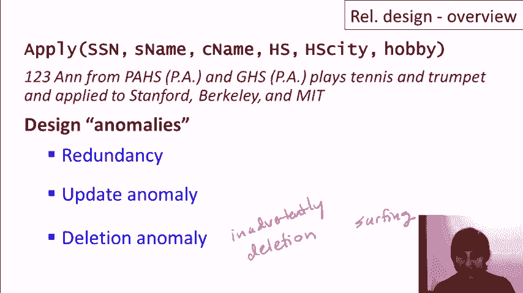
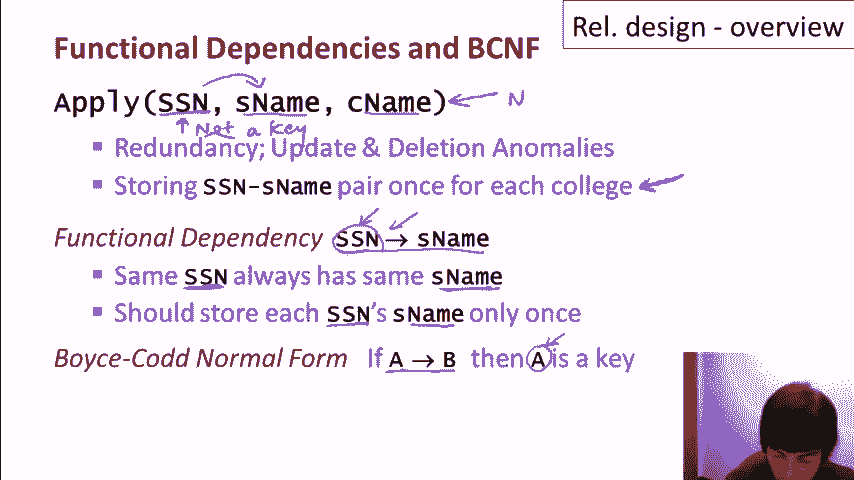
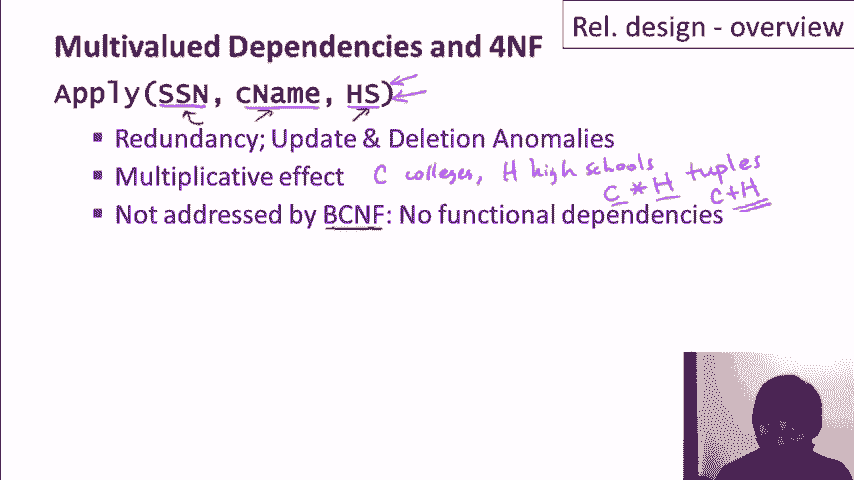

# 课程 P13：关系数据库设计概述 🗂️

在本节课中，我们将学习如何为关系数据库设计良好的模式。我们将探讨为什么某些设计优于其他设计，并介绍一种通过分解大型关系来避免数据冗余和异常的理论方法。

---


## 设计目标与挑战

假设我们正在为一个应用程序构建数据库，需要确定存储数据的模式。数据库通常有多种可能的设计方案，其中一些设计远比其他设计更好。


那么，我们如何选择合适的设计呢？虽然人们通常使用高级工具来设计关系数据库，但直接理解关系设计本身以及设计工具背后的原理是非常有用的。

从学术角度看，关系数据库设计有一套完善的理论。

---

## 一个设计示例：学生申请数据库

让我们考虑为一个大学申请学生数据库设计模式。对于每个学生，我们想存储以下信息：社会安全号码、姓名、申请的大学、就读的高中、高中所在城市以及学生的爱好。

### 初始设计：单一关系

一种直接的方法是创建一个名为 `apply` 的单一关系，包含所有属性。

```sql
CREATE TABLE apply (
    ssn INT,
    name VARCHAR(255),
    college VARCHAR(255),
    high_school VARCHAR(255),
    hs_city VARCHAR(255),
    hobby VARCHAR(255)
);
```

现在，让我们看看如何用数据填充这个数据库。假设有一个学生（社会安全号码123，名叫Anne），她申请了三所大学，就读于两所高中，并有两个爱好。



为了表示Anne的所有信息，我们需要创建多个元组。例如，她申请斯坦福、就读帕洛阿尔托高中、爱好网球，这需要一个元组。她申请伯克利、就读同一所高中、同一爱好，这需要另一个元组。以此类推，最终需要12个元组来表示Anne的所有信息组合。

### 初始设计的问题

这个设计存在几种异常类型：

1.  **冗余**：同一条信息被多次记录。例如，Anne的社会安全号码和姓名被记录了12次，她上帕洛阿尔托高中的事实被记录了6次。
2.  **更新异常**：由于冗余，更新信息时可能无法保持一致性。例如，如果将Anne的爱好“小号”改为“短号”，但只更新了部分记录，数据库就会变得不一致。
3.  **删除异常**：删除某些信息时，可能会意外删除其他信息。例如，如果删除所有“冲浪”爱好的记录，那么唯一爱好是冲浪的学生信息将被完全从数据库中移除。

---

## 改进的设计：分解关系

现在，让我们看看同一数据的另一种设计。我们创建五个不同的关系：


*   `students(ssn, name)`
*   `applications(ssn, college)`
*   `schools(ssn, high_school)`
*   `locations(high_school, hs_city)`
*   `hobbies(ssn, hobby)`

在这个设计中，上述三种异常都不会发生。信息没有冗余，更新和删除操作不会导致不一致或信息丢失。更重要的是，我们可以从这五个关系中重建出初始设计中的所有原始数据。


### 设计调整的考量

设计可以根据实际需求进行调整：

*   **标识高中**：如果仅凭高中名称不足以唯一标识一所学校（例如，不同城市可能有同名高中），那么更好的设计是将 `schools` 关系改为 `schools(ssn, high_school, hs_city)`，并去掉单独的 `locations` 关系。
*   **隐私考虑**：如果学生不希望所有大学都知道其全部爱好，我们可以修改设计，将爱好与特定大学关联：`hobbies(ssn, college, hobby)`。

这表明，最佳的关系数据库设计不仅取决于如何构建关系，还取决于数据的实际语义和业务需求。

---

## 设计方法论：通过分解进行规范化

上一节我们看到了分解如何改进设计。接下来，我们将形式化这一过程。

基本思路是：首先创建一个包含所有待存储属性的“超级关系”，然后根据数据的属性（约束）将其自动分解为更小的、更好的关系，同时保证不丢失任何信息。

这个过程称为**规范化**。系统将保证最终的关系集满足特定的**范式**要求，这些范式正是为了消除我们之前讨论的异常而定义的。

我们将主要关注两种范式：

1.  **Boyce-Codd范式**：基于**函数依赖**。
2.  **第四范式**：基于**函数依赖**和**多值依赖**。

所有满足第四范式的关系也一定满足Boyce-Codd范式，但反之则不成立。

> **注**：第一范式要求关系中的值是原子的；第二、三范式如今较少讨论，第三范式是Boyce-Codd范式的一种轻微弱化形式。本课程将重点讲解最常用的Boyce-Codd范式和第四范式。



---

## 核心概念预览

在后续课程中，我们将深入讲解以下概念。这里先做一个简要介绍以激发理解。

### 函数依赖与Boyce-Codd范式

考虑一个简化的 `apply` 关系：`apply(ssn, name, college)`。

即使在这个小关系中，也存在冗余：如果学生123（Anne）申请了7所大学，那么她的社会安全号码和名字会被存储7次。

*   **函数依赖**：`ssn -> name`。这表示社会安全号码**函数决定**姓名，即相同的`ssn`总是对应相同的`name`。
*   **Boyce-Codd范式**要求：如果一个关系中有函数依赖 `X -> Y`，那么 `X` 必须是该关系的**超键**（即能唯一标识元组）。
*   在我们的例子中，`ssn` 不是 `apply` 关系的键（因为一个`ssn`会对应多个`college`），所以它不符合Boyce-Codd范式。
*   **解决方案**：根据函数依赖进行分解。我们可以将其分解为：
    *   `student(ssn, name)` （其中 `ssn` 是键）
    *   `applies(ssn, college)`



### 多值依赖与第四范式

考虑另一个关系：`apply2(ssn, college, high_school)`。

假设一个学生申请了C所大学，就读过H所高中。在这个设计中，我们将得到 C × H 个元组，因为每个大学都要与每所高中组合记录一次。这导致了乘法冗余。

*   **多值依赖**：`ssn ->> college` 和 `ssn ->> high_school`。这表示对于给定的`ssn`，其对应的`college`值和`high_school`值是相互独立的，并且所有组合都会出现。
*   这个关系可能没有违反Boyce-Codd范式（如果没有函数依赖），但它违反了第四范式。
*   **第四范式**要求：如果一个关系中有非平凡的多值依赖 `X ->> Y`，那么 `X` 必须是该关系的超键。
*   **解决方案**：根据多值依赖进行分解。我们可以将其分解为：
    *   `applies_to(ssn, college)`
    *   `attended(ssn, high_school)`
    *   这样，元组数量就从 C × H 减少到了 C + H。

---

## 总结

本节课中，我们一起学习了关系数据库设计的基本目标和方法。

我们了解到，糟糕的设计会导致数据冗余、更新异常和删除异常。通过将包含所有信息的大型关系**分解**为更小的关系，可以消除这些异常。

这一分解过程可以基于数据的属性（如函数依赖和多值依赖）自动进行，并保证结果满足特定的**规范化形式**（如Boyce-Codd范式和第四范式），从而确保设计既高效又可靠。


在接下来的课程中，我们将深入探讨函数依赖、Boyce-Codd范式、多值依赖和第四范式的形式化定义、性质及分解算法。