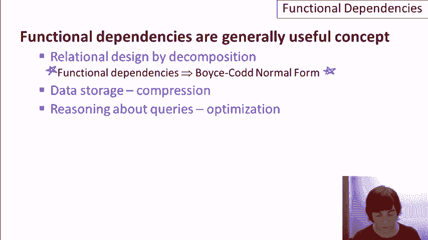

# P14：07-02-功能依赖.mp4 - 哈库那玛塔塔i - BV1R4411u7dt

本视频涵盖了功能依赖。

首先，快速回顾一下通过分解进行关系设计的概念。这个思想是，应用设计师编写包含所有信息的超级关系，包含我们要存储的数据的所有属性，然后系统会根据指定的属性自动对这些关系进行分解。

最终的分解关系集将满足所谓的**范式**，范式是良好的关系，意味着它们没有异常，也不会丢失原始大关系中指定的信息。现在，这些属性本身是通过功能依赖来定义的。

在这种情况下，系统将生成Boyce-Codd范式关系，或者多值依赖，进而产生第四范式关系。所以，如你所见，本视频是关于功能依赖的。让我说，功能依赖实际上是一个非常有用的概念。

在数据库中，不仅仅是关系设计，功能依赖也有广泛的应用。对于功能依赖，正如我们很快就会看到的，它是键概念的推广，它允许系统例如在系统了解功能依赖的情况下，更高效地存储数据。基于功能依赖的压缩方案可以用于存储。并且还有其他的用途。

功能依赖，作为键的推广，可以用来推理查询和进行查询优化，提醒一下，这是数据库系统中一个非常重要的方面，它允许系统高效地执行声明式查询。顺便提一下，功能依赖的第三个用途是用于考试题目。

在数据库课程中，因为功能依赖有非常好的理论，如你将看到的那样，它也相对容易编写相关问题。因此，本视频的其余部分将涵盖功能依赖作为一个通用概念，而不仅仅是关系设计相关内容，之后的视频将把功能依赖与分解设计联系起来。

和往常一样，我们将使用一个大学申请数据库作为示例，在这个案例中，我扩展了我们要包含的信息量。我们将在本视频以及后续的关系设计视频中，使用这两个关系作为示例。在这个例子中，我们将查看两个关系。

一个包含学生信息，另一个包含他们申请的学校信息。学生信息将包括社会保障号码、学生姓名、住址，和三项关于他们高中的属性。我们假设每个高中都有唯一的代码。

但它们也有名字，并且在一个城市里。最后，学生的GPA和稍后我们会看到的招生优先级字段。对于申请，我们将有学生的社会安全号码，申请的大学名称，大学所在州，申请日期和专业。

并不是所有这些属性都会在这个视频中使用，但正如我所说，这个例子将在多个视频中贯穿始终。为了说明功能依赖的概念，让我们集中讨论学生关系，特别是GPA和优先级这两个属性。假设学生的优先级由他们的GPA决定。例如。

我们可能会有一个规则，表示如果GPA大于3.8，那么优先级为1。如果GPA在3.3和3.8之间，那么我们将优先级设为2。如果GPA小于3.3，那么优先级值为3。所以如果这个关系在我们的数据中是被保证的，那么我们可以说，任何两个。

具有相同优先级的元组一定会有相同的GPA。让我们来形式化这个概念。所以我要写一个小的逻辑表达式来形式化这个概念。我会使用谓词逻辑中的全称符号，并且我要说，如果我们有任意一对元组，那么对于所有的t和u，这些都是元组。

在学生关系中，如果学生t和u具有相同的优先级，我会说，抱歉，应该是相同的GPA。如果t.gpa等于u.gpa，那么这就是逻辑蕴含符号，t.priority就等于u.priority。所以这个逻辑表达式实际上就是功能依赖的定义。

我们会把这个功能依赖写作gpa箭头priority。所以这意味着GPA决定了优先级，或者说任何两个具有相同GPA的元组必须有相同的优先级。这个是一个具体的例子。现在让我们来概括我们的定义。把这里的gpa和priority替换成两个属性A和B，假设它们属于关系R。

然后我们还需要修改我们的定义。所以你可以看到我已经删除了具体的属性和关系。现在我只说，在我们的关系R中，对于每一对t和u，如果t.a等于u.a，那么t.b就等于u.b。这就是关系R中功能依赖“A决定B”的定义。

实际上，我将进一步概括这个定义，因为功能依赖不一定每一边都有一个属性。它们实际上可以有一组属性。所以现在我把左边写成A1，A2，点点点，An。这些都是关系R中的属性，而右边则是B1，B2，逗号，Bm，依然是R中的属性。修改后的正式定义如下图所示。

现在我不能再使用点符号了。所以我将使用方括号，并写A1到An等于方括号A1到An。我在这里想表达的是，在这种情况下，两个元组t和u对于所有属性A1到An的值是相同的。

如果它们确实相等，那么它们对于B1到Bm的值也将相同。我们很快就会看到一些具体的例子。在继续之前，最后一点符号约定。为了简便起见，我在视频中会经常使用竖线来缩写一组属性或属性集。所以，我会写A bar来表示属性集A，B bar来表示属性集B。

再次强调，这仅仅是为了方便。我们已经看到了关系中函数依赖的动机。一个关系的函数依赖是基于对现实世界数据的理解。当我们指定一个依赖关系时，就像指定键一样，关系中的所有实例都必须遵守这个函数依赖。

总结一下函数依赖关系：我们说一组属性A函数性地决定一组属性B。也就是说，每当元组在其A值上相等时，它们的B值也会相等。假设我们的关系R包含A中的元组，B中的元组，还有一些其他的属性，我们称它们为C。

现在让我画一个包含这些属性的关系图。我们这里有三个列，但这些列实际上是多个属性。这些是属性A，这些是属性B，而这些是属性C。如果我们插入几个元组，我们会说，如果有两个元组，其值是相同的。

我还将对元组中的这些值使用竖线。如果我们有两个元组，它们的A值相同，则它们的B值也必须相同。我们将在后续的推理中使用这种模板。但我们并不要求它们的C值必须相同，因此我们可以有C1，也可以有不同的C值。

但如果我们指定这个函数依赖关系，意味着我们的关系中的每个实例都必须满足这样的条件：如果A值相同，则B值也必须相同。最后，让我们回到我们的例子，我认为当我们开始为实际的关系编写函数依赖时，你会更好地理解它们究竟捕捉了什么。

现在，让我们根据我们预期在现实世界中捕获的数据，为我们的学生关系写几个函数依赖关系。以下是第一个例子：社会保障号码函数性地决定学生姓名（S name）。所以我们说，如果我们有关于某个学生的多个元组，它们具有相同的社会保障号码，例如学生一的两个元组。

两个和三个，我们预期它们有相同的名称。实际上，我们要求它们有相同的名称，假设一到三可以识别学生，那么这将是一个自然的函数依赖关系，在这种情况下会成立。

同样，我们可以预期社会安全号码决定地址，尽管我们在这里已经做出了一些关于现实世界的假设。如果我们有这种特定的函数依赖关系，那么我们是在说一个学生不会搬家。每个通过社会安全号码描述学生的元组都会有相同的地址。让我们来看一下高中的情况，看看那里的情况可能是什么样的。

我提到过高中代码，我在这里想要捕捉的是每所高中的唯一代码，可能会在大学申请中填写。然后我们希望高中代码能够决定高中名称。每当我们遇到特定的高中代码时，可能对于不同的学生，都会有相同的高中名称，并且也会有相同的城市。

这是一个具有两个属性在右侧的函数依赖的例子。现在让我们看看一个更复杂的例子，它是具有两个属性在左侧的函数依赖。事实证明，这个情况更有趣。实际上，在这个特定的情况下，我们可能可以反转箭头，让它成为另一个方向的函数依赖。

如果我们有高中名称和高中城市的组合，我假设这是唯一的。也就是说，不会有两所高中在同一城市拥有相同的名称。如果是这种情况，假设它是唯一的，那么我们就可以预期存在一个函数依赖关系，指向高中代码。每当我们遇到相同名称和城市的组合时，我们就是在讨论同一所高中，因此我们应该有相同的代码。

我们还有什么其他例子呢？如果我们假设每个学生都有一个GPA，那么社会安全号码将决定GPA。我们已经讨论过，GPA决定优先级。再举一个例子，实际上，如果我们把这两个条件结合在一起，我们应该能看到，如果有两个相同的社会安全号码，那么它们应该有相同的优先级。你可能会想，这有点像是一个传递规则，它把这两个条件结合起来得出这个结论，确实如此。

我们稍后会讨论函数依赖的规则。在这种情况下，可能会有更多的规则。现在，让我们来看一下我们申请关系的函数依赖。实际上，这个有点复杂，甚至可能根本没有任何函数依赖。这实际上取决于现实世界中的数据和约束条件。

其中一种可能性是每个学院有一个特定的日期，在这个日期它会收到所有的申请。如果是这样的话，那么学院名称就决定了日期。换句话说，每个特定学院的所有申请必须具有相同的日期。另一个约束可能是学生只能在每个他们申请的学院选择一个专业。

所以如果是这种情况，这又是一个左边有两个属性的例子，我们会说社会保障号和学院联合起来可以推导出专业。换句话说，我们不能有一个学生和学院的组合对应两个不同的专业，这就体现了这个约束。

也许我们有一个约束，规定学生只能申请一个州内的学院。这个约束似乎不太可能，但我在努力找出这种情况下的函数依赖。在这种情况下，我们会有这个函数依赖，表明一个学生只能申请一个州内的学院。对于应用关系而言，实际上是现实世界的约束决定了哪些函数依赖在该关系中成立。

但理解这些约束非常重要，这样它们就能转化为函数依赖，从而推动良好的关系设计。之前我曾多次提到函数依赖是如何推广键的概念的，现在我们来明确这一点。

假设我们有一个关系R，且R没有重复的元组。R有一些属性A，还有一些其他属性，我们称之为B。假设我们有一个函数依赖，A决定关系中的所有属性。现在让我画个图来表示这个情况。所以这是一个具有属性A和属性B的关系R，现在假设我们有两个元组，它们的A值相同。

所以我们就把它们写成小A条，然后看看B值会发生什么。我们将它们写成B1条和B2条。因为我们有函数依赖，A的相等值表明B1和B2必须相等。所以B1等于B2，我们就删掉1和2，但现在我们生成了重复的元组。函数依赖在这种情况下告诉我们，这两个元组实际上是相同的，或者说我们不能有两个具有相同A值的独立元组。

所以我们不能有两个具有相同A值的元组，这正是A作为键的含义。再说一次，只有在R中没有重复元组时，这种情况才成立，但如果没有重复，如果一组属性决定了关系中的所有其他属性，那么这些属性就是一个键。

这里有几个与函数依赖相关的其他定义。我们有一个平凡函数依赖的概念。如果B是A的子集，那么A到B的函数依赖就是平凡的，让我们画一个小图来说明这是什么意思。这里我们有我们的A属性，然后我们说这就是所有这些属性，我们说B是A的子集。

换句话说，这些属性中有一部分，我们用紫色标记，这些就是B属性。显然，如果两个元组在它们的A属性的整个范围内具有相同的值，那么它们在这个部分的值也必然相同。

B部分。所以这就是为什么它被称为平凡的函数依赖。非平凡函数依赖是指那些不是平凡的函数依赖。顺便提一下，FD是函数依赖（Functional Dependency）的常见缩写。所以，如果A决定B，那就是非平凡的，前提是B不是A的子集。

回到我们的图示，我们这里有我们的A属性，现在我们说B中的一些属性不是A的一部分，因此我们可以说，也许B部分是A的一部分，但还有一些部分不是A的一部分。那么假设这些就是我们的B属性。

所以现在我们的函数依赖实际上在表达一些内容。它的意思是，如果我们有两个属性，它们在这些值上是一致的，那么它们在这里的这些值上也会是一致的。而最后一个定义是完全非平凡的函数依赖，就是A决定B，其中A和B完全没有交集。因此，在这种情况下，再回到我们的图示，我们会有A属性在这里，然后B属性将是剩余属性的一个部分。

在这里我们说了很多。我们说，如果这两个值相同，那么这两个值也应该相同。实际上，完全非平凡的函数依赖才是我们最感兴趣的部分。我提到过有一些规则适用于所有的函数依赖，我现在给大家列出几个。第一个是分割规则。分割规则说，如果我们有一组属性决定另一组属性，这一次我会写出来而不是使用条形符号。

然后我们还有这个规则，这意味着我们有A决定B1，A决定B2，依此类推。换句话说，我们可以将函数依赖的右边分开。如果你仔细想一想，这其实是显而易见的。如果我们说，当A值相同时，所有的B值必须相同，那么当A值相同时，B值也必须独立地相同。你可能会想，分割规则是否也适用于反向情况。

假设我们有，我将写出左边的属性。假设我们有A1到An决定B，那么从这个可以推出，A1决定B，A2单独决定B，依此类推。答案是否定的，我将给出一个简单的例子，来自我们的大学申请数据库。假设我们有功能依赖：高中名称和高中城市决定高中代码。

我们之前讨论过这个问题。哦，注意这里有一个箭头。它表示当我们有一个特定的名字和城市组合来表示一个高中的时候，它是唯一标识一个高中，所以我们将始终拥有相同的代码。这是非常有道理的，但并非如此。因此，我将画一个大X，表示如果我们拆分左边的部分，仅凭高中名字无法决定高中代码。例如，我猜想全国各地有很多名为“杰斐逊”的高中，但它们不会是同一所学校。

因此，实际上是左边属性的组合共同决定了右边的内容，因此作为一般原则，我们没有拆分规则。组合规则是拆分规则的反面。它表示，如果我们有a决定b1，并且我们有a决定b2，依此类推，一直到a决定bn，那么我们也有a决定b1到bn的组合。

它表示a决定b，其中b是a的子集。换句话说，左边的每一项决定它自己或它的任何子集，这就是推动两个基本依赖规则的原因。其一是，如果我们有a决定b，那么我们也有a决定a并集b。

接下来，我们有两个基本依赖规则。让我提醒你什么是基本依赖。换句话说，我们可以将左边已经包含的内容添加到每个依赖的右边。作为反向推理，我们也可以说，如果a决定b，那么a决定a与b的交集。实际上，这个规则也由拆分规则所暗示，因此我们在这种情况下有两个不同的规则在做相同的事情。最后是传递规则，这是我们之前提到的。

这表示，如果我们有a决定b，并且我们有b决定c，那么我们就有a决定c。现在，所有这些规则实际上都可以形式化证明，我将简要展示其中这一条。这里是我的关系R，它有属性a、b、c，然后我们假设d是我们的左边属性。

我的目标是证明a决定c，而我需要用来证明这一点的信息是这两个函数依赖。为了证明a决定c，我必须证明，如果两个元组具有相同的a值（我们在这儿放上小竖线），那么它们的c值也必须相同。所以，我需要证明这两个c值将是相同的。

所以你可以看到接下来会发生什么。利用第一个函数依赖关系，因为这两个a值相同，我知道它们的b值也必须相同。接着我使用第二个函数依赖关系，因为这两个b值是相同的。

我知道这两个c值是相同的，这表明这个函数依赖关系成立。你可以做类似的事情来证明其他规则。现在我要引入属性闭包的概念。假设我们给定了一个关系，以及该关系的一组函数依赖。

然后是关系中属性a条的一组属性。我感兴趣的是找到关系中所有属性b，使得a条函数地决定b。这就是所谓的闭包，我稍后会展示为什么我们可能想计算它。从符号上讲，闭包是用加号表示的，所以a条的闭包就是a条加。

让我更明确一些。让我写出a条，因为记住，每当我们写条的时候，我们实际上是在谈论一组属性。所以我们将它写作a1到an，我感兴趣的是计算这组属性的闭包。

换句话说，整个属性集是由a1到an这些属性函数地决定的。我将提供一个计算该闭包的算法。我的算法是从集合本身开始。因此，我将从a1到an开始，但我不会直接关闭它。我会留一点空间，然后重复执行，直到没有变化。

我将向这个集合中添加属性，直到得到闭包。因此，我将重复如果a决定b的过程，这样就会在这里加入条目，且所有的a都在集合中。然后将b添加到集合中。所以我可能会有这样的属性集合：a1到an，并且可能存在a4决定了c和d属性。

所以我将把c和d添加到集合中。如果可能有c决定了e，那么我就将e添加到集合中，依此类推。当没有更多变化时，我就得到了完整的闭包。现在，如果你是那种喜欢从规则角度思考的人，那么我们实际上是在将合并规则和传递规则应用到集合中的属性上，直到没有变化。

让我们来做一个闭包算法的例子。让我们回到完整的学生表，并添加三个函数依赖。一个是表示学生的社会保障号码决定了他们的姓名、地址和GPA，这就是正常情况。GPA决定了优先级，而高中代码决定了高中名称和高中城市。再次提醒，这些都是我们之前给出的示例，作为这个特定关系的自然函数依赖。

假设我们有兴趣计算两个属性的闭包：社会安全号码和高中代码。换句话说，我们希望找到在学生关系中由这两个属性功能决定的所有属性。那么算法说，从这两个属性本身开始。

社会安全号码和高中代码，然后添加那些由集合中属性功能决定的属性。所以如果我们从第一个功能依赖开始，由于我们有社会安全号码，我们可以添加学生姓名、地址、GPA。到此为止。现在让我们再重复一遍。因为我们有了GPA。

我们的第二个功能依赖告诉我们，我们可以添加优先级。到此为止。然后，既然我们在集合中已经有了高中代码，我们的第三个依赖告诉我们，可以添加高中名称和高中城市。到那时，我们肯定知道已经完成，因为我们实际上已经得到了整个关系。

现在我并不是随便选了这个特定的例子。我们取了两个属性：社会安全号码和高中代码。我们计算了它们的闭包，并发现它们一起功能决定了学生关系中的所有属性。现在记住，就在几张幻灯片之前，当一组属性功能决定了所有属性时，这些属性一起构成了该关系的关键字。事实上，如果你想一想。

社会安全号码和高中代码一起构成该关系的自然关键字。一个学生可能会去多所高中，但没有理由用某个特定学生和他们就读的高中的组合来表示多个元组。

所以让我们正式化一下闭包与关键字之间的关系。假设我们有兴趣回答这个问题：一组特定的属性是否是某个关系的关键字？我们可以用闭包来解决这个问题。记住，我们有关系，并且有该关系的功能依赖集。

所以我们做的是计算`a`的闭包，这将给我们一个属性集合。如果这个集合等于所有属性，那么`a`就是一个关键字。作为一个更一般的问题，假设我们给定了一个关系的功能依赖集，我们如何使用它来找到该关系的所有关键字呢？

所以我们使用相同的基本思想来计算闭包，但这次我们必须对每个属性子集都进行计算。我们可以称每个子集为`bar`，然后检查`bar`的闭包是否决定了所有属性。如果是，那么它就是一个关键字。通过考虑关系中的每个属性子集。

然后，我们考虑所有可能的键，并逐一检查每个键是否真的是一个键。现在，这看起来效率比较低，实际上我们可以提高效率。我们可以按递增的大小顺序考虑这些子集。例如，如果我们确定A和B一起决定所有属性。

如果A、B功能性地确定了关系中的所有属性，这就告诉我们，A，B是一个键。而且这实际上也告诉我们，A，B的任何超集也是一个键。如果你想想，这一点自然成立。所以，真正的算法是，从单一属性开始，确定是否为键。

如果单一属性，比如c，是一个键，那么c的所有超集也是一个键。接着，我们考虑属性对，依此类推。最后，来谈谈如何为一个关系指定功能依赖集。首先，我将定义一个概念，表示一个功能依赖集是如何从另一个依赖集中推导出来的。

假设我们有一个关系R，并且有两个功能依赖集S1和S2，它们不完全相同。如果每个满足S1的关系实例也满足S2，那么我们说S2是从S1推导出来的。举个简单的例子，假设S2是“社会安全号码决定优先级”，而S1是两个功能依赖，“社会安全号码决定GPA”和“GPA决定优先级”。

那么，对于这个例子来说，S2确实是从S1推导出来的。每次我们有一个满足“社会安全号码决定GPA”和“GPA决定优先级”的关系时，那么该关系也会满足“社会安全号码决定优先级”。我们实际上在视频的早些部分已经证明了这一点。

那么，你可能会问，如何测试一个功能依赖集是否从另一个依赖集中推导出来。实际上，这归结为测试一个功能依赖是否从一组功能依赖中推导出来。所以，让我在这里将A和B表示为属性集，以便清楚地说明它们可以是属性集。因为如果我们有S1和S2，那么我们只需要检查S2中的每个功能依赖是否从S1中的功能依赖推导出来。

其实有两种方法来进行这个测试。第一种方法是使用闭包。我们将基于S中的功能依赖计算A的闭包，然后检查B是否在闭包内。提醒一下，计算闭包会告诉我们A中属性根据S中的功能依赖功能性地确定的所有属性。如果这些属性中包含B，那么A确实决定B，这表明A确定B是从S推导出来的。

第二种检查方法是基于一组公理，一组叫做阿姆斯特朗公理的规则。我们之前看过一些关于功能依赖的规则，但阿姆斯特朗公理是一组特殊的规则，它们是所谓的完整规则。可以保证，如果某个功能依赖的性质可以从另一个推导出来，那就一定能通过这些规则证明。

然后可以使用**阿姆斯特朗公理**证明这一点。我不会在视频中讲解阿姆斯特朗公理，但你可以查看任何推荐的阅读材料，那里会有相关内容。你可能会想，为什么我要引入一个函数依赖集从另一个函数依赖集派生的概念呢？

那么，为什么我要引入微不足道的和非微不足道的函数依赖呢？嗯，我将用一句话总结我们在为关系指定函数依赖集时所要寻找的内容。我们有现实世界的数据，我们有我们的属性，但我们需要指定函数依赖，以便得到一个良好的设计，或者出于我提到的其他原因。

我们想要找到的是一个最小的完全非微不足道的函数依赖集，使得关系中所有有效的函数依赖，都能通过我给出的技术定义，从该集合中的依赖推导出来。哇，这看起来是一个非常复杂的事情，但事实上，当你开始指定函数依赖时，你会发现你实际上会很自然地得到这个定义。所以，结论是：

函数依赖是数据库系统中一个普遍有用的概念。它们是通过分解进行关系设计的关键成分，因为我们使用函数依赖来获得**博伊斯-科得范式**，这将在下一个视频中讲解。但它们对系统确定如何存储数据也很有用。

用于压缩数据，也用于推理查询处理。

