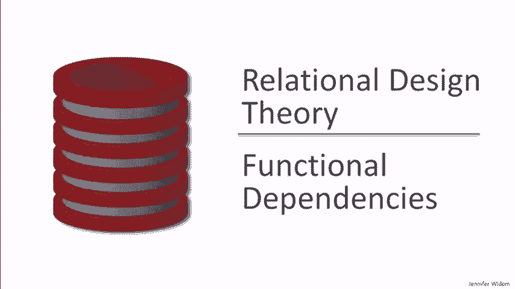
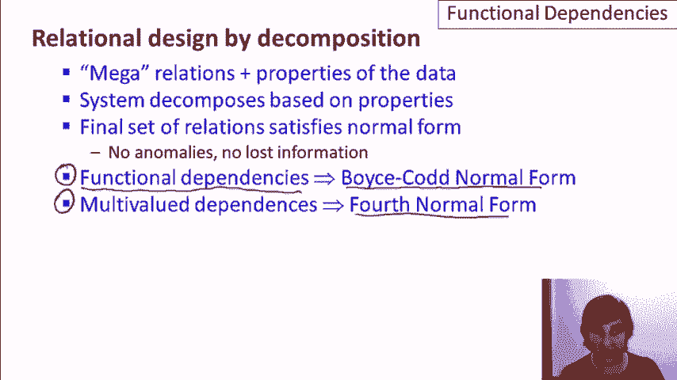
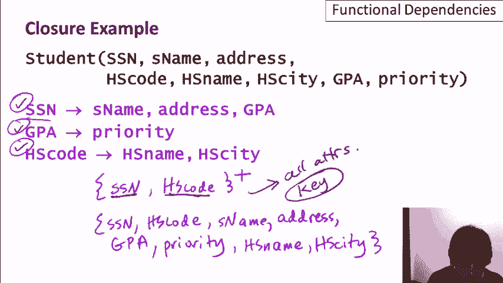
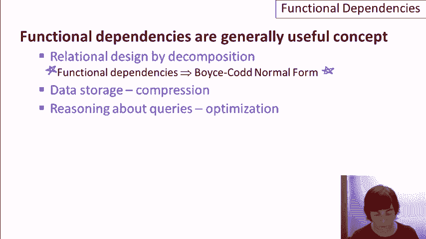

# 数据库系统原理 P14：07-02-功能依赖 🧩



在本节课中，我们将要学习数据库设计中的一个核心概念——**功能依赖**。功能依赖是理解关系数据库设计、数据存储优化和查询处理的基础。我们将从基本定义出发，逐步学习其形式化表示、相关规则、计算方法及其在数据库系统中的应用。

## 关系设计与功能依赖回顾

上一节我们介绍了通过分解进行关系设计的概念。其核心思想是，应用设计师首先定义一个包含所有信息的“超级关系”，然后系统根据指定的属性自动将其分解为多个关系。

最终的分解关系集将满足特定的**范式**，这意味着它们是结构良好的关系，没有数据异常，也不会丢失原始关系中的信息。这些分解所依据的属性规则，正是通过**功能依赖**来定义的。

系统利用功能依赖可以生成**Boyce-Codd范式**关系，或者利用多值依赖生成**第四范式**关系。因此，功能依赖是关系设计理论的关键组成部分。

## 功能依赖的广泛应用

功能依赖不仅仅用于关系设计，它在整个数据库系统中都有广泛的应用。

以下是功能依赖的几个主要用途：
1.  **关系设计**：作为分解关系、实现范式的基础。
2.  **数据存储与压缩**：系统在了解功能依赖后，可以更高效地存储和压缩数据。
3.  **查询优化**：功能依赖作为键概念的推广，可用于推理查询逻辑，帮助系统优化查询执行计划。
4.  **理论与教学**：功能依赖拥有完善的理论体系，是数据库课程中编写考题的常见主题。

本视频将重点讲解功能依赖作为一个通用概念，后续视频会将其与具体的分解设计联系起来。

## 示例数据库：大学申请系统

我们将使用一个大学申请数据库作为贯穿本课程的示例。该系统包含两个关系：

*   **学生关系**：包含学生个人信息和高中信息。
    *   属性：`Ssn`（社会保障号码）， `Sname`（学生姓名）， `Address`（住址）， `HS_code`（高中代码）， `HS_name`（高中名称）， `HS_city`（高中所在城市）， `GPA`（平均绩点）， `Priority`（招生优先级）。
*   **申请关系**：包含学生的大学申请信息。
    *   属性：`Ssn`（社会保障号码）， `Cname`（大学名称）， `State`（大学所在州）， `Date`（申请日期）， `Major`（申请专业）。

## 功能依赖的定义与形式化

让我们通过学生关系中的`GPA`和`Priority`属性来理解功能依赖。假设存在一条业务规则：学生的优先级由其GPA决定（例如，GPA>3.8为优先级1）。这意味着，任何两个GPA相同的学生，其优先级也必须相同。

我们可以将此概念形式化。对于关系R中的任意两个元组t和u，如果它们在属性集A上的值相等，则它们在属性集B上的值也必须相等。这被称为“A功能决定B”，记作 **A → B**。

其正式的逻辑定义如下：
```
∀ t, u ∈ R, if t[A] = u[A] then t[B] = u[B]
```

功能依赖的两边都可以是属性集合。设A = {A1, A2, ..., An}， B = {B1, B2, ..., Bm}，则依赖 **A → B** 表示：
```
∀ t, u ∈ R, if t[A1...An] = u[A1...An] then t[B1...Bm] = u[B1...Bm]
```

为简化表示，我们常用`Ā`和`B̄`来代表属性集A和B。

## 功能依赖示例

根据对现实世界数据的理解，我们可以为学生关系和申请关系指定一系列功能依赖。

以下是学生关系中可能存在的功能依赖：
*   `Ssn → Sname`：一个学生的社会保障号码唯一确定其姓名。
*   `Ssn → Address`：假设学生不搬家，其社保号唯一确定住址。
*   `HS_code → HS_name, HS_city`：高中代码唯一确定该高中的名称和所在城市。
*   `HS_name, HS_city → HS_code`：假设同一城市内高中名称不重复，则高中名称和城市的组合能唯一确定高中代码。
*   `Ssn → GPA`：一个学生有一个确定的GPA。
*   `GPA → Priority`：GPA决定招生优先级（根据既定规则）。
*   由`Ssn → GPA`和`GPA → Priority`，可推导出`Ssn → Priority`。

以下是申请关系中可能存在的功能依赖：
*   `Cname → Date`：假设每所大学有统一的申请截止日期。
*   `Ssn, Cname → Major`：假设一个学生对同一所大学只能申请一个专业。
*   `Ssn → State`：假设一个学生只能申请一个州内的大学（这是一个较强的约束示例）。

现实世界中的约束决定了哪些功能依赖在关系中成立。准确识别这些约束是进行良好关系设计的前提。

## 功能依赖与键

功能依赖是键概念的推广。在关系R中，如果一组属性K功能决定了R中的所有其他属性（即 **K → R**），并且K的任何真子集都不能功能决定R中的所有属性，那么K就是R的一个**超键**。如果K是极小的（即不含多余属性），那么K就是R的一个**候选键**。

例如，在学生关系中，如果我们发现属性集`{Ssn, HS_code}`的闭包包含了所有属性，那么`{Ssn, HS_code}`就是一个候选键。

## 功能依赖的分类与规则

功能依赖可以分为以下几类：
*   **平凡函数依赖**：如果 **B ⊆ A**，则 **A → B** 是平凡的。它总是成立。
*   **非平凡函数依赖**：如果 **B ⊈ A**，则 **A → B** 是非平凡的。
*   **完全非平凡函数依赖**：如果 **A ∩ B = ∅**，则 **A → B** 是完全非平凡的。这类依赖最有意义。

功能遵循一组推理规则，以下是几个基本规则：
*   **自反律**：若 **B ⊆ A**，则 **A → B**。
*   **增广律**：若 **A → B**，则 **A C → B C**（对于任意属性集C）。
*   **传递律**：若 **A → B** 且 **B → C**，则 **A → C**。
*   **合并规则**：若 **A → B** 且 **A → C**，则 **A → B C**。
*   **分解规则**：若 **A → B C**，则 **A → B** 且 **A → C**。

这些规则构成了**Armstrong公理**系统，是功能依赖理论推导的基础。

## 属性闭包及其计算

给定关系R及其功能依赖集F，属性集A的**闭包**（记作 **A⁺**）是指由A通过F中的功能依赖所能推导出的所有属性的集合。

计算属性闭包`A⁺`的算法如下：
1.  初始化 `result = A`。
2.  循环检查F中的每一个功能依赖 **X → Y**，如果 **X ⊆ result**，则将 **Y** 加入到 `result` 中。
3.  重复步骤2，直到`result`不再发生变化。
4.  最终的`result`即为 **A⁺**。

**示例**：计算学生关系中`{Ssn, HS_code}`的闭包。
已知功能依赖：
1.  `Ssn → Sname, Address, GPA`
2.  `GPA → Priority`
3.  `HS_code → HS_name, HS_city`

计算过程：
*   `result = {Ssn, HS_code}`
*   应用依赖1：`Ssn`在`result`中，加入`{Sname, Address, GPA}`，`result = {Ssn, HS_code, Sname, Address, GPA}`
*   应用依赖3：`HS_code`在`result`中，加入`{HS_name, HS_city}`，`result = {Ssn, HS_code, Sname, Address, GPA, HS_name, HS_city}`
*   应用依赖2：`GPA`在`result`中，加入`{Priority}`，`result = {Ssn, HS_code, Sname, Address, GPA, HS_name, HS_city, Priority}`
*   此时`result`已包含所有属性，停止计算。因此，`{Ssn, HS_code}⁺` 包含所有属性，说明`{Ssn, HS_code}`是一个超键。



属性闭包可用于：
*   **判断是否为键**：计算A⁺，若A⁺包含所有属性，则A是超键。
*   **判断函数依赖是否成立**：判断 **A → B** 是否由F逻辑蕴含，只需计算A⁺，并检查是否 **B ⊆ A⁺**。
*   **计算函数依赖集的覆盖**：寻找最小、完全非平凡的依赖集。

## 函数依赖集的覆盖与最小集

设F和G是两个函数依赖集。如果F逻辑蕴含G中的所有依赖，且G也逻辑蕴含F中的所有依赖，则称F和G是**等价的**，或称F**覆盖**G，G也覆盖F。

在数据库设计中，我们通常希望找到一个**最小函数依赖集**，它满足：
1.  每个依赖的右边都是单个属性。
2.  每个依赖的左边都是极小的（删除任何属性都会改变依赖集的闭包）。
3.  删除任何一个依赖都会改变依赖集的闭包。

这样的最小集没有冗余，能最简洁地描述数据中的所有约束。

## 总结

本节课中我们一起学习了数据库中的核心概念——**功能依赖**。

我们首先回顾了功能依赖在关系模式分解设计中的核心作用。接着，我们形式化地定义了功能依赖 **A → B**，并通过大学申请数据库的示例展示了如何根据业务规则识别功能依赖。

我们探讨了功能依赖与键的关系，指出键是一种特殊的、能决定所有属性的功能依赖。然后，我们学习了功能依赖的分类（平凡、非平凡、完全非平凡）和基本的推理规则（如自反律、增广律、传递律）。



最后，我们介绍了**属性闭包**的概念及其计算算法。属性闭包是一个强大的工具，可用于验证功能依赖、寻找关系的键以及计算函数依赖集的覆盖。理解并掌握功能依赖，是学习后续数据库范式理论、进行有效的数据库设计和优化的坚实基础。