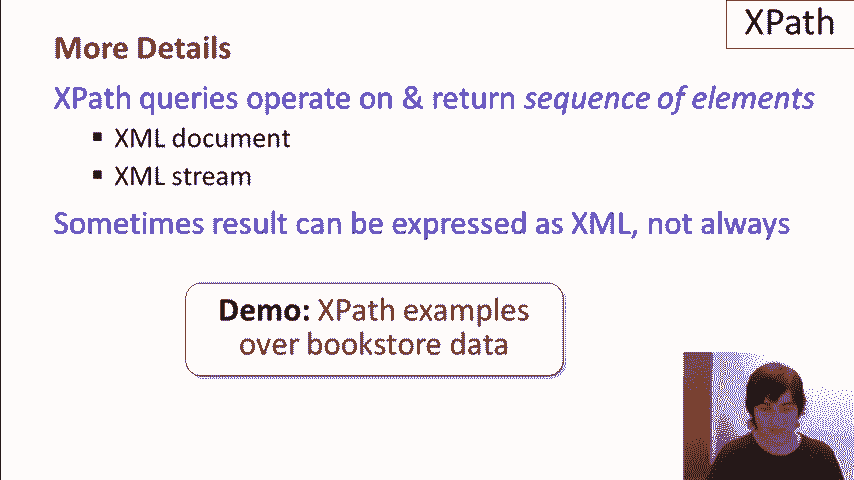

# 课程 P15：XML 查询语言入门 🧭

在本节课中，我们将要学习 XML 查询语言的基础知识，特别是 XPath 的核心概念和工作原理。我们将了解如何将 XML 数据视为树形结构，并使用路径表达式和条件来导航与查询数据。

---

现在让我们来讨论查询 XML 的话题。

首先，需要明确一点，查询 XML 远没有关系型数据库查询那么成熟。这背后有几个原因。XML 实际上要新得多。其次，它的设计不够简洁。XML 没有类似于关系型数据库查询所依赖的关系代数。

接下来，我们来谈谈 XML 查询语言的发展历程。第一个被开发的语言是 XPath。XPath 由路径表达式和条件构成。接下来开发的语言是 XSLT。XSLT 包含了 XPath 作为组件，但它还包括了转换功能，这也是 T 的含义。它还具备输出格式化的构造。XSLT 常用于将 XML 转换为 HTML 进行渲染。

最后，最新且最具表现力的语言是 XQuery。因此，它也包含了 XPath 作为组件，此外，它还是一种功能全面的查询语言。它在某种程度上与 SQL 最为相似。我们将按以下顺序介绍它们：首先是 XPath，然后是 XQuery，最后是 XSLT。

还有一些其他的语言，如 XLink 和 XPointer。这些语言是用于指定链接和指针的。它们也使用 XPath 语言作为组件。我们在这个视频中不会涉及这些内容。现在，我们将详细讨论 XPath、XQuery 和 XSLT。我们不会覆盖每个语言构造，但我们会讲解足够的内容，帮助你使用这些语言编写各种查询。

---

## 将 XML 视为树 🌲

为了理解 XPath 如何工作，我们可以将 XML 看作一棵树。我将绘制一下树结构，表示我们正在处理的书店数据的树编码。我们会将 `bookstore` 元素作为根节点，然后会有子元素，包含书店的书籍。我们可能还有另一本书。也许这边有一本杂志。

而在这些书籍中，你可能还记得我们有一些属性和子元素。例如，我们有 ISBN 号码。我们有作为属性写出的内容。还有价格。当然，还有书名。我们当然还列出了作者信息。显然，我不会在这里填充所有的子元素结构。我们这里只看一本书作为示例。

ISBN 号码位于树的叶子节点处。所以我们可以在这里放一个字符串值来表示这个叶子节点，也许是价格为 100，或者是标题“一个数据库系统的初步课程”。然后我们的作者有进一步的子元素。也许我们这里有两个作者子元素。我在下面做了一些简化，写了一个名字（first name）和姓氏（last name）。所以这里可能是“杰夫”（Jeff），“奥门”（Omen）等。

我们这么做的原因是为了能够将 XPath 中的表达式视为对树形结构的导航。具体来说，XML 的组成部分是描述在树形结构中向下导航，有时也涉及横向和向上导航的路径表达式。然后，我们还会有一些条件，用来评估并选择我们感兴趣的 XML 组件。

---

## XPath 基本构造 🛠️

让我简单介绍一下 XPath 中的一些基本构造。我将使用这个小框，将构造放进去，然后解释它是如何工作的。

第一个构造就是简单的斜杠 `/`。斜杠用于指定根元素。所以我们会在 XPath 查询的开头加上斜杠，表示我们希望从根元素开始。斜杠也可以作为分隔符使用。因此，我们将编写路径，以便在树形结构中进行导航，并且在路径的各个元素之间加上斜杠。

下一个构造就是简单地写出元素的名称。我在这里写了 `X`，但我们可以写出其他的名称，比如 `book`。当我们在 XPath 表达式中写出 `book` 时，我们的意思是希望导航到 `book` 子元素，作为我们路径表达式的一部分。

我们还可以编写特殊的元素符号星号 `*`，星号可以匹配任何内容。所以如果我们写上 `/*`，那么我们将匹配当前元素的任何子元素。当我们执行 XPath 时，在编写路径表达式时，实际上有一种概念是我们处在某个特定的位置。所以我们可能已经从 `book` 导航到了这里，然后我们会继续导航。

如果我们想匹配一个属性，我们会写 `@` 符号，然后是属性名称。例如，如果我们在 `book` 元素下，想要匹配到 ISBN 号，我们会在查询或路径表达式中写出 `@ISBN`。

我们看到单斜杠是用于导航一步。还有一个双斜杠构造 `//`。双斜杠会匹配当前元素的任何后代元素。例如，如果我们在 `book` 元素下，写上 `//`，我们将匹配 `title`、`author`、`author` 的 `first-name` 和 `last-name` 等每一个后代元素。实际上，我们也会匹配到自身。所以这个符号意味着任何后代元素，包括我们当前所处的元素。

---

## 条件与函数 📝

那么条件又该如何编写呢？如果我们想在路径中的当前位置评估一个条件，我们需要将它放在方括号 `[]` 中，并在其中写下条件。例如，如果我们希望价格小于 50，这就是我们可以放入方括号中的条件，前提是我们实际上是在属性中。

如果我们在导航的这一点上，现在我们不应将方括号中的条件与方括号中的数字混淆。如果我们在方括号中写入一个数字，例如写 `[3]`，这不是一个条件，而是匹配当前元素的第 n 个子元素。例如，如果我们在 `authors` 节点上，并且我们写 `[2]`，那么我们将匹配 `authors` 节点下的第二个子元素。

XPath 还包含很多内置函数。我将随机举出两个例子。有一个函数叫做 `contains()`。如果你写 `contains()`，然后写两个表达式，每个轴都有一个字符串值——这实际上是一个谓词——如果第一个字符串包含第二个字符串，它将返回 true。

作为第二个函数的例子，有一个叫做 `name()` 的函数。如果我们在路径中写入 `name()`，它将返回当前元素的标签名。

---

## 导航轴 🧭

我想谈的最后一个概念是被称为“导航轴”的内容。XPath 中有 13 个轴。轴实际上是一个关键词，允许我们在 XML 树中进行导航。

例如，一个轴被称为 `parent`。你可能已经注意到，当我们谈到基本构造时，大多数内容是关于向下遍历树的。如果你想向上遍历树，那么你可以使用父元素轴，它会告诉你返回到父元素。

有一个叫做 `following-sibling` 的轴。后续兄弟轴的作用是匹配当前元素的所有后续兄弟元素。如果我们有一棵树，并且我们正处于树的某个位置，接下来，后续兄弟轴会匹配树中当前元素之后的所有兄弟元素。

还有一个叫做 `descendants` 的轴。后代轴，顾名思义，匹配当前元素的所有后代。这与 `//` 不完全相同，因为需要提醒的是，`//` 也会匹配当前元素及其后代。实际上，XPath 中有一个导航轴叫做 `descendants-and-self`，它等同于 `//`。

顺便提一下，还有一个叫做 `self` 的轴，会匹配当前元素。这个轴可能看起来没有什么用处，但我们将在示例中看到它的应用场景，结合我们之前讨论过的 `name()` 函数，这将给我们当前元素的标签。

---

## 总结与建议 📚

最后补充一些细节。技术上，XPath 查询是在元素序列上操作并返回结果。这是它们的正式语义。对于 XML 文档和 XML 流，有一个规范将它们映射为元素序列。你会发现这非常自然。当我们运行 XPath 查询时，有时结果可以表示为 XML，但并不总是如此。

本节课介绍了 XPath。我们展示了如何将 XML 数据视为一棵树，然后将 XPath 看作是穿梭在树中的表达式，也可以用来评估条件。我们已经看过了一些路径表达式的构造方式，以及条件部分。我们也看过了一些内建函数，并且我介绍了导航轴的概念。

但是，学习和理解 XPath 的真正方法是运行一些查询。所以我强烈建议你观看下一个视频，它展示了如何在我们的书店数据上运行 XPath 查询。然后自己尝试一些查询。

