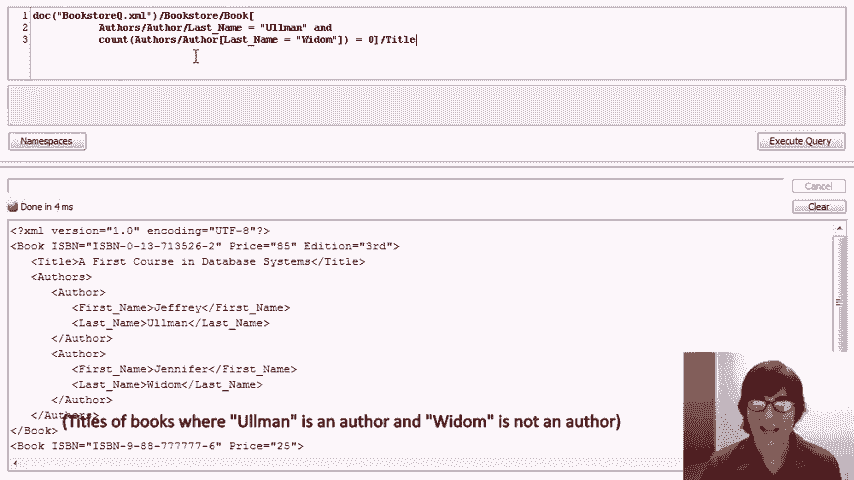

# P16：08-02-xpath-demo.mp4 - 哈库那玛塔塔i - BV1R4411u7dt

 In this video， we'll demonstrate X-Path by running a number of queries over our bookstore data。

 Let's first take a look at the data。 We've expanded it slightly over what we've been using in previous videos。 but it continues to have pretty much the same structure。 We have a number of books。 Books have attributes， ISBN， price， sometimes in addition。 They have a title sub-element。 authors with first name and last name。 So we have our first course book and our complete book。

 And our complete book also has a remark， as you may recall。

 Then I've added a couple more books。 I've added Hector and Jeff's Database Hints by Jeffrey Elman and Hector Garcia Molina。 with a remark， an indispensable companion to your textbook。

 I've also added Jennifer's economical database hints for that。

 At a mere price of $25， you get some hints。 And then finally。 just to demonstrate certain expressions。

 I've inserted three magazines to national geographics and a Newsweek。 And finally。 a magazine called Hector and Jeff's Database Hints。

 So with this data in mind， let's move to the queries。 We'll start with simple queries and get more complicated as we proceed。

 In this window， we'll be putting our X-Path expressions in the upper pane。 then we'll execute the query and we'll see the results in the lower pane。 The way X-Path works。 the first part of every expression， specifies the document over which the X-Path expression is to be evaluated。 So we have the data that you saw in a document called bookstoreQ。xml。

 and you'll see in each of our expressions that we begin by specifying that document。 and then move ahead to the rest of the X-Path expression。 Our first expression is a very simple path expression。 It says navigate through the XML by going first to the root element called Bookstore。

 then look at all the book-sub elements of Bookstore and finally all the titles of elements。

 Let's run the query and we'll see our result below。

 So as we can see， our result here is actually written in XML， a little header appears。 and then we see the four titles of books that are in our database。 Now let's modify our path expression。 Instead of only getting book titles。 let's get book or magazine titles。 We do that by extending our middle matching element here to use a sort of regular expression like syntax。

 book or magazine， and we put it in parentheses。 So now it says match any path in the data that starts at the bookstore element。 follows either a book or magazine sub-element， and then finally a title sub-element。 When we run the query， we see now that we get not only the titles of our books。 but also the titles of our magazines。 So far we've mentioned element names explicitly in our path expressions。

 but as I mentioned in the introductory video， we can also use what's known as a wildcard symbol。 the symbol star。 Star says to match any element name。 So now we're going to start again with bookstore， match any element below bookstore。 and finally find title sub-elements below those any elements。

 Now it so happens that the only elements below bookstore are books and magazines。 so when we run the query， we will get exactly the same result。 So far we've been navigating with the single slash operator。 which tells us to go one element at a time。 We're at a particular element。

 and then we match sub-elements with the specific tag that we typed。 There's also the double slash operator。 As you recall from the introductory video。 double slash says match myself， or any descendants of myself to any length。 So if I put a double slash title， what we'll be matching is any title element anywhere at all in the XML tree。

 We run the query， and again we get exactly the same result。 because we had already been getting all of the titles。 which were sub-elements of books or magazines。 Now let's get something a little different。 Let's put slash slash star。 Now that's kind of a wild thing to put。

 because it says I'm going to match any element in the entire tree。 and furthermore it can be of any element type。 Let's run the query and see what happens。

 What we get is a huge result。

 Let me just scroll down so you can see the result。 In fact。 what we're getting is every element at every level of the tree， including all of its sub-elements。

 So in fact the first element in our result is our entire tree， because it's our bookstore element。

 and we'll go all the way down to the end of the bookstore。 The next element in our result is some children of the bookstore， so we get the book elements。

 And we're also going to get their children in the answer， and as we keep scrolling down。

 we'll see that we get every element of the entire database。

 So that's not a useful query， but it does demonstrate the constructs。 the double slash matching any element in the tree， and the star matching any tag of any element。 Now let's turn to attributes。 Let's suppose we're interested in returning all the ISBN numbers in the database。 So we'll go back to saying bookstore， book sub-elements， and then we'll get the attribute ISBN。

 So we type at sign and ISBN。 Let's run the query， and we get an error。 It turns out that attributes cannot be what's called serialized in order to return them in an XML-looking result。 So what we need to do actually is obtain the data from the attribute itself， and once we do that。 we'll see that we're getting the answer that we desire。 So we'll ask for the data of the attribute。

 run the query， and now we see we have all the ISBN numbers。 Now the attribute data is just strings。 so we're returning the ISBN numbers as a set of strings with blanks between them。 So some of these are sort of peculiarities of how X-Path works。 Again。 we were not able to return an attribute because it didn't know how to structure the result。

 but once we extracted the data from the attribute， it returned it as string values。 So far。 we've only seen path expressions with no conditions involved， so let's throw in a condition。 Let's say that we're interested in returning books that cost less than $90。 So what we're going to do here is navigate to the book。

 and then we're going to use the square bracket， which says start evaluating a condition at the current point of the navigation。 So the condition that I'm going to put is that the price of the book is less than $90。

 We'll run that query， and we'll see that we have two books， our three books， I apologize。 whose price is less than $90。 Now here we return the book that satisfied the condition。 What if what we actually want to return is the title of the book whose price is less than $90？

 What we can do is after evaluating this condition on the book。 we can actually continue our navigation。 So we just put /title here， it says find the books。 only keep the ones that match the condition， and then continue navigating down to their titles。 and return that as the result of the query。

 We run the query and we see our result。 Now another type of condition that we can put in square brackets is an existence condition instead of a comparison。 If we put， for example， just the label remark inside our square brackets。 that says that we should match books that have a remark。 So putting an element name in square brackets is an existence condition on that。

 so the element existing。 Once we've isolated the books that have a remark。 we'll return the title of those books。 We run the query and we discover that two of our books have a remark。 You can go back and check the data and you'll see that's indeed the case。 Let's get a little bit more complicated now。 Let's get rid of this query and put in a whole new one。

 In this query we're going to find the titles of books where the price is less than $90 and where Omen is one of the authors。 So now we have in our square brackets a longer condition。 This is less than $90 and there exists and implicitly this is an exist。 There exists a sub path from the book author/author/last name where the value of that is Omen。

 If we satisfy both of those conditions then we'll return the title of the book。 So we run the query and we discover two books that are less than $90 where Omen is one of the authors。 Now let's expand this query by adding another condition。 We want not only the last name of the author to be Omen but the first name to be Jeffrey。

 So now we're looking for books where Jeffrey Omen is one of the authors and the books are less than $90。 So we run the query and we get the same result not surprisingly since Omen is always paired with Jeffrey。 But actually this is not doing quite what we're expecting and I'm going to explain why by demonstrating some changes。 Let's say that we change our query to not look for Jeffrey Omen as an author but to look for Jeffrey Widdham。

 Hopefully we'll get no answers but when we run the query we see we still get a book。 The first course in database systems。 So the two authors of that book if you look back at the data are Jeffrey Omen and Jennifer Widdham。 So let's see why that book was returned in this query。 The reason is if we look closely at this condition what we're saying is we're looking for books for the prices less than $90 and there exists an author's author/last name path where the value is Widdham and there exists an author's author first name。

 Where the value is Jeffrey。 Well that in fact is true。 We have one author whose last name is Widdham and another author whose first name is Jeffrey。 Let's try to formulate the correct query now。 So instead of matching the entire path to the last name and then the entire path to the first name separately through the authors sub elements。 What we want to do is we want to look at each author at a time and within that author look at the last name and first name together。

 So to modify our query to do that we're going to use a condition within the condition specifically within the author/author will look at the last name and the first name。 This syntax error is temporary once we finish the query everything will look good。

 So we put a second bracket there and let me show again what I've done。 I've said we're looking for books where the price is less than 90 and there exists an author/author sub element where the last name is Widdham and the first name is Jeffrey。 Hopefully we'll get an empty answer here。 We execute the query and indeed we do。 Now our original goal was to have Jeffrey Omen。 So finally we'll change Jeffrey Omen run the query and now we get the correct answer。

 Incidentally it's a very common mistake when we have a condition to put a slash before the condition。 If we did that we'd get a syntax error。 When we write the square bracket it essentially acts like a slash so when we reference a sub element name within a square bracket we're implicitly navigating to that sub element。

 Next we're going to try a similar query with a twist。 We're going to try to find books where Omen is an author and Widdham is not an author。

 So we navigate to books as usual and we look for cases where there's an author's author last name equals Omen and there's an author's author last name not equal to Widdham。 Now you may already detect that this is not the correct query but let's go ahead and run and we see that we got three books but we know the first two books Widdham is an author。

 So as you may have detected this is not correct what this asks for are books where there's an author whose last name is Omen and there's some author whose last name is not Widdham。 Well in fact every book with Omen as an author has some author whose last name is not Widdham that would be Omen。

 So even if I took away this condition and ran the query again I'll get exactly the same result。

 Well actually I got a syntax error。 Whoops I forgot to erase the and so let's get rid of that run the query and now we do in fact get the exact same result。

 So as a reminder we were trying to find books where Omen is an author and Widdham is not。 In fact we do not have constructs yet to write that query。 A little later in the demo we'll see how we can write it in a kind of tricky fashion but for what we've seen so far with path expressions and conditions we're unable to write that specific query。 So far we've seen two types of conditions in brackets。

 We saw comparisons and we saw existence constraints where we check to see whether a particular sub element existed。 As you might remember from the intro we can also put numbers inside square brackets and those numbers tell us to return the nth sub element。

 Specifically if we look at this query we're using slash slash to navigate directly to author's elements and then we want to return the second author sub element of each author's element。 So we run the query and we'll see if we looked at our data that Jennifer Widdham。

 Jeffrey Omen and Hector Garcia Molina each appear once as the second author of a book or a magazine。 If we change this to three we'll be returning third authors only and we can see only Jennifer Widdham is a third author。 If we change this to ten hopefully we'll get an empty result and in fact we do。 Now let's take a look at some built-in functions and predicates。

 In this query we're going to find all books where there's a remark about the book that contains the word "great"。 So we're going to navigate using slash slash directly to book elements and within the book element we'll have a condition that invokes this built-in predicate contains which I mentioned in the introductory video which looks at two strings and checks whether the first string contains the second one。

 So if we have a book where there's a remark which is a string that contains the word "great" then the book matches the condition and we'll return the title of the book。 We run the query and we see that we have one book that has a remark containing the word "great"。

 Our next query does something kind of new。 I like to call this query a self-join but that's probably because I'm a relationally biased person。 What it's actually doing is querying sort of two instances of our bookstore data at once and joining them together。

 So we'll see that our doc bookstore appears twice in this expression。 Let me explain what this expression is doing。 It's finding all magazines where there's a book that has the same title as the magazine and here's how it does it。 So our first path expression navigates two magazines and then it extracts it in the condition the title of the magazines。 The magazine will match if the title equals some book title and so to find the book titles we need to go back to the top of the document so we get a second instance of the document and we find book titles。

 Now when we have the equals here this equals is implicitly existentially quantified。 That means that even though we're doing equals on what's effectively a set the condition is satisfied if some element of the set is equal to the first title。 There's a lot of implicit existential quantification going on inequality in x path and in x query as well as we'll see later on。 In any case let's run the query and we will get back the fact that the magazine called Hector and Jeff's database hints has the same title as a book and if you look back in the data you'll see what's going on。

 So back in the data you'll see we do have a book of the same name。 We saw one example of a built-in predicate contains this example shows another built-in function in this case the name function and it also shows our first example of a navigation axis。

 We're going to use the parent axis。 What this query is going to find is all elements whose parent element tag is not bookstore or book。 Of course this is just for demonstration purposes is not really that useful of a query。 We just walk through the construction of the query。 We're starting with our bookstore and then we're using slash slash star which finds all elements。

 We saw slash slash star earlier when we ran the query we saw that it matched every element in the book in the database。 Now since we've already put in bookstore we're not going to match the bookstore element itself but we'll match every child of the bookstore element。

 So what the condition looks for is the tag of the parent of the current element and it sees if it's bookstore or book and we return the element if it's neither bookstore nor book as the parent tag。 Here's how we find the parent tag。 So name is a built-in function name operates on an element and it returns the tag of that element。

 The element we want to look at is the parent of the current element and the way we do that is with the parent navigation axis which is parent colon colon。 Finally the star is matching the tag of the parent。 So here we say match any tag of the parent extract the tag and check if it's bookstore or book。

 So when we run the query we'll see that we get back a lot of data but all of them are elements in the database whose parent is not the bookstore or book。

 Here's another example of a navigation axis。 In this case we're using following sibling。 Following sibling says that if we're at a specific point in the tree we should match every sibling so every other element at the same level that's later in the document that follows the current sibling。

 So let's walk through this expression and see what we're doing。 What this expression is looking for is all books and magazines that have a non-unique title。 In other words all books or magazines where some other book or magazine has the same title。 So we navigate down to books or magazine elements。

 This is what we saw in one of our earlier path expressions。 We'll match any book or magazine element。 And then we want to find one where the title is equal to some title of a later sibling。 Now our books and magazines are all at the same level in our data so when we do a following sibling we're going to be matching all other books and magazines that appear after the current one。 And again this star says that we can match an element of any type。

 We get a quiver only book or magazine in here because we know they're all books or magazines and we'll do that in a moment but now let's just focus on running the query。

 So we execute the query and we find two answers。

 We find Hector and Jeff's database hints which is a book because we had a magazine of the same title and we find national geographic which is a magazine because there's another magazine of the same title。

 So actually this query was somewhat incomplete and that was our fault。 The way we wrote the query we said that we want to return book or magazine elements when a later one has the same title so that doesn't actually return all of the ones with non-unique titles。

 It only returns the first instance of each one with a non-unique title。

 Let's modify the query to do the right thing。 What we need to do is not only check whether the title equals the following sibling title of some book or magazine but whether it might also equal a preceding one。 We add title equals the same construct using the preceding sibling axis/slur title。

 Here we go and now when we run the query we see that we get Hector and Jeff's database hints and national geographic but we also get another instance of national geographic and another instance of Hector and Jeff's database hints。

 So now we have the correct answer。 We don't only get the first instance of duplicated titles but we get both of them。 Now to show the use of this star we were matching any book or magazine as the following sibling。 What if all we were interested in is cases where there's a book that has the same title but not a magazine and we can do the same thing here。

 In that case we shouldn't get national geographic anymore。

 Let's run the query and indeed all we get in fact is Hector and Jeff's database hints as a magazine because that was only the only instance where there was an actual book that had the same title。 As opposed to matching books or magazines with the star。

 Don't take a look at this query yet。 Let me explain what I'm doing before you try to untangle the syntax to do it。 As I mentioned earlier expath revolves around implicit existential quantification。 So when we are looking for example for an author whose name is Omen implicitly we will match the path if any author has the last name Omen。 In general most of expath revolves around matching sets of values and then returning things if any element of that set matches the condition。

 What if we want to do universal quantification in other words for all。 That turns out to be more complicated but we can do it in a tricky fashion。 So what we're going to do with this query is we're going to find books where every author's first name includes J。 If we wrote it in the fashion that we might be tempted to where we just say book author/author first name includes J。

 Then we'll get books where some author's first name contains J。 To get books where all author's first name contains J is more difficult and the way we're going to do it is it's kind of a cluge。 We're going to use the built in function count。 So here's what we're doing in this query。 We're finding all books where the number of authors whose first name includes J is the same as the number of authors of the book without a condition。

 So specifically under book we count the number of matches of an author's author sub element where the built in function。 the built in predicate contains is true where the first name contains J。 And so we're counting the number of authors whose first name contains J and we're setting that equal to the count of the first name sub elements。

 We'll run the query and we will find indeed that there are two books where all of the authors' first name includes J。

 We can use a related trick to write the query we tried to write earlier but failed to find books where all men is an author and whittom is not an author。 So with the implicit existential what happened before is that we found books where there was an author whose name was Omen and then there was an author whose last name was not whittom。

 And of course we still got everything back。 What we want to find is books where there's a last name that's Omen and where none of the authors had the last name of whittom。 That's effectively again a universal quantification or for all。 For all of the authors their last name is not whittom。 Since we don't have a for all construct and expat where again going to use the count trick。

 So in this query we're looking for books where one of the authors' last name is Omen and the number of authors using count again。 the number of authors' last name is whittom is zero。

 So now we've expressed that query， we run it and we get the correct answer。 That concludes our demonstration of expat。 We've shown a large number of constructs and we've written some fairly complicated queries。 On the other hand we certainly have not covered the entire expat language。 If you're interested in our many online materials we'll also provide data and we encourage you to experiment on your own。

