# 课程 P16：XPath 查询实战教程 📚

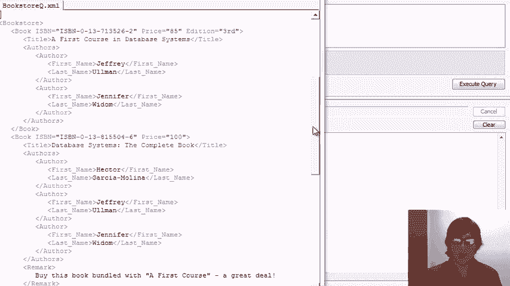

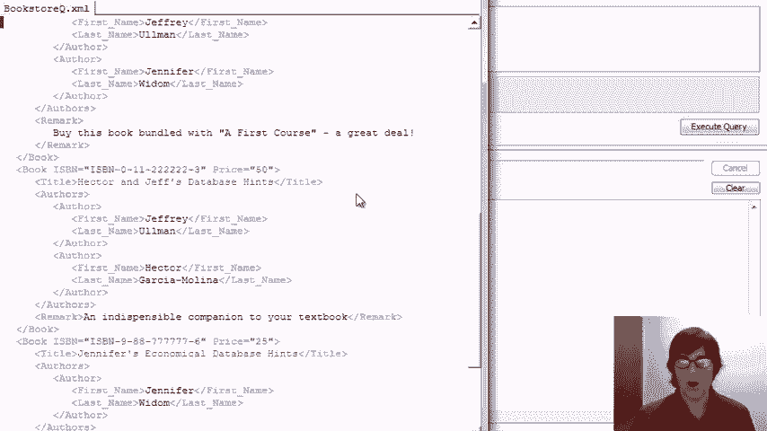

在本课程中，我们将通过一个书店数据集的系列查询，来演示 XPath 的核心语法和功能。我们将从简单的路径导航开始，逐步深入到包含条件、函数和复杂逻辑的查询。


---


## 数据概览 📂


首先，我们来看看将要使用的 XML 数据。数据基于一个书店目录，结构如下：

*   根元素是 `bookstore`。
*   包含多个 `book` 和 `magazine` 元素。
*   每本书 (`book`) 包含属性（如 `ISBN`、`price`）和子元素（如 `title`、`author`、`remark`）。
*   每个作者 (`author`) 包含 `first_name` 和 `last_name` 子元素。
*   杂志 (`magazine`) 的结构与书籍类似。


数据示例包含了多本教材、补充书籍和几本杂志，用于演示各种查询场景。


---

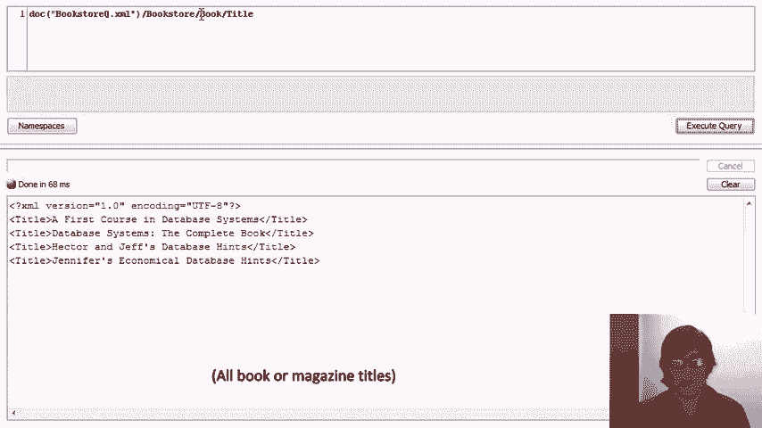

## 基础路径导航 🧭

上一节我们介绍了数据集，本节中我们来看看如何使用 XPath 进行最基本的导航。

XPath 表达式通常从指定文档根目录开始，然后使用路径操作符逐级向下导航。单斜杠 `/` 表示直接子元素关系。


以下是几个基础路径查询示例：

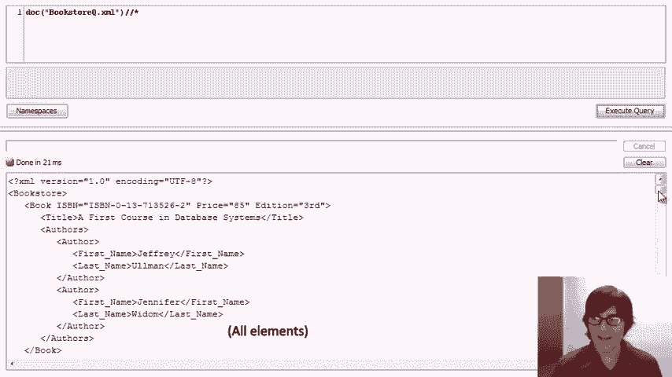


*   **查询所有书籍的标题**:
    ```xpath
    doc("bookstoreQ.xml")/bookstore/book/title
    ```
    这个表达式从根 `bookstore` 开始，找到其下的所有 `book` 子元素，再获取每个 `book` 下的 `title` 子元素。

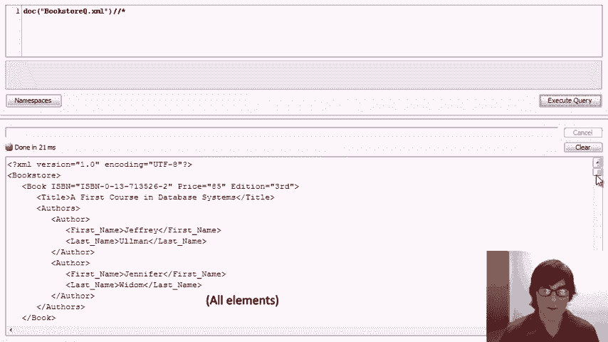


*   **查询所有书籍和杂志的标题**:
    我们可以使用类似正则表达式的语法 `(book|magazine)` 来匹配多种元素。
    ```xpath
    doc("bookstoreQ.xml")/bookstore/(book|magazine)/title
    ```

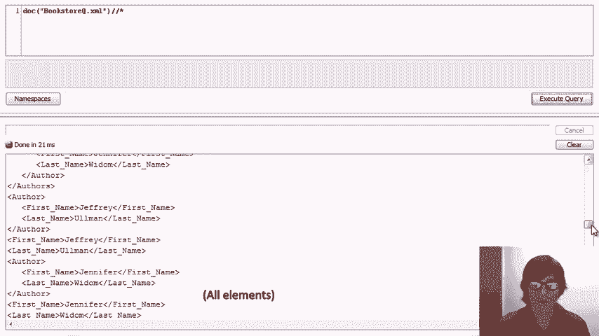


*   **使用通配符 `*`**:
    星号 `*` 可以匹配任何元素名。
    ```xpath
    doc("bookstoreQ.xml")/bookstore/*/title
    ```
    这个表达式会匹配 `bookstore` 下任何直接子元素的 `title` 子元素。

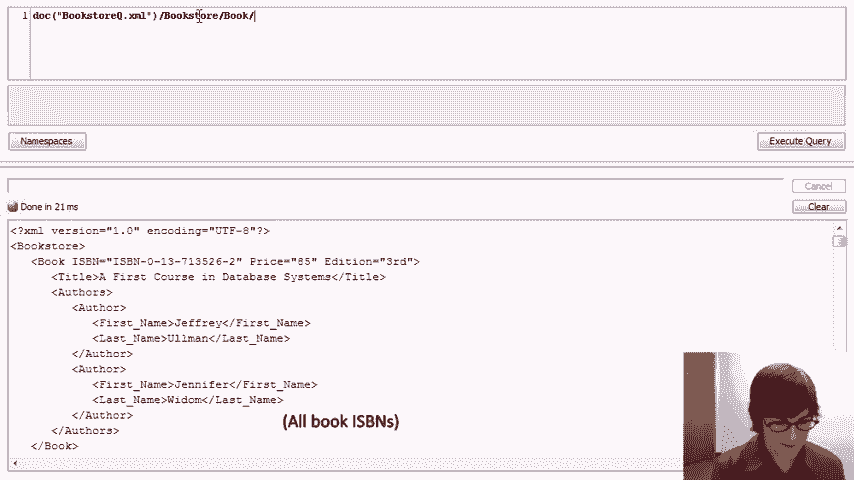

---

## 使用轴与通配符进行深度搜索 🔍

上一节我们学习了基础的子元素导航，本节中我们来看看如何搜索整个文档树。


双斜杠 `//` 是一个强大的操作符，它表示“当前节点或任意深度的后代节点”。结合通配符，可以实现灵活的搜索。


以下是相关示例：

*   **搜索文档中任意位置的 `title` 元素**:
    ```xpath
    doc("bookstoreQ.xml")//title
    ```
    这等价于之前 `/(book|magazine)/title` 的结果。

*   **匹配文档中的每一个元素**:
    ```xpath
    doc("bookstoreQ.xml")//*
    ```
    这个查询会返回 XML 树中从根元素开始的所有元素，通常结果集很大。

---

## 处理属性与简单条件 ⚙️

在掌握了元素导航后，我们来看看如何访问属性以及为查询添加简单的过滤条件。

属性使用 `@` 符号访问。条件使用方括号 `[]` 添加，它会对当前路径节点集进行过滤。

以下是相关操作：


*   **获取所有书籍的 ISBN 号**:
    直接返回属性节点有时会出错，通常我们提取其值。
    ```xpath
    doc("bookstoreQ.xml")/bookstore/book/@ISBN/data()
    ```


*   **查找价格低于 $90 的书籍**:
    在 `book` 节点后添加条件 `[price < 90]`。
    ```xpath
    doc("bookstoreQ.xml")/bookstore/book[price < 90]
    ```

*   **查找价格低于 $90 的书籍的标题**:
    在条件筛选后，可以继续向下导航。
    ```xpath
    doc("bookstoreQ.xml")/bookstore/book[price < 90]/title
    ```


*   **基于子元素存在的条件**:
    在方括号中直接放入子元素名，表示检查该子元素是否存在。
    ```xpath
    doc("bookstoreQ.xml")/bookstore/book[remark]/title
    ```
    此查询返回所有带有 `remark` 子元素的书籍的标题。

---

## 组合条件与常见错误 🧩

单一条件往往不能满足需求，本节我们学习如何组合多个条件，并注意一个常见的逻辑错误。

可以在方括号 `[]` 内使用 `and`、`or` 来连接多个条件。需要注意的是，路径表达式中的条件存在“隐式存在量化”，即只要存在一个节点满足条件，整个条件就为真。


以下是组合查询示例与陷阱：

*   **查找价格低于 $90 且作者包含 “Omen” 的书籍标题**:
    ```xpath
    doc(“bookstoreQ.xml”)/bookstore/book[price < 90 and author/last_name = “Omen”]/title
    ```

*   **一个常见的错误模式**:
    假设我们想找作者是 “Jeffrey Widom” 的书。**错误**的写法可能如下：
    ```xpath
    //book[author/first_name=“Jeffrey” and author/last_name=“Widom”]
    ```
    这个查询的实际含义是：找一本有作者名叫 “Jeffrey” **并且**有作者（可以是另一个人）姓 “Widom” 的书。这可能导致错误匹配。

*   **正确的写法**:
    我们需要确保名字和姓氏属于**同一个** `author` 元素。这需要在条件内部再指定路径。
    ```xpath
    //book[author[first_name=“Jeffrey” and last_name=“Widom”]]
    ```
    这个查询的含义是：查找存在一个 `author` 子元素，且该元素的 `first_name` 为 “Jeffrey” **同时** `last_name` 为 “Widom” 的书籍。

---

## 使用函数与轴进行高级查询 🚀


XPath 提供了丰富的内置函数（如 `contains()`, `count()`, `name()`）和轴（如 `parent::`, `following-sibling::`），用于编写更强大的查询。


以下是高级功能示例：

*   **使用 `contains()` 函数**:
    查找备注中包含 “great” 一词的书籍标题。
    ```xpath
    //book[contains(remark, “great”)]/title
    ```


*   **使用 `parent::` 轴**:
    查找所有父元素名不是 “bookstore” 或 “book” 的元素（演示用途）。
    ```xpath
    //*[name(parent::*) != “bookstore” and name(parent::*) != “book”]
    ```


*   **使用 `following-sibling::` 轴实现“自连接”**:
    查找有同名书籍的杂志。这个查询巧妙地引用了文档两次。
    ```xpath
    //magazine[title = doc(“bookstoreQ.xml”)//book/title]
    ```

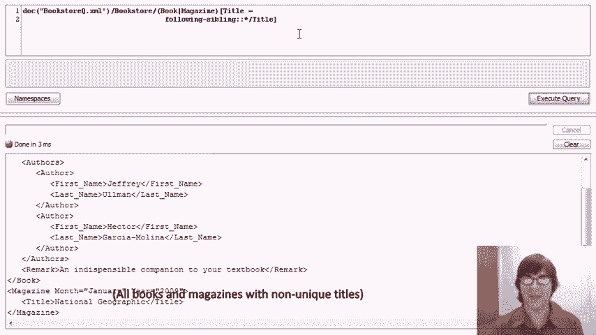

*   **查找有重复标题的书籍或杂志**:
    通过检查是否存在前驱或后继兄弟节点有相同标题来实现。
    ```xpath
    //(book|magazine)[title = following-sibling::*/title or title = preceding-sibling::*/title]
    ```

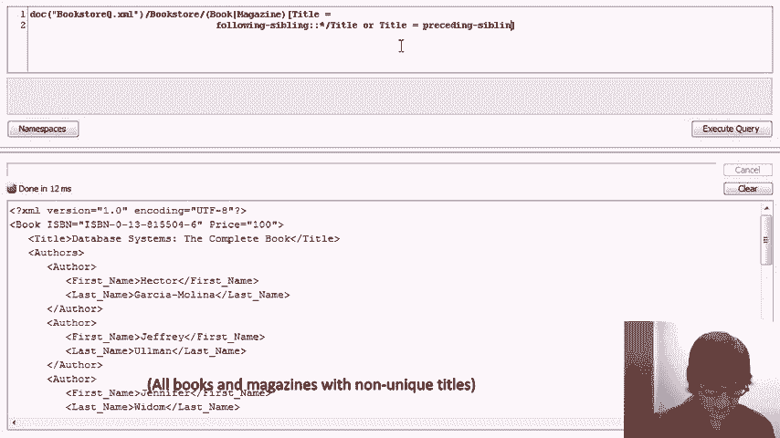

---


## 实现“全称量化”逻辑 🎯


XPath 的条件默认是“存在量化”的。若要表达“所有作者都满足某条件”这类“全称量化”逻辑，需要借助函数进行变通。


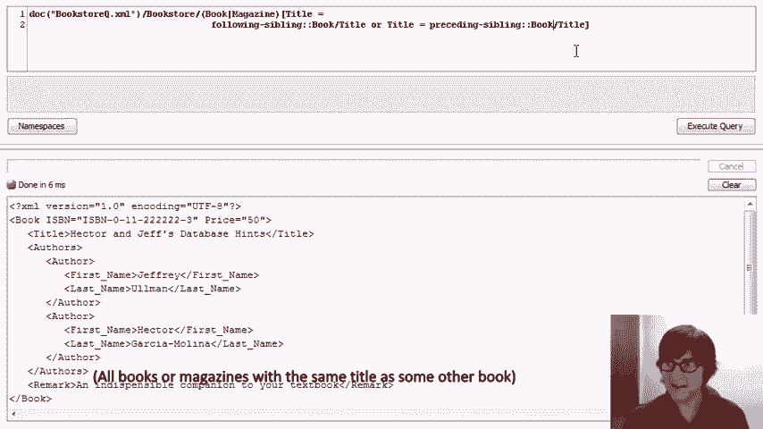

一个常用的技巧是使用 `count()` 函数：满足条件的节点数量等于总节点数量。


以下是具体应用：

*   **查找所有作者名字都包含字母 “J” 的书籍**:
    ```xpath
    //book[count(author[contains(first_name, “J”)]) = count(author)]
    ```
    这个查询统计名字含 “J” 的作者数，并检查它是否等于作者总数。

*   **查找有作者姓 “Omen” 但没有作者姓 “Widom” 的书籍**:
    这是我们之前用简单条件无法正确表达的查询。
    ```xpath
    //book[author/last_name=“Omen” and count(author[last_name=“Widom”]) = 0]
    ```
    首先要求存在姓 “Omen” 的作者，然后要求姓 “Widom” 的作者数量为 0。

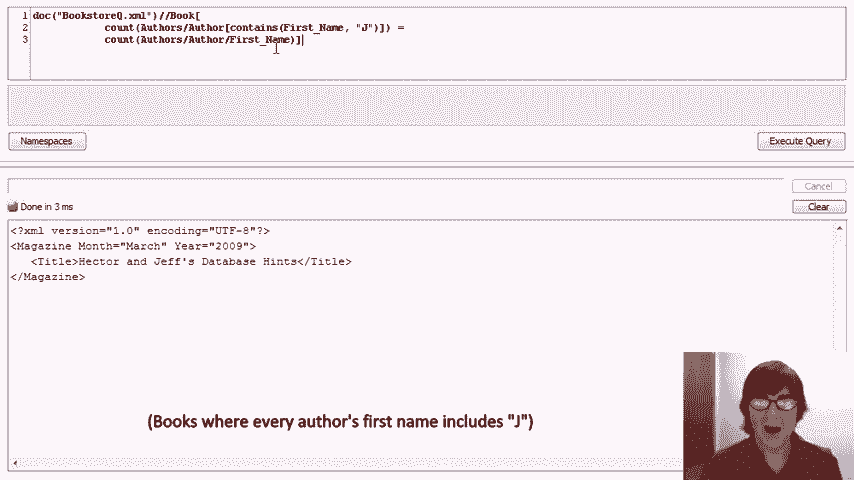

---

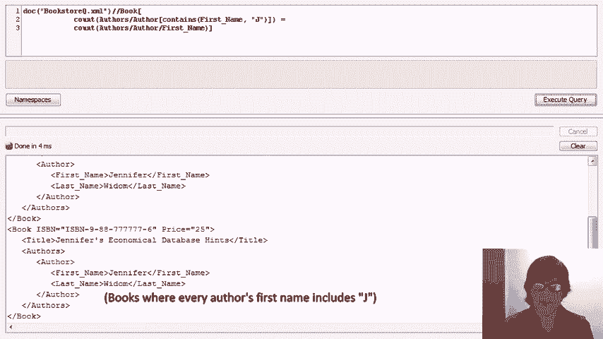

## 课程总结 📝

在本节课中，我们一起学习了 XPath 的核心查询技术：


1.  **基础导航**：使用 `/`、`//`、`*` 进行元素路径匹配。
2.  **属性访问**：使用 `@` 符号。
3.  **条件过滤**：使用 `[]` 添加比较、存在性及位置条件。
4.  **组合条件**：使用 `and`/`or`，并注意隐式存在量化带来的逻辑陷阱。
5.  **函数与轴**：利用 `contains()`、`count()`、`name()` 等函数和 `parent::`、`following-sibling::` 等轴进行复杂查询。
6.  **高级逻辑**：通过 `count()` 函数变通实现“全称量化”查询。


通过这个从简单到复杂的演示，你应该已经能够使用 XPath 对 XML 数据执行各种查询操作。建议你使用提供的数据集进行练习，以巩固所学知识。