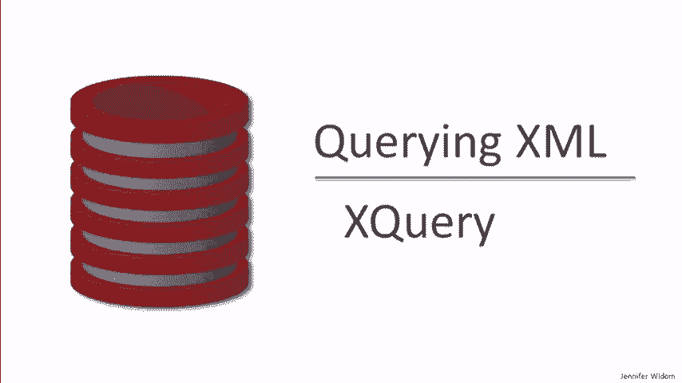
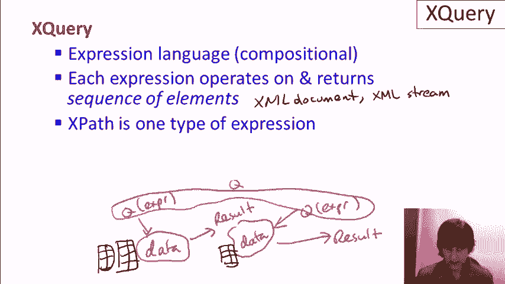
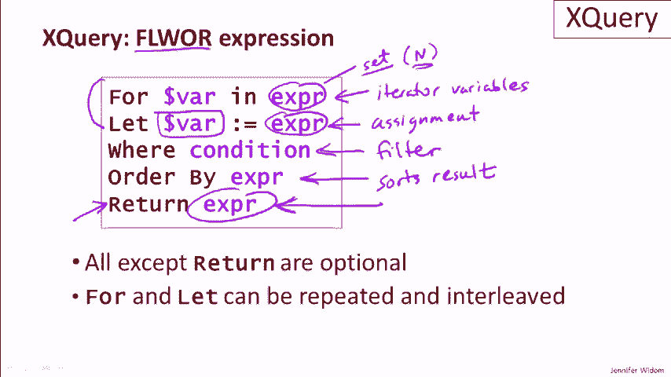
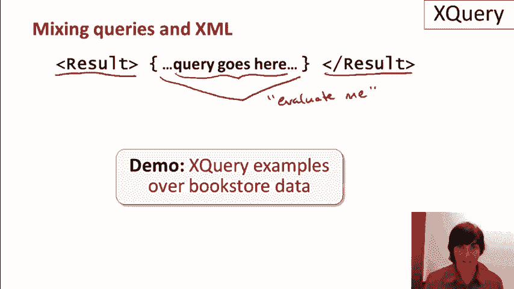

# P17：08-03-xquery-intro.mp4 - 哈库那玛塔塔i - BV1R4411u7dt

 This video gives an introduction to the XQuery query language for XML。

 As a reminder， querying XML is not nearly as mature as querying relational databases。

 It's much newer， and there's no clean underlying algebra that's equivalent to the relational algebra。

 The sequence of development of XML query languages started with XPath， which we've already covered。

 Then XSLT， which we'll be covering later， and in this video and the subsequent demo。

 we'll be covering the XQuery language。 XQuery is an expression language。

 also known as a compositional language。 We've seen that already with relational algebra。

 What that means is when we run an expression of the language on a type of data。

 the answer to that expression or query is the same type of data。

 So let me just draw the picture here。 We have some data。

 We run an expression or a query over that data， and we get a result back。

 And that result is also going to be in the same type of data。

 That means we can run another query or expression over the same type of data that was the result of the previous one。

 And again， we'll again get a result of the same type of data。 Now。

 that also means that we can sort of put these together， and when we put them together。

 that will give us additional expressions or queries that are valid in the language。

 When we talked about compositionality in the relational model。

 the types of data we were using were relations。 We would have maybe some relations here。

 We run a query over those relations。 The result itself is a relation。

 And we can run further queries over that relation。 That's the answer。

 And then when we looked at relational algebra， we saw composing the expressions of relational algebra into more complicated expressions and everything worked together。

 In XML， it's similar， except the expressions operate on and return what are known as sequences of elements。

 Now， we're not going to go into a great detail of this model。 As we mentioned for X-Path。

 the sequences of elements can be generated from an XML document。

 They can also be generated from an XML stream， and the interpretation is quite natural。 Now。

 let me mention that one of the basic types of expressions in X-Query is X-Path。

 So every X-Path expression is， in fact， an X-Query expression or a valid query in X-Query。

 Then we can use X-Path and other constructs of X-Query to put together into more complicated queries。

 Now， one of the most commonly used expressions in X-Query is what's known as the flower expression。

 And it looks closest to SQL of any of the constructs in X-Query。 Let me explain how it works。

 We have up to five clauses in that flower expression， and that's where the FLWR comes from。

 The first， the FLWR clause sets up what are known as iterator variables。

 So the idea here is that in the FLWR clause， this expression is evaluated。

 and it will produce potentially a set result。 And then the variable will be bound to each element of the set one at a time。

 and then the rest of the expression will be evaluated for each element。 So in other words。

 if this produces a set of n results， then we'll effectively evaluate the rest of the query n times。

 We'll see that much more clearly when we do the demonstration。

 The LET clause is more of a typical assignment， so it's only run once each time the rest of the query is run。

 and so this expression is evaluated， and even if it's a set， it's assigned once to this variable。

 so it's not iterating。 Now it's just doing an assignment。 Again。

 it'll become quite clear when we do the demonstration。 The WHERE clause specifies a condition。

 and it's a filter very similar to the filters that we've seen in SQL。

 The order by is also sort of similar to SQL。 It sorts the result so that you can get the result in a particular order。

 And finally， the RETURN clause says what we want to actually get in the result of our query。

 And just as a reminder， when we start the query with the four。

 if we're effectively executing the query n times， then each one of those n executions may result in one of the elements in the result。

 The FLOWER expression has up to five clauses， but actually all of the clauses except the RETURN clause are optional。

 The RETURN is the only one that's required to have a well-formed query and to get a result。

 I also want to mention that the FOR/IN LET clause can be repeated multiple times if we want to set up multiple variables。

 or multiple assignments， and they can be interleaved with each other。

 They don't need to be in a particular order。

 In XQuery， it's possible to mix query evaluation with simply writing down the XML data that we want in the result。

 And here's an example。 In this case， we're writing the opening and closing tags that we want to be in the result of our query。

 and then inside curly braces we write the query itself。

 And what these curly braces effectively say are evaluate me。

 The curly braces are an indicator to the XQuery processor that what's inside them needs to be run as a query。

 It's replaced with the XML that's the query result。

 and the final output is our opening and closing tags with the XML query result inside。

 At this point， let's move ahead to the demo。 We'll once again be using our bookstore data and we'll do a sequence of XQuery examples over that data。

 Again， we're not going to be comprehensive XQuery as a big language。

 but we'll show the flavor of the language and a lot of its most useful constructs。

 and we'll be able to write some quite powerful queries。

