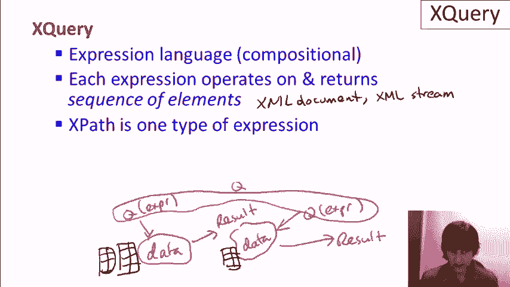
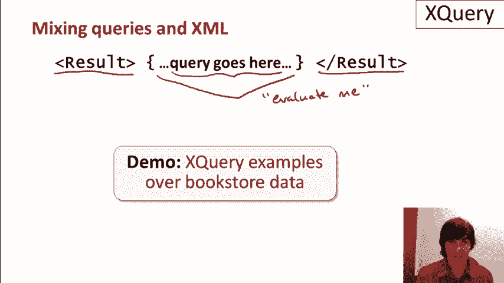

# 课程 P17：XQuery 入门教程 🧩

在本节课中，我们将学习 XQuery 查询语言及其在 XML 数据查询中的应用。XQuery 是一种功能强大的表达式语言，允许我们以组合的方式查询和转换 XML 数据。

---

## XML 查询语言的发展背景

上一节我们介绍了 XML 查询的背景。查询 XML 的技术不如查询关系数据库的技术成熟，它更新且缺乏像关系代数那样清晰的理论基础。

以下是 XML 查询语言的发展序列：
*   **XPath**：一种用于在 XML 文档中定位节点的语言。
*   **XSLT**：一种用于转换 XML 文档的语言。
*   **XQuery**：一种功能更全面的 XML 查询和数据处理语言，也是本节课的重点。

---

## XQuery 的核心概念：组合性

本节中我们来看看 XQuery 的核心特性——组合性。XQuery 是一种表达式语言，也被称为组合语言。这意味着，当我们对某种数据类型执行该语言的表达式时，表达式的结果将是相同类型的数据。

我们可以用以下模型来理解：
```
原始数据 -> [执行查询/表达式] -> 结果数据（同类型）
```
这个结果数据本身又可以作为输入，再次执行新的查询。这种特性允许我们将简单的查询组合成更复杂的表达式。



在关系模型中，组合操作的数据类型是**关系**。在 XML 和 XQuery 中，操作和返回的是**元素序列**。XQuery 的一种基本表达式类型就是 XPath，因此每个 XPath 表达式都是一个有效的 XQuery 查询。

---

## FLWOR 表达式：XQuery 的“SQL”

XQuery 中最常用且最接近 SQL 风格的构造是 **FLWOR 表达式**。它得名于其主要的五个子句（For, Let, Where, Order by, Return）。

以下是 FLWOR 表达式的各个子句及其作用：
*   **FOR**：设置迭代变量。该子句的表达式会计算出一个集合，变量会依次绑定集合中的每个元素，并为每个元素执行后续查询。
*   **LET**：进行赋值操作。该子句的表达式只会计算一次，并将结果（即使是集合）一次性赋值给变量，不进行迭代。
*   **WHERE**：指定过滤条件，类似于 SQL 中的 WHERE 子句。
*   **ORDER BY**：对结果进行排序。
*   **RETURN**：定义查询最终返回的内容。**这是 FLWOR 表达式中唯一必须的子句。**

需要注意的是，FOR 和 LET 子句可以出现多次，并且可以交替使用，以设置多个变量。

---

## 在 XQuery 中直接构造 XML 结果

XQuery 允许我们将查询评估与直接编写期望的 XML 输出结构结合起来。其核心语法是使用大括号 `{}` 来包裹需要执行的查询表达式。


例如：
```xml
<结果>
  { 这里放置 XQuery 查询 }
</结果>
```
大括号内的查询会被执行，其结果将作为 XML 内容嵌入到外部的标签中，共同构成最终的输出。

---

## 课程总结与展望

本节课中，我们一起学习了 XQuery 语言的基础。我们了解了它的组合性特性，掌握了其核心的 FLWOR 表达式结构，并学习了如何直接构造包含查询结果的 XML 输出。



接下来，我们将通过实际演示，在书店 XML 数据上运行一系列 XQuery 示例。虽然 XQuery 是一门庞大的语言，但通过这些核心概念和结构，我们已经能够编写出非常强大的查询。