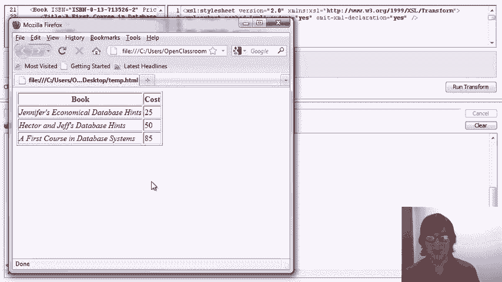

# P18：08-05-xslt.mp4 - 哈库那玛塔塔i - BV1R4411u7dt

在本视频中，我们将介绍如何使用XSLT查询XML数据。

提醒一下，查询XML数据远没有查询关系型数据成熟，因为它相对较新，且没有像关系代数那样漂亮的底层代数。我们已经讨论了XPath，它是最早为查询XML数据开发的语言。我们还讨论了XQuery，它实际上是在XSLT之后开发的。

但它在风格上与XPath类似，而我们将在本视频中讲解的XSLT实际上是非常不同的。XSL代表可扩展样式表语言，最初被提出，但很快扩展到包括转换功能，XSLT目前比XSL被广泛使用。

下面是我们如何将XSLT视为查询语言。我们有一个XSLT处理器，我们将XML数据以文档或流的形式输入该处理器，同时还会给处理器一个XSLT规范，顺便提一下，这个规范是使用XML格式表示的。处理器接收数据和规范。

它将数据转换为一个结果，这个结果也可以表示为一个XML文档或流。现在，如果我们考虑传统的数据库查询处理，其实是有自然映射的。如果我们考虑关系型处理，我们有一个查询处理器和一个数据库。我们将数据输入查询处理器，也将查询输入查询处理器。

然后输出答案。所以，XSLT处理虽然确实是通过转换来实现的，但可以把它看作类似于查询数据库。因此，尽管XSLT可以被看作是一种查询语言，但其查询范式与我们习惯的方式是非常不同的。

与SQL，甚至与XPath或XQuery不同。它从根本上基于转换数据的概念，而这种转换是通过规则进行的。为了理解这些规则的作用以及转换如何工作，再次很有帮助的是将XML看作是一棵树。所以，让我们拿出我们的书店数据，再次将其构建成一棵树，就像我们在第一次学习XPath时做的那样。

我们有一些书籍子元素，还有一个杂志子元素。我不会详细阐述这些内容。我们就假设这些是子树。对于我们的书籍，我们有标题和一些作者。标题可能是我们的叶节点，举例来说，它可能是《数据库系统入门》。

而我们的作者可能有作者子元素。在这些作者子元素中，我们可能会有名字和姓氏，用字符串值表示。当然，还会有更多的作者子元素。所以，这就给出了一个XML树结构的基本概念，正如我们之前所看到的那样。

所以现在让我们来看看在这个树形结构下，XSLT会发生什么。首先，我们有一个概念，那就是匹配模板并进行替换。因此，XSLT的思想是，我们可以编写一个表达式，通过模板匹配来查找XML树中的部分内容。例如，我们可能会找到有特定作者的书籍，一旦找到这些书籍。

我们实际上会用我们模板中的结果替换整个子树。例如，我们可能决定要选择书名，并用书名替换整个子树。或者我们可能会匹配到作者，然后找到他们的名字和姓氏，并说用名字和姓氏的连接替换整个作者子元素。同样，思想是你编写的模板会在树中匹配，实际上是使用X-path。

正如我们所看到的，编写这些模板的一部分内容就是替换树中的那部分。我们也可以递归地进行这一操作。因此，我们可以，例如，决定用一个不同的元素替换这本书，然后递归地将我们的模板应用于它的子元素。我们将在演示中看到这一点。再次需要一些时间适应。

XSLT语言具有提取值的能力，而且它通常使用X-path表达式来实现这一点。它还有一些类似编程语言的构造。它有一个for each，所以我们可以进行迭代；它还有条件语句，所以我们可以做if。所有这些将在演示中得到更好的展示。

最后，我必须提到，在XML数据中与空白字符有关的一些默认行为，这些行为在演示中会有所体现。同时，当我们有多个模板可以匹配相同的元素时，也存在一个隐式的优先级方案。

那么我们直接进入演示吧。我们将再次使用相同的书店数据，并将看到多个XSLT示例。即使比X查询或X-path更多，我们的示例也不会穷尽所有情况，但它们会给你一种语言的感觉，你将能够用我们视频中展示的内容表达一些相当强大的查询。

现在让我们看看XSLT的实际应用。首先让我解释一下屏幕上显示的内容。在左上角的窗口中，我们有要查询的文档。这是我们所有示例中使用的完全相同的书店数据。所以我会把它缩小一点，以便我们能更好地看到我们的模板。

在右上角是我们的XSLT模板。每个我们要做的示例都会有开头和结尾的样式表，并包含一些参数，告诉我们如何显示结果。然后，我会在这些开头和结尾标签之间放置不同的模板。再一次注意，XSLT是通过XML来表达的。一旦我们有了数据和模板匹配规则集。

我们将运行转换，在底部看到我们的结果。你可以将其视为右上方的查询，左上方的数据，以及底部显示的结果。现在，甚至比X查询更复杂，不能解释我们将编写的每一个模板的细节。

所以我再次鼓励你暂停视频，看看以及下载数据文件和转换文件，这样你就可以自己尝试它们。我们的第一个示例将做一些非常简单的模板匹配。它将查找书籍子元素，当找到时，它会用书籍标题元素替换这些书籍子元素。

标题组件的值，书籍和闭合标签书籍标题。它将类似地匹配杂志的子元素，并用一个表示杂志标题开标签的元素替换这些杂志的子元素。杂志标题子元素的值和闭合标签。因此，模板将遍历XML树，匹配子元素，并且树会匹配书籍的子元素和杂志的子元素。

对于每个，它会用表达式替换这些子元素，在这种情况下，用我们更改后的开闭标签和标题的值。我们运行转换后，看到的结果确实是我们的四个书籍标题，和我们的四个杂志标题，开闭标签是书籍标题。

对于下一个示例，我们将只匹配满足条件的书籍。我们通过在匹配表达式中使用X-Path来实现这一点。现在有一个小小的奇怪之处，我们不能写小于符号。实际上，我们必须使用小于符号的转义符。但除此之外。

这个模板找到价格属性小于90的书籍。就像我们在X-Path中使用方括号来做条件判断一样，当它匹配到这些书籍时，它会复制这些书籍。因此，这是一个重要的结构，意味着如果我匹配到书籍，我会复制这本书，我会选择点（dot），它选择当前元素。所以实际上。

它的意思是找到书籍并按原样保留它们。让我们运行转换并看看我们得到的结果。

我们可以看到我们得到了这本书，因为它的价格是85，还有一本书的价格是50，另外一本书的价格是25。但我们确实看到了一些奇怪的东西。我们得到了书籍，但我们也有这些字符串，这些长文本，我们并不清楚它们从哪里来。嗯，这就是XSLT的一个特性。

当你的数据库中有一些元素没有被任何模板匹配时，XSLT 实际上会返回这些元素的字符串叶子值或文本叶子的串联。我知道这听起来有点奇怪，但实际上有一个简单的解决方法。我们将添加第二个模板，匹配这些文本元素，对于这些元素返回空值。

所以在这里我们添加了模板，让我来解释一下。我们正在匹配的是符合文本谓词的元素。因此，这将匹配那些叶子文本元素。当我们编写一个没有正文的模板时，我们打开模板然后关闭模板，完全没有正文。

这个模板表示匹配元素，然后什么也不替换。所以这是一个非常有用的构造，使用没有正文的模板来去除我们不感兴趣的数据部分。现在让我们运行一下转换，看看结果。现在当我们向下滚动时，我们看到之前示例中所有的多余文本都已经消失了。

正如我们所看到的，XSLT 通过定义模板来对数据进行匹配。当数据的某个部分被模板匹配时，模板会指定该做什么。我们可能会用不同的内容替换那部分数据，或者可能直接将那部分数据从答案中移除，或者我们可能会直接将其复制到答案中。

现在，让我们探讨一下当数据的某些部分被多个模板匹配时，XSLT 规范会发生什么。这里我们有三个模板。前两个模板都匹配书籍元素。第一个模板说，当我们匹配到书籍元素时，就把它丢掉。再次强调，这是一个没有正文的模板示例，表示从结果中删除匹配的元素。

第二个模板正好做了相反的操作。它说当我们匹配到一个书籍子元素时，保持这个书籍子元素原样不动。提醒一下，这里的正文部分表示将当前元素复制到结果中。我们的第三个模板匹配的是杂志，这个模板只有一个，表示将杂志复制到结果中。

让我们继续运行这个转换，看看会发生什么。首先，我们遇到了一个模糊的规则匹配。所以这很好，系统识别到我们有两个不同的规则匹配同一个元素。

但是它还是决定给我们一个结果。让我们来看看到底发生了什么。实际上，它确实返回了数据库中的所有书籍和所有杂志。所以我们可以看到，在出现模糊匹配时，它选择使用第二个模板而不是第一个模板。那么让我们做一个实验。我们将把两个书籍模板的位置调换一下。

所以现在我们有了第一个复制的模板和第二个消除的模板。我们来运行这个转换，结果确实发生了变化。我们不再得到书籍。所以从中我们可以推断出，当我们有两个都匹配的模板时。

我们得到了这个模糊警告，但它仍然进行了转换，并选择了匹配的第二个转换。实际上，事实证明事情并不这么简单。它并不总是选择第二个。在这个例子中，我们将修改第一个模板，只匹配价格低于90的书籍。因此，我们将使用之前相同的语法。

我们必须像这样转义那个小于符号。小于90。关闭我们的方括号。所以现在我们的第一个转换规则是，当找到价格低于90的书籍时，返回它们。而当找到任何书籍时，则不返回。所以我们再次会遇到一些模糊性。我们来运行转换。事实上，这次我们没有得到模糊错误或警告。

原因在于XSLT实际上内建了一种模板优先级的概念，即某些模板比其他模板更具体。当一个模板更具体时，它被视为优先级更高的模板。所以当我们运行这个特定的转换时，价格低于90的书籍被第一个模板匹配，因为这个模板被认为更具体，因此它们没有被第二个模板匹配。

我们可以看到，下面我们确实得到了所有价格低于90的书籍，而没有得到其他书籍。

我们再次得到了所有的杂志。所以让我们做最后一次修改进行实验。我们将第二个模板添加一个简单的条件，这个条件适用于所有书籍，那就是书籍具有标题子元素。这也是X-path。现在，也许我们的两个规则具有相同的特异性，在这种情况下我们将再次遇到模糊性。让我们删除这里的结果，然后运行转换，看看会发生什么。

事实上，现在我们有了一个模糊的规则匹配，因为这两个模板都有条件，所以它们被认为是等效的，就像它们都没有条件时一样。现在它们再次被认为是等效的，第二个模板将优先，因为如你所见，我们的结果中没有得到任何书籍。

所以即使我们有一些价格低于90的书籍，这些书籍也有标题，因此它们被第二个模板匹配，并且没有返回。所以从这些例子中你可以看到，当你编写XSLT程序或查询时，如果多个模板匹配相同的数据，你需要非常小心。

现在让我们看几种不同的方式，将整个输入数据作为查询结果来复制。我们的第一个示例是最简单的。我们写一个模板，匹配文档的根元素。正如你可能记得的，X-path 中的单斜杠表示根元素。然后在模板体内，我们有一个复制模板，用来复制整个当前元素。

让我们运行这个转换，我们会看到得到整个数据库作为结果。顺便说一下，我们可以将斜杠改为 bookstore，结果是一样的，因为 bookstore 是我们的根元素。我们可以删除这个，运行转换，再次得到整个数据库作为结果。现在我将展示一个更复杂的方式来复制整个文档，但它使用了一个在其他上下文中也会用到的重要模板。

这个模板是我们递归应用模板到结果的第一个示例。这里的模板匹配 XML 数据中的任何元素。这实际上是一个 X-path 表达式，表示匹配一个带有星号的元素。这意味着任何元素标签、任何带有星号的属性，或者 XML 数据中的任何文本叶节点。

所以，这里的 or 构造在 XSLT 规范中非常常见，用来匹配数据中的任何内容。当任何内容被匹配时，该元素的数据会被复制，然后递归地将模板应用到你所拥有的所有元素。

所以，最好的方法可能是相信我的话，或者你可以花些时间自己思考为什么它有效，但再次强调，核心思想是我们匹配任何类型的元素，无论是 XML 元素的属性还是文本，然后复制该对象，再递归地将模板应用到它的所有子元素，依然是复制它们。

现在显然，这不是复制整个文档的最简单方法。我们已经在之前的示例中看到最简单的方法，但我们很快就会看到这个特定模板的价值。当我们运行它时，当然会返回整个文档。这个模板之所以有价值，是因为我们可以将它用作其中一个模板，然后添加额外的模板，提供一些例外情况来避免复制整个文档。

这将允许我们复制整个文档，只是在某些部分做出更改。而我在这里添加的实际上是一大堆附加的模板。第一个模板表示递归地应用所有模板到整个文档。第二个模板表示在递归应用模板时，如果遇到名为 ISBN 的属性，将其更改为子元素。

所以我们将匹配 ISBN 属性，将其更改为子元素，类似于我们之前看到的方式，给出一个打开标签 ISBN，并使用当前元素的值。我们也会类似地处理属性，将价格属性更改为子元素，处理我们的附加信息、月份和年份在我们的杂志中。

最后，我们还将对作者进行更改。当我们匹配一个作者时，除了将子元素转换为属性，如姓氏属性和名字属性。让我们运行这个转换，看看我们的数据现在已经被显著重新结构化。

我们有了书店和书籍，但我们的 ISBN 号码现在是子元素，而在作者中，姓氏和名字是属性，所有的书籍都按这种方式重新结构化，我们的杂志再次将属性重构为子元素。

现在我们来看看如果我们运行这个 XSLT 规范，但没有在开始时添加递归应用模板到整个数据库的 megatep 会发生什么。

当我们现在运行转换时，我们得到一个有些令人惊讶的结果，我们不会试图全面分析它，它是仅匹配自动子元素而不匹配属性的组合，而且还会输出所有的文本节点，正如我们在前面一个例子中看到的那样。

所以再次假设我们不希望这是一个结果，它展示了必须包含一种通用模板的必要性，这种模板匹配数据库中每种类型的对象并递归地应用模板到它的子元素。

现在我们完全换个思路。我们在这个转换中实际上是在编写一个程序。我们将使用 for each、排序和 if 语句，此外，程序还将把 XML 数据转换成 HTML，我们可以在浏览器中渲染它。

所以这只是一个模板，它匹配我们文档的根元素，一旦匹配到根元素，它就会输出 HTML 标签，设置表格，所以实际上我们在这里编写了结果，并为表格添加了标题，然后我们看到一个 for each，表示我们将运行对象的主体。

对于每本书在数据库中的处理，我们将根据价格排序。如果价格低于 90，那么我们将生成一行表格，并且这一行会用斜体来显示标题，并显示价格的数值。

它将关闭行，并且我们将关闭所有标签。所以这在几个方面是完全不同的。首先，它更像是编程风格，其次，结果实际上将是 HTML。

让我们运行这个转换，我们可以看到这里的结果，实际上它是 HTML。实际上，我们可以将这个 HTML 渲染到浏览器中，看看它看起来有多好。

就是这样。我们可以看到，经过美丽格式化后的三本价格低于 90 的书籍，按价格排序，标题用斜体显示，所有内容都被格式化成了 HTML 表格。这是通过一个并不复杂的 XSLT 程序完成的，所以 XSLT 经常被用来将以 XML 表达的数据转换为 HTML 格式进行渲染，也常用作查询语言。

我们的最后两个例子回到了更传统的模板匹配风格。我们将从这个递归模板匹配开始，匹配数据库中的所有内容。这意味着我们将复制所有内容，但会做一个类型的更改。具体来说，我们将把 Jennifer 从数据库中移除，然后将 WIDM 改为 Ms。

WIDM。因此，每次出现 Jennifer 作为名字和 WIDM 作为姓氏时，最终都会变成只有一个名字 Ms。WIDM。具体来说，我们使用了两个模板。第一个模板表示，当我们找到一个名字数据等于 Jennifer 的时候。

所以我们再次使用点号来引用当前元素，数据是一个内建函数。所以，首先名字等于 Jennifer。当我们匹配到这一点时，我们不会返回任何东西。这个模板中没有正文，因此它会移除该元素。现在你可能会想，为什么我们不直接写一个条件，说明名字等于 Jennifer。

问题在于，要编写这个条件，当前元素会是父元素，而我们不想移除父元素。我们实际上想要移除的是名字本身。除了移除名字为 Jennifer 的元素外，我们还会匹配姓氏为 WIDM 的模板，并将其替换为一个开头标签名称。

字符串 Ms。 WIDM 和一个结束标签名称。

所以让我们运行这个转换并查看一下结果。我们会看到，在作者为 Jennifer WIDM 的情况下，现在是单一的元素名称 Ms。WIDM，并且我们应该能看到在数据库中其它地方也出现这种情况。

作为我们最后的一个例子，让我们进行相同的转换，但只用一个模板来完成。我们将查找作者子元素，其中名字等于 WIDM。现在我们不需要使用数据。首先名字等于 WIDM，然后我们将这些整个作者子元素替换成一个名字为 WIDM 的作者子元素。所以我们需要在这里放入作者标签。让我们去掉这个自动生成的结束标签。

我们希望它出现在这里。我们将删除第一个模板。所以，我们将做完全相同的修改，用一个单一的模板。它将查找名字为WOOPS且姓氏是Jennifer的作者，并将其替换为仅包含"Ms. WIDM"的author子元素。我们运行转换并快速查看结果，再次看到完全相同的结果，不过程序稍微简化了一些。

这就是我们对XSLT的演示总结。再次说明，我们只展示了其中的一些构造。我们没有深入细节，也没有逐一讲解语法。XSLT是非常强大的。我们已经看到了不少不同的内容。我们也看到了一些不太直观的行为。我们必须小心处理空格。我们在有多个模板匹配相同数据时，也需要特别小心。

但一旦我们搞清楚了这一切，它就可以在转换数据和查询数据方面发挥强大的作用。

