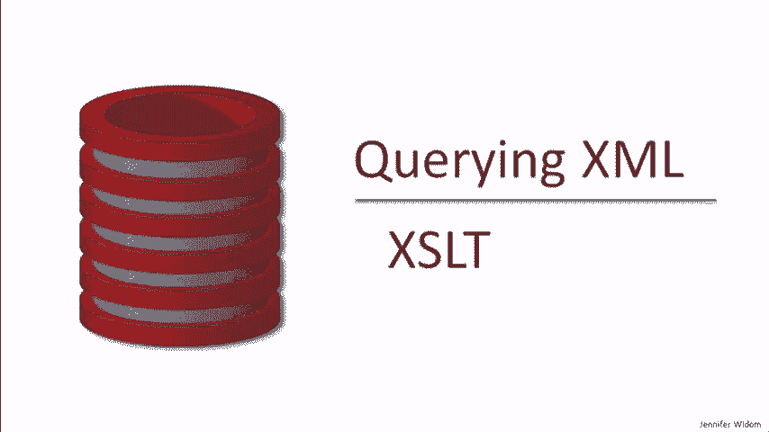

# 课程 P18：XSLT 查询语言入门教程 📖

在本课程中，我们将学习如何使用 XSLT（可扩展样式表语言转换）来查询和转换 XML 数据。XSLT 是一种基于模板匹配和转换的查询语言，其工作方式与 SQL、XPath 或 XQuery 有显著不同。

---

## 概述：什么是 XSLT？ 🤔


查询 XML 数据的技术不如查询关系型数据的技术成熟，因为它相对较新，并且缺乏像关系代数那样优雅的底层理论。我们已经学习过 XPath，它是为查询 XML 数据而开发的最早的语言之一。我们也讨论过 XQuery，它实际上是在 XSLT 之后开发的，但在风格上与 XPath 类似。

本节我们将要讲解的 XSLT 则非常不同。XSL 代表可扩展样式表语言，最初被提出用于样式化，但很快扩展了转换功能。如今，XSLT 比 XSL 本身应用得更为广泛。

---

## XSLT 的工作原理 ⚙️

我们可以将 XSLT 视为一种查询语言。其工作流程如下：

1.  一个 **XSLT 处理器** 接收输入。
2.  输入包括 **XML 数据**（以文档或流的形式）和一个 **XSLT 规范**（该规范本身也是用 XML 格式编写的）。
3.  处理器根据规范对数据进行转换。
4.  输出一个 **结果**，该结果也可以表示为 XML 文档或流。

这个过程可以类比传统的数据库查询处理：在关系型处理中，我们将数据和查询输入查询处理器，然后得到答案。因此，虽然 XSLT 是通过转换来实现的，但可以将其视为一种查询数据库的方式。不过，它的查询范式与我们习惯的方式有很大不同。

---


## 核心概念：将 XML 视为树 🌳

为了理解 XSLT 的规则和转换如何工作，将 XML 数据视为一棵树会非常有帮助。让我们以书店数据为例，将其构建成一棵树，就像我们初次学习 XPath 时那样。

*   根节点是 `bookstore`。
*   它有 `book` 和 `magazine` 等子元素。
*   对于 `book`，可能有 `title` 和 `author` 等子元素。
*   `title` 可能是一个叶节点，其值为“数据库系统入门”。
*   `author` 可能包含 `first-name` 和 `last-name` 子元素，其值为字符串。

这种树形结构是我们理解 XSLT 操作的基础。

---

## XSLT 的基本操作：匹配与替换 🔍

XSLT 的核心思想是 **匹配模板并进行替换**。


*   **匹配**：我们编写一个表达式（通常使用 XPath）来查找 XML 树中的特定部分。例如，查找具有特定作者的书籍。
*   **替换**：一旦找到匹配的部分，我们就用模板中定义的结果替换整个子树。
    *   例如，可以匹配书籍并用其书名替换整个书籍子树。
    *   或者匹配作者，然后用其名字和姓氏的连接字符串替换整个作者子元素。

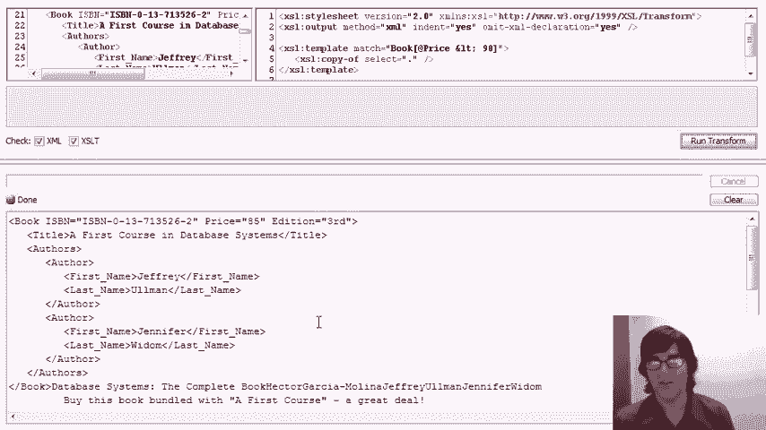

这种替换可以是递归进行的。例如，我们可以决定用一个不同的元素替换一本书，然后递归地将我们的模板应用到它的子元素上。

XSLT 语言还具有提取值的能力（通常使用 XPath 表达式），并包含一些类似编程语言的构造，如 `for-each` 循环和 `if` 条件语句。

---

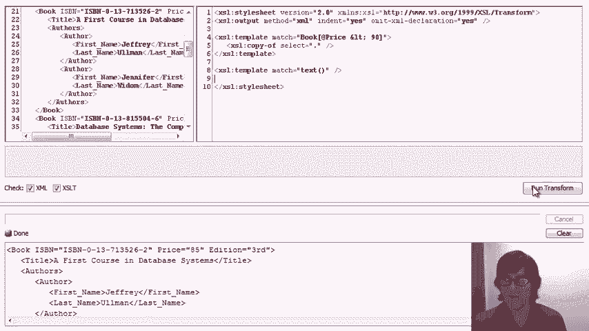


## 实战演示：XSLT 示例 🖥️

现在让我们通过实际示例来了解 XSLT 的应用。演示环境如下：
*   **左上角窗口**：包含要查询的 XML 文档（书店数据）。
*   **右上角窗口**：编写 XSLT 模板的地方。
*   **底部窗口**：显示转换后的结果。

以下是几个关键示例：

### 示例 1：简单模板匹配


这个示例将查找 `book` 和 `magazine` 子元素，并用它们各自的标题元素进行替换。


**XSLT 模板核心代码：**
```xml
<xsl:template match="book">
  <book-title>
    <xsl:value-of select="title"/>
  </book-title>
</xsl:template>
<xsl:template match="magazine">
  <magazine-title>
    <xsl:value-of select="title"/>
  </magazine-title>
</xsl:template>
```
**结果**：输出所有书籍和杂志的标题。

---

### 示例 2：条件匹配与默认文本处理

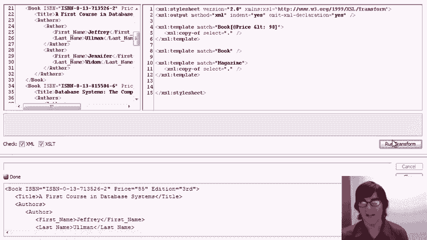

这个示例只匹配价格低于 90 的书籍，并将其复制到结果中。

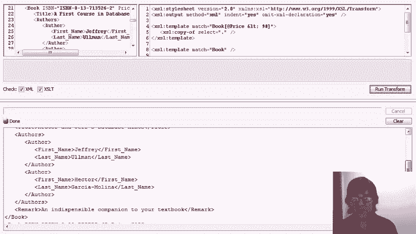

**XSLT 模板核心代码：**
```xml
<xsl:template match="book[@price < 90]">
  <xsl:copy-of select="."/>
</xsl:template>
```
初次运行会发现结果中包含了许多多余的文本节点。这是因为 XSLT 的默认行为会将未被任何模板匹配的元素的文本叶子节点值串联输出。

**解决方法**：添加一个匹配文本节点并返回空的模板。
```xml
<xsl:template match="text()"/>
```
添加此模板后，无关的文本即被移除。

---

### 示例 3：模板优先级

当多个模板匹配同一元素时，XSLT 会根据**模板的优先级**来决定使用哪一个。通常，更具体的模板（匹配条件更严格）优先级更高。

例如，有两个模板：
1.  匹配 `book[@price < 90]`（复制书籍）。
2.  匹配 `book`（删除书籍）。

由于第一个模板更具体（增加了价格条件），它将获得更高优先级，因此价格低于90的书籍会被复制，而其他书籍则被第二个模板删除。

如果两个模板特异性相同（例如，都使用等价的条件），则后出现的模板可能被优先应用，但这可能导致非预期的模糊匹配警告。

---

### 示例 4：复制与重构整个文档

有多种方式可以复制整个 XML 文档。

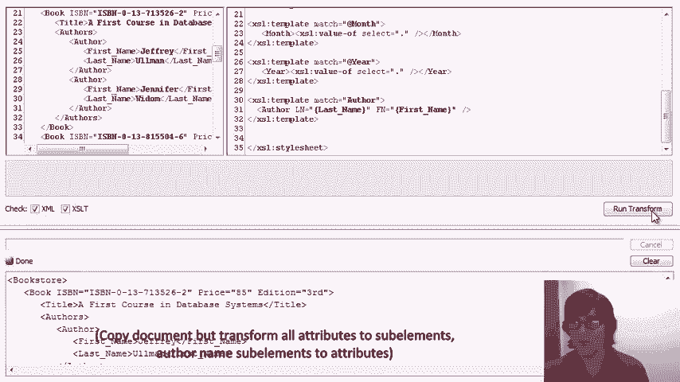

**最简单的方式**：匹配根元素并复制。
```xml
<xsl:template match="/">
  <xsl:copy-of select="."/>
</xsl:template>
```


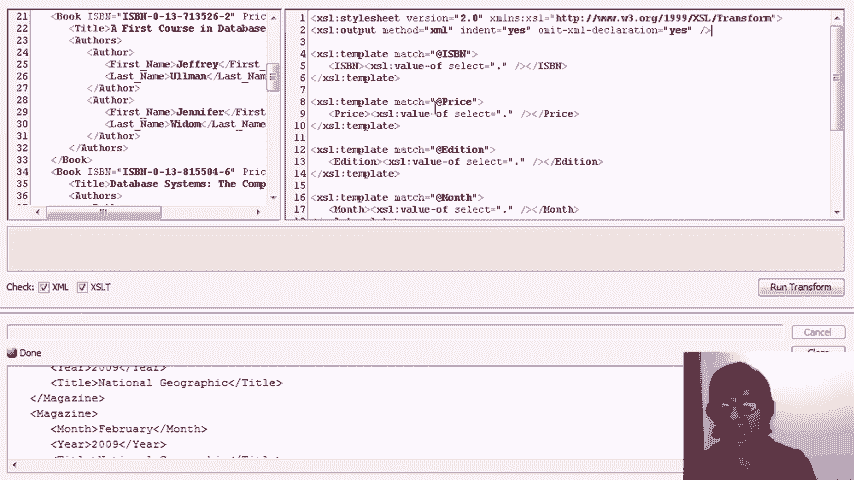

**更通用的递归方式**：匹配任何元素，复制它，并递归应用模板到其子元素。这种方式允许我们在复制整体结构的同时，添加额外的规则来修改特定部分。
```xml
<xsl:template match="*|@*|text()">
  <xsl:copy>
    <xsl:apply-templates select="*|@*|text()"/>
  </xsl:copy>
</xsl:template>
```
例如，我们可以在此基础上添加规则，将 `ISBN` 属性改为子元素，或者将作者的 `first-name` 和 `last-name` 子元素改为属性，从而实现文档结构的重构。

---


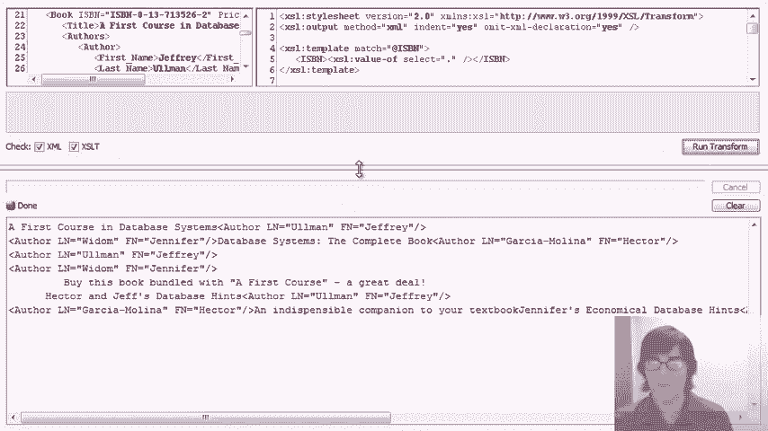

### 示例 5：编程式转换与 HTML 输出

XSLT 可以像编程一样使用循环、排序和条件判断，并生成 HTML 等格式。

以下示例将书籍数据转换为一个 HTML 表格，按价格排序，并将价格低于90的书籍标题以斜体显示。


**XSLT 模板核心代码：**
```xml
<xsl:template match="/">
  <html>
    <body>
      <table border="1">
        <tr><th>Title</th><th>Price</th></tr>
        <xsl:for-each select="bookstore/book">
          <xsl:sort select="@price"/>
          <xsl:if test="@price < 90">
            <tr>
              <td><i><xsl:value-of select="title"/></i></td>
              <td><xsl:value-of select="@price"/></td>
            </tr>
          </xsl:if>
        </xsl:for-each>
      </table>
    </body>
  </html>
</xsl:template>
```
**结果**：生成一个格式良好的 HTML 表格，展示了 XSLT 在数据呈现方面的强大能力。

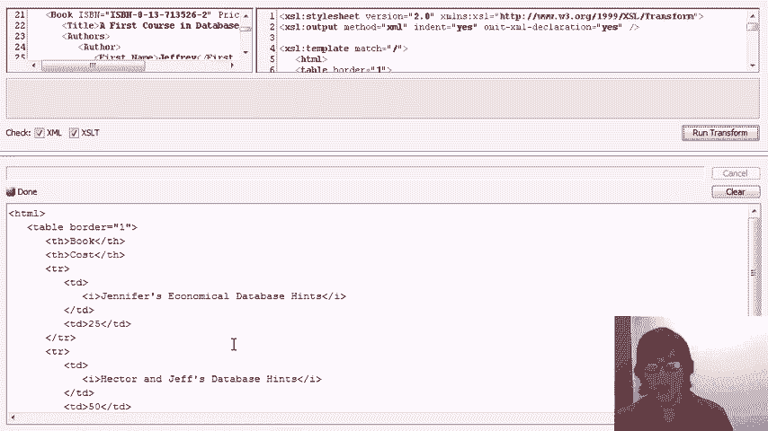

---

### 示例 6：复杂内容替换


我们可以使用多个模板或单个复杂模板来实现精细的内容替换。

**目标**：将名为“Jennifer WIDM”的作者替换为单个元素“Ms. WIDM”。

**方法一（使用两个模板）**：
1.  匹配 `first-name` 值为“Jennifer”的元素，并移除它（空模板）。
2.  匹配 `last-name` 值为“WIDM”的元素，将其替换为 `<name>Ms. WIDM</name>`。

**方法二（使用单个模板）**：
直接匹配 `author[first-name='Jennifer' and last-name='WIDM']`，并将其整个替换为新的 `author` 元素，其内容为 `Ms. WIDM`。

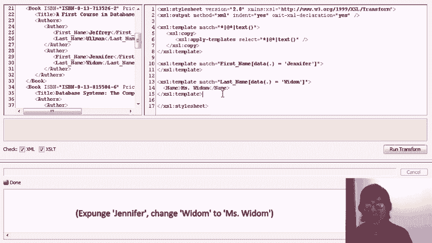

两种方法都能达到相同的转换效果。


---

## 总结 📝

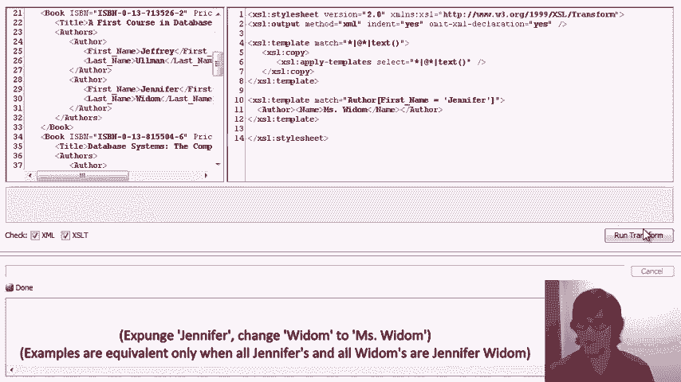

在本课程中，我们一起学习了 XSLT 查询语言的基础知识和核心概念：

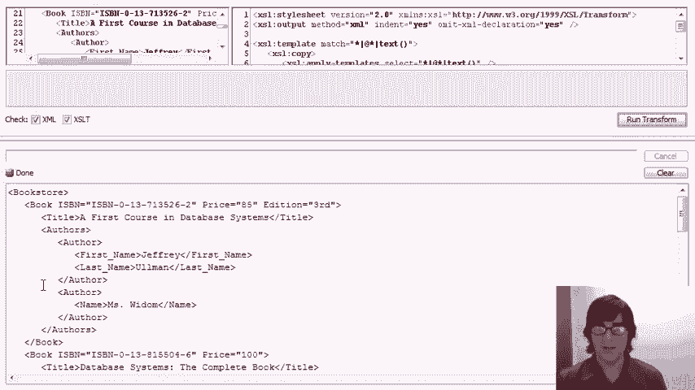

*   **工作原理**：XSLT 基于模板匹配和替换，将 XML 输入转换为新的输出（如 XML、HTML）。
*   **核心操作**：包括使用 XPath 进行匹配、替换子树、递归应用模板，以及使用 `for-each`、`if` 等编程构造。
*   **重要特性**：
    *   需要注意**默认的文本节点处理**行为，通常需要显式模板来管理。
    *   当**多个模板匹配相同数据**时，理解**模板优先级**规则至关重要。
    *   XSLT 非常适合用于**数据转换**和**结构重构**，也能生成用于展示的格式（如 HTML）。


XSLT 功能强大且灵活，虽然其范式与声明式查询语言不同，但一旦掌握，它能高效地处理复杂的 XML 数据查询与转换任务。