# P19：09-01-uml数据建模.mp4 - 哈库那玛塔塔i - BV1R4411u7dt

这个视频讲述了UML中的数据建模。

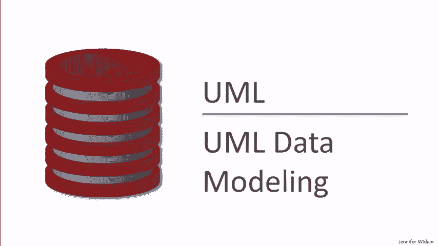

统一建模语言。数据建模的领域包括如何为一个应用表示数据。我们已经详细讨论了关系数据模型，它被广泛使用，并且我们有良好的设计原则来创建关系模式。我们还讨论了XML作为一种数据模型。XML相对较新，尚没有类似于关系模型的设计原则。

但是通常，当人们在设计数据库时，他们实际上会使用一种专门用于数据库设计的更高层次的模型。这些模型并不是由数据库系统实现的。

它们不是直接实现的，而是被转化为数据库系统的模型。那么让我们画个图来说明这个。假设我们有一个关系型数据库管理系统，通常简称为RDBMS，我将它画成一个磁盘，这是出于传统的做法。所以，如果我们在一个关系系统中创建一个数据库，这个数据库将由关系组成。

但数据库设计师不会直接设计关系，而是会在这里绘制更高层次的设计模型。这个模型会经过一个翻译器，这个过程通常是自动化的，将更高层次的模型转化成数据库系统可以理解的形式。

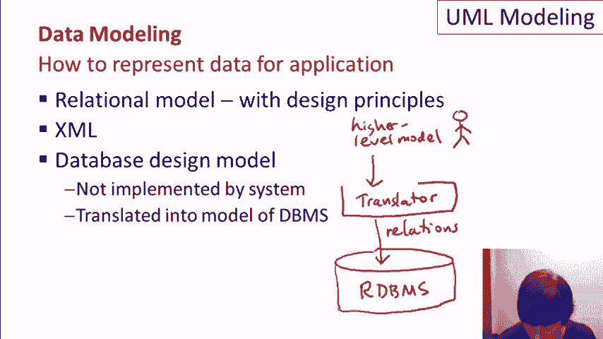

这些关系是由数据库系统实现的。那么这些更高级的模型是什么呢？从历史上看，实际上已经有几十年了，实体关系模型，也叫做ER模型，是一种非常流行的模型。但最近，统一建模语言（UML）变得更加流行。

对于更高层次的数据库设计，统一建模语言实际上是一个非常大的语言，不仅用于数据库设计，还用于程序设计。所以我们要看的，是UML的数据建模子集。这两种设计模型本质上都是图形化的。因此，在设计数据库时，

用户会画出框和箭头，可能还会用到其他形状。这些设计模型一般也可以通过自动化翻译为关系模式。虽然有时翻译过程中可能需要一些人工干预，但通常这不是必须的。所以在UML的数据建模子集里，

有五个基本概念——类、关联、关联类、子类以及组合和聚合。接下来我们将依次讲解每一个概念，并通过示例来说明。因此，UML中的类概念并不特定于数据建模，它也用于程序设计。类由类的名称组成。

类的属性和类中的方法。这可能对你来说很熟悉，尤其是来自编程方面。对于数据建模来说，我们在属性中增加了主键的概念，并去掉了与之相关的那些方法，因为此时我们主要关注数据建模。所以我们会在我们的示例中画出这些内容。

和往常一样，来自一个虚拟的大学招生数据库，包含学生、大学以及学生向大学申请等内容。所以我们的一类，不出意外，应该是学生类。在UML中，我们会将类画成这样的框。在顶部，我们写上类的名称，然后写上类的属性。

假设我们简化一些。我们有一个学生ID，一个学生名字，暂时还有学生的GPA。UML中下面部分会是方法的规范。同样，我们不会专注于方法，因为我们关注的是数据建模，而不是数据上的操作。所以一个区别是，我们将没有方法。

另一个方面是，如果我们希望，可以指定主键，使用术语PK来指定。所以我们会说，在这种情况下，学生ID是主键。就像关系模型中的键一样，这意味着当我们有一组学生类的对象时，每个对象都会有一个唯一的学生ID。

在我们的大学申请数据库中，每个对象的学生ID不会重复。因此，我们也可能有一个大学类。所以我们会有一个我们称之为大学（college）的类。暂时，我们将把这个类的属性设置为大学名称和所在州。同样，在完整的UML中，下面可能会有一些方法。我们将设置大学名称。

在这种情况下，成为主键。

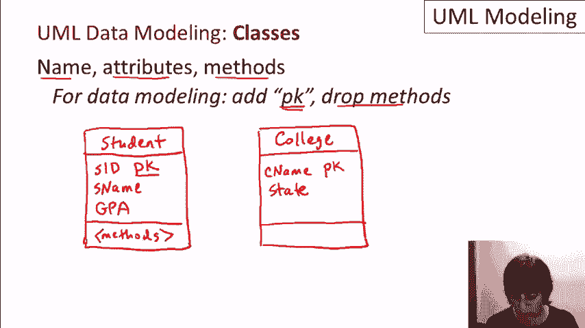

所以我们现在假设大学名称本身是唯一的。至此，类的部分就介绍完了。很直接，它们看起来很像关系。当然，它们会直接转换为关系。接下来，让我们谈谈关联。关联捕捉了两个不同类之间对象的关系。所以假设。

现在，我们有了学生类。我现在不写属性，只是像这样写。我们在UML设计中有了大学类。如果我们想要表示学生向大学申请的关系，我们就把它写成学生类和大学类之间的一条线。

然后我们给它命名。所以我们称之为应用（applied）。这表示我们有学生类中的对象，以及在大学类中的对象，它们通过应用关联（applied association）相互关联。如果我们想要给关系引入方向性，表示学生在申请。

如果是与大学相关联，我们可以在这里加一个小箭头。这是 UML 语言的一部分。虽然我们会看到，在将 UML 设计转换为关系时，这其实并不重要。当我们有类之间的关联时，我们可以指定我们所说的基数。

这涉及到一个类的多少个对象可以与另一个类的一个对象相关。我们将看到，我们可以捕捉诸如一对一、多对一等概念。那么我们来看看如何在 UML 图中具体指定这些内容。现在，我将使用两个通用类。假设我有一个类 C1 和一个类 C2。

假设我在这两个类之间有一个关联，这样就会是一条线。我可以给它命个名字。我们叫它 A。假设我想指定类 C1 中的每个对象——我只是把这些对象作为点写在类说明下方。假设我想说每一个对象。

将与 C2 中的至少 M 个，但最多 N 个对象相关。这里是 C2 类的对象。我将在我的关系中有这种扇出。要在 UML 图中指定这一点，我在关联线的右侧写 M 点点 N。再一次，这表示 C1 中的每个对象。

将与 C2 的 M 到 N 个对象相关。那么在这个符号中有一些特殊情况。我可以写 M 点点 星号。星号表示任何数量的对象。所以这会表示 C1 中的每个对象至少与 M 个，最多与任何数量的 C2 元素相关。我也可以写 0 到 N。这样。

这会表示类 C1 中的每个对象可能与 C2 中的没有任何对象相关。例如，这里我没有画出任何关系。可能没有，并且最多有 N 个 C2 的元素。我还可以写 0 点点 星号，这基本上没有对基数的限制。顺便提一下，默认情况下是 1 点点 1。

所以如果我们在关联上不写任何东西，我们假设每个对象仅与另一类的一个对象相关。而且这在两个方向上都适用。顺便提一下，我可以在这里写一个 x 点点 y。这样就会限制 C2 中有多少个对象与其相关。顺带一提，UML 允许一些缩写。

1 点点 1 可以缩写为普通的 1。而 0 点点 星号可以缩写为星号。

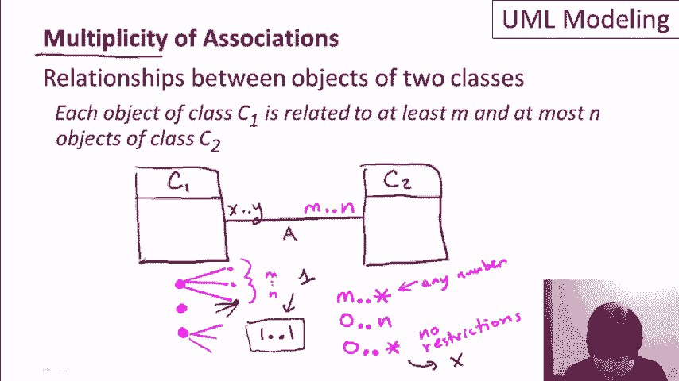

那么让我们来看一下学生和大学的例子，以及学生申请大学的关联的基数。假设我们坚持要求学生必须申请某些学校。所以他们至少申请一所大学，但不允许申请超过五所。

而且进一步来说，假设没有大学会收到超过 20,000 个申请。那么这个例子是人为设置的，目的是让我在两边都加上基数约束。所以我们会有我们的学生类，也会有我们的大学类，还会有学生和大学类之间的关联。

我现在就把名称写在下面，已经应用了。那么我们来想一下如何为这个关系指定基数。为了指定一个学生必须申请某个地方，但不能申请超过五所大学，我们在这一边加上 1..5 的基数。这有时真的需要思考。

记住应该在哪一边加上基数约束。有时真的需要思考一下。这样就可以从左边的对象扩展到右边的对象。所以它的意思是每个学生最多可以申请五所大学，且必须至少申请一所。这样就不会有没有申请任何大学的学生。在另一边。

我们想讨论的是，多少学生可以申请某个特定的大学。我们说它最多可以是 20,000 个。我们没有给出下限限制。因此我们会把基数指定为 0..20,000。

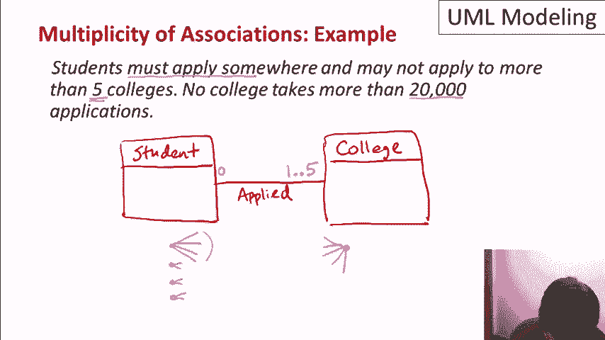

所以我之前提到过，关联的基数捕捉了这些类型的关系，你可能在别的地方学到过的一对一、多对一等关系。让我来展示一下关联、基数和这些术语之间的关系。如果我们有 C1 和 C2 之间的一对一关系。

从技术上讲，一对一并不意味着所有的东西都必须参与其中。它真正的意思是，左边的每个对象至多与右边的一个对象相关联。为了表示一对一关系，我们在两边都加上 0..1 的基数。看看我能不能用一些颜色来标注。

那么多对一呢？多对一意味着我们可以有多个 C1 的元素与一个 C2 的元素相关联，但每个 C2 的元素至多与一个 C1 的元素相关联。所以在这种情况下，我们在右边依然加上 0..1，表示每个 C1 对象最多与一个 C2 对象相关联。而在左边，我们加上星号，表示 C1 对象可以与多个 C2 对象相关联。

C2 的对象可以与任何数量的 C1 对象相关联。作为提醒，星号是 0..* 的缩写。多对多没有关系限制，因此两边都会是星号，非常简单。最后一个概念是完整关系。

所以完整关系是对这些关系的补充。它表示每个对象必须参与到关系中。因此我们可以有一个完整的一对一关系，这时两边都会是 1..1。我们也可以有一个完整的多对一关系，在左边是 1..*。

右边是1..1。最后，一个完整的多对多关系会是每一边都为1..*。作为提醒，默认情况下，如果我们没有指定多重性，则两边都是1..1。这将是一个完整的一对一关系。好了。

我们已经完成了类和关联的内容。

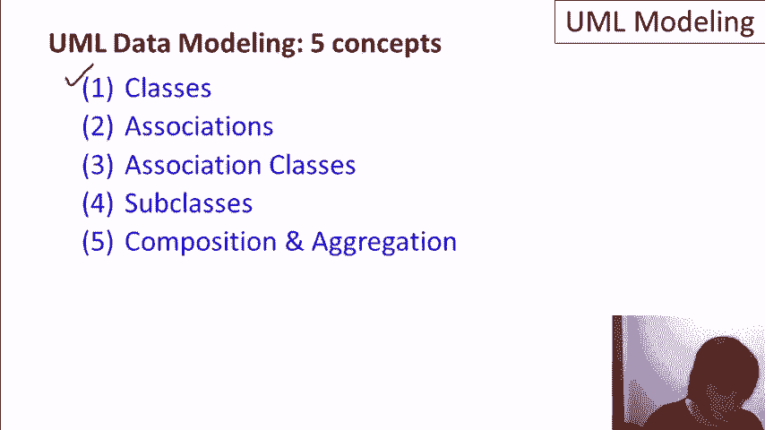

现在让我们来谈谈关联类。关联类通过允许我们在关联本身上添加属性，来概括关联的概念。再次，我们将使用我们的例子。所以我们已经知道如何指定学生申请大学。但是如果与申请相关联，我们想要添加，例如。

他们申请的日期，或者可能是该申请的决定？

我们实际上没有办法做到这一点，而不添加一个新的构造体，这个构造体被称为关联类。所以我们可以创建一个类，称之为应用信息（app info）。它看起来像一个类，顶部有名称框和属性。然后我们把这个框连接到关联上。

这告诉我们，每个学生与大学之间的关联实例都有额外的信息，申请的日期以及该申请的决定。现在，有几件事我想提一下。首先，在一些例子中，我可能会省略多重性。

在关联的两端。这并不意味着我假设的是默认的一对一关系，只是当这不相关时，我不会关注这一方面。现在，当我们有学生和大学的关联时——我们这里有一个学生，和一所大学——然后它们之间有一个关联。现在，我们所说的是这个关联。

这个类将会与日期和决定关联。我们无法在UML中描述的是，可能会有多个关系或关联，存在于同一个学生和同一所大学之间。所以当我们有一个关联时，假设两个对象之间最多只有一个关系——。

比如，如果我们想添加一个可能性，即学生可以多次申请同一所大学——比如他们想为不同的专业分别申请——那就必须以完全不同的方式来表示。我们必须添加一个单独的类，用于申请信息，并与学生和大学分别建立关系。

所以这是我对UML的理解，它有一个小小的不足。再次强调，它最多只能捕捉两个特定对象之间的一个关系，这两个对象分别属于两个不同的类。

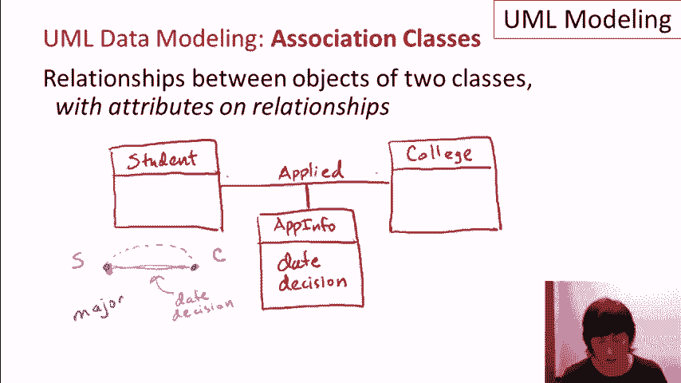

有时候，我们可能会设计一个关联类，结果发现其实我们并不需要它。然后我们会回到基数（multiplicities），看看这种情况是如何发生的。那么，再次让我们看一下通用类——C1和C2。假设它们之间有一个关联，然后我们有一个关联类。

我们就叫它AC，它会有一些属性。我们暂时可以把它们称为A1和A2。当然，C1和C2中也有属性。假设在左侧的基数是星号，意味着任何情况都可以。而在右侧，我们有1对1的关系。那么这个基数的含义是，每个C1类的对象至多关联一个C2类的对象。

所以——或者实际上，确切地说，是一个对象。在这种情况下，我们知道每个C1类的对象会有一个关联。如果只有一个关联，那么实际上我们可以将这些属性直接放入C1类，而不是拥有一个单独的关联类。

举个例子，如果这个类恰好是学生类，而这是大学类，并且我们坚持要求每个学生只能申请一个大学。那么我们在这里的属性，日期和决定，可以移到学生类中，因为我们知道它们只适用于一个大学。所以这些就是申请的日期和决定。

对于一个学生申请的唯一大学。再者，如果我们有0到1的关系，我们仍然可以将这些属性移到这里。在这种情况下，如果一个学生没有涉及任何大学——根本没有申请大学，或者更一般地说，C1类的一个对象与C2类的任何对象没有关联，

那么这些属性将会有等同于空值（null）的值。顺便提一下，关联可以是类与自身之间的关系。例如，我们可以有学生类，可能我们会有一个关联，叫做“兄弟姐妹”。学生与另一个学生之间的关联，因为他们是兄弟姐妹。

类与自身之间的关联，是通过一条线表示的，这条线连接类与自身，然后我们可以给它加上标签，称之为“兄弟”。对于基数，我们可以假设每个学生有0到任意数量的兄弟姐妹。假设如此，我们可以在关联的两端加上星号。

一个更有趣的关联可能涉及大学，比如说，我们有每个旗舰主校区的大学，但有些大学拥有独立的分支或卫星校区。那么这将是一个关系，一个关联，抱歉，是大学与自身之间的关联。

比如说，一个大学是另一个大学的分校。现在让我们考虑一下这里的基数。首先，当我们有这种自我关联时，在UML中，我们允许标注关联的两端。所以例如，我可以在一端标注“主校区”，另一端标注“卫星校区”。

现在有了这些标签，我们可以看到不对称性，这使我们能够正确地进行关联。假设每个卫星校区必须有一个主校区。那么这里就是一个1对1的关系。每个主校区可以有任意数量的卫星校区。或者实际上，我们可以假设其他情况。假设每个主校区可以有0到10个卫星校区。

所以，在自我关联的那一侧，这将是一个0对10的关系。

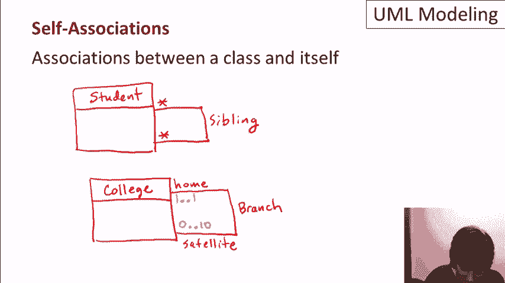

好的，我们完成了前三个部分。接下来进入子类。对于子类，我们将做一个相当大的示例，涉及到学生，我们将把学生分为外国学生和国内学生。我们还将单独指定那些参加过AP课程的学生。

这些将是我们的AP学生。因此，我们将有学生类作为我们层次结构的顶层。学生类将再次包含学生ID，假设是学生姓名和GPA。我们会说学生ID是该类中对象的主键。我们将有三个子类。

其中一个是外国学生，我们称其为foreign S。另一个是国内学生。然后我们还会为AP学生设置一个子类。我假设你已经对编程中的子类有所了解。所以，基本的想法是，当我们有一个子类时，子类有一些特定于对象的属性。

位于该子类中。它们将继承来自超类的属性。因此，我们将把学生类设为超类，并画出三个子类，分别是外国学生、国内学生和AP学生。我们会说外国学生除了学生ID外，还包含。

一个学生姓名和GPA，他们来自的国家。我们还会说，国内学生会有一个他们所在州的标识。我们还会说他们会有社会安全号码，这个信息可能是外国学生没有的。AP学生，颇有趣的是。

将是空的。它不会有任何额外的属性。但AP学生是唯一可以与AP课程建立关联的学生。我们会说AP课程有一个课程编号，这可能是主键，也许还有课程的标题和一些学分数。

然后，当我们的AP学生参加课程时，我们称这种关联为tuck。我们将有一个关联类，它将包含一些信息，我们叫它AP信息，关于他们参加特定AP课程的情况。我们会说这个关联类包含。

例如，他们上课的年份，可能还有他们在课上的成绩。最后，添加一些基数。假设AP学生可以参加1到10门AP课程，但他们必须至少选修一门才能成为AP学生。并且假设每门课程至少有一名学生参加。

以及任意数量的学生。所以这是我们到目前为止看到的最大UML图之一。再次强调，这里是超类。我们有我们的子类在下面。然后我们还拥有关联、关联类以及一些基数。再强调一下，注意到AP学生子类中没有属性是可以的。

该子类定义为那些学生。

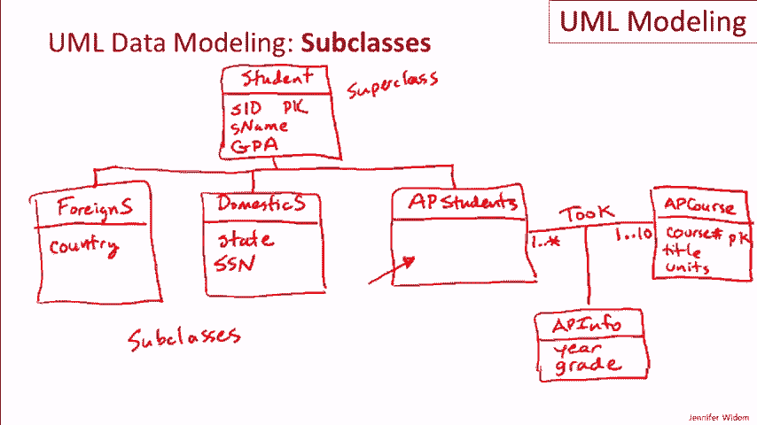

已经参加了AP课程。这里是一些术语和属性，关联到子类关系。UML中的超类有时称为泛化，子类称为特化。如果每个超类中的对象都至少属于一个子类，那么我们就说子类关系是完整的。

如果不是这种情况，那就是不完整的。并且不完整有时也被称为部分的。一个子类关系被称为互斥的，如果每个对象最多只属于一个子类。换句话说，我们没有任何对象属于多个子类。这有时被称为独占的。如果不是互斥的，那么它就是重叠的。

这意味着对象可以属于多个子类。我们可以有这些对子组合的任何组合。所以我们可以有不完整的重叠、不完整的互斥、完整的互斥或完整的重叠。

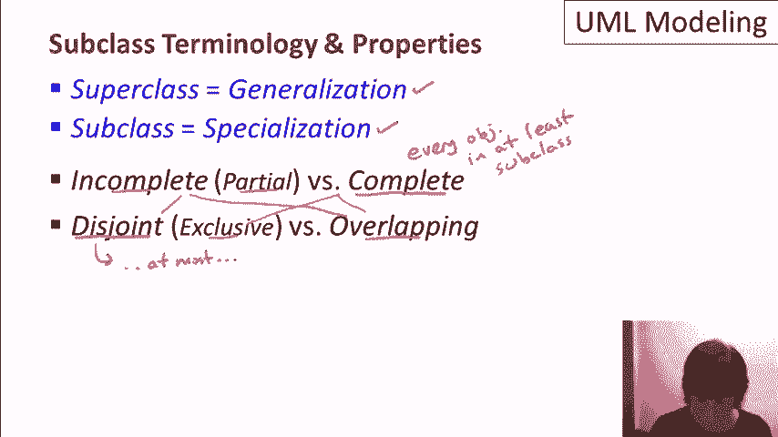

让我们回顾一下我们的示例。对于这个示例，我们可能会遇到一个完整的子类关系。换句话说，每个学生至少属于一个子类。可以推测，每个学生要么是外籍学生，要么是本国学生。而且，我们将说它是重叠的。

因为我们将会有一些学生，例如，既是本国学生又是AP学生。而在UML中，实际的表示法是，在这里加上小括号，以指定该子类关系是完整的且是重叠的。为了说明其他情况，假设我们没有这一整部分，这里没有AP学生。

我们只有外籍和本国学生。在这种情况下，我们会说子类关系是完整的，但它不会是重叠的。它将是互斥的。或者假设我们没有左边的这整部分。那么我们所拥有的只是AP学生子类。

在这种情况下，它可能是一个不完整的子类关系，因为并不是每个人都是AP学生。而且重叠和互斥之间没有任何区别。

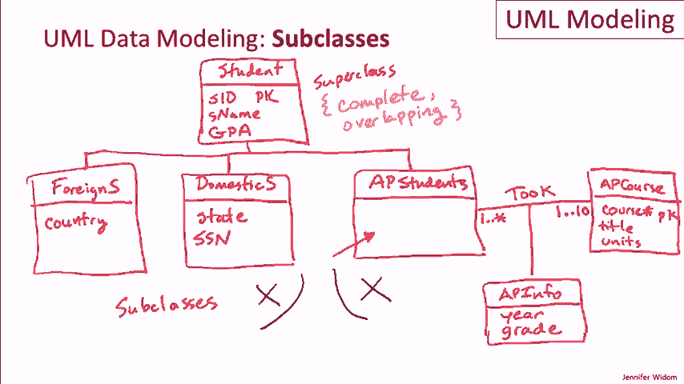

因为在这种情况下只会有一个子类。好了，现在我们已经讲到了最后一个概念，就是组合和聚合。让我直接澄清一点，聚合在这里与SQL中的聚合完全无关。这是一个完全不同的概念。现在让我们先谈谈组合。

组合（Composition）用于当我们有一个数据库结构时，其中一个类的对象属于另一个类的对象。我要举的例子是学院和系。所以我在这里画了这两个类。假设对于系，我们有系名，还有系所在的建筑。

所以我们假设每个学院有一堆系。现在，我们可以在学院和系之间建立一个关系，表明一个系属于一个学院。但是当我们有了“系属于特定学院”这个概念时，这时就使用组合结构。

组合的写法是在关联的末尾加上一个菱形。所以，组合实际上是一个特殊类型的关联。我们会在这里填入菱形，表示组合。聚合则是一个空菱形，我们稍后会看到。当我们有了这个菱形，并且我们正在创建其中一个组合关系时。

左侧隐含着一个1：1的关系。所以每个系属于一个学院。但这里有点不同的是，正常的关系假设中，我们并不认为系名是主键。事实上，我们可以在不同的学院中拥有相同的系，甚至是在同一栋建筑中。

这就没问题，因为一个系通过这种关系与它的学院相关联。这就是组合。一个类的对象属于另一个类的对象。让我举个聚合（aggregation）的例子。这稍微有点牵强。但我要做的是一个公寓类，而不是系，而是公寓。

所以我们来设想，数据库中有公寓楼的表示。也许它们有一个地址作为主键，像单位的数量这样的属性。我们假设一些公寓楼是由学院拥有或与之关联的，但并不是所有的公寓楼都是。

这就是聚合的做法。对于聚合，我们同样有一个关系。但在这种情况下，我们在这边画一个空的菱形。它的意思是，每个公寓类中的对象属于一个学院，或者最多属于一个学院，或者根本不属于任何学院。所以我们可以有属于学院的公寓。

我们还可以有一些独立的公寓。这就是开放菱形的用途，它代表的是聚合。

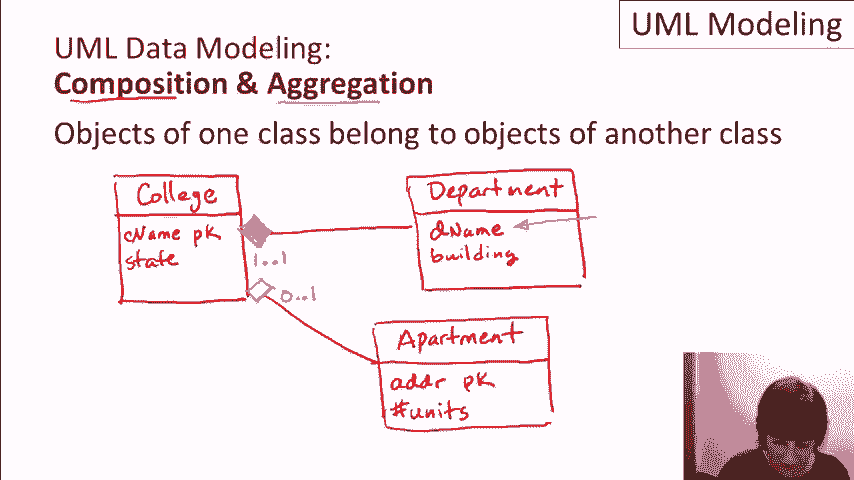

是关于。所以，总结来说，统一建模语言中的数据建模部分可以用于在更高层次上进行数据库设计。这是一种图形化语言。我们已经讲解了该语言的五个主要概念。还有非常重要的一点是，UML设计可以自动转换为关系型模型。这也是下一个视频的主题。

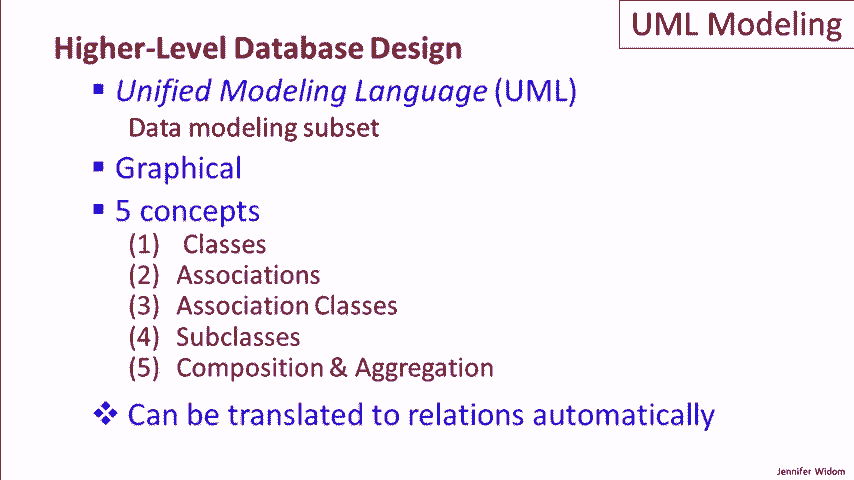
