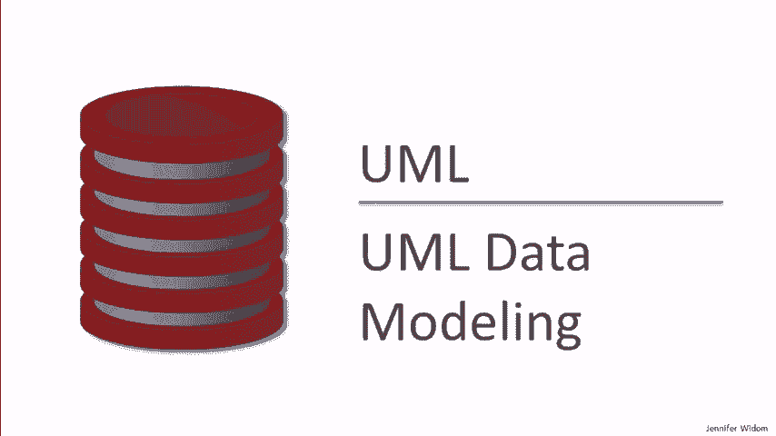
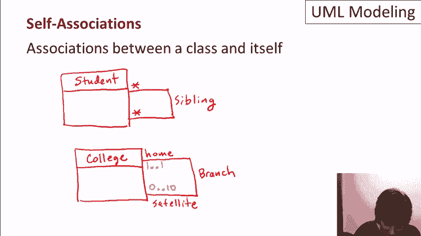

# 课程 P19：UML 数据建模 🗺️

在本节课中，我们将学习统一建模语言（UML）在数据建模领域的应用。UML 是一种强大的图形化建模语言，它不仅用于软件设计，也包含一个专门用于数据库设计的子集。我们将重点介绍如何使用 UML 的五个核心概念来构建高层次的数据模型，这些模型最终可以自动转换为关系数据库模式。

---


## 概述：什么是 UML 数据建模？

统一建模语言（UML）是一个庞大的语言体系，用于软件和系统的可视化建模。数据建模是其中的一个重要领域，它关注如何为一个应用程序表示和组织数据。

我们已经详细讨论过关系数据模型和 XML 数据模型。然而，在实际的数据库设计过程中，设计师通常会使用一种更高层次、专门用于设计的模型。这些模型（如 UML 数据模型）本身并不由数据库系统直接实现，而是通过一个翻译过程，被转化为数据库系统（如关系型数据库管理系统 RDBMS）能够理解和执行的模型。

这个过程可以形象地理解为：设计师在 UML 层面绘制图形化的“蓝图”，然后通过自动化工具将其“翻译”成具体的关系表。

---

## 核心概念一：类 📦

在 UML 中，类是一个核心概念，它同样用于程序设计和数据建模。一个类由名称、属性和方法组成。在数据建模的上下文中，我们主要关注**数据**，因此会强调**属性**和**主键**的概念，而通常忽略方法部分。

一个类在 UML 图中被表示为一个矩形框。框的顶部是类名，中间部分列出属性，底部（在数据建模中通常省略）用于列出方法。我们可以使用 `PK` 来指明哪个属性是主键。


**示例：学生类与大学类**

假设我们有一个大学招生数据库，其中包含“学生”和“大学”两类信息。

*   **学生类 (Student)**:
    *   属性：`studentID` (PK), `studentName`, `GPA`
*   **大学类 (College)**:
    *   属性：`collegeName` (PK), `state`

在 UML 图中，它们看起来像这样（此处用文字描述）：
```
[学生]
---------
studentID (PK)
studentName
GPA
```

```
[大学]
---------
collegeName (PK)
state
```

类的设计非常直观，它们看起来很像关系数据库中的表，并且可以直接转换为关系模式。

---

## 核心概念二：关联 🔗


上一节我们介绍了如何用类表示实体，本节我们来看看如何表示实体之间的关系。关联用于捕捉两个不同类的对象之间的连接。

**示例：学生申请大学**

在学生类和大学类之间，我们可以画一条线来表示“申请”关系。我们可以为这条线命名，例如“applied”。如果需要表示方向（例如学生申请大学），可以在线上添加一个小箭头。

### 基数约束


关联的一个重要方面是**基数**，它描述了一个类的对象可以与另一个类的多少个对象相关联。这可以捕捉一对一、一对多、多对多等关系。

基数在 UML 图中通过在线段两端标注 `M..N` 的格式来指定，表示“至少 M 个，最多 N 个”。有一些特殊的缩写：
*   `*` 是 `0..*` 的缩写，表示“零到任意多个”。
*   单独的 `1` 是 `1..1` 的缩写。
*   如果不标注，默认是 `1..1`。

**示例：为“申请”关系添加基数**

假设我们规定：
1.  每个学生必须至少申请1所大学，且最多申请5所大学。
2.  每所大学收到的申请数量没有下限，但最多不能超过20,000份。

那么，在学生端的基数应为 `1..5`，在大学端的基数应为 `0..20000`。


### 基数与关系术语的对应

以下是基数约束如何对应常见的关系术语：
*   **一对一 (One-to-One)**: 两边都是 `0..1`。
*   **完整一对一**: 两边都是 `1..1`。
*   **多对一 (Many-to-One)**: 一端是 `*`，另一端是 `0..1`。
*   **完整多对一**: 一端是 `1..*`，另一端是 `1..1`。
*   **多对多 (Many-to-Many)**: 两边都是 `*`。
*   **完整多对多**: 两边都是 `1..*`。

---

## 核心概念三：关联类 🧩

有时，关联本身也具有需要记录的属性。这时，我们就需要使用**关联类**。关联类看起来像一个普通的类，但它通过一条虚线连接到关联线上。


**示例：为申请添加详细信息**

在学生“申请”大学这个关联中，我们可能想记录“申请日期”和“录取决定”。仅仅使用关联无法存储这些信息。我们可以创建一个名为“AppInfo”的关联类，它拥有 `applicationDate` 和 `decision` 属性，并将其连接到“申请”关联线上。

**重要说明**：
UML 的关联默认假设两个特定对象之间最多只有一个关联实例。如果一个学生可以向同一所大学申请多次（例如申请不同专业），则需要用更复杂的方式（例如引入单独的“申请”类并与学生、大学分别关联）来建模，而不能简单地用同一个关联类表示。

**何时不需要关联类？**
考虑一个关联，如果一端（例如学生端）的基数是 `1..1`（即每个学生只关联一所大学），那么关联类的属性（申请日期、决定）实际上可以直接作为学生类的属性，因为每个学生只对应一份申请信息。

**自关联**
关联也可以发生在一个类与其自身之间。例如，“学生”类可以有一个“兄弟姐妹”关联，连接两个学生对象。我们可以在关联两端使用标签（如“兄/姐”和“弟/妹”）和基数（如两边都是 `*`）来更清晰地描述这种关系。

---

## 核心概念四：子类 🎯

子类用于表示类之间的“是一种”关系，即特化与泛化。子类继承超类的所有属性，并可以拥有自己特有的属性。



**示例：学生的子类**

假设我们将“学生”作为超类，并定义几个子类：
*   **外国学生 (ForeignStudent)**: 特有属性 `countryOfOrigin`。
*   **国内学生 (DomesticStudent)**: 特有属性 `state`, `socialSecurityNumber`。
*   **AP学生 (APStudent)**: 无特有属性，但只有AP学生可以与“AP课程”类关联。

“AP课程”类可能有属性 `courseNumber` (PK), `title`, `credits`。AP学生与AP课程之间通过“参加”关联连接，并且可以有一个关联类“APInfo”来记录 `yearTaken` 和 `grade` 等信息。

### 子类关系的性质

子类关系有两个重要性质：
1.  **完整性**: 如果超类中的每个对象都至少属于一个子类，则关系是**完整的**，否则是**不完整的**（或部分的）。
2.  **互斥性**: 如果超类中的每个对象最多只属于一个子类，则关系是**互斥的**（或独占的），否则是**重叠的**。

这些性质可以组合，例如：完整且互斥、完整且重叠、不完整且互斥、不完整且重叠。

**示例分析**：
在我们的例子中，如果每个学生要么是外国学生，要么是国内学生（完整），并且一个学生可以同时是国内学生和AP学生（重叠），那么这就是一个**完整且重叠**的子类关系。在UML图中，可以在子类连接处用 `{complete, overlapping}` 标注。


---

## 核心概念五：组合与聚合 ⚙️


最后，我们来看两个特殊的关联类型：组合和聚合。请注意，这里的“聚合”与SQL中的聚合函数毫无关系。

### 组合

组合表示一种强烈的“拥有”关系，其中一个类的对象是另一个类对象不可分割的一部分。在UML中，组合通过在关联的“所有者”端画一个**实心菱形**来表示。


**示例：学院与系**
一个“系”完全属于一个“学院”。如果学院不存在了，其下属的系也就没有意义了（在业务逻辑上）。这里，“学院”是所有者，关联末端是实心菱形。组合隐含了“系”端是 `1..1` 的基数（每个系属于且仅属于一个学院）。

### 聚合

聚合表示一种较弱的“整体-部分”关系，部分可以独立于整体而存在。在UML中，聚合通过在关联的“整体”端画一个**空心菱形**来表示。

**示例：学院与公寓楼**
一些“公寓楼”可能由某个“学院”拥有或管理，但并非所有公寓楼都如此。公寓楼可以独立存在，即使没有关联的学院。这里，“学院”是整体，关联末端是空心菱形。

---

## 总结 📝


本节课我们一起学习了UML数据建模的五个核心概念：
1.  **类**：表示实体及其属性。
2.  **关联**：表示实体之间的关系，可通过基数约束定义关系类型。
3.  **关联类**：为关联本身添加属性。
4.  **子类**：表示特化与泛化关系，具有完整性和互斥性。
5.  **组合与聚合**：表示两种不同强度的“整体-部分”关系。


UML数据建模提供了一种图形化、高层次的方法来设计数据库。它的最大优势在于，这些设计通常可以**自动或半自动地转换**为标准的关系数据库模式，这将是下一节课的主题。通过掌握这些概念，你可以更清晰、更系统地进行数据库结构设计。