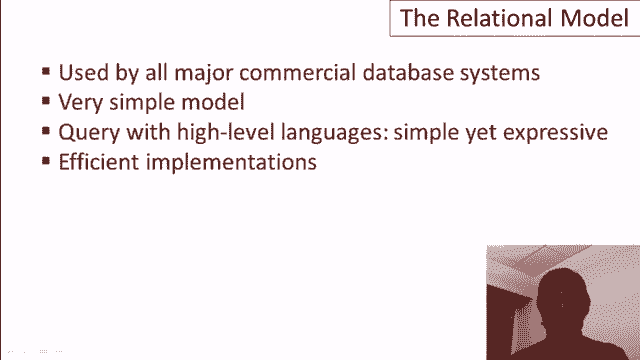

# 数据库基础课程 P2：02-01-关系模型 🗄️

在本节课中，我们将要学习关系模型。关系模型是数据库管理系统的基石，已有超过35年的历史。它催生了一个价值数十亿美元的产业，目前所有商业数据库系统都基于此模型。它的优势在于模型本身极其简单，支持通过高级查询语言进行高效的数据访问，并且其实现也极为高效。


## 关系与表格 📊

上一节我们介绍了关系模型的重要性，本节中我们来看看它的基本构造。关系模型中最核心的构造就是**关系**，通常也被称为**表格**。一个数据库由一组关系（或表格）组成。

每个表都有一个名称。在本教程的示例中，我们将使用一个关于学生申请大学的虚构数据库，并聚焦于两个表格：`学生`表和`大学`表。

## 属性与类型 📝

在关系型数据库中，每个关系都有一组预定义的列，这些列被称为**属性**。每个属性都有一个名称和一种**类型**（有时也称为**域**）。

以下是两个表格的属性定义：
*   **学生表**：包含`ID`（整数）、`姓名`（字符串）、`GPA`（浮点数）和`照片`（JPEG文件）等属性。
*   **大学表**：包含`名称`（字符串）、`州`（枚举类型，如50个州的缩写）和`注册人数`（整数）等属性。

## 元组与实例 📄

实际的数据存储在称为**元组**（或表格中的**行**）的结构中。在特定时间点，表格中所有元组的集合称为该关系的**实例**。而数据库的**模式**则定义了关系的结构，包括名称、属性和属性类型。模式通常提前设定，而数据实例会随时间变化。

以下是数据实例的示例：
*   **学生表实例**：
    *   `(123, ‘Amy’, 3.9, 😊)`
    *   `(234, ‘Bob’, 3.4, 😟)`
*   **大学表实例**：
    *   `(‘斯坦福大学’, ‘CA’, 15000)`
    *   `(‘伯克利’, ‘CA’, 36000)`
    *   `(‘麻省理工学院’, ‘MA’, 10000)`

## 空值（NULL）及其处理 ⚠️

关系型数据库中有一个特殊的值，称为**NULL**。它可以出现在任何类型的列中，用于表示值未知或未定义。

例如，如果学生Craig的GPA未知，其元组可能为`(345, ‘Craig’, NULL, 😐)`。NULL值在使用时必须非常小心，因为它会影响查询逻辑。

以下是查询示例，说明NULL值的影响：
*   查询`GPA > 3.5`的学生：结果包含Amy，不包含Bob，也不包含Craig（因为无法判断NULL > 3.5是否成立）。
*   查询`GPA <= 3.5`的学生：结果包含Bob，不包含Craig。
*   查询`GPA > 3.5 OR GPA <= 3.5`的学生：结果仍然不包含Craig。这说明即使逻辑上应包含所有元组，NULL值也可能导致其被排除在外。

## 键（Key）的概念 🔑

**键**是关系型数据库中的另一个核心概念。键是一个或一组属性，其值能**唯一标识**关系中的每一个元组。

以下是键的示例：
*   在`学生`表中，`ID`属性很可能是一个键，能唯一标识每个学生。
*   在`大学`表中，仅`名称`可能不够唯一（例如可能存在多个“华盛顿学院”），因此`名称`和`州`的组合更可能成为键。

键非常重要，其主要用途包括：
1.  **标识元组**：用于精确查找特定数据行。
2.  **提升效率**：数据库系统会为键建立索引，以加速基于键的查询。
3.  **关系引用**：在关系模型中，一个关系通过另一个关系的键来引用其元组，取代了指针的概念。

## SQL创建表语句 💻

在SQL语言中，创建关系（表）的语句非常简单直接。使用`CREATE TABLE`命令，后跟表名和属性定义列表。

创建学生表的SQL代码示例：
```sql
CREATE TABLE 学生 (
    ID INT,
    姓名 VARCHAR(255),
    GPA FLOAT,
    照片 BLOB
);
```


创建大学表的SQL代码示例：
```sql
CREATE TABLE 大学 (
    名称 VARCHAR(255),
    州 CHAR(2),
    注册人数 INT
);
```

## 总结 📚



本节课中我们一起学习了关系模型的基础知识。我们了解到关系模型是一个简单而强大的基础，它使用**表格**来组织数据，通过**属性**定义结构，用**元组**存储实际数据，并通过**模式**来描述整体设计。我们还探讨了**NULL值**的特殊性及其在查询中需要谨慎处理的原因，以及**键**对于唯一标识和数据关联的重要性。最后，我们看到了如何使用SQL语句来创建表。这些概念共同构成了理解和运用现代数据库系统的基石。