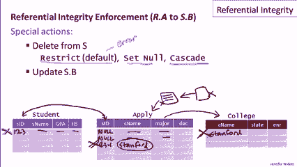
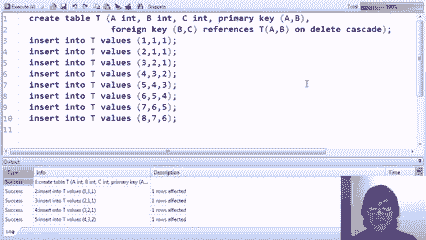

# 课程 P20：参照完整性约束 🧩

在本节课中，我们将要学习一种非常重要的数据库约束类型——参照完整性。我们将了解它的定义、作用、如何声明以及数据库系统如何强制执行它，以确保数据之间引用的有效性。


---

## 概述

参照完整性是关系型数据库中的一种关键约束。它确保一个关系（表）中某个属性（列）的值，必须存在于另一个关系（表）的指定属性中。这类似于编程中确保指针不指向无效内存地址的概念。通过本课，你将理解参照完整性的核心概念、如何定义它，以及当数据被修改时，系统如何处理潜在的违规情况。

---

## 什么是参照完整性？

上一节我们介绍了完整性约束的基本概念，本节中我们来看看参照完整性的具体定义。

在关系型数据库中，一个元组（行）引用另一个元组是通过指定属性值来实现的。参照完整性规定这些引用的值必须是有效的。

例如，在一个包含`学生`、`大学`和`申请`的数据库中，`申请`表中的`学生ID`值必须存在于`学生`表中，`大学名称`值必须存在于`大学`表中。这保证了每一条申请记录都对应一个真实的学生和一所真实的大学。

参照完整性约束可以形式化地描述为：如果关系R的属性A参照关系S的属性B，那么R.A中的每一个值都必须在S.B中存在对应值。

**公式表示：**
`∀r ∈ R, ∃s ∈ S 使得 r.A = s.B`

---

## 参照完整性的方向与外键

参照完整性具有方向性。我们通常说“引用表”参照“被引用表”。在引用表中的参照属性被称为**外键**。

以下是关于外键的几个关键点：

*   **术语**：参照完整性约束常被称为外键约束。
*   **被引用属性要求**：被参照的属性（如S.B）通常要求是其所在表的主键，或者至少被声明为`UNIQUE`。这主要是为了实现的效率。
*   **复合外键**：外键可以由多个属性共同组成，就像主键可以是复合主键一样。

---

## 可能违反约束的操作

并非所有数据库操作都会违反参照完整性。我们需要识别哪些操作可能带来风险。

以下是可能违反参照完整性约束的几种数据修改操作：

1.  **向引用表插入数据**：例如，向`申请`表插入一条记录，但其`学生ID`在`学生`表中不存在。
2.  **从被引用表删除数据**：例如，从`学生`表删除一个学生，但`申请`表中仍有记录引用该学生的ID。
3.  **更新引用表的外键值**：例如，将`申请`表中的某个`学生ID`改为一个不存在的值。
4.  **更新被引用表的主键值**：例如，更改`大学`表中的`大学名称`，导致`申请`表中对旧名称的引用失效。

对于在引用表上的插入或更新操作，如果导致违反约束，数据库系统通常会直接报错并拒绝执行该操作。



---

## 处理违反约束的策略：ON DELETE 与 ON UPDATE

对于在被引用表（如`学生`、`大学`）上进行的、可能导致违反约束的删除或更新操作，数据库系统提供了几种自动处理策略。这些策略在定义外键约束时通过`ON DELETE`和`ON UPDATE`子句指定。

以下是三种主要的处理策略：

*   **RESTRICT / NO ACTION（限制/无动作）**：**默认行为**。如果删除或更新被引用表的行会导致违反参照完整性，则操作被禁止，并产生错误。
*   **SET NULL（设为空）**：如果删除或更新被引用表的行，系统会自动将引用表中所有对应外键列的值设置为`NULL`。这要求外键列允许为`NULL`。
*   **CASCADE（级联）**：如果删除被引用表的行，则引用表中所有引用该行的记录也会被**自动删除**。如果更新被引用表的主键值，则引用表中所有对应外键值会被**自动更新**为新值。级联操作可能会产生连锁反应。

---

## 实践演示：定义与测试参照完整性


现在，让我们通过SQL代码来实际定义和测试参照完整性约束。

首先，我们创建被引用的`学生`表和`大学`表。


```sql
CREATE TABLE 学生 (
    SID INT PRIMARY KEY,
    ... -- 其他属性
);

CREATE TABLE 大学 (
    Cname VARCHAR(50) PRIMARY KEY,
    ... -- 其他属性
);
```

接着，我们创建`申请`表，并声明其外键约束。这里展示了基本的约束声明方式。

```sql
CREATE TABLE 申请 (
    SID INT,
    Cname VARCHAR(50),
    ... -- 其他属性如专业、决定等
    FOREIGN KEY (SID) REFERENCES 学生(SID),
    FOREIGN KEY (Cname) REFERENCES 大学(Cname)
);
```

如果尝试先向`申请`表插入数据，而引用的学生或大学不存在，操作将会失败。

```sql
-- 这将失败，因为学生123和大学‘Stanford’尚不存在
INSERT INTO 申请 VALUES (123, ‘Stanford‘, ...);
```

正确的顺序是先插入被引用表的数据，再插入引用表的数据。

```sql
INSERT INTO 学生 VALUES (123, ...);
INSERT INTO 大学 VALUES (‘Stanford‘, ...);
INSERT INTO 申请 VALUES (123, ‘Stanford‘, ...); -- 现在成功了
```

尝试删除被引用的数据（如`学生`表中ID为123的记录），如果`申请`表中有记录引用它，默认的`RESTRICT`行为会阻止删除。

```sql
DELETE FROM 学生 WHERE SID = 123; -- 默认情况下会失败
```

---

## 实践演示：使用 SET NULL 和 CASCADE

我们可以定义更灵活的外键行为。以下示例展示了如何定义`ON DELETE SET NULL`和`ON UPDATE CASCADE`。


```sql
CREATE TABLE 申请 (
    SID INT,
    Cname VARCHAR(50),
    ...,
    FOREIGN KEY (SID) REFERENCES 学生(SID) ON DELETE SET NULL,
    FOREIGN KEY (Cname) REFERENCES 大学(Cname) ON UPDATE CASCADE
);
```


插入一些测试数据后，我们进行以下操作：

1.  **测试 ON DELETE SET NULL**：删除一个被`申请`表引用的学生。删除后，`申请`表中对应记录的`SID`将自动变为`NULL`，而记录本身保留。
2.  **测试 ON UPDATE CASCADE**：更新`大学`表中的大学名称（如将`‘Berkeley‘`改为`‘Berserkley‘`）。更新后，`申请`表中所有引用旧名称`‘Berkeley‘`的记录，其`Cname`字段会自动更新为新名称`‘Berserkley‘`。

---

## 高级示例：表内引用与级联删除


参照完整性不仅限于表之间，也可以在单个表内部定义。这个复杂的例子展示了表内引用、复合外键以及级联删除的连锁反应。

我们创建一个表`T`，其属性`(A, B)`是主键，并定义属性`(B, C)`参照同一个表的`(A, B)`，且删除时级联。

```sql
CREATE TABLE T (
    A INT,
    B INT,
    C INT,
    PRIMARY KEY (A, B),
    FOREIGN KEY (B, C) REFERENCES T(A, B) ON DELETE CASCADE
);
```

插入数据形成一条引用链：`(1,1,1)` <- `(1,1,2)` <- `(2,1,3)` <- `(3,2,4)` ... 每个元组的`(B,C)`值都引用前一个元组的`(A,B)`值。

当我们删除链头的第一个元组`(A=1, B=1)`时，由于设置了`ON DELETE CASCADE`：
*   引用`(1,1)`的元组`(1,1,2)`会被删除。
*   接着，引用`(1,1,2)`的`(A,B)`值`(2,1)`的元组`(2,1,3)`又会被删除。
*   这个连锁反应会一直持续，直到整张表变空。



这个例子生动地展示了级联操作的传播效应。

---

## 总结

本节课中我们一起学习了参照完整性约束的核心知识。我们了解到：

1.  **参照完整性**确保了数据库中外键引用的有效性，是维护数据一致性的基石。
2.  外键约束具有方向性，并可以指向自身（表内引用）。
3.  插入、更新、删除操作都可能违反参照完整性。
4.  通过`ON DELETE`和`ON UPDATE`子句，我们可以指定违反约束时的自动处理策略：禁止操作（`RESTRICT`）、设为空值（`SET NULL`）或级联执行（`CASCADE`）。
5.  参照完整性约束还会影响表的删除操作，必须先删除依赖它的表，才能删除被引用的表。


在实际数据库设计中，合理地使用参照完整性约束，可以让数据库系统自动帮我们维护复杂的业务规则和数据关联，是构建健壮应用的重要一环。