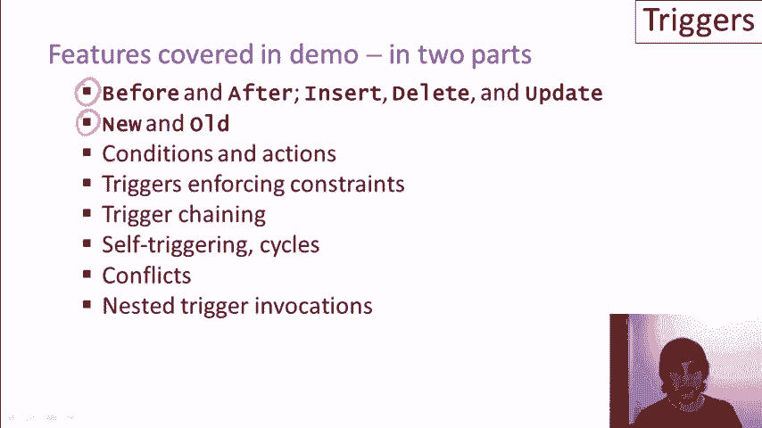

# P21：11-05-triggers-demo-part-1.mp4 - 哈库那玛塔塔i - BV1R4411u7dt

现在让我们看看触发器的实际效果。

我们将在演示中介绍许多特性，演示将分为两个部分。我们将讲解插入、删除和更新触发事件的前触发器和后触发器。我们不会讲解代替触发器，因为它们主要用于视图，因此会在视图的相关材料中讲解。我们将展示如何访问因触发器激活而修改的数据的旧数据和新数据。

我们将展示触发器的条件和触发器的动作。我们将展示一些用于强制执行约束的触发器。我们还将展示触发器链式执行的情况，即一个触发器的执行激活另一个触发器，并展示触发器自激活及其循环行为。

当多个触发器同时被激活时的冲突，最后是嵌套触发器调用的情况，即当一个触发器有多个动作，而这些动作又激活了其他触发器。本视频中介绍的触发器使用了 SQL 标准，但实际上没有任何数据库系统完全实现该标准。

事实上，一些系统在行为上偏离了标准，不仅在指定触发器的语法上有所不同，而且在行为上也有差异，这意味着必须非常小心，理解所使用的触发器系统。在本视频制作时，主要的开源系统是：

Postgres 拥有最具表现力的触发器系统，SQLite 的表现力稍弱，而 MySQL 则比其他两者更为限制。让我们看一下细节。在表现力和行为方面，Postgres 最接近标准。它确实完全实现了该标准，并且支持行级触发器和语句级触发器。

访问旧表和新表的行数据。遗憾的是，它使用了自己繁琐且略显尴尬的语法，这使得它不太适合我们的演示。SQLite 仅实现了行级触发器，而且它还有即时激活，这与标准的行为有所偏离。

正如我们在介绍中讨论的，标准规定，如果我们有一个修改语句进行许多更改，不管是行级触发器还是语句级触发器，我们都会在语句结束时执行触发器。而在 SQLite 中，我们只有行级触发器，并且它们在每次对数据库进行行级更改后被激活。结果是：

SQLite 也无法访问新表或旧表的数据。像 SQLite 一样，MySQL 也只有行级触发器，并且它们会立即激活，而不是在语句结束时激活。它们也无法访问旧表和新表数据。MySQL 还有两个其他显著的限制。其中之一是 MySQL 每个事件类型只允许一个触发器。因此，例如：

MySQL中只有一个触发器用于插入特定表或从表中删除数据。此外，MySQL中允许的触发器链式调用是有限的。现在，如果我们要称这些为“特性”，那么它们意味着MySQL中的触发器行为相对容易理解，因为它们在功能上相对受限，尤其是在它们如何相互作用方面。

对于我们的演示，我们将使用SQLite。让我提一下关于语法的一些事情。由于SQLite只有行级触发器，所以对于每一行，尽管它可以在触发器中被指定，但如果没有指定，则默认为隐式。正如我所提到的，无法访问旧表或新表，因此会导致一些结果。

SQLite没有引用子句。相反，它预先绑定了变量`old`和`new`，即旧行和新行。在演示中我们将清楚看到这一点。最后，SQLite触发器中的操作是一个包含任意数量SQL语句的begin-end块。演示分为两部分。在演示的第一部分，我们将涵盖前五个特性。

另外三个特性将在第二部分中讲解。在演示的第一部分，我们将使用我们通常的简单大学招生数据库，包含大学表、学生表，以及学生申请大学的记录。我们将从我们的常规数据库开始，包括四所大学、我们的学生集合，以及学生申请大学的元组集合。

这个概念是，我们将创建多个不同的触发器，然后修改数据库并查看这些触发器的行为。这里是我们的第一个触发器。需要提到的是，我们使用的特定接口不允许我们从这个窗口执行触发器命令，因此我们将单独执行这些命令。

我们的第一个触发器将拦截对学生表的插入操作，我们将检查GPA。如果插入学生的GPA大于3.3或小于等于3.6，那么该学生将自动申请斯坦福大学地质专业，并申请麻省理工学院生物学专业。让我们更仔细地看一下这个语法。我们为触发器指定一个名称。

我们指定触发事件，在这个例子中是对学生表的插入操作。接下来，我们有一个选项可以为每一行指定触发器。作为提醒，在SQLite系统中，只有“for each row”选项被实现，因此即使我们省略了这个子句，它仍然会是一个行级触发器。此外。

SQLite没有引用子句，因此SQL标准中有新行、旧行、新表以及其他相关内容。在SQLite中，只有新行和旧行得到支持，因此它们会自动绑定到预定义的变量`new`和`old`。现在请记住，`new`和`old`为我们提供了一种访问修改数据的方式，这些数据触发了触发器的激活。

在插入的情况下，只有新数据是插入的行。如果我们有更新操作，我们会同时获得修改行的新旧数据。如果我们有删除操作，我们将获得新旧数据可供使用。而如果是删除操作，我们只会得到旧数据。我们将在后面的示例中看到这些。在这个特定的示例中，我们将在触发器条件中使用`new`来引用触发器激活时插入的内容。

我们检查插入的元组是否满足我们设定的GPA范围。如果满足条件，触发器就会执行相应的操作。该操作将向apply表插入两个新元组，并再次使用new变量来访问我们正在处理的插入元组。

所以我们将为插入的行获取SID，并将其与斯坦福大学、地质学和一个空值决策一起插入到apply表中，同时新学生ID也将应用于MIT大学、生物学以及空值决策。我们已经创建了触发器，现在让我们尝试向数据库插入一些新学生。具体来说，我们将插入111号Kevin，他的GPA在我们设定的自动申请范围内。

还有222号Lori，她的GPA不在这个范围内。让我们插入这些元组，然后查看我们的数据。当我们查看学生表时，我们看到Kevin和Lori已经被插入。接下来我们看一下apply表。在这里我们看到学生111，也就是GPA为3.5的Kevin，已经被自动插入申请斯坦福的地质学专业和MIT的生物学专业。

提醒一下，空单元格表示空值。所以我们的触发器被这些插入操作激活，并将Kevin的申请插入到apply表中，但再次强调，Lori没有被插入，因为她的GPA未满足触发器条件。现在，让我们进行更大范围的数据库修改，来测试我们的触发器。

我们将基本上把整个学生表复制到自身中，因此我们将使学生表的大小翻倍。我们将提取每一行，并添加一个新行，新行与原行完全相同，唯一的区别是我们将递增学生ID，以生成唯一的ID。因此，当我们将所有这些行再次插入到学生表时。

所有GPA在3.3到3.6之间的学生，应该在apply表中自动插入一个元组，实际上是插入两个元组，分别申请斯坦福大学和MIT大学。所以这是插入命令。我们将插入学生表，并使用查询结果。

这是我们从前面的视频中学到的操作方式。我们的查询将从学生表中选择所有四个属性，除了会递增ID。所以这将再次使学生表的大小翻倍，复制每一行，但会生成新的学生ID。接下来我们执行插入操作，然后查看学生表。

然后我们刷新表格，看到表格的大小翻倍了，学号也已递增。当然，我们最关心的是申请表发生了什么。现在我们应该看到一些新的斯坦福和麻省理工的申请记录，的确看到了，如果回头看，我们会发现每个学号都对应一名符合触发器条件的学生，且其 GPA 在条件范围内。我们会保留所有这些元组，并在之后的触发器中使用它们。

这个触发器与我们在介绍视频中看到的非常相似，甚至可能是相同的。这个触发器模拟了级联删除的行为，当我们在申请表中有学生 ID 外键约束，引用学生表中的学生 ID 时，触发器会生效。

具体来说，它会在我们从学生表删除记录时激活，此外我还使用了“for each row”选项，我会在每个触发器中都这样做，尽管如果我省略了这个选项，行为也是一样的。所以，对于每一条从学生表删除的记录，它没有条件，因此始终会执行动作，而动作的内容是查找任何学生 ID 等于被删除 ID 的申请记录。再次强调，我们使用了这个保留字“old”，它自动绑定到被删除的旧行，因此它会绑定到触发该触发器的已删除元组。

接下来，我们会查找任何与被删除学生 ID 相关的申请记录，并将这些申请记录也删除。首先，我们来看看我们的学生表，因为我们将从该表中删除所有学号大于 500 的学生，所以会有相当多的学生被删除，然后我们会看到这些学生的申请记录，且学号大于 500 的申请记录会通过触发器自动删除。

所以这是一个简单的删除命令，用来删除所有学号大于 500 的学生，运行命令后我们来看看结果。我们进入学生表，确实看到许多学生已被删除，其中学号大于 500 的学生被删除了。

我们进入申请表，看到所有学号大于 500 的申请记录已经自动被删除了。现在让我们创建一个触发器，模拟级联更新以保证参照完整性。所以假设我们试图使用触发器来实现从申请表中的 C-name 到学院表中的 C-name 的参照完整性。当我们更新学院名称时，触发器将自动将这些更新传播到所有引用该名称的申请记录中。

让我们来看看这个触发器。这是我们第一个由更新命令触发的触发器，因此触发事件是在大学表上的更新，具体来说，我们指定了属性 C-name。如果我们省略 C-name，那么大学表上的任何更新都会触发这个触发器，但通过指定 C-name，它变得更加具体，也更高效。

如果我们省略每一行的内容，实际上是隐含的，那么让我们来看看我们的操作会做些什么。类似于之前的触发器，我们没有条件，我们自动运行操作。提醒一下，因为这是一个更新，所以我们现在有了新的和旧的变量，每次触发这个触发器都会针对一行，新值会给我们该行的新值，旧值会给我们该行的旧值。因此，我们的操作将会更新应用表，它会查找那些引用旧大学名称的大学名称，并将其更改为引用新的大学名称。

所以我认为这是一个非常直观的触发器，容易理解，用来执行级联更新。那么让我们修改数据库中两个大学的名称。我们将斯坦福大学更改为“农场”，而对于那些不知道的人，“农场”实际上是斯坦福大学的一个常见昵称，我们还会将伯克利大学更改为“Berserkle”，接下来我让你们自己得出结论。那么让我们继续更新并查看我们的数据，这次我们将直接查看应用表。

我们刷新一下，就会看到对伯克利的引用已自动更改为“Berserkle”，斯坦福则变成了“农场”，而且我并没有在应用表上执行更新命令。我只在大学表上执行了更新命令，大学表也发生了变化，触发器被激活并将更新传播到应用记录。

我们之前的两个触发器模拟了引用完整性约束。接下来的两个触发器将模拟键约束。具体来说，我们将要求大学名称在大学表中是唯一的。因此，我们将编写触发器，拦截大学表中的插入和更新操作，如果它们尝试创建或更新一个重复的大学名称，我们将通过引发错误来禁止该命令。

我们之前的触发器与这个触发器的另一个区别是，它们会在插入之前被激活，而不是在插入之后。那么让我们来看一下。我们有一个在插入之前激活的触发器，针对大学表，并且它们确实有条件。

它寻找的是另一个大学，那个大学的名称与我们试图插入的大学名称相同。如果我们尝试插入一个已存在的大学名称，就会发生键冲突。在这个操作中，我们使用了一个SQLite特有的构造，“raise ignore”。所以“raise”是一个引发错误的命令，而“ignore”则表示简单地忽略正在进行的更新。

所以当我们尝试插入那个大学时，当我们尝试插入一个重复的大学时，对不起，触发器会被激活，“raise ignore”会阻止插入。现在我们实际上有第二个触发器在这里隐藏。这个触发器处理对college表的更新操作。当大学名称被更新时。

类似于插入操作，它会检查是否已经存在一个具有提议新大学名称的记录。如果存在，它会再次使用“raise ignore”命令。现在这两个触发器在修改之前已经被指定，这是使用此特定条件所必需的。

如果我们指定了修改之后（after）作为触发事件类型，那么条件将必须检查不同的内容。它必须检查是否创建了重复的大学名称。但我们这里使用的是before版本，这是非常自然的。

“raise ignore”命令也与before触发器配合使用，因为它的作用是放弃正在进行的修改。现在我要提到的是，触发器动作中错误的抛出是非常依赖系统的。所以我向你展示的只是我们在before触发器情况下会使用的SQLite版本。

所以现在让我们对college表做一些尝试性的修改。提醒一下，我们已经将Stanford改成了the farm，将Berkeley改成了berserkly。在我们前两次插入尝试中，我们将尝试将Stanford插入到college表中。那应该是可以的，因为我们将Stanford的名称改成了the farm。

我们还将尝试为MIT插入另一条元组，这应该不起作用，因为这会激活触发器并检测到，如果插入MIT，它会是一个重复项。我们将执行这些命令。没有出现任何错误。没有抛出错误。作为提醒。

“raise ignore”命令只是停止了正在进行的命令。所以我们查看一下college表，发现新的Stanford元组已经成功插入，但尝试插入MIT元组被触发器拒绝了。现在让我们尝试一些更新。作为提醒，我们有一个触发器拦截插入操作，另一个拦截更新操作。

让我们试着将berserkly改回Berkeley。我们执行这个操作，进入college表，发现它确实已经改回了，没有问题，因为它没有造成键值冲突。现在让我们尝试将the farm改回Stanford。我们执行这个操作，再次没有出现错误，但当我们查看college表时，会看到the farm仍然存在。

因为我们插入了新的Stanford元组，触发器拦截了我们的更新操作，并且没有允许它被更改，因为这会导致重复值。所以对此感到沮丧，让我们将the farm改为Stanford，再次尝试我们最喜欢的大学拼写错误。我们执行命令，查看一下，的确如此。

“the farm”现在已经变回斯坦福，因为它没有创建重复的值。顺便说一下，在我们试验这些关键触发器时，后台发生了一些事情。不要忘记，我们定义了一个触发器，用于拦截大学名称的更新，并将这些更改传播到`apply`表。因此，在我们更改大学名称以实验关键触发器时，

我们还在修改`apply`表。我们来看看这个表发生了什么变化。我们来到这里，查看`apply`表，看到我们的伯克利学生仍然是伯克利。就在我们不注意的时候，它们变成了“berserkly”，然后又变回了伯克利。我们的斯坦福学生变成了“the farm”，然后又变回了斯坦福。

为了不引起我的不适，在继续之前，我会在后台删除那些学生记录以及它们的申请记录。现在让我们来看一个不仅仅强制执行约束的触发器。这个触发器将监控大学的申请情况。

当申请某个大学的数量超过十个时，它会将该大学的名称更改为大学名后加上“done”符号，表示我们已经完成了对该大学的处理。具体来说，这个操作是通过对`apply`表的插入触发的，因为插入操作会增加申请数量。

当插入操作发生时，它会计算该大学已提交申请的记录数。因为这是一个`after`触发器，所以它会包括我们插入的记录。`new`将再次指向插入的表。所以我们将计算特定大学的申请记录数量，并查看是否超过十个。

如果满足条件，系统将更新申请的大学对应的记录。我们再次通过查看新的大学名称来做到这一点，它将会把该大学的记录更新为当前的名称，并且这是一个与字符串“done”连接的操作。一旦执行，它就会生效。

你将会看到它是如何工作的。我们在这个示例中还会演示触发器链的应用，其中一个触发器的激活会执行一个操作，从而激活另一个触发器。让我提醒你一下我们创建的第一个触发器，它会在我们插入具有特定GPA的学生时触发。

我们已经为这些学生自动插入了斯坦福和MIT的申请记录。所以我实际上做的，不是直接插入申请记录来测试这个触发器，而是插入学生记录。如果这些学生记录符合条件的GPA，将会激活这个触发器，自动插入申请记录。

然后这些插入操作将激活我们的`apply`触发器，检查该大学是否有超过十个申请者。提醒一下，我们的触发器会自动插入学生的申请记录到斯坦福和MIT。所以目前还没有学生申请斯坦福。

这是因为我删除了那些拼写错误的斯坦福记录，导致没有剩下任何数据，但这没关系。这样可以帮助我们测试触发器。让我们看看有多少学生申请了MIT。我们目前有五个学生申请了MIT。最后，让我们看看有多少现有学生的GPA在范围内，符合自动申请的条件。

我之所以检查这一点，是因为我要插入这些学生的副本，这些副本将激活我的触发器并展示触发器链式操作。所以我目前有六个GPA在范围内的学生。如果我将这六个学生复制为新的插入记录，那么我们将会向MIT添加六个申请。这会使得MIT的总申请数达到十一，而斯坦福会有六个新的申请。

这使得我们的总数达到了六个。所以，如果触发器链式操作和其他一切顺利，当我们插入这六个新学生后，我们应该会得到新的申请记录，这会导致MIT状态变为已完成，因为申请数已超过十个阈值。

但斯坦福还没有标记为已完成。所以让我们看看这一切是否按照预期进行。我的插入命令将完全复制学生表。它将复制每个学生的一个额外副本。提醒一下，这将插入六个新的学生，这些学生的GPA在范围内，可以自动申请。

现在我们运行插入命令，然后直接去我们的学校数据表看看会发生什么。确实，MIT现在被标记为已完成，但斯坦福没有变化。让我们看一下我们的申请表，看看发生了什么。实际上，从这里开始的所有数据项都是在这一轮触发器激活过程中插入的。

所以我们添加了六个学生，其中六个GPA在范围内。这为我们带来了12个申请，一个是MIT的，一个是斯坦福的。其他申请是之前留下来的。然后，MIT的申请数超过十个，这意味着MIT被标记为已完成，并且发生了一些额外的触发器链式操作。

不要忘记我们的更新传播触发器，它仍然存在。该触发器在MIT状态被修改时，将它标记为已完成，并回过头来修改申请表中MIT的值。这可能是一个很好的例子，供你自己下载并进行操作，或者重新观看视频，完全理解发生了什么。现在让我们看看是否也能将斯坦福标记为已完成。

那么我们有多少学生申请了斯坦福呢？

这些是由于最近的触发器触发导致的六个申请。然后，我们有多少学生的GPA在范围内呢？我们有12个学生。其中六个是最初的学生，另外我们在之前的示例中复制了每个学生。因此，现在如果我们再次复制学生表，并插入到学生表中，整个复制会被插入。

然后我们会插入12个GPA在有效范围内的学生。这12个学生会自动申请斯坦福和伯克利大学。这应该会使斯坦福的申请数超过10个，并将其名称更改为“Stanford-done”。让我们执行这个命令，然后查看大学表，看看当前的状态。

事实上，现在斯坦福已经完成了。我们还可以看看申请表，因为这里发生了一些相当有趣的事情。所以我们看到所有的元组，斯坦福完成，麻省理工也完成。让我们回忆一下发生了什么。我们将元组插入到学生表中，这些元组导致了斯坦福和麻省理工的自动插入。然而，当斯坦福或麻省理工的申请数超过10个时。

然后，大学表中的名称被修改为“MIT done”或“Stanford done”。这个修改激活了我们的更新传播触发器，这个触发器将大学表中的变更传播到申请表中的变化。但在这个过程中，我们看到最终麻省理工和斯坦福的状态会停止显示“MIT done”和“Stanford done”。

然后我们回到麻省理工和斯坦福。那么，为什么会这样呢？

之所以如此，是因为当我们插入麻省理工和斯坦福的记录时，我们回去统计麻省理工和斯坦福的数量，在将它们改为“dash done”后，我们回到了零。如果我们继续进行，然后再次达到10个申请的阈值，我们就会看到斯坦福完成和麻省理工完成也发生变化。抱歉。

斯坦福和麻省理工会回到“Stanford done”和“MIT done”状态。所以这非常复杂。再次强调，我在这里真正想要展示的是，当然，触发器的基本行为，但也想展示触发器相互触发，进而触发其他触发器并反向触发的复杂性。我们将在第二个演示视频中看到更多这种情况。

但我确实想在这里说明这一点。还有一个我要强调的点。正如我之前提到的，在SQLite中，行级触发器会在每次行级变化后立即激活。这与SQL标准不同。在SQL标准中，

即使是行级触发器，在整个语句执行完毕后也会被激活。这就是例如Postgres的行为。但在SQLite中，我们是立即激活的。实际上，在这种特定的行为下，如果你仔细想一想，如果我们在整个命令执行结束时再激活触发器，结果会有些不同。

即使我们是逐行处理的，依然是非常复杂的事情。你可能想暂停一下，思考一下这个过程，或者更好的方法是亲自进行实验。让我们回到一个更简单的触发器。这个触发器在学生表插入之前拦截插入操作，并检查高中规模是否在有效范围内。

如果高中的人数低于100并且大于5,000，我们会认为这是一个错误。然后我们会忽略它。我们会提高我们的忽略级别。再说一次，这是SQLite特有的语法，表示不要执行正在进行的修改。现在，这发生在对学生的插入之前。我们还有一个触发器，别忘了。

它发生在对学生插入之后。这个触发器检查学生的GPA是否在特定范围内，并将该学生插入到申请表中。我们将稍微实验一下这两个触发器如何交互。现在，我已经删除了学生和申请表中的所有现有数据，以简化查看这些触发器的效果。现在，让我们尝试插入一些学生。所有三次插入的学生GPA都在自动申请的范围内。

然而，第二个和第三个学生的高中人数超出了范围。所以当我们执行三次插入时，希望触发器会因为高中人数超出范围而不允许插入第二个和第三个记录。而第一个触发器将会激活，并为Nancy自动提交申请。其实，你知道吗？

这里有一个小提示，说明发生了什么。我们可以看到第一次插入已经发生，第二行和第三行的零数据被影响了。所以我们已经可以看到它做了我们预期的事情，但让我们再看看数据，确保它确实如此。

所以，如果我们刷新申请页面，我们会看到实际上有一份申请提交到了斯坦福，一份提交到了MIT，GPA为4.4。让我们确认这就是我们的学生。我们有很多不同类型的工具需要处理第一个指令。我们有很多工具需要处理第一个指令。我们有很多工具需要处理第一个指令。

我们有很多工具需要处理第一个指令。我们有很多工具需要处理第一个指令。我们有很多工具需要处理第一个指令。我们有很多工具需要处理第一个指令。

我们有很多工具需要处理第一个指令。我们有很多工具需要处理第一个指令。我们有很多工具需要处理第一个指令。我们有很多工具需要处理第一个指令。

我们有很多工具需要处理第一个指令。我们有很多工具需要处理第一个指令。我们有很多工具需要处理第一个指令。我们有很多工具需要处理第一个指令。

我们有一些工具需要与第一次指令一起使用。我们有一些工具需要与第一次指令一起使用。我们有一些工具需要与第一次指令一起使用。我们有一些工具需要与第一次指令一起使用。

我们有一些工具需要与第一次指令一起使用。我们有一些工具需要与第一次指令一起使用。我们有一些工具需要与第一次指令一起使用。我们有一些工具需要与第一次指令一起使用。

我们有一些工具需要与第一次指令一起使用。我们有一些工具需要与第一次指令一起使用。我们有一些工具需要与第一次指令一起使用。我们有一些工具需要与第一次指令一起使用。

我们有一些工具需要与第一次指令一起使用。我们有一些工具需要与第一次指令一起使用。我们有一些工具需要与第一次指令一起使用。我们有一些工具需要与第一次指令一起使用。

我们有一些工具需要与第一次指令一起使用。我们有一些工具需要与第一次指令一起使用。我们有一些工具需要与第一次指令一起使用。我们有一些工具需要与第一次指令一起使用。

我们有一些工具需要与第一次指令一起使用。我们有一些工具需要与第一次指令一起使用。我们有一些工具需要与第一次指令一起使用。我们有一些工具需要与第一次指令一起使用。

我们有一些工具需要与第一次指令一起使用。我们有一些工具需要与第一次指令一起使用。第一次指令的决策设置为“是”，我们已经通过匹配学生ID和大学名称找到相应的apply记录。再次确认。

我已经删除了所有现有的学生和申请记录，以保持演示的简洁。我们将插入两名学生，Amy和Bob。他们都有IGPA，但只有Bob的高中规模足够大，能够让他自动被伯克利录取。然后，我们会让第一个学生Amy申请伯克利，第二个学生Bob也申请。

适用于伯克利和斯坦福大学。我们会看到，Bob将自动被伯克利录取。因此，我们运行了查询，查看apply，我们发现插入了三组apply记录，但只有第二条，也就是Bob申请伯克利的记录，决策被修改为“是”。我们的最后一个触发器也更复杂，我猜它更现实。

这个触发器监控的是大学的注册人数，当某个大学的注册人数超过16,000的阈值时，将会对其申请做出相应的处理。所有申请电气工程（EE）的学生将会从申请表中删除，所有决策为“是”的剩余申请将被设置为“未决定”。

关于这个触发器，有一个有趣的地方是它监控数据库的动态行为，并寻找阈值是否被突破，这是触发器可以做到的，而约束条件则无法做到。我们其他的一些触发器，正如你所看到的，它们更多地是监控静态约束条件。我们将阈值设定为16,000。我们看到斯坦福有15。

000名学生，其他的还离阈值有些距离。对于这个触发器，我还重新填充了我们的数据库，所以我们有很多申请记录。现在让我们进行一次更新，看看会发生什么。我们将所有大学的注册人数增加2,000。

这将使得斯坦福大学的学生数量超过16,000，并且应该激活触发器并更改申请表。当我们查看申请表时，我们可以看到电气工程专业的学生确实已经消失，所有以前为“是”的其他斯坦福申请现在都已被设置为“未决定”。

这就是我们演示触发器的上半部分。下一段视频我们将进一步探讨触发器可能产生的有趣交互以及它们的行为方式。到时见。
