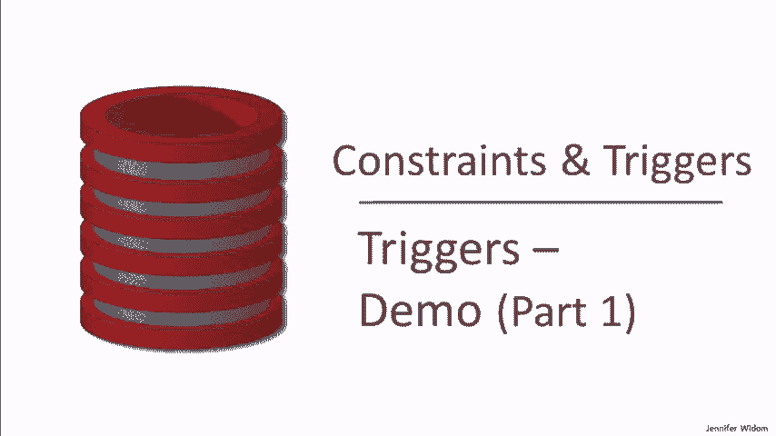

# P21：11-05-triggers-demo-part-1.mp4 - 哈库那玛塔塔i - BV1R4411u7dt

 Now let's see triggers in action。

 We're going to cover a number of features in the demonstration， which is going to be in two parts。 We'll cover before and after triggers with both insert， delete， and update triggering events。 We will not be covering instead of triggers， which are used primarily for views。 and so will be covered in the material on views。 We'll show access to new and old data for the modified data that causes a trigger to be activated。

 We'll show trigger conditions and trigger actions。 We'll show some triggers that are being used to enforce constraints。 We'll show trigger chaining。 where the execution of one trigger activates another trigger。 and we'll show triggers that activate themselves and cyclic behavior of triggers。

 Conflicts when multiple triggers are activated at the same time。 and finally nested trigger invocations， when a trigger has several actions which themselves activate other triggers。 The video introducing triggers use the SQL standard。 It so happens that no database system implements the exact standard。

 and in fact some systems deviate considerably from the standard。 not only in the syntax for specifying triggers， but also the behavior。 meaning one has to be very careful to understand the trigger system that one is using。 In terms of the primary open source systems at the time of this video。

 Postgres has the most expressive trigger system。 SQLite is a little bit less expressive。 and MySQL is considerably more restrictive than the other two。 Let's look at some details。 In terms of expressiveness and behavior， Postgres is the closest to the standard。 It really does implement the full standard。 It has row level and statement level triggers。

 access to old and new rows and tables。 Unfortunately。 it uses its own cumbersome and somewhat awkward syntax。 making it not very suitable for our demonstration。 SQLite implements row level triggers only。 and it also has immediate activation， which is a deviation in behavior from the standard。

 As we discussed in the introduction， the standard for triggers says that if we have a modification statement that makes many changes。 regardless of whether we have a row level or statement level trigger。 we execute triggers at the end of the statement。 Whereas in SQLite， we have row level triggers only。 and they're activated after each row level change to the database。 As a result。

 SQLite also does not have access to new table or old table。 Like SQLite。 MySQL also has only row level triggers， and they are activated immediately instead of at the end of the statement。 They also don't have access to old and new table。 There are two other significant limitations in MySQL。 One of them is that MySQL only permits one trigger per event type。 So， for example。

 only one trigger for inserting into a particular table or deleting from a table。 Furthermore。 there's limited trigger chaining allowed in MySQL。 Now， these features。 if we want to call them that， do mean that the triggers in MySQL are quite understandable in how they behave。 because they're fairly restricted in what they can do， and specifically in how they can interact。

 For our demo， we'll be using SQLite。 Let me mention a few things about the syntax。 Since there's row level triggers only， for each row。 although it's allowed to be specified in the trigger， is implicit if it's not present。 As I mentioned， there's no access to old table or new table， and so as a result。

 SQLite has no referencing clause。 Instead， it pre-binds variables old and new。 too old row and new row。 We'll see that clearly in the demo。 Finally。 the action in SQLite triggers is a begin-end block with any number of SQL statements。 The demo is in two parts。 In this part of the demo， we'll be covering the first five features。

 The other three will be covered in the second part。 In the first part of the demo。 we'll be using our usual simple college admissions database with the college table， student table。 and students applying to colleges。 We'll be starting with our usual database， our four colleges。 our set of students， and our set of tuples of students applying to colleges。

 The idea is that we'll be creating several different triggers。 and then we'll be modifying the database and see how those triggers behave。 Here's our first trigger。 Let me mention that the particular interface we're using does not allow us to execute trigger commands from this window。 so we'll actually be executing the commands separately。

 Our first trigger will intercept insertions into the student table， and we'll check the GPA。 If the GPA of the inserted student is greater than 3。3 or less than or equal to 3。6。 that student will be automatically applying to Stanford for a geology major and applying to MIT for a biology。 Let's look a little closer at this syntax。 We give the trigger a name。

 we specify the triggering event， in this case it's insertions on student。 Next we have the option of specifying for each row。 Now as a reminder。 in the SQLite system only the for each row option is implemented。 so even if we actually left this clause out， it would be a row level trigger。 Furthermore。

 SQLite does not have a referencing clause， so in the SQL standard there's the new row， old row。 new table， and all of the other things。 In SQLite only new row and old row are supported。 and therefore they're bound automatically to the predefined variables new and old。 Now remember new and old gives us a way to access the data that was modified to trigger that caused the trigger to be activated。

 In the case of an insertion there's only new data that would be the inserted row。 If we had an update we'd have both new and old available to us for the modified rows。 and if we had a delete， we'd have the new and old to use。 And if we had a delete we'd have only old。 and we'll see that in later examples。 In this particular example we're going to use new in our trigger condition to reference the insertion that caused the trigger to be activated。

 We check if that inserted tuple has a GPA within the range we're looking for。 If it does then we go ahead and the trigger will go ahead and execute the action。 The action will insert two new tuples into the apply table。 and it will again use the new variable to access the inserted tuple we're working on。

 so we'll get that SID for the inserted tuple， insert that together with Stanford。 Geology and a null decision into apply， and similarly have that new student ID applying to MIT。 Biology with a null decision。 We've created the trigger so now let's try inserting some new students into our database。 Specifically we'll insert 111 Kevin whose GPA is in the range that we're looking for for automatic applications。

 and 222 Lori whose GPA is outside of that range。 Let's go ahead and insert those tuples and let's take a look at our data。 When we look at our student table we see that Kevin and Lori have been inserted。 Now let's take a look at apply。 Here we see that student 111 and that was Kevin with the 3。5 GPA has automatically been inserted to apply to Stanford in Geology， MIT in Biology。

 and as a reminder， an empty cell indicates a null value。 So our trigger was activated by those insertions and it performed insertions into apply for Kevin。 but again not for Lori because her GPA did not satisfy the trigger condition。 Now let's make a more dramatic database modification to test out our trigger。

 We're going to essentially copy the entire student table into itself。 so we're going to double the size of the student table。 We're going to take each tuple and we're going to add a new tuple that's going to be identical except we're going to increment the student ID in order to generate a unique ID。 So when we insert all of these tuples into the student table again。

 all of those whose GPA is in the range between 3。3 and 3。6 should have an automatic tuple inserted into the apply。 actually two tuples inserted into the apply table having them apply to Stanford and MIT。 So here's the insert command。 We're going to insert into student the result of a query。

 That's a reminder how we do that from previous videos。 Our query will select from the student all four attributes except it will increment the ID。 So again this will double the size of the student table copying every tuple but with a new student ID。 So let's go ahead and perform the insertions and now let's look at the student table。

 So we'll refresh and we see that the table has doubled in size and again we incremented the IDs。 What we're most interested in of course is what happened to the apply table。 And now we should have a bunch of new applications to Stanford and MIT and indeed we do and if we look back we'd see that each of these IDs corresponds to a student whose GPA is in the range to satisfy the condition of the trigger。 We'll leave all these tuples in。 We're going to actually use them in later triggers that we're going to see。

 This trigger is very similar， maybe identical to one we saw in the introductory video。 This trigger simulates the behavior of cascaded delete when we have a referential integrity constraint from the student ID in the apply table to the student ID in the student table。

 Very specifically it is activated when we have deletions from student and again I'm including for each row and I'll do that in every trigger even though if I let's say that's not true。 Even though if I left it out the behavior would be the same。 So for each row that's deleted from student it has no condition so it always executes the action and the action says look and apply for any student ID whose ID is equal to the deleted one。 And again we're using this reserved keyword old as a reminder that's automatically bound to old row and so it will bind to the tuple that's being deleted that activated the trigger。

 So we'll find any apply records that refer to the deleted student ID and we'll delete those apply records as well。 So first let's take a look at our student table because what we're going to do is delete from this table every student whose ID is greater than 500 so quite a number of these students are going to be deleted and then we're going to see that the applications of those students and there's quite a large number of applications greater than 500 will be deleted automatically by the trigger。

 So here's the simple deletion command to remove all students whose ID is greater than 500 will run the command and let's go take a look。 So we go to our student table and we see indeed that a lot of students have been deleted those with ID's greater than 500。

 We go to our apply table and we see similarly but automatically all of the apply records with the student ID greater than 500 have been deleted as well。 Now let's create a trigger that simulates cascaded update again for referential integrity。 So let's suppose that we're trying to implement using triggers referential integrity from the C-name that appears in apply to the C-name that appears in college。 And when we update college names we're going to propagate those updates to any apply records that refer to them。

 So let's take a look at this trigger。 This is our first trigger that's activated by update command so the event the triggering event here is an update on the college table and very specifically we've specified the attribute C-name。 If we left out C-name then any update to college would activate this trigger but by putting in C-name it's a little more specific and more efficient。

 Again for each row would be implicit if we left it out and then let's take a look at what our action does。 Similar to the other the previous trigger we don't have a condition we update the we run the action automatically。 As a reminder we have now the new and old variables since it's an update so each activation of this trigger will be for one row new will give us the new value of that row old will give us the old value of that row。 So our action is going to update the apply table it's going to find college names that refer to the old college name and it's going to change them to refer to the new college name。

 So I would say this is actually a very intuitive trigger easy to understand to perform cascaded update。 So let's modify two of the college names in our database。 We'll change Stanford to the farm and for those of you who aren't aware the farm is actually a common nickname for Stanford and we'll change Berkeley to Berserkle and I'll let you draw your own conclusions。 So let's go ahead with the update and let's take a look at our data now and this time we'll just go straight to the apply relation。

 We'll refresh and we'll see that our references to Berkeley have been changed automatically to Berserkle and Stanford to the farm and again I did not run an update command on the apply table。 I only ran the update command on the college table which has also changed and then the trigger was activated and propagated the update to the apply records。

 So our previous two triggers simulated referential integrity constraints。 The next two triggers we're going to write are going to simulate key constraints。 Specifically we're going to say that the college name needs to be unique within the college table。 So we're going to write triggers that intercept both inserts and updates to the college table and if they try to create or update a college name that creates a duplicate we're going to disallow that command by raising an error。

 One other difference between our previous triggers is that these are going to be activated before the insert rather than after the insert。 So let's take a look。 We have a trigger that's activated before inserts on college and they do have a condition。

 What it looks for is another college that has the same college name as the one we're trying to insert。 So that would be a key violation if we attempt to insert a college name that already exists。 In the action we're using a SQLite specific construct， "raise ignore"。 so "raise" is an error raised command and "ignore" says simply ignore the update that's underway。

 So when we try to insert that college， when we try to insert a duplicate college， sorry。 the trigger will be activated and "raise ignore" will say disallow that insert。 Now we actually have a second trigger hidden underneath here。 This trigger handles updates to the college table。 When a college name is updated。

 similar to the insertion， it checks whether there's already a college with the proposed new college name。 and if it is， it again uses the "raise ignore" command。 Now both of these triggers were specified before the modification。 and that's necessary in order to use this particular condition。

 If we had specified after the modification as our type of triggering event。 then the condition would have to check something different。 It would have to check if we created duplicate college names。 But again。 we're using the before version here， which is quite natural。

 and the "raise ignore" command also works in tandem with the before。 because what it says is to abandon the modification that's underway。 Now I will mention that the raising of errors in trigger actions is quite system specific。 So what I'm showing you is simply the SQLite version that we would use in the case of a before trigger。

 So now let's make some attempted modifications to college。 As a reminder。 we've already changed Stanford to the farm， and Berkeley to berserkly。 So in our first two insertion attempts， we'll try to insert Stanford into our college table。 and that should actually work because we changed the name Stanford to the farm。

 We'll also try to insert another tuple for MIT， and that should not work because that should activate the trigger and detect that MIT would be a duplicate if it were inserted。 We'll run the commands。 We don't get any errors。 It's not raising an error。 As a reminder。

 the "raise ignore" command simply stops the command that's underway。 So we'll take a look at our college table， and we see that the new Stanford tuple was inserted successfully。 but the attempt to insert an MIT tuple was rebuffed by our trigger。 Now let's try some updates。 As a reminder， we had one trigger that intercepted inserts， and another that intercepted updates。

 Let's try to change berserkly back to Berkeley。 We run that， and we go to college。 and we see that it did in fact change back， no problem because it's not creating a key violation。 Now let's try changing the farm back to Stanford。 We'll run that。 Again， we won't get an error。 but when we go and look at the college table， we'll see that the farm is still there。

 because we inserted the new Stanford tuple， the trigger intercepted our update。 and didn't allow it to be changed because it would have caused a duplicate value。 So frustrated by that， let's change the farm to Stanford。 Again。 our favorite misspelling of the university。 We'll run the command。 We'll take a look。 And indeed。

 the farm has now been changed to Stanford because it's not creating a duplicate value。 Incidentally。 there were a few things happening behind the scenes while we were experimenting with those key triggers。 Don't forget， we defined a trigger that intercepts updates on the college name and propagates them to the apply table。 So while we were changing those college names to experiment with the key triggers。

 we were also modifying the apply table。 Let's go see what happened to that table。 We go here and we look at apply， and we see our Berkeley students are still Berkeley。 While we weren't looking， they changed to berserkly and back to Berkeley。 Our Stanford students changed to the farm， and then they changed to Stanford。

 So in order not to offend my sensibilities， I'll be deleting those students。 those apply records behind the scenes before we proceed。 Now let's take a look at a trigger that does a little more than enforce a constraint。 What this trigger is going to do is monitor applications to colleges。

 and when the number of applications to a college exceeds ten。 it's going to rename that college to have the college name and then dash done。 indicating that we're done with the college。 Specifically。 it will be triggered by insertions to apply， since that's what can increase the number of applications。

 And when there's an insertion， it's going to count the number of apply records that have applied to that college。 Now this is an after trigger， so it will include the one we've inserted。 and new is going to again refer to the inserted table。 So we'll count the number of applied records to that particular college and see if it exceeds ten。

 If it does， it's going to update the college corresponding to the one that's being applied to。 and we'll do that again by looking at the new college name。 and it's going to take that college record and it's going to set its name to be the current name。 and this is a concatenation operator with the string done。 Once we run it。

 you will see exactly how it works。 Another thing we'll be demonstrating in this example is trigger chaining。 where the activation of one trigger executes an action that activates another trigger。 And let me remind you of the first trigger we created。 where when we inserted students with a certain GPA。

 we automatically inserted apply records for those students to Stanford and MIT。 So what I'm going to actually do， rather than insert apply records directly to experiment with this trigger。 I'm going to insert student records。 Those student records， if they have the right GPA。 will activate this trigger， which will automatically insert into apply。

 and then those insertions will activate our apply trigger。 which will check to see if the college now has more than ten applicants。 As a reminder。 our trigger that does automatic insertions of applications will be having students apply to Stanford and MIT。 So we have no students who have currently applied to Stanford。

 That's because I deleted those misspelling Stanford and that led us with none， but that's fine。 That will help us test our trigger。 Let's see how many students we have who have applied to MIT。 We currently have five who have applied to MIT。 Finally。 let's see how many existing students we have with the GPA that's in range for automatic application。

 And the reason I'm checking that is because I'm going to insert copies of those students that will activate my trigger and show the trigger chaining。 So I currently have six students with GPA's in range。 So if I copy those six students as new insertions， then we'll be adding six applications to MIT。 That will bring us to a total of eleven and six applications to Stanford。

 bringing us to a total of six。 So if all goes well with the trigger chaining and everything else。 when we， after we insert those six new students， we should get new apply records that will cause MIT to be done because it's exceeded the threshold of ten。

 but Stanford not to be done。 So let's see if that all works out as we expect。 So my insertion command is going to completely replicate the student table。 It's going to copy one additional copy of every student。 And as a reminder that will insert six new students whose GPA is in range for automatic application。

 So let's go ahead and run the insert command and let's go straight to our colleges and see what happens。 Indeed， MIT is now labeled as done， but Stanford hasn't changed。 And let's look at our apply table to understand what happens。 So all of the tuples actually starting here were inserted in this round of trigger activation。

 So we added six students， six of them had GPA's in range。 That gave us 12 applications。 one each to Stanford and MIT。 These other applications were left over from before。 Then the fact that MIT went over ten applications meant MIT was relabeled as done。 and there was a bit more trigger training that happened。

 Don't forget our update propagation trigger， which is still there。 That one took MIT done when it was modified and sent it back to modify the values of MIT in the apply table。 This might be a good example for you to download and play with yourself or rerun the video just to entirely understand what's going on。 Now let's see if we can cope Stanford to be done as well。

 So how many students do we have to apply to Stanford？

 Those are the six applications that occurred as a result of the most recent trigger firings。 And how many students do we have with the GPA in range？ Well， we have 12 of them。 We have the six that we had originally， and then we copied each one of those over in our previous example。 So now if we once again copy our student table， insert into student and entire copy。

 then we'll be inserting 12 students whose GPA is in range。 Those 12 students will automatically apply to Stanford in Berkeley。 That should put Stanford over the threshold of 10 and change its name to Stanford dash done。 Let's go ahead and execute the command。 And then let's take a look at the college table and see where things stand。

 Indeed， now Stanford is done。 Let's also take a look at the apply table because there's some quite interesting things going on here。 So we see all of our tuples with MIT done in Stanford done。 And let's just remember what happened。 We insert tuples into student。 Those tuples are causing automatic insertions to Stanford and MIT。 However， when Stanford or MIT went over threshold over 10 applications。

 then the name was modified in the college table to the MIT done or Stanford done。 And that modification in the college table activated our update propagation trigger。 which then had the change in the college table propagate to the change in the apply table。 But then at some point along the way we see that we stop having MIT done and Stanford done。

 and we revert back to MIT and Stanford。 Well， why is that？

 That's because when we insert the MIT Stanford's automatically and we go back and count how many。 there are for MIT and Stanford after we've changed it to dash done， we're back to zero。 If we kept going and then we hit the threshold again of 10。 then we would see that Stanford done and MIT done change as well。 Sorry。

 that Stanford and MIT changed back to Stanford done and MIT done。 So this is very complicated。 Again， what I'm really trying to demonstrate here is， well， of course。 just the basic behavior of triggers， but also the complexity when triggers trigger other triggers that further trigger other triggers and back。 And we'll be seeing more of that in the second demonstration video。

 but I did want to illustrate it here。 And there's one more point that I want to make。 which is that as I mentioned， in SQLite， triggers。 row level triggers are activated immediately after each row level change。 That is different from the SQL standard。 In the SQL standard。

 even a row level trigger will be activated after the entire statement。 And that's what， for example。 Postgres does。 But in SQLite， we're activating immediately。 and actually in this particular behavior， if you think about it。 it would be somewhat different if we were activating the triggers at the end of the entire command。

 even if we're doing it one row at a time。 Again， very complicated stuff。 You might want to pause and just think about how this works or even better experiment yourself。 Let's go back to a simpler trigger。 This one intercepts insertions on student before they occur。 and it checks if the high school size is in range。

 If the high school sizes below 100 are greater than 5，000， we're going to assume that's an error。 and we're going to ignore it。 We're going to raise our ignore。 Again。 that's a SQLite specific syntax that says don't perform the modification that's underway。 Now。 that occurs before inserts on students。 We also have a trigger， don't forget。

 that it occurs after inserts on student。 And that one checks whether the student's GPA is in a particular range and inserts the student into the apply table。 And we're going to experiment a little bit with how these two triggers interact。 Now。 I've deleted all the existing data from the student and the apply tables just to simplify looking at what happens with these triggers。 Now， let's try inserting some students。 All three of the proposed insertions have GPAs that are in range for automatic application。

 However， the second and third students have high school sizes that are out of range。 So when we run the three inserts， hopefully the triggers will disallow the second and third inserts for their high school being out of range。 And the first trigger will activate automatic applications for Nancy。 Actually， you know what？

 There's a little hint down here of what happened。 We can see that the first insertion occurred and the second and third zero rows were affected。 So we can already see that it did what we expect， but let's go take a look at the data and make sure it did。

 So if we refresh the apply， we'll see that in fact there was one application to Stanford and one at MIT for 4。4。4。 Let's make sure that's our student。 We have a number of different types of instruments that we had to do with the first instruction。 We have a number of instruments that we had to do with the first instruction。 We have a number of instruments that we had to do with the first instruction。

 We have a number of instruments that we had to do with the first instruction。 We have a number of instruments that we had to do with the first instruction。 We have a number of instruments that we had to do with the first instruction。 We have a number of instruments that we had to do with the first instruction。

 We have a number of instruments that we had to do with the first instruction。 We have a number of instruments that we had to do with the first instruction。 We have a number of instruments that we had to do with the first instruction。 We have a number of instruments that we had to do with the first instruction。

 We have a number of instruments that we had to do with the first instruction。 We have a number of instruments that we had to do with the first instruction。 We have a number of instruments that we had to do with the first instruction。 We have a number of instruments that we had to do with the first instruction。

 We have a number of instruments that we had to do with the first instruction。 We have a number of instruments that we had to do with the first instruction。 We have a number of instruments that we had to do with the first instruction。 We have a number of instruments that we had to do with the first instruction。

 We have a number of instruments that we had to do with the first instruction。 We have a number of instruments that we had to do with the first instruction。 We have a number of instruments that we had to do with the first instruction。 We have a number of instruments that we had to do with the first instruction。

 We have a number of instruments that we had to do with the first instruction。 We have a number of instruments that we had to do with the first instruction。 We have a number of instruments that we had to do with the first instruction。 We have a number of instruments that we had to do with the first instruction。

 We have a number of instruments that we had to do with the first instruction。 We have a number of instruments that we had to do with the first instruction。 We have a number of instruments that we had to do with the first instruction。 We have a number of instruments that we had to do with the first instruction。

 We have a number of instruments that we had to do with the first instruction。 We have a number of instruments that we had to do with the first instruction。 We have a number of instruments that we had to do with the first instruction。 We have a number of instruments that we had to do with the first instruction。

 We have a number of instruments that we had to do with the first instruction。 We have a number of instruments that we had to do with the first instruction。 We have a number of instruments that we had to do with the first instruction。 We have a number of instruments that we had to do with the first instruction。

 We have a number of instruments that we had to do with the first instruction。 We have a number of instruments that we had to do with the first instruction。 The first instruction is set to a decision of yes， and we have found that。 apply record by matching the student ID and the college name。 Once again。

 I've deleted all existing students and apply records just to keep the demonstration simple。 We're going to insert two students， Amy and Bob。 They both have IGPA's。 but only Bob's high school size is big enough to grant him automatic admission to Berkeley。 Then we're going to have our first student， Amy， apply to Berkeley， and our second student， Bob。

 apply to both Berkeley and Stanford。 And we'll see that Bob is going to automatically be admitted to Berkeley。 So we've run the query and we take a look at apply and we see that we have inserted the three-group apply records。 but only the second one and that's Bob's application to Berkeley had a decision that was modified to yes。 Our last trigger is also more complex and I guess sort of realistic。

 What this trigger monitors is enrollments of colleges and at the point that an enrollment of a college is increased。 past the threshold of 16，000， then some action will be taken on its applications。 The anybody who's applied to EE at that college will be deleted from the application table。 and all remaining applications where the decision had been yes are going to have the decision set to undecided。

 One thing that's interesting about this trigger is it does monitor so the dynamic behavior of the database。 and look for a threshold to be passed and that's something that triggers can do that simply cannot be done with constraints。 Some of our other triggers many of them as you saw were more effectively monitoring static constraints。 We set the threshold at 16，000。 We see that Stanford has 15。

000 students and the others aren't very close to the threshold。 For this trigger I've also repopulated our database so we have a whole bunch of apply records。 So let's go ahead and make an update and see what happens。 We're going to increase all college enrollments by 2，000。

 That will cause Stanford to pass the threshold of 16。000 and it should activate the trigger and change the apply table。 When we go look at the apply table we see that indeed the electrical engineering majors have disappeared and all of the other applications to Stanford。 that were formerly yes have now been set to undecided。

 That concludes the first half of our demonstration of triggers。 In the next video we'll be exploring even further the interesting interactions that triggers can have and how they behave。 See you then。