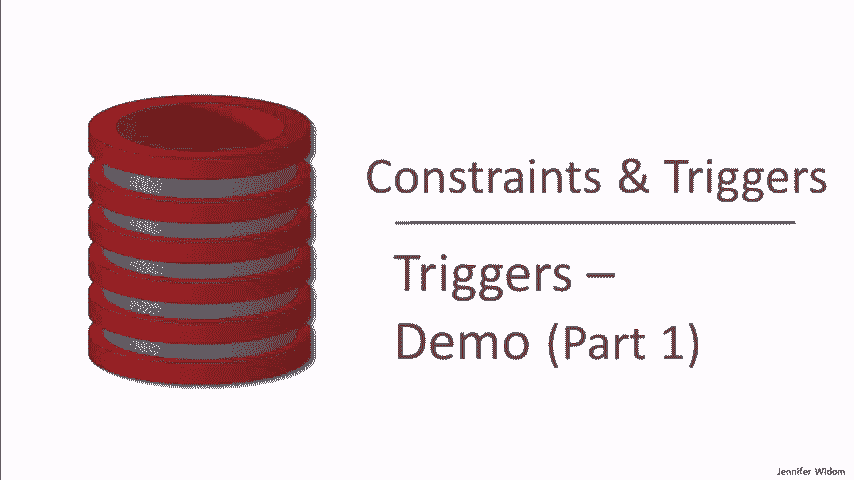
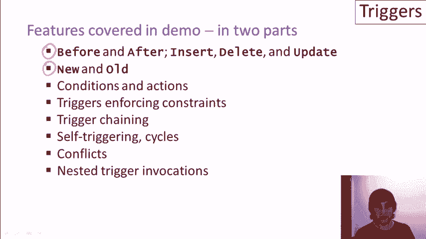

# 数据库触发器实战教程（第一部分）📘



在本课程中，我们将学习数据库触发器的核心概念，并通过一系列实际演示来探索其工作原理。触发器是数据库管理系统中的一种强大工具，它能在特定事件发生时自动执行预定义的操作。我们将重点介绍插入、删除和更新事件的前触发器与后触发器，并展示如何访问修改前后的数据。

---

## 触发器概述与系统差异 🔍

上一节我们介绍了课程目标，本节中我们来看看不同数据库系统对触发器的支持情况。

虽然触发器遵循SQL标准，但没有任何数据库系统完全实现该标准。各系统在语法和行为上存在差异，因此理解所使用的特定系统至关重要。

以下是当前主要开源数据库系统对触发器的支持情况：

*   **PostgreSQL**：最接近SQL标准，支持行级和语句级触发器，并能访问新旧表数据，但语法较为独特。
*   **SQLite**：仅支持行级触发器，且触发器在每次行修改后**立即激活**（与标准的语句结束后激活不同）。它通过预定义的 `OLD` 和 `NEW` 变量访问行数据，不支持访问整个新旧表。
*   **MySQL**：功能限制较多，仅支持行级触发器和即时激活。每个表对每种事件（如INSERT）只能定义一个触发器，且触发器链式调用能力有限。

本教程的演示将基于 **SQLite** 进行。

---

## 演示准备与第一个触发器 ✨

在开始具体演示前，我们需要准备好数据库环境。我们将使用一个简单的大学招生数据库，包含 `college`（大学）、`student`（学生）和 `apply`（申请）三个表。

现在，让我们创建第一个触发器。这个触发器将在向学生表插入数据时被激活。

**触发器功能**：当插入一名GPA在3.3到3.6之间的学生时，自动为该生生成两条申请记录，分别申请斯坦福大学的地质专业和麻省理工学院的生物专业。

**触发器代码**：
```sql
CREATE TRIGGER auto_apply
AFTER INSERT ON student
FOR EACH ROW
WHEN (NEW.gpa > 3.3 AND NEW.gpa <= 3.6)
BEGIN
    INSERT INTO apply VALUES (NEW.sid, ‘Stanford‘, ‘geology‘, NULL);
    INSERT INTO apply VALUES (NEW.sid, ‘MIT‘, ‘biology‘, NULL);
END;
```

**代码解释**：
*   `CREATE TRIGGER auto_apply`：创建名为 `auto_apply` 的触发器。
*   `AFTER INSERT ON student`：指定触发事件为在 `student` 表执行 `INSERT` 操作**之后**。
*   `FOR EACH ROW`：声明为行级触发器（在SQLite中可省略，因默认即为行级）。
*   `WHEN (...)`：设置触发条件，仅当新插入行的 `gpa` 字段值满足条件时执行操作。
*   `NEW.sid`：引用被插入行的 `sid`（学号）值。

**演示操作**：
1.  插入学生Kevin（GPA=3.5）和Lori（GPA=3.8）。
2.  查询发现，只有Kevin被自动添加了两条申请记录。
3.  执行一个批量插入，复制所有现有学生（ID递增），导致所有GPA在范围内的新记录都自动生成了申请。

---

## 实现参照完整性：级联删除与更新 ⛓️

上一节我们看到了一个用于自动生成数据的触发器，本节中我们来看看如何使用触发器来维护数据之间的关联，即参照完整性。

### 模拟级联删除

当从学生表删除一条记录时，我们希望自动删除申请表中所关联的该学生的所有申请记录。

**触发器代码**：
```sql
CREATE TRIGGER cascade_delete
AFTER DELETE ON student
FOR EACH ROW
BEGIN
    DELETE FROM apply WHERE apply.sid = OLD.sid;
END;
```

**代码解释**：
*   `AFTER DELETE ON student`：在 `student` 表执行 `DELETE` 操作后触发。
*   `OLD.sid`：引用被删除行的 `sid` 值。

**演示操作**：删除所有学号大于500的学生后，查询发现申请表中学号大于500的记录也被自动删除。

### 模拟级联更新

当更新大学表的名称时，我们希望自动更新申请表中所有引用该旧名称的记录。

**触发器代码**：
```sql
CREATE TRIGGER cascade_update
AFTER UPDATE OF cname ON college
FOR EACH ROW
BEGIN
    UPDATE apply SET cname = NEW.cname WHERE apply.cname = OLD.cname;
END;
```

**代码解释**：
*   `AFTER UPDATE OF cname ON college`：仅在更新 `college` 表的 `cname` 字段后触发，提高了效率。
*   `OLD.cname` 和 `NEW.cname`：分别引用更新前和更新后的大学名称。

**演示操作**：将`Stanford`更新为`Farm`，将`Berkeley`更新为`Berserkly`后，申请表中对应的大学名称也被自动更新。

---

## 实现键约束：唯一性保障 🔑

除了维护表间关系，触发器还可以用来实现更复杂的约束，例如保证表中某个字段的唯一性（类似主键约束）。

以下是两个触发器，分别在插入前和更新前检查大学名称是否重复，如果重复则阻止操作。

**防止重复插入的触发器**：
```sql
CREATE TRIGGER check_unique_insert
BEFORE INSERT ON college
FOR EACH ROW
WHEN EXISTS (SELECT * FROM college WHERE cname = NEW.cname)
BEGIN
    SELECT RAISE(IGNORE);
END;
```

**防止重复更新的触发器**：
```sql
CREATE TRIGGER check_unique_update
BEFORE UPDATE OF cname ON college
FOR EACH ROW
WHEN EXISTS (SELECT * FROM college WHERE cname = NEW.cname)
BEGIN
    SELECT RAISE(IGNORE);
END;
```

**代码解释**：
*   `BEFORE`：在操作执行**之前**触发，这样可以在实际修改数据前进行检查和干预。
*   `RAISE(IGNORE)`：这是SQLite特有的语句，用于中止当前操作并忽略错误。
*   `WHEN EXISTS (...)`：条件检查是否存在同名的大学记录。

**演示操作**：
1.  尝试插入已存在的`MIT`会被触发器阻止，而插入不存在的`Stanford`则成功。
2.  尝试将`Farm`更新为已存在的`Stanford`会被阻止，而将其更新为不存在的`Stanford2`则成功。

---

## 触发器链与复杂业务逻辑 🧩

触发器可以相互激活，形成链式反应，用于实现复杂的业务逻辑。本节我们将看到一个监控申请数量并自动更新大学状态的例子。

**申请数量监控触发器**：
```sql
CREATE TRIGGER app_monitor
AFTER INSERT ON apply
FOR EACH ROW
WHEN ( (SELECT COUNT(*) FROM apply WHERE cname = NEW.cname) > 10 )
BEGIN
    UPDATE college SET cname = cname || ‘-done‘ WHERE cname = NEW.cname;
END;
```

**代码解释**：
*   在每次向`apply`表插入新申请后触发。
*   检查该大学的申请总数是否超过10。
*   如果超过，则在大学名称后追加“-done”后缀。

**演示的链式反应**：
1.  插入GPA符合条件的学生，会激活第一个`auto_apply`触发器，从而向`apply`表插入申请记录。
2.  向`apply`表插入记录，激活了`app_monitor`触发器。
3.  `app_monitor`触发器修改了`college`表的名称。
4.  修改`college`表名称，又激活了之前定义的`cascade_update`触发器，将`apply`表中的旧大学名更新为新大学名。
5.  这个过程清晰地展示了触发器如何一环扣一环地执行。

---

## 前触发器与后触发器的交互 ⚖️

一个操作可以同时激活多个触发器，特别是既有`BEFORE`触发器又有`AFTER`触发器时。它们的执行顺序和交互需要仔细设计。

以下是两个作用于`student`表插入操作的触发器：

**前触发器（数据校验）**：
```sql
CREATE TRIGGER check_hs_size
BEFORE INSERT ON student
FOR EACH ROW
WHEN (NEW.sizehs < 100 OR NEW.sizehs > 5000)
BEGIN
    SELECT RAISE(IGNORE);
END;
```

**后触发器（业务操作）**：
```sql
-- 即之前定义的 auto_apply 触发器
```

**演示操作**：尝试插入三名学生，其中两名的高中人数(`sizehs`)超出范围。
*   只有高中人数合规的学生插入成功。
*   该成功插入的学生，因其GPA符合条件，又激活了`auto_apply`后触发器，生成了申请记录。
*   这体现了`BEFORE`触发器用于校验和过滤，`AFTER`触发器用于执行后续业务逻辑的典型分工。

---

## 监控动态阈值的触发器 📈

最后，我们来看一个更接近实际应用的触发器，它监控一个动态变化的数值（大学注册人数），并在其超过阈值时执行一系列复杂的更新操作。

**动态阈值监控触发器**：
```sql
CREATE TRIGGER enroll_threshold
AFTER UPDATE OF enrollment ON college
FOR EACH ROW
WHEN (NEW.enrollment > 16000)
BEGIN
    -- 删除所有申请该大学EE专业的学生
    DELETE FROM apply WHERE cname = NEW.cname AND major = ‘EE‘;
    -- 将该大学其他已录取的申请设为未决定
    UPDATE apply SET decision = NULL WHERE cname = NEW.cname AND decision = ‘Y‘;
END;
```

**演示操作**：将所有大学的注册人数增加2000后，斯坦福大学的注册人数超过了16000的阈值。触发器随即被激活，执行了以下操作：
1.  删除了所有申请斯坦福大学EE专业的记录。
2.  将其他申请斯坦福且已被录取的记录状态置为“未决定”。

这个例子展示了触发器如何响应数据状态的变化，执行约束无法实现的、基于业务规则的复杂操作。

---

## 本节总结 🎯

在本节课中，我们一起学习了数据库触发器的核心概念和多种应用场景：

1.  **触发器基础**：了解了不同数据库系统（PostgreSQL, SQLite, MySQL）对触发器支持的差异。
2.  **自动执行业务逻辑**：创建了在插入学生时自动生成申请记录的触发器。
3.  **维护数据完整性**：使用触发器模拟了**级联删除**和**级联更新**，以维护表间的参照完整性。
4.  **实施数据约束**：通过`BEFORE`触发器实现了大学名称的**唯一性约束**。
5.  **理解触发器链**：观察了触发器如何相互激活，形成复杂的执行链。
6.  **区分执行时机**：实践了`BEFORE`触发器（用于校验）和`AFTER`触发器（用于后续操作）的不同用途。
7.  **响应动态变化**：创建了监控数据阈值并执行批量更新的触发器。

通过以上演示，我们看到触发器是数据库自动化管理中极其灵活和强大的工具。在下一部分课程中，我们将进一步探讨触发器可能引发的冲突、循环以及嵌套调用等更复杂的行为。