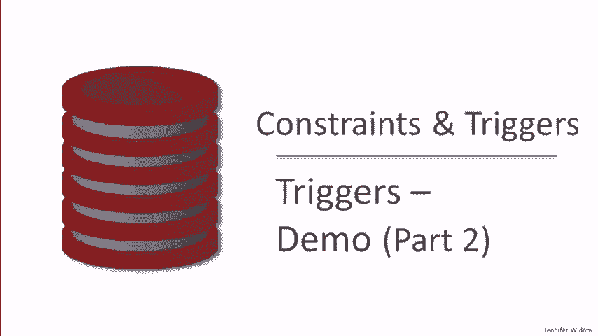

# P22：11-06-triggers-demo-part-2.mp4 - 哈库那玛塔塔i - BV1R4411u7dt

 If you made it through that long first part of the demo of triggers， here we are in part。

 two。 As a reminder， our introduction video about triggers use the SQL standard， but no database。

 system actually implements the standard， and most systems deviate considerably。

 Postgres is the closest and is the most expressive with triggers。 However。

 it has a kind of cumbersome syntax， so we're not using it for our demos。

 SQLite follows Postgres and is also quite expressive。 My SQL is considerably less expressive。

 mostly with some limitations it has in how， triggers can interact。

 So again， we're using SQLite for our demo， and just a few of the differences from the， standard。

 it has row level triggers only， no statement level triggers， and an immediate， activation semantics。

 For each row can be specified in triggers， but if it's not there， it's still a row level， trigger。

 It doesn't have old table or new table since it has immediate activation semantics only。

 and it doesn't have a referencing clause。 The variables old and new are automatically bound in every trigger to what would be old。

 row and new row if it had a referencing clause。 And finally。

 the action part of SQLite triggers are SQL statements embedded in begin and blocks。

 Overall， here's the long list of features that are being covered in our two part demo。

 We covered the first five features in part one， so in part two we'll be talking about。

 self-triggering triggers。 We'll be talking about triggers that have cyclic behavior， conflicts。

 that means when， we have multiple triggers triggered at the same time。

 and finally nested trigger invocations， when the action part of a trigger triggers additional triggers。

 And finally， we'll also add to the demo a demonstration of SQLite's row level immediate， activation。

 And again， that doesn't follow the standard。 It's a bit subtle， but let me review it。

 In the SQL standard， all triggers are activated at the end of the commands， even if they modify。

 multiple rows。 Whereas in SQLite and also in MySQL。

 triggers are activated immediately after each row level， modification。

 The tables that we'll use for this demo are very simple because we want to focus specifically。

 on trigger behavior， so we'll just be using four tables each with a single attribute。

 Let's go to the demo。 Our first trigger is a simple one that demonstrates triggers triggering themselves。

 It's activated when we have an insertion on T1。 It has no condition， and after that insertion。

 it inserts an additional row into T1 that contains， the value that was inserted plus one。

 So let's go ahead and insert a row and see what happened。 The first tuple in T1， the one。

 is the tuple that we inserted with our command。 The second tuple， the two。

 was inserted automatically by the trigger。 However。

 we expected additional trigger activations to insert additional tuples。 It turns out that SQLite。

 as a default， doesn't allow a trigger to be activated more than once。

 in a trigger processing session， presumably to prevent infinite behavior。 But if we'd like。

 we can toggle a variable in the SQLite session called recursive triggers。

 If we turn recursive triggers on， then that checking is turned off and triggers can be。

 activated arbitrarily many times during a trigger processing session。

 Now with recursive triggers on， this trigger would in fact activate itself indefinitely。

 inserting more and more tuples into T1。 Actually what would happen is eventually an error is generated。

 but we can modify the trigger， in order to put in a limit。 Specifically。

 we'll add a condition to the trigger that says we'll only perform the action。

 when the number of tuples in T1 is less than 10。 So what we expect now is when we start by inserting a tuple。

 we'll insert 1， 2， 3， 4， 5 and so on。 But when the size reaches 10。

 the condition will not be satisfied， the action won't be， executed and trigger processing stops。

 I deleted the two tuples from T1， so now let's once again start by inserting a single。

 tuple with the value 1 and let's see what happened。 We take a look at table T1。

 we refresh and we see that indeed 10 tuples were inserted。

 the first one we inserted all the rest by self-triggering of our single trigger and when it got to。

 the size of 10， triggering terminated because the condition part of the trigger was not satisfied。

 Now let's generalize the idea to three triggers that trigger each other in a cycle。

 The first trigger is going to be activated by inserts on T1 and when there's an insert。

 on T1 it will insert into table T2 the same tuple except incremented by 1。

 That will activate trigger R2 which is triggered by insertions on T2。

 When R2 is activated it will likewise insert into table T3， again the value that was inserted。

 into T2 incremented by 1， then trigger T3 will be activated by those insertions onto。

 T3 and it will go back and insert back into table T1 again incrementing the value。

 So let's start as usual by inserting into the first table the value 1 and let's see what， happened。

 Now let me mention that before I started this example I turned the recursive triggers flag， off。

 So here's our original tuple 1 that activated a trigger and it inserted 2 into table T2。

 we can go ahead and see that。 That in turn activated a trigger that inserted a 3 into table T3 and then we go back to table。

 T1 and the 4 was inserted but because SQLite has as a default the limitation that each。

 trigger is activated only once in a trigger processing session at that point trigger processing。

 terminated。 Now we're going to do the same thing that we did last time and we're going to turn recursive。

 triggers on again using this command for our SQLite session and then we're going to modify。

 our triggers to put in a termination condition。 So we only need to put the termination condition in one trigger and we'll put it in the third。

 trigger and this will allow it to go a little farther。

 So the third trigger will add a condition that when the size of the first table T1 is。

 less than 100 then the trigger will go ahead and execute its action but when the size of。

 T1 exceeds 100 then it won't and that will break the cycle and trigger processing will， terminate。

 As always let's start things off by inserting the tuple 1 into table T1。

 So when we look at table T1 we see our original insertion this one inserted a 2 into table。

 T2 which then caused a 3 to be inserted in table T3 and then back to a 4 being inserted。

 in table T1 and that triggered 5 being inserted into T2 and so on。

 So we can see the trigger behavior now we did put in a limitation so when we go look at。

 the size of table T1 we'll see that it got to exactly 100 and then when the size of T1。

 exceeded 100 the third triggers condition was not satisfied and that caused its action。

 to not be executed which brought everything to a halt。 Okay that's enough of cycles。

 Now let's take a look at a situation where we have two triggers activated at exactly the。

 same time and they perform updates to exactly the same portion of the database。

 Both of our triggers are activated by insertions into table T1 and we're going to again start。

 trigger processing by inserting one tuple with the value 1。

 The first trigger has no condition it updates the contents of T1 to set all the values to， 2。

 The second trigger checks to see if there exists a 2 in table T1 and if so it sets the values， to 3。

 So these two triggers are designed specifically so we can see which one goes first。

 If trigger R1 goes first it will set the value to 2 the condition part of R2 will be。

 true and it will then in turn set the value to 3。 However if trigger R2 goes first it will not find a 2 in table T1 so its action will not。

 be executed and will then trigger R1 will go next and it will set the value to 2。

 Okay so let's go ahead and do our insertion with these two triggers defined and see what， happens。

 We insert the value we take a look at T1 and we discover that we have the value 2。

 So what does that tell us？ That actually tells us that trigger R2 went first。

 We performed our insertion it looked to see if there was a 2 in the table there wasn't。

 because it was just a 1 it didn't execute its action then trigger R1 went and it modified。

 the value to be 2。 So that's interesting the second trigger went first。

 So as an experiment let's try reversing the order in which the triggers are defined。

 We'll create trigger R2 first and R1 second。 I've deleted a tuple that was in T1 so once again we'll insert a T1 to get 3 things started。

 we go take a look and now we see indeed that we have the value 3。

 Going back to look at our triggers the value 3 means that trigger R1 went first it set the。

 value to 2 that made trigger R2's condition true and then it set the value to 3。

 So interestingly in SQLite when you have triggers that are activated at the same time。

 it appears that the trigger that was created second is the one that's going to go first。

 Now let's experiment with nested invocation of triggers。

 We make things exciting this time I'm going to start by inserting a 0 into table T1 instead， of a 1。

 And we're going to be using all four of our tables T1 through T4 with 3 triggers。

 The first trigger is going to be activated by the insertion into T1 and it will simply。

 insert a tuple 1 into table T2 and a tuple 1 into table T3。

 What we're going to see and what we're specifically experimenting with is that the first insertion。

 will in fact activate triggers before the second insertion is performed。

 The first insertion into T2 will activate our second trigger， inserts on T2 and this trigger。

 will in turn insert into tables T3 and T4 and it will insert the values too。

 So this will occur in a somewhat nested fashion and in fact in this action we'll see the first。

 command will be executed and it will in a nested fashion activate our trigger R3 which。

 will insert simply into table T4 the value 3。 So let's get started and again as I mentioned for excitement we'll be inserting a 0 this。

 time and let's go see what happened to our tables。

 So table T1 has just the 0 that we inserted as expected。

 Table T2 has just a single tuple with the value 1 which is exactly what we expected。

 This trigger is only activated once。 Now let's take a look at table T3。

 Table T3 has a 2 and a 1 and they're in that order and what that tells us is that this。

 insertion here activated by trigger R2 happened before this insertion here from trigger R1 and。

 that's what demonstrates the nested invocation of the triggers。

 And just to look at the last table we'll see something similar in T4 we again can see the。

 nested invocation because the 2 occurs after the first insertion of 3 and then we have the。

 final insertion of 3。 So this is a bit complicated you might want to look at the video again or even better。

 yet download the triggers and try them yourself。 Our last example is designed specifically to demonstrate the immediate activation of the。

 row level triggers implemented in SQLite。 Specifically I've populated table T1 already with 4 tuples with the value 1 and what my。

 trigger is going to do when I insert additional values into T1 is insert into table T2 the。

 average value in T1。 What I'm going to do is insert a batch of tuples into T1。

 In fact I'm going to insert 4 tuples with the value 2 so when I'm done I'll have 4。

 tuples in table T1。 If triggers followed the SQL semantics of being activated the very end of the entire。

 statement so the entire batch of inserts then the average values that we insert into T2。

 would reflect the average of the 4 ones and the 4 tuples so it would be the value 1。5。

 However what SQLite does is activates the trigger after each tuple level insertion so。

 as we insert the 2s one at a time an average will be inserted into table T2 and the first。

 average will reflect having 1 2 in table T1 the second will reflect having 2 tuples in table。

 T1 and so on。 I think you'll get the idea when I show what happens。

 So here's the command I'm going to use to insert the 4 tuples into table T1。

 I'm going to insert into T1 the result of the sub query which takes every value and adds， 1。

 So let's go ahead and do it and let's take a look at table T1 and we see now that indeed。

 we have the 4 ones and the 4 tuples。 So the real story is told when we look at table T2 and here we see indeed that we do not get。

 4 averages that are 1。5 which is what we would have gotten with the SQL standard semantics。

 Instead we saw that for each 2 that was inserted we inserted the average into table T2 reflecting。

 the number of tuples that were in the table so far。

 Again fairly complicated you might want to watch this example a second time or download。

 it and try it at home。 So that concludes a rather long coverage of triggers。

 We've seen that it can actually be quite complicated when triggers interact with updates on the。

 database when they perform updates and especially when they interact with each other。

 Now the reality is that a lot of times that triggers are used in applications is for very。

 simple purposes。 We might have a couple of triggers that are enforcing simple constraints。

 They don't interact with each other and they don't interact with the database in complicated， ways。

 And I've shown a few of those triggers early on。 However I did want to make a point that when triggers are used for more complicated purposes。

 when they interact with each other and with the database in complicated ways it is important。

 to be very careful to fully understand how they behave。

