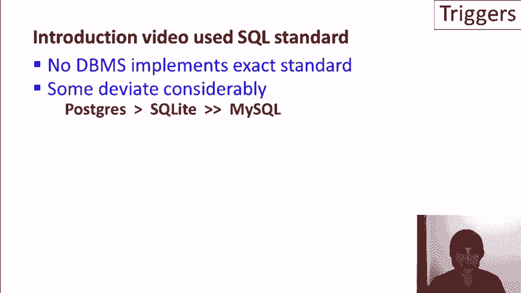
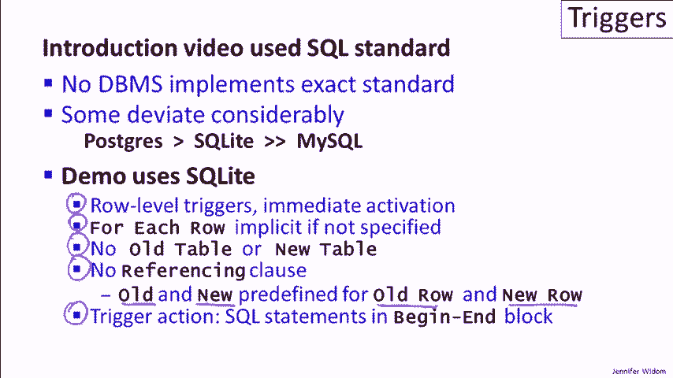

# 课程 P22：触发器演示（第二部分）🔁


在本节课中，我们将继续学习数据库触发器的进阶概念。我们将探讨触发器的自我触发、循环行为、冲突处理以及嵌套调用等复杂场景，并通过具体的 SQLite 示例来演示这些行为。课程最后，我们还会专门展示 SQLite 中行级立即激活触发器的特性。

---

## 触发器实现差异回顾



上一节我们介绍了触发器的基本概念和演示。本节中我们来看看不同数据库系统在触发器实现上的差异。

作为提醒，关于触发器的介绍视频使用了 SQL 标准，但没有数据库系统完全实现这个标准，大多数系统有很大的偏差。Postgres 是最接近标准且最具表现力的触发器系统，但其语法比较繁琐，因此未在演示中使用。

SQLite 遵循 Postgres，也非常灵活。相比之下，MySQL 则表现得较为有限，主要体现在触发器的交互上存在一些限制。



## SQLite 触发器特性

我们的演示使用的是 SQLite，且与标准有一些差异。以下是 SQLite 触发器的关键特性：

*   **仅支持行级触发器**：没有语句级触发器。
*   **立即激活语义**：触发器在每行数据修改后立即激活。
*   **无 OLD TABLE 或 NEW TABLE**：由于只有立即激活语义，因此没有这些表。
*   **无 REFERENCING 子句**：在每个触发器中，变量 `OLD` 和 `NEW` 会自动绑定到行数据。
*   **动作部分**：触发器的动作部分是嵌入在 `BEGIN` 和 `END` 块中的 SQL 语句。

## 演示功能概览

以下是我们在两部分演示中涵盖的功能清单。第一部分涵盖了前五个功能，在第二部分我们将讨论以下内容：


1.  **自触发触发器**：触发器如何触发自身。
2.  **循环行为**：多个触发器互相触发形成的循环。
3.  **冲突**：当多个触发器在同一时间被激活并修改相同数据时的情况。
4.  **嵌套触发器调用**：触发器的动作部分触发其他触发器。
5.  **SQLite 行级立即激活演示**：展示 SQLite 与标准在激活时机上的差异。

## 自触发触发器

首先，我们来看一个触发器如何触发自身的简单示例。

我们创建一个在表 `T1` 上进行插入操作时激活的触发器 `R1`。它没有条件，在插入之后，它会向 `T1` 中插入一行数据，这行数据包含插入的值加一。

```sql
CREATE TRIGGER R1 AFTER INSERT ON T1
BEGIN
    INSERT INTO T1 VALUES (NEW.a + 1);
END;
```

当我们向 `T1` 插入值 `1` 时：
*   第一个元组 `1` 是我们通过命令插入的。
*   第二个元组 `2` 是由触发器 `R1` 自动插入的。

然而，我们预计 `R1` 会再次被激活，插入更多的元组（`3`, `4`, ...）。但 SQLite 默认情况下不允许在一次触发器处理会话中，同一个触发器被激活多次，这是为了防止无限循环。

我们可以通过启用递归触发器来关闭此限制：


```sql
PRAGMA recursive_triggers = ON;
```

启用后，`R1` 会无限次地激活自己。为了避免无限循环，我们可以为触发器添加一个终止条件。例如，修改 `R1`，使其仅在 `T1` 中的元组数少于 10 时才执行操作：

```sql
CREATE TRIGGER R1 AFTER INSERT ON T1
WHEN (SELECT COUNT(*) FROM T1) < 10
BEGIN
    INSERT INTO T1 VALUES (NEW.a + 1);
END;
```

现在，当我们插入 `1` 时，触发器会自我触发，依次插入 `2`, `3`, ..., 直到表中有 10 个元组后条件不满足，触发停止。

## 触发器循环

现在，让我们将自触发的概念推广到三个互相触发的触发器形成的循环。

以下是三个触发器的定义：
*   `R1`：在 `T1` 插入时激活，将值加1后插入 `T2`。
*   `R2`：在 `T2` 插入时激活，将值加1后插入 `T3`。
*   `R3`：在 `T3` 插入时激活，将值加1后插入 `T1`。

```sql
-- 触发器 R1
CREATE TRIGGER R1 AFTER INSERT ON T1
BEGIN
    INSERT INTO T2 VALUES (NEW.a + 1);
END;

-- 触发器 R2
CREATE TRIGGER R2 AFTER INSERT ON T2
BEGIN
    INSERT INTO T3 VALUES (NEW.a + 1);
END;

-- 触发器 R3 (带终止条件)
CREATE TRIGGER R3 AFTER INSERT ON T3
WHEN (SELECT COUNT(*) FROM T1) < 100
BEGIN
    INSERT INTO T1 VALUES (NEW.a + 1);
END;
```

当我们向 `T1` 插入值 `1` 时，会触发以下链式反应：
1.  `R1` 激活，向 `T2` 插入 `2`。
2.  `R2` 激活，向 `T3` 插入 `3`。
3.  `R3` 激活，检查 `T1` 大小 (<100)，向 `T1` 插入 `4`。
4.  `R1` 再次激活，向 `T2` 插入 `5`。
5.  ... 如此循环，直到 `T1` 大小达到 100，`R3` 的条件不满足，循环终止。

这个例子演示了多个触发器如何通过互相调用形成复杂的循环逻辑。

## 触发器冲突

接下来，我们看一个情况：假设我们有两个触发器在完全相同的时间被激活，并且它们对数据库的相同部分进行更新。

我们定义两个都在 `T1` 插入时激活的触发器：
*   `R1`：无条件，将 `T1` 中的所有值更新为 `2`。
*   `R2`：检查 `T1` 中是否存在值为 `2` 的项，如果有，则将这些值设置为 `3`。

```sql
-- 触发器 R1
CREATE TRIGGER R1 AFTER INSERT ON T1
BEGIN
    UPDATE T1 SET a = 2;
END;

-- 触发器 R2
CREATE TRIGGER R2 AFTER INSERT ON T1
WHEN EXISTS (SELECT * FROM T1 WHERE a = 2)
BEGIN
    UPDATE T1 SET a = 3;
END;
```

当我们向 `T1` 插入值 `1` 时，哪个触发器先执行会导致不同的结果：
*   如果 `R1` 先执行：它将所有值设为 `2`，然后 `R2` 的条件满足，将所有值设为 `3`。最终结果为 `3`。
*   如果 `R2` 先执行：此时表中没有 `2`，其条件不满足，操作不执行。然后 `R1` 执行，将所有值设为 `2`。最终结果为 `2`。

实验表明，在 SQLite 中，当触发器同时激活时，**后创建的触发器会先执行**。如果我们先创建 `R2` 再创建 `R1`，结果是 `3`；如果顺序相反，结果是 `2`。

## 嵌套触发器调用

现在让我们实验触发器的嵌套调用，即一个触发器的动作触发了另一个触发器。

我们使用四个表 (`T1` 到 `T4`) 和三个触发器：
*   `R1`：在 `T1` 插入后激活，向 `T2` 和 `T3` 各插入一个元组。
*   `R2`：在 `T2` 插入后激活，向 `T3` 和 `T4` 各插入一个元组。
*   `R3`：在 `T3` 插入后激活，向 `T4` 插入一个元组。

```sql
-- 触发器 R1
CREATE TRIGGER R1 AFTER INSERT ON T1
BEGIN
    INSERT INTO T2 VALUES (1);
    INSERT INTO T3 VALUES (1);
END;

-- 触发器 R2
CREATE TRIGGER R2 AFTER INSERT ON T2
BEGIN
    INSERT INTO T3 VALUES (2);
    INSERT INTO T4 VALUES (2);
END;

-- 触发器 R3
CREATE TRIGGER R3 AFTER INSERT ON T3
BEGIN
    INSERT INTO T4 VALUES (3);
END;
```

当我们向 `T1` 插入值 `0` 时：
1.  `R1` 激活，尝试向 `T2` 和 `T3` 插入 `1`。
2.  向 `T2` 插入 `1` 的操作会立即激活 `R2`。
3.  `R2` 向 `T3` 插入 `2`，向 `T4` 插入 `2`。
4.  向 `T3` 插入 `2` 的操作会激活 `R3`，`R3` 向 `T4` 插入 `3`。
5.  然后，`R1` 中向 `T3` 插入 `1` 的操作才执行，这会再次激活 `R3`，向 `T4` 插入另一个 `3`。

最终，我们会在表中看到嵌套执行产生的数据顺序，例如 `T3` 中可能有 `2, 1`，`T4` 中可能有 `2, 3, 3`。这演示了触发器动作如何以嵌套方式激活其他触发器。

## SQLite 行级立即激活演示

我们的最后一个例子专门展示 SQLite 中“立即激活”的行级触发器与 SQL 标准的差异。

根据 SQL 标准，所有触发器都在整个 SQL 命令执行结束时才激活。而在 SQLite（和 MySQL）中，触发器会在每一行级别的修改后立即激活。

假设表 `T1` 已有 4 个值为 `1` 的元组。我们创建一个触发器，在向 `T1` 插入时，将 `T1` 中所有值的平均值插入到 `T2`。

```sql
CREATE TRIGGER AvgTrigger AFTER INSERT ON T1
BEGIN
    INSERT INTO T2 SELECT AVG(a) FROM T1;
END;
```

现在，我们执行一个批量插入，向 `T1` 插入 4 个值为 `2` 的元组：

```sql
INSERT INTO T1 SELECT a+1 FROM T1; -- 假设T1原有4个1，此操作会插入4个2
```

*   **如果遵循 SQL 标准**：触发器在整个 `INSERT` 语句结束后激活一次。此时 `T1` 有 4个`1` 和 4个`2`，平均值为 `1.5`。`T2` 中只会插入一个值 `1.5`。
*   **在 SQLite 的立即激活语义下**：触发器会在**每插入一行** `2` 之后立即激活。因此：
    *   插入第一个 `2` 后，平均值是 `(1+1+1+1+2)/5 ≈ 1.2`，插入 `T2`。
    *   插入第二个 `2` 后，平均值是 `(1+1+1+1+2+2)/6 ≈ 1.33`，插入 `T2`。
    *   ... 以此类推。

最终，`T2` 中会插入 4 个逐步增长的平均值，而不是一个固定的 `1.5`。这个例子清晰地展示了 SQLite 触发器立即激活的特性。

---

## 总结

本节课中我们一起学习了触发器的多种复杂交互行为。

我们首先回顾了不同数据库在触发器实现上的差异，并明确了演示所使用的 SQLite 的特性。接着，我们深入探讨了：
1.  **自触发触发器**：如何通过递归设置让触发器调用自身，并利用条件语句控制循环。
2.  **触发器循环**：多个触发器如何互相调用形成逻辑循环，以及如何安全地终止循环。
3.  **触发器冲突**：当多个触发器同时激活并修改相同数据时，它们的执行顺序对最终结果的影响。
4.  **嵌套触发器调用**：一个触发器的动作如何触发另一个触发器，形成嵌套执行流。
5.  **立即激活语义**：通过平均值计算的例子，直观展示了 SQLite 行级触发器立即激活与 SQL 标准语句级激活的显著区别。


触发器在应用程序中常用于执行简单的约束和审计日志。然而，当触发器用于更复杂的目的，并且彼此之间或与数据库的交互变得复杂时，必须非常小心，需要完全理解它们是如何工作的，以避免不可预期的行为和无限循环。