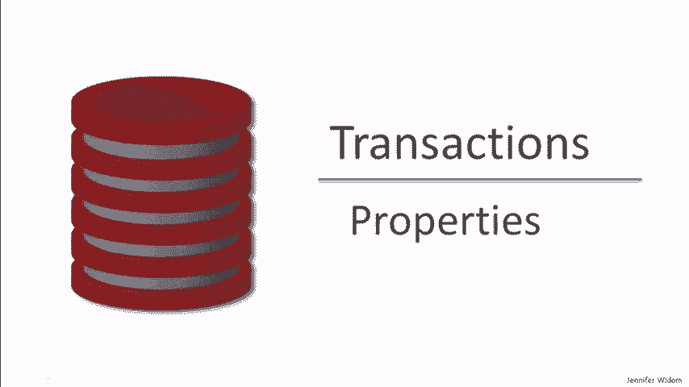
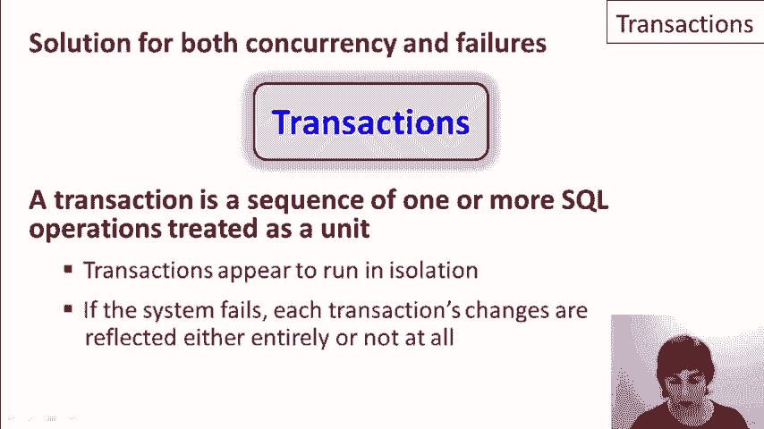
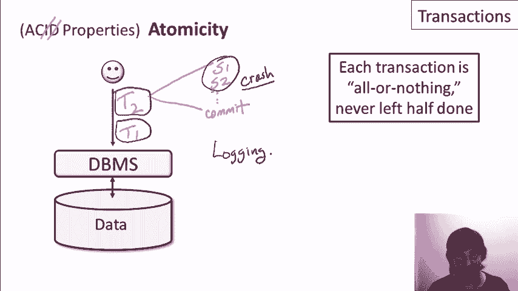

# P23：12-02-transactions-properties.mp4 - 哈库那玛塔塔i - BV1R4411u7dt

在本视频中，我们将更详细地探讨事务的属性。

提醒一下，事务是作为解决数据库中的并发控制问题和系统故障问题引入的概念。具体来说，事务是一个操作序列，这些操作被当作一个单元处理。即使多个客户端同时在操作数据库，事务也看起来是在隔离中运行的。此外，如果发生系统故障或意外的软件、硬件或电力故障，事务仍然能够保持其一致性和完整性。

每个事务对数据库的更改要么完全反映出来，要么完全不反映出来。每个数据库专家都知道事务支持被称为ACID特性的四个属性。

尽管并非每个人都总是记得ACID代表什么，但我会告诉你。A代表原子性，C代表一致性，I代表隔离性，D代表持久性。我们将依次讨论这四个属性。我们将首先讨论隔离性，然后讨论持久性。

接下来我们将讨论原子性，然后我们将总结一致性。现在我们来讲解隔离性。我们的数据库上将有很多客户端在操作，我们希望每个客户端都能认为他们是在单独操作数据库。因此，正如我们在前一个视频中讨论的，每个客户端会向数据库系统发出一系列事务。

所以，第一个客户端可能会先发出事务T1，然后是T2、T3，依此类推。在这里我们有T9、T10、T11，作为提醒，每个事务本身可以是一个由多个语句组成的序列。所以，这可能是语句1、语句2、语句3，依此类推，然后这些语句会作为一个单元进行处理。

所以，隔离性属性是通过一个非常具体的正式概念——可串行化来实现的。可串行化的意思是，事务内部的操作可以在多个客户端之间交错进行，但这些操作的执行必须等同于所有事务按某个顺序串行执行的结果。以我们的例子为例，系统可能会并行执行每个事务内的所有语句。

但它必须保证对数据库的操作行为等同于某个顺序的事务执行。所以，或许等效的顺序执行会是系统首先执行事务T1，接着是T2，T9，T10，可能再回到T3，依此类推。系统必须保证即使这些事务是交错执行的，数据库的状态在这一时刻也看起来像是这些事务按顺序执行的。

现在，你可能会想知道，数据库系统如何在仍然交错执行操作的同时保证这种级别的一致性。它使用基于锁定数据库部分的协议。现在我们不会描述具体实现，因为实现方面不在本课程的重点之内。作为用户或应用程序角度，你需要知道的是，实际上是哪些属性得到了保证。

现在，考虑到可串行化的正式概念，让我们回过头来看一下之前视频中的例子，这些例子展示了并发访问可能带来的问题。第一个例子是两个独立客户端更新斯坦福大学注册人数的情况。我们就称其中一个为T1，它现在是一个事务，另一个为T2。

所以，当我们在系统中运行这些操作并保证可串行化时，我们将得到一种行为，至少等同于T1之后是T2，或者T2之后是T1的行为。因此，在这个例子中，当我们从15,000的注册人数开始时，任何一种执行方式最终都会正确地得到17,500的注册人数，从而解决我们的并发问题。

这是我们的第二个例子。在这个例子中，第一个客户端正在修改Apply表中学生123的专业，第二个客户端正在修改决策。我们看到，如果允许这两者交替执行，就有可能只有其中一个更改会生效。同样，通过可串行化，我们将得到一种保证其行为等同于T1之后是T2，或者T2之后是T1的行为。

在这两种情况下，这两个更改都会反映在数据库中，这是我们想要的。下一个例子是我们观察Apply表和Student表的情况，我们基于Student表中的GPA修改Apply表，同时也修改该GPA。

所以，如果这两个操作作为两个事务发出，我们将得到T1之后是T2，或者T2之后是T1，或者至少我们会得到等效于该行为的结果。现在，这个例子有点有趣，因为这两种情况都导致数据库的状态是一致的。

在第一种情况下，我们会在修改任何人的GPA之前更新所有的决策记录。在第二种情况下，我们会在修改GPA之后更新Apply记录。这里有趣的是，顺序在这种情况下确实很重要。现在，数据库系统仅保证可串行化。

它们保证行为将等同于某种顺序执行，但如果事务是同时发出的，它们并不保证确切的顺序。因此，如果重要的是确保例如T1先于T2执行，那实际上需要在应用程序中编码这一点。我们的最后一个例子是涉及Apply表和Archive表的情况。

我们在一个客户端中正在从一个表移到另一个表，而另一个客户端在计数元组。

再次强调，T1 和 T2，它们作为事务发起。系统保证要么先移动所有元组然后再计数，要么先计数元组然后再移动它们。现在，再次说明，顺序在这里确实有影响，但如果我们特别关心顺序，那必须在应用程序中进行编码。

好的，我们完成了四个ACID特性中的第一个。剩下的三个会比较快地讲完。现在我们来讲耐久性。我们只需要看一个客户端就能理解正在发生的事情。假设我们的客户端正在向数据库发出一系列事务。

每个事务，仍然是由一系列语句组成。最后，在事务的末尾有一个提交。那么耐久性为我们保证的是，如果事务提交后系统崩溃，那么该事务的所有效果将保留在数据库中。所以具体来说，如果在这之后，某个时刻发生了故障，不管是什么原因。

客户端可以放心，事务的效果已经写入数据库，并且当系统恢复时，它们仍然会存在。所以你可能会想，既然数据库系统在磁盘和内存之间移动数据，且崩溃随时可能发生，那怎么能够做出这样的保证呢？实际上，有一些相当复杂的协议被用来处理这个问题。

它们基于日志记录的概念。但再一次，我们不会讨论实现细节。从用户或应用程序的角度来看，重要的是那些保证的特性。两个特性已经讲过了，现在让我们来谈谈原子性。再次强调。

我们只看一个客户端，它向数据库发出一系列事务。让我们来看事务 T2，它本身是一个由一系列语句组成的事务，最后是提交。原子性处理的情况是，在事务执行过程中，发生了崩溃或故障，但事务还未提交。原子性特性告诉我们的是，即使在系统崩溃的情况下。

每个事务总是要么全部执行，要么完全不执行。换句话说，如果我们有每个事务在运行，那么在系统崩溃时，不可能在数据库上只执行了一部分语句，而剩下的事务没有执行。现在，再次强调，可能有人会想知道这是如何实现的。它也使用了日志机制，特别是在系统从崩溃中恢复时。

有一个过程，系统在此过程中不会被使用。系统会撤销在崩溃时正在执行的事务的部分影响。现在，应用程序确实需要对这个过程有所了解。比如当应用程序向数据库提交一个事务时。

有可能在执行事务时出现崩溃，然后系统重启，这时它会返回一个错误。在这种情况下，应用程序可以得到保证，确保事务的任何影响都没有反映到数据库中。

但它需要重新启动事务。

现在让我们回到一个事实，那就是系统将撤销事务的部分影响，以保证原子性属性，即每个事务要么完全执行，要么完全不执行。所以撤销事务部分影响的这个概念被称为事务回滚或事务中止。

我之所以在这里提到这一点，是因为虽然它是实现原子性的机制，但它也是一个数据库暴露给应用程序的操作，应用程序可以选择使用它。具体来说，事务回滚可以在出现错误或崩溃恢复的情况下由系统启动，但它也可以由客户端发起。让我举个例子，说明客户端可能会编写代码利用这个操作。

这是一些示例应用程序代码。在这段代码中，客户端开始一个事务，向数据库用户请求输入，执行一些SQL命令，可能根据用户的输入对数据库进行一些修改，确认用户是否喜欢这些修改的结果，如果用户说“好”。

那么事务就会被提交，我们就得到了这个行为的原子执行。但如果用户不同意，那么事务将被回滚，这些执行过的SQL命令会被撤销，从而解放了应用程序，让它不需要显式编写撤销这些命令的代码。所以对于客户端来说，这实际上是一个非常有用的功能。

但是客户端需要非常小心，因为这个回滚命令只会撤销数据库中数据本身的影响。所以如果在这段代码中，系统还在修改一些变量，或者更糟的情况，比如说从ATM机中取现，那么回滚命令是不会撤销这些操作的。

它不会修改变量，当然也不会将现金重新拉回到ATM机中。所以实际上，在这个特定的客户端交互中还有另一个问题，我在这里会放一个悲伤的表情。这是一个回滚如何有用的简单示例。但这个例子中发生的一件事是，我们开始一个事务，然后我们等待用户执行某个操作，实际上在这里我们等着用户。

所以有经验的数据库应用开发人员会告诉你，绝不要长时间保持事务打开并等待任意的时间。原因是事务确实使用了我之前提到的锁机制。因此，当事务正在执行时，它可能会阻止其他客户端访问数据库的某些部分。如果用户恰好去喝杯咖啡或者一周后才回来。

我们当然不希望数据库被锁定整整一周。所以，再次强调，一个基本的经验法则是，事务应该以一种我们能确保它们能够快速完成的方式构建。最后，让我们来谈谈一致性。一致性属性讨论的是事务如何与数据库上可能存在的完整性约束进行交互。提醒一下，完整性约束是对哪些数据库状态是合法的进行的规范。

事务在约束管理中实际上非常有帮助。具体来说，当多个客户端以交错的方式与数据库交互时，我们可以设定每个客户端都能假设，在开始时，它操作的是一个特定的数据库，该数据库满足所有完整性约束。

然后，每个客户端必须保证在事务结束时所有约束条件都得以满足。这通常由约束执行子系统来保证。现在，凭借这个保证，由于事务的可串行化性，这保证了约束条件始终成立。具体来说，数据库的行为是我们知道的事务的某个顺序排列，我们知道可以在事务开始时假设约束条件已经成立。

然后我们保证它们在结束时保持一致，并且由于行为等同于顺序执行，那么下一个事务可以假设约束条件已经保持一致，依此类推。

总之，事务是一个非常强大的概念。它们为数据库中的并发控制和系统故障管理提供了解决方案。它们提供了原子性、一致性、隔离性和持久性的正式定义属性。在下一个视频中，我们将更深入地讨论隔离性属性。

我们将看到，在某些情况下，我们可能希望放宽隔离性概念，同时仍然在特定情况下为应用提供足够的属性。

