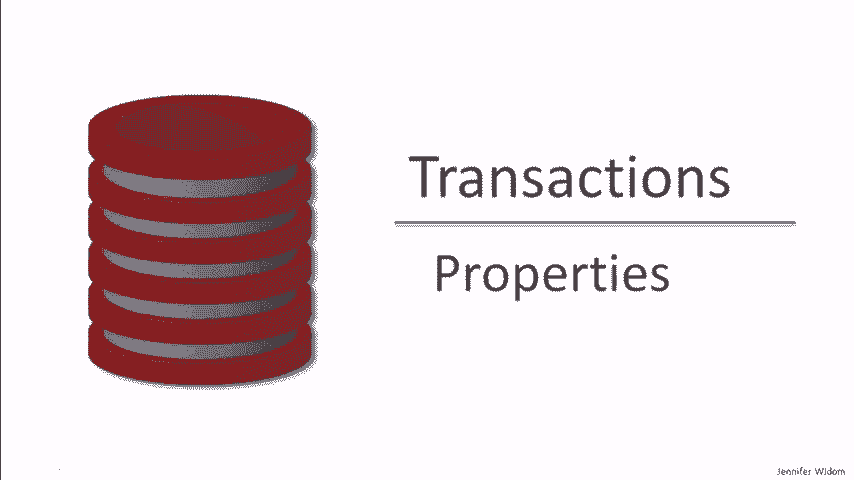
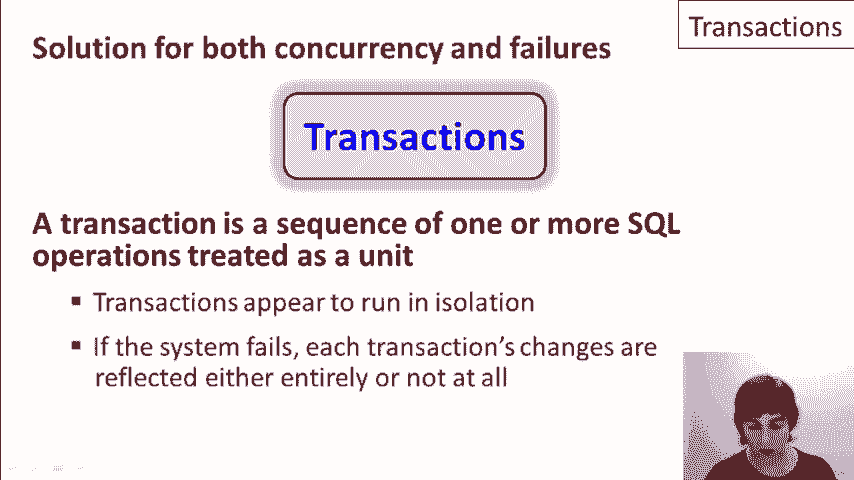
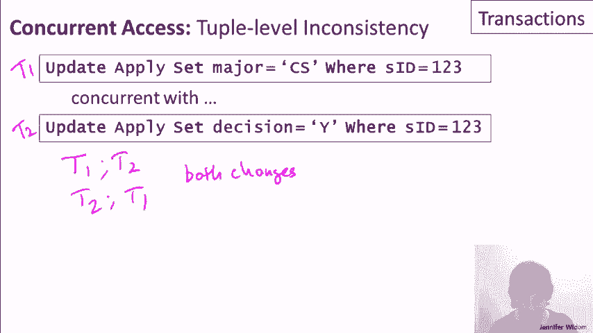
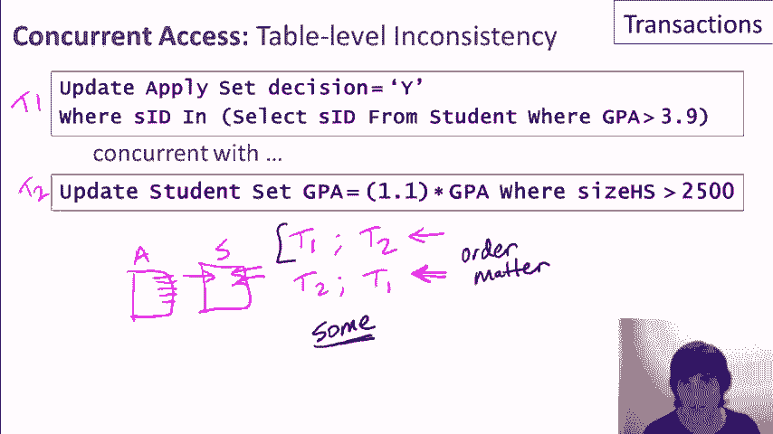
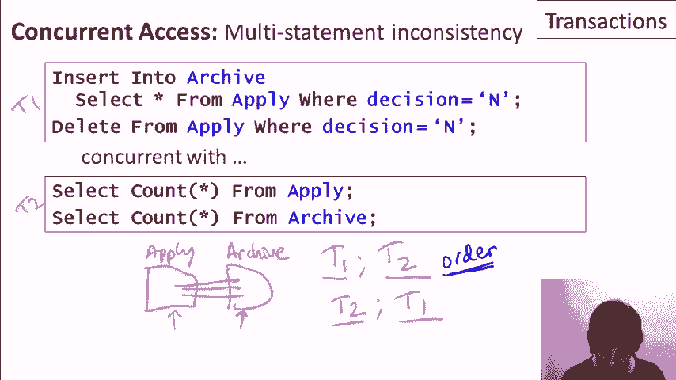
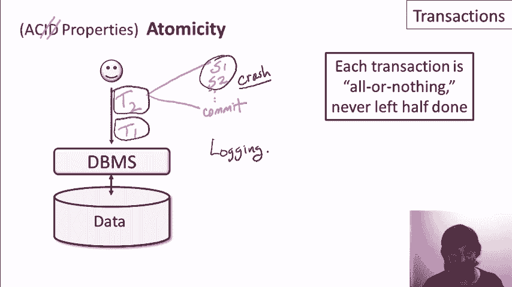
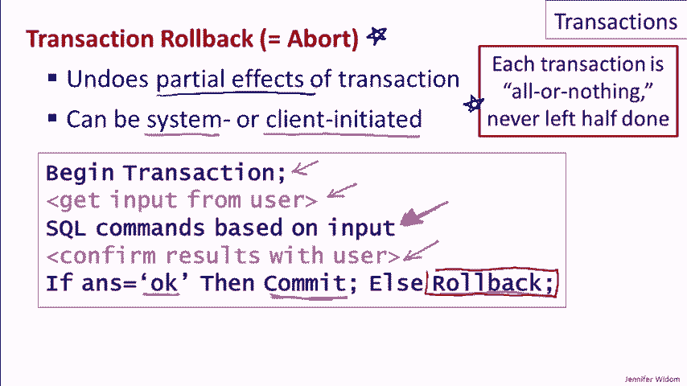
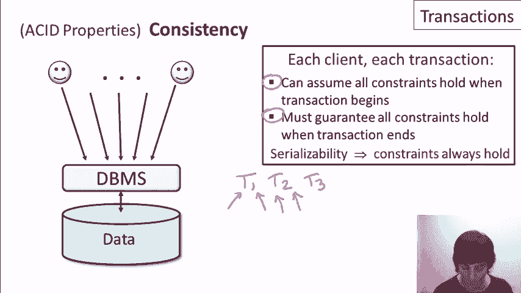
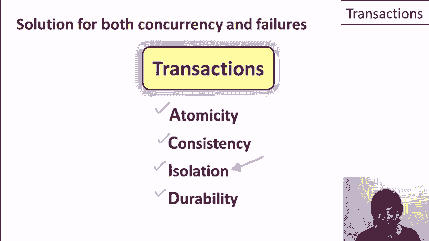

# 数据库课程 P23：事务的ACID属性详解 🧩

在本节课中，我们将深入探讨数据库事务的核心属性——ACID。事务是数据库管理系统中用于处理并发控制和系统故障的关键概念。我们将逐一解析原子性、一致性、隔离性和持久性这四个属性，并通过简单的例子说明它们如何保证数据库操作的可靠性与一致性。



---

## 事务的隔离性 🔒

上一节我们介绍了事务的基本概念，本节中我们来看看隔离性。隔离性确保多个并发执行的事务互不干扰，每个客户端都感觉自己在独立操作数据库。这是通过一个称为“可串行化”的正式概念来实现的。

**可串行化** 意味着，尽管多个事务的操作可能交错执行，但最终效果必须等同于这些事务按**某个顺序**串行执行的结果。数据库系统通常使用锁机制来实现这一点。

以下是几个并发访问的例子，展示了隔离性如何解决问题：


*   **例1：更新注册人数**：两个事务T1和T2分别增加注册人数。通过可串行化保证，最终结果（17,500）将是正确的，避免了并发更新导致的数据不一致。
*   **例2：修改学生申请信息**：一个事务修改专业，另一个修改决策。可串行化保证两个修改都会生效，不会出现只有一个生效的情况。
*   **例3：基于GPA更新决策**：一个事务根据GPA更新申请决策，另一个事务修改GPA本身。可串行化保证结果一致，但执行顺序（先更新决策还是先修改GPA）会影响中间状态，数据库只保证等效于某种顺序。
*   **例4：移动数据与计数**：一个事务将数据从A表移到B表，另一个事务计数。可串行化保证要么先移后数，要么先数后移，结果确定。

**关键点**：数据库保证行为等同于某种串行顺序，但不保证具体的顺序。如果应用程序对执行顺序有严格要求，需要在代码中显式控制。

---

## 事务的持久性 💾



理解了隔离性如何管理并发后，我们来看看持久性。持久性关注的是系统故障后数据的存续问题。

持久性保证：**一旦一个事务成功提交（Commit），它对数据库所做的所有更改将是永久性的，即使后续发生系统崩溃、断电等故障，这些更改也不会丢失。**

实现持久性通常依赖于**预写日志**等复杂机制。从用户角度看，只需知道提交后数据即获持久化保证即可。



---



## 事务的原子性 ⚛️

接下来我们探讨原子性。原子性处理的是事务执行过程中发生故障的情况。

原子性保证：**一个事务中的所有操作被视为一个不可分割的单元。事务要么全部成功执行，要么完全不执行（即没有任何效果）。** 如果在事务提交前系统崩溃，数据库系统必须能够撤销（回滚）该事务已执行的部分操作，使数据库恢复到事务开始前的状态。

撤销事务部分影响的操作称为 **事务回滚** 或 **事务中止**。这不仅在系统崩溃恢复时自动发生，应用程序也可以主动调用。

以下是一个应用程序利用回滚的示例代码：

```sql
BEGIN TRANSACTION;
-- 执行一些SQL操作，例如UPDATE、INSERT
UPDATE accounts SET balance = balance - 100 WHERE user_id = 123;



-- 询问用户是否确认
-- 如果用户确认
COMMIT;
-- 如果用户取消
ROLLBACK; -- 撤销上面的UPDATE操作
```

**重要提示**：
1.  `ROLLBACK` 只能撤销对数据库数据的更改，无法撤销外部操作（如发送邮件、支付现金）。
2.  应避免长时间保持事务打开并等待（如等待用户输入），因为事务持有的锁可能会阻塞其他客户端，影响数据库整体性能。

---

## 事务的一致性 ✅



最后，我们来总结一致性属性。一致性关注的是事务如何维护数据库的完整性约束。

一致性保证：**事务将数据库从一个一致的状态（满足所有完整性约束）转换到另一个一致的状态。** 其工作流程如下：
1.  每个事务开始时，都假设数据库处于一致状态。
2.  事务执行过程中可能暂时违反约束。
3.  事务结束时，必须保证所有约束再次得到满足。

结合隔离性（可串行化），这确保了即使事务并发执行，数据库也能始终保持一致性。因为可串行化保证了事务效果等同于串行执行，而每个事务在串行序列中都是从前一个一致状态开始，并结束于一个新的一致状态。

---

## 总结 📝



本节课中我们一起学习了事务的四个ACID属性：
*   **隔离性**：通过可串行化保证并发事务互不干扰。
*   **持久性**：保证已提交事务的更改永久有效。
*   **原子性**：保证事务要么全部完成，要么全部回滚。
*   **一致性**：保证事务始终将数据库从一个有效状态转换到另一个有效状态。



事务是数据库系统中用于解决并发和故障问题的强大工具，ACID属性为其提供了坚实的理论基础和行为保证。在接下来的课程中，我们将进一步探讨隔离性的不同级别，了解在某些场景下如何适当放宽隔离要求以提升性能。